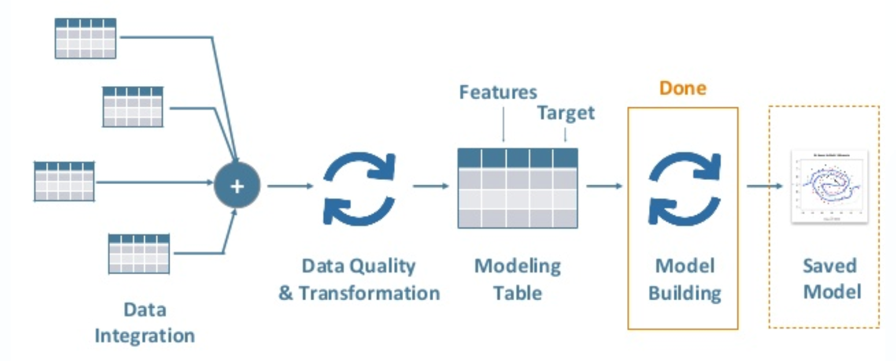

# 机器学习流程

- [1.标准流程](#标准流程)
- [2.比赛流程](#比赛流程)

## 标准流程

### 业务知识

#### 问题定义

- 询问
  - 主要的目标：核心业务问题是什么？是要预测结果还是其他？
  - 量化决策：短期目标 v.s 长期增长
  - 好的指标：对齐目标，可比较、准确、可执行
- 理解
  - 如何衡量成功? SMART，具体、可衡 量、时间限制
  - 影响因子：有什么已知的、可能的影响因子或则限制？
- 翻译
  - 业务目标 -> 技术目标
- 现有方研究案
  - 抽样：用哪部分的样本？
  - 数据变换：有哪些已知的、需要变换的数据？
  - 学习算法：该问题有无合适的学习算法？
  - 模型评估：模型用什么指标评估？

#### 工具选型

- 数据选型
  - 有哪些内部、外部可用的数据？
- 算法选型：不同技术就像工具箱

- 平台选型：选择语言/软件/工具
  - Python、R、Spark、SPSS、SAS

#### 项目计划

- 时间
- 可用资源
- 工具和技术
- 风险和收益
- 项目里程碑（Milestones）

### 特征工程

详见“特征工程”篇

- 数据获取
- 数据探索
- 数据清洗
- 特征选择
- 数据分拆：标准流程中会将数据分拆为训练集、测试集和验证集。

### 建模训练

所谓建模训练就是从假设空间中寻找一个最优的假设函数 g，使得样本空间的输入 X 经过该假设函数的映射得到的 g(X) 与真实的 label 空间 Y 值之间的评估 metrics 最小（大部分情况下是距离）。这个最优的假设函数只有在少数非常简单的场景中可以直接计算所得，在大部分场景中通常没法直接计算得到，需要用数值计算的方法不断迭代求解。因此如何寻找 g 函数的全局最优解，以及使寻找过程尽量高效，就构成了机器学习的建模训练。

完整的建模训练过程归结为以下步骤：

1. 学习算法确定：确定学习算法及其超参。
2. 模型训练：基于“学习算法”给定的超参，在训练集上训练模型的普通参数，使得训练所得模型及其参数在训练集上的损失函数/误差降低到可接受的程度。
3. 学习算法验证：在验证集上验证训练所得模型的性能（泛化能力），并根据模型性能对“学习算法”的结构或其超参进行调参。

以上 2、3 两步循环执行，直至训练所得模型在验证集上取得较好的性能（较低的泛化误差），此时完整的训练过程结束。在完成“模型训练”和“学习算法训练”后，才会在测试集上测试训练所得模型的性能。

#### 学习算法确定

- 学习算法选择：对于训练，有多个“学习算法”可以选择（也可以被称为通用模型），对于同一类“学习算法”，也有多种结构即“超级参数”可以选择。当使用不同的“超参”时，也会产生不同的“学习算法”。最正常的做法应当先使用训练集来学习、验证模型，再使用验证集来调整“学习算法”及“超参”。
- 超参设置：“学习算法”的调参除了对算法进行选择外，还需要对“学习算法”的“超参”进行设定，可以基于验证集对特定参数的“学习算法”训练出的模型进行性能评估。
  - 学习算法结构：
    - 例如，选择“深度神经网络”作为“学习算法”，而 DNN 的层数以及每层的 neuron 数。
    - 例如，决策树的深度
  - 选择模型的性能评估方式：确定模型的损失函数，用来判断这个模型的效果，主要是为了看模型输出的结果跟真实结果的差别，差别越小效果越好。

#### 模型训练

这步是在确定了学习算法及其“超参”之后，使用该“学习算法”训练具体的模型。对于同一个“学习算法”，可能会产生不同的模型，理想的选择方式是对模型的性能（例如泛化误差）进行评估，然后选择性能最好（泛化误差最小）的那个模型。

1. 直接计算最优参数：对于一些比较简单的场景，可以根据损失函数直接计算得出在假设空间中的最优模型。

2. 迭代比较获得最优参数：基于训练集迭代训练模型。

#### 学习算法验证

学习算法验证是通过验证测试来对训练所得模型进行评估、验证。在模型验证中用到的数据集被称为验证集，基于验证集上的性能来进行模型的评估与选择。具体操作是选择一个验证集来测试模型对新样本的判别能力，然后以验证集上的误差作为泛化误差的近似。将训练得出的模型应用于验证集上，从而评估训练所得模型的性能（泛化误差）。然后基于性能评估结果调整训练方案或“学习算法”的超参。

如果验证集性能评估差（泛化误差大）：

- 训练集性能也差（泛化误差大）-> 训练所得模型欠拟合：模型太简单或缺少关键特征
- 训练集性能好（泛化误差小）->
  - 训练集、验证集数据分布有问题：调整测试集数据分布，重新训练模型
  - 训练所得模型过拟合：
    - 1/ 收集更多数据
    - 2/ 降低模型的复杂度，替换使用复杂度较低的训练模型，例如用线性回归替换多项式回归

### 工程实现

#### 模型部署

- 输出形式
- 技术文档
- 模型复用

#### 数据可视化

- 结果展示
  - 效果指数
    - 离线指标：准确率、AUC、RMSE、Lift Chart
    - 在线指标：参与人数、ARPU、总收入、在线时长
  - 解释结果
    - 比较现有模型/业务规则
    - 影响因子重要性
    - 每个因子跟目标Y的关系
- 可视化展示

#### 监控维护

- 效果监控
  - 随着时间效果是否衰减
  - 预测值分布的变化
- 维护
  - 模型维护计划
  - 增加新数据源
  - 版本更新
- 测试
  - 测试计划和执行
  - 实验设计：A/B Test、Fractional Factorial

## 比赛流程

### 业务知识

#### 问题定义

具体了解业务问题

#### 工具选型

同上

#### 比赛计划

时间安排
人员分工

### 特征工程

同上

- 数据获取

- 数据探索

- 数据清洗

- 特征选择

- 数据分拆：标准流程中会将数据分拆为训练集、验证集、测试集（private、public）。

  - train（labeled）

  - val（labeled）

  - test（labeled）

    - public（unlabeled）

    - private（unlabeled）

- 评估方式探索：探索对测试集的评估方式

### 建模训练

#### 学习算法确定

同上

#### 模型训练

同上

### 学习算法验证

同上

### 模型提交

测试模型效果

- 模型应用：正式使用顺利所得的最优模型对测试数据集进行预测
- 评估结果：
  - 预测准确性
  - 可解释性
  - 运行时间
  - 部署难度

#### 公开提交

基于 public 测试集

#### 私有提交

基于 private 测试集

