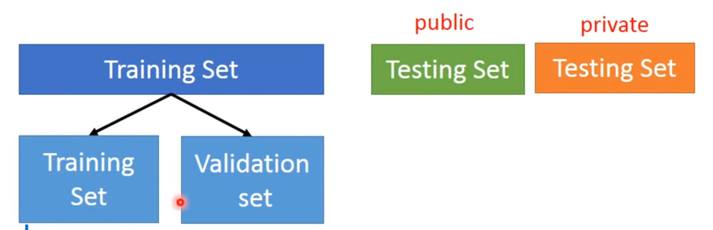
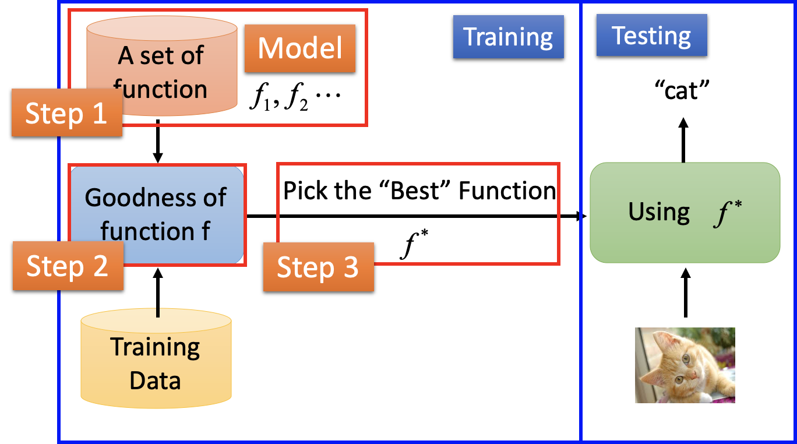

# 介绍

## 简介

1956 年提出 AI 概念，短短3年后（1959）[Arthur Samuel](https://en.wikipedia.org/wiki/Arthur_Samuel) 就提出了机器学习的概念：机器学习研究和构建的是一种特殊算法（而非某一个特定的算法），能够让计算机自己在数据中学习从而进行预测。机器学习的原理是把现实生活中的问题抽象成数学模型，并且很清楚模型中不同参数的作用。利用数学方法对这个数学模型进行求解，从而解决现实生活中的问题。

AI 是目标，而机器学习 ML（Machine Learning）是实现 AI 的方法，它是计算机基于数据构建概率统计模型并运用模型对数据进行预测与分析的学科。ML 所研究的是关于在计算机上从经验数据中产生模型（model）的“学习算法”。有了“学习算法”，就可以把经验数据提供给它，它就能基于这些经验数据产生模型。在面对新的情况时，模型可以提供相应的判断。

### 历史

- 第一次黄金期：1956年Dartmouth会议，第一款神经网络软件Perceptron，第一款人工智能软件Logic Theorist 。
- 第二次黄金期：1980年，第一次AI冬天，Hopfield网络&BP算法，第五代计算机兴起。第五代计算机失败，DARPA削减投入。2000年，第二次AI冬天。
- 第三次浪潮：深度学习(Hinton 2006)，DNN在语义识别上的成功，CNN在图像上的成功。

### 三要素

- 样本：样本就是通常说的“训练数据”，包括输入和结果两部分。样本的数量和质量对机器学习的效果至关重要，如果样本量太少，或者样本分布不均衡，对训练出来的模型就有很大的影响。
- 模型：模型就是映射样本输入与样本结果的函数 f，可能是一个条件概率分布，也可能是一个决策函数。所有 f 的可能结果构成了模型的假设空间 F。很多时候 F 的函数类型是明确的，需要计算的是函数的参数，比如确定 f 函数为一个线性函数，那么 f 的函数表示就可以写为：y=a1 x+a0
- 算法：算法就是要从模型的假设空间中寻找一个最优的函数，使得样本空间的输入 X 经过该函数的映射得到的 f(X)，和真实的 Y  值之间的距离最小。这个最优的函数通常没办法直接计算得到，即没有解析解，需要用数值计算的方法不断迭代求解。因此如何寻找到 f  函数的全局最优解，以及使寻找过程尽量高效，就构成了机器学习的算法。如何保证 f 函数或者 f 函数的参数空间最接近最优解，就是算法的策略。机器学习中用损失函数来评估模型是否最接近最优解。损失函数用来计算模型预测值与真实值的差距，常用的有 0-1 损失函数、平方损失函数、绝对损失函数、对数损失函数等。

### 术语

#### 样本

样本（sample）/示例（instance），表示数据集中的每条数据。

- 特征（feature）/属性（attribute）：反映样本某方面性质的描述。被描述的性质叫作特征/属性，特征的取值称为特征值/属性值。
- 特征空间（feature space）/属性空间（attribute space）/样本空间（sample space）/：数据的不同属性之间可以视为相互独立，因而每个属性都代表了一个不同的维度，这些维度共同张成了特征空间。
- 特征向量（feature vector）：不同于线性代数中的“特征向量”，机器学习中的每个数据有 n 个特征值，这 n 个特征值组成的向量被称为特征向量，对应 n 维特征空间的一个点。因而**每个样本都可以视为特征空间中的一个向量**，即特征向量。
- 标记（label）：监督学习下，样本已经打的标签
- 标记空间（label space）/输出空间：所有标记的集合
- 样例（example）：拥有标记的样本

#### 数据集

数据集（data set）是一组样本的集合。

- 训练集（training set）：训练过程中使用的数据，相当于上课学知识。其中每个样本称为训练样本。
- 验证集（validation set）：相当于课后的的练习题，用来纠正和强化学到的知识。模型选择与评估中用于评估测试的数据集称为“验证集”。例如不同神经网络在训练集上训练结束后，通过验证集来比较判断各个“学习算法”/模型的性能。这里的不同模型主要是指对应不同结构或超参数的神经网络。
- 测试集（testing set）：相当于期末考试，用来最终评估学习效果。学得模型后，使用其进行测试的被预测样本称为测试样本。测试集应该尽量与训练集互斥，即测试样本尽量不在训练集中出现、为在训练过程中使用过。
- 误差（Error）：误差被定义为学习器的实际预测输出与样本真实输出之间的差异。在分类问题中，常用的误差函数是错误率，即分类错误的样本占全部样本的比例。
  - 训练误差（training error）/经验误差（empirical error）：指的是学习器在训练数据集上的误差，也称经验误差。训练误差描述的是输入属性与输出分类之间的相关性，能够判定给定的问题是不是一个容易学习的问题。
  - 测试误差（testing error）：指的是学到的模型在新样本上的误差，也称泛化误差。测试误差反映了学到的模型对未知的测试数据集的预测能力。

#### 假设

假设（hypothesis）：ML 训练学得的模型对应了关于经验数据的某种潜在的规律，因此称为假设。

- 假设空间（hypothesis space）：所有可能函数构成的集合，也就是后面训练时所说的model。
- 泛化能力（generalization）：泛化能力只学得的模型适用于新样本的能力。具有泛化能力的模型能很好地适用于整个样本空间。

可以把 ML 看成在假设空间中搜索的过程，搜索的目的是找到与训练集“匹配”的假设。在实际问题中，常常会面临很大的假设空间，但学习的过程是基于有限样本训练集进行的。因此可能有多个假设与训练集一致。归纳偏好表示在学习过程中对某一类假设的偏好，它可以看做是“学习算法”自身一个可能很庞大的假设空间中对假设进行选择的启发式“价值观”。

- 奥卡姆提到（Occam's razor）：若在假设空间中有多个假设满足训练集，则选择最简单的那个。
- 

### 过拟合 vs. 欠拟合

#### 欠拟合（underfitting）

如果说造成过拟合的原因是学习能力太强，造成欠拟合的原因就是学习能力太弱，以致于训练数据的基本性质都没能学到。

欠拟合的表现：

- training error 大
- bias 大

解决方法：

- 增加训练轮数
- 说明 model 过于简单，需要采用更复杂的 model

#### 过拟合（overfitting）

把训练数据的特征错当做整体的特征。例如如果接触的外国人较少，从没见过双眼皮的韩国人，思维中就难免出现“单眼皮都是韩国人”的错误定式。过拟合出现的原因通常是学习时模型包含的参数过多，从而导致训练误差较低但测试误差较高。

过拟合的表现是：

- testing error 大

- variance大

解决方法是：

- 增加 training data：
- 调参 regularization：在 model 中加上一个 w_{i}^2

## 分类

模型训练方式不同可以分为监督学习（Supervised Learning），无监督学习（Unsupervised Learning）、半监督学习（Semi-supervised Learning）和强化学习（Reinforcement Learning）四大类。

- 监督学习：基于已知类别的训练数据进行学习。监督学习假定训练数据满足独立同分布的条件，并根据训练数据学习出一个由输入到输出的映射模型。反映这一映射关系的模型可能有无数种，所有模型共同构成了假设空间。**监督学习的任务就是在假设空间中根据特定的误差准则找到最优的模型**。
  - 分类 Classification：输出的是离散的值，当个数为 2 时即为最简单的二分类问题。
  - 回归 regression：输出的是连续的值
  - structure：输出的是类似于图形、语音等
- 无监督学习：基于未知类别的训练数据进行学习
- 半监督学习：同时使用已知类别和未知类别的训练数据进行学习
- 强化学习：最接近人类学习的办法。即，有 input，取代 label 的是 reward——不告诉你正确答案是什么，但是会根据你的答案表扬你或者批评你。

## 训练流程

### 数据处理

将实际业务中的数据转化成机器可理解的形式的过程，也可以称为特征工程。它具体是指从数据中提取特征，将原始数据转换成适合机器学习模型的格式，并且为模型和任务制定最佳特征的过程。它是数据处理中关键的一步，因为合适的特征可以降低建模的复杂度，这些解决数据问题的算法很多是基于规则的。

#### 数据获取

#### 数据预处理

主要涉及数据清洗等工作。当数据本身没有什么问题后，将数据集分为3个份，训练集（60%）、验证集（20%）、测试集（20%），用于后面的验证和评估。划分方法包括：

- 留出法：直接将数据集分为训练集、测试集两个互斥的集合。单次采用留出法得到的估计结果不够稳定可靠，一般要采用若干次随机划分、重复进行试验评估后取平均值作为留出法的评估结果。一般测试集占数据集的65%-80%。
- 交叉验证法（Cross Validation）：将数据集划分为 k 个大小相似的互斥子集，每个子集都能尽可能保持分布的一致性。每次用 k-1 个子集作为训练集，余下的子集作为测试集，这样就获得 k 组训练/测试集。进行 k 次训练和测试，最终返回的结果是 k8 个测试结果的均值。
- 自助法（bootstrapping）：

### 模型训练

从 model（假设空间）中寻找一个最优的函数，使得样本空间的输入 X 经过该函数的映射得到的 f(X) 与真实的 Y 值之间的距离最小。这个最优的函数通常没办法直接计算得到，需要用数值计算的方法不断迭代求解。因此如何寻找 f  函数的全局最优解，以及使寻找过程尽量高效，就构成了机器学习的算法。

完整的训练过程归结为一下两个步骤：

1. 预设“学习算法”超参数
2. 训练普通参数：在训练集（给定超参数）上利用学习算法训练普通参数，使得模型在训练集上的误差降低到可接受的程度，从而获得 best function。
3. 训练超参数：在验证集上验证“学习算法”的泛化能力，并根据模型性能对超参数进行调整

以上2、3两步循环执行，直至“学习算法”在验证集上取得较低的泛化误差，此时完整的训练过程结束。在完成参数和超参数的训练后，在测试集上测试 best function 的性能.

#### 学习算法选择&调参

对于训练，有多个“学习算法”可以选择（也可以被称为通用模型），对于同一个“学习算法”，当使用不同的参数配置时，也会产生不同的模型（一个模型就是整体假设空间中一类 function 的集合），这就是“模型选择”。最正常的做法应当先使用验证集来调整超参数，再使用训练集来学习。当在验证集上取得最优的模型时，此时就可以使用此模型的超参数来重新训练（训练集+验证集），并用测试集评估最终的性能。

- “学习算法”结构选择：也就是对“学习算法”结构的选择。
- “学习算法”调参：除了对模型进行选择外，还需要对“学习算法”的参数进行设定，也就是调参。可以用验证集（validation set）对特定参数的“学习算法”训练出的模型进行评估。

例如，选择“深度神经网络”作为“学习算法”（通用模型），而 DNN 的层数以及每层的 neuron 数就是该“学习算法”的参数。

#### 算法模型训练

这步是在“学习算法选择”确定了“学习算法”结构及超参数之后，使用该“学习算法”训练具体的模型（一个模型就是整体假设空间中一类 function 的集合）。理想的解决方法是通过后续讲的 goodness function 对候选模型的测试误差（泛化误差）进行评估，然后选择泛化误差最小的那个作为 best function。

##### Goodness function

确定集合的 lost function，用来判断这个模型的效果，主要是为了看模型输出的结果跟真实结果的差别，差别越小效果越好。goodness function主要用于衡量所得模型的泛化能力，其评价标准就是性能度量（performance function）。评估的指标主要有准确率、召回率、F值，这个过程可以看到模型如何对尚未看到的数是如何做预测的，这意味着代表模型在现实世界中的表现。

主要的性能度量包括：

- 错误率&精度：分类常用
- 均方误差（mean squard error）

##### Best function

根据 lost function 算出在 model 中最好的 function，**这也是整个机器学习中的核心工作**。

#### 改进学习算法&模型

完成模型选择和数后，存在 training error 或 validation error 过大，需要进一步改进获得的具体模型。

- 重新调整学习算法 ：调整结构或超参数
- 重新调整 loss function：

### 模型预测

正式使用顺利所得的 best function 对 testing set 进行预测

## Ref

1. [一口气读完人工智能简史](https://www.toutiao.com/a6761213894112313860/?tt_from=weixin&utm_campaign=client_share&wxshare_count=1&timestamp=1581728608&app=news_article&utm_source=weixin&utm_medium=toutiao_ios&req_id=202002150903280101290480370E50AAE1&group_id=6761213894112313860)
2. [陆奇最新演讲：没有学习能力，看再多世界也没用](https://page.om.qq.com/page/O-AOlyQhshJ7QZ9X9g1wq0ZA0)
3. 