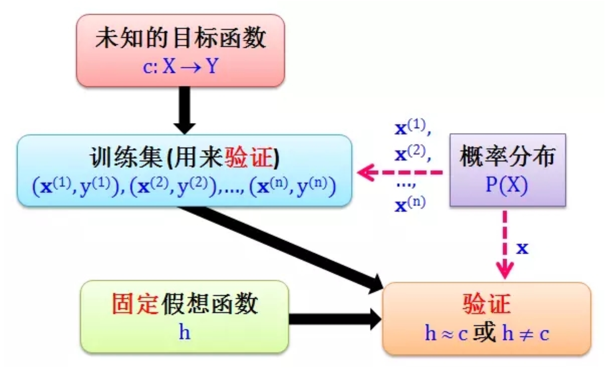

# 介绍

## 简介

1956 年提出 AI 概念，短短3年后（1959）[Arthur Samuel](https://en.wikipedia.org/wiki/Arthur_Samuel) 就提出了机器学习的概念：机器学习研究和构建的是一种特殊算法（而非某一个特定的算法），能够让计算机从经验数据中产生“模型”，基于模型对新的数据进行预测。机器学习的原理是把现实生活中解决问题的“经验”抽象成数学模型，并且很清楚模型中不同参数的作用。在本文中用“模型”泛指从数据中学得的结果。

AI 是目标，而机器学习 ML（Machine Learning）是实现 AI 的方法，它是计算机基于数据构建概率统计模型并运用模型对数据进行预测与分析的学科。ML 所研究的是关于在计算机上从经验数据中产生模型（model）的“学习算法”。有了“学习算法”，就可以把经验数据提供给它，它就能基于这些经验数据产生模型。在面对新的情况时，模型可以提供相应的判断。

### 学习 vs. 智能

- 人工智能：整个学科的名称，类似于“生物学”或“化学”，通过机器模拟人类认知 – 感知、学习、推理、决策 。
- 数据科学/挖掘：数据科学（Data Sciense） = 数据 + 科学，是从数据中获取信息的科学，其交叉领域包括计算机、统计及专业知识。它利用机器学习和统计学等技术，从大量数据中提取有效信息、模型。
- 机器学习：是人工智能的重要组成部分，但不是唯一的部分。
- 神经网络：是机器学习的一种分支方法，这种方法很受欢迎，不过机器学习大家庭下还有其他分支。
- 深度学习：是关于构建、训练和使用神经网络的一种现代方法。本质上来讲，它是一种新的架构。在当前实践中，没人会将深度学习和“普通网络”区分开来，使用它们时需要调用的库也相同。为了不让自己看起来像个傻瓜，你最好直接说具体网络类型，避免使用流行语。
- 统计：数理统计和应用统计（描述统计、推论统计）

#### 数据挖掘 vs. 机器学习

实际上数据挖掘和机器学习在很大程度上是重叠的。一些常用算法，比如 K-Means、KNN、SVM、决策树和朴素贝叶斯等，既可以说是数据挖掘算法，又可以说是机器学习算法。

- 数据挖掘：知识模型。数据挖掘通常是从现有的数据中提取规律模式（pattern）以及使用算法模型（model）。核心目的是找到这些数据变量之间的关系，因此也会通过数据可视化对变量之间的关系进行呈现，用算法模型挖掘变量之间的关联关系。通常情况下，我们只能判断出来变量 A 和变量 B 是有关系的，但并不一定清楚这两者之间有什么具体关系。在谈论数据挖掘的时候，更强调的是从数据中挖掘价值。
- 机器学习：经验模型。机器学习是人工智能的一部分，它指的是通过训练数据和算法模型让机器具有一定的智能。一般是通过已有的数据来学习经验，并通过各种算法模型形成一定的**处理能力**，比如分类、聚类、预测、推荐能力等。这样当有新的数据进来时，就可以通过训练好的模型对这些数据进行预测，也就是通过机器的智能帮我们完成某些特定的任务。

### 机器学习三要素

抛开所有和人工智能(AI)有关的扯淡成分，机器学习唯一的目标是基于输入的数据来预测结果，就这样。所有的机器学习任务都可以用这种方式来表示，否则从一开始它就不是个机器学习问题。样本越是多样化，越容易找到相关联的模式以及预测出结果。因此，需要 3 个部分来训练机器：

- 数据：想检测垃圾邮件？获取垃圾信息的样本。想预测股票？找到历史价格信息。想找出用户偏好？分析他们在Facebook上的活动记录。数据越多样化，结果越好。对于拼命运转的机器而言，至少也得几十万行数据才够吧。获取数据有两种主要途径——手动或者自动。手动采集的数据混杂的错误少，但要耗费更多的时间——通常花费也更多。自动化的方法相对便宜，你可以搜集一切能找到的数据（但愿数据质量够好）。样本就是通常说的“训练数据”，包括输入和结果两部分。样本的数量和质量对机器学习的效果至关重要，如果样本量太少或样本分布不均衡，对训练出来的模型就有很大的影响。
- 模型：模型就是映射样本输入与样本结果的函数 f，可能是一个条件概率分布，也可能是一个决策函数。所有 f 的可能结果构成了模型的假设空间 H。很多时候 H 的函数类型是明确的，需要计算的是函数的参数，比如确定 f 函数为一个线性函数，那么 f 的函数表示就可以写为：$y=a_1 x+a_0$。
  - 特征：也可以称为“参数”或者“变量”，属于模型的一部分。比如汽车行驶公里数、用户性别、股票价格、文档中的词频等。换句话说，这些都是机器需要考虑的因素。如果数据是以表格的形式存储，特征就对应着列名，这种情形比较简单。但如果是100GB的猫的图片呢？我们不能把每个像素都当做特征。这就是为什么选择适当的特征通常比机器学习的其他步骤花更多时间的原因，特征选择也是误差的主要来源。人性中的主观倾向，会让人去选择自己喜欢或者感觉“更重要”的特征——这是需要避免的。
- 算法：算法就是要从模型的假设空间中寻找一个最优的函数，使得样本空间的输入 X 经过该函数的映射得到的 f(X)，和真实的 Y 值之间的距离最小。这个最优的函数通常没办法直接计算得到，即没有解析解，需要用数值计算的方法不断迭代求解。因此如何寻找到 f 函数的全局最优解，以及使寻找过程尽量高效，就构成了机器学习的算法。如何保证 f 函数的参数空间最接近最优解，就是算法的策略。机器学习中用损失函数来评估模型是否最接近最优解。损失函数用来计算模型预测值与真实值的差距，常用的有 0-1 损失函数、平方损失函数、绝对损失函数、对数损失函数等。最显而易见的部分。任何问题都可以用不同的方式解决。你选择的方法会影响到最终模型的准确性、性能以及大小。需要注意一点：如果数据质量差，即使采用最好的算法也无济于事。这被称为“垃圾进，垃圾出”(garbae in - garbage out,GIGO)。所以，在把大量心思花到正确率之前，应该获取更多的数据。

### 历史

- 第一次黄金期：1956 年 Dartmouth 会议，第一款神经网络软件 Perceptron，第一款人工智能软件 Logic Theorist 。
- 第二次黄金期：198 0年，第一次 AI 冬天，Hopfield 网络&BP 算法，第五代计算机兴起。第五代计算机失败，DARPA削减投入。2000年，第二次AI冬天。
- 第三次浪潮：深度学习（Hinton 2006），DNN 在语义识别上的成功，CNN 在图像上的成功。

### 五大流派

- 符号主义：使用符号、规则和逻辑来表征知识和进行逻辑推理，如规则和决策树
- 贝叶斯派：获取发生的可能性来进行概率推理，如朴素贝叶斯或马尔可夫
- 联结主义：使用概率矩阵和加权神经元来动态地识别和归纳模式，如神经网络
- 进化主义：生成变化，然后为特定目标获取其中最优的，如遗传算法
- Analogizer：根据约束条件来优化函数（尽可能走到更高，但同时不要离开道路），如支持向量机

### 分类

模型训练方式不同可以分为监督学习（Supervised Learning），无监督学习（Unsupervised Learning）、半监督学习（Semi-supervised Learning）和强化学习（Reinforcement Learning）四大类。

在“有监督学习”中，有一个“监督者”或者“老师”提供给机器所有的答案来辅助学习，比如图片中是猫还是狗。“老师”已经完成数据集的划分——标注“猫”或“狗”，机器就使用这些示例数据来学习，逐个学习区分猫或狗。

无监督学习就意味着机器在一堆动物图片中独自完成区分谁是谁的任务。数据没有事先标注，也没有“老师”，机器要自行找出所有可能的模式。

#### 监督学习

基于已知类别的训练数据进行学习。监督学习假定训练数据满足独立同分布的条件，并根据训练数据学习出一个由输入到输出的映射模型。反映这一映射关系的模型可能有无数种，所有模型共同构成了假设空间。**监督学习的任务就是在假设空间中根据特定的误差准则找到最优的模型**。

- 分类（Classification）：就是通过训练集得到一个分类模型，然后用这个模型可以对其他数据进行分类。输出的是离散的值，当个数为 2 时即为最简单的二分类问题。

- 回归（regression）：输出的是连续的值

- structure：输出的是类似于图形、语音等

#### 无监督学习

无监督学习比有监督学习出现得稍晚——在上世纪90年代，这类算法用的相对较少，有时候仅仅是因为没得选才找上它们。有标注的数据是很奢侈的。假设现在我要创建一个——比如说“公共汽车分类器”，那我是不是要亲自去街上拍上几百万张该死的公共汽车的照片，然后还得把这些图片一一标注出来？没门，这会花费我毕生时间，我在Steam上还有很多游戏没玩呢。你可以尝试使用无监督学习。但是印象中，我不记得有什么关于它的最佳实践。无监督学习通常用于探索性数据分析(exploratory data analysis)，而不是作为主要的算法。那些拥有牛津大学学位且经过特殊训练的人给机器投喂了一大堆垃圾然后开始观察：有没有聚类呢？没有。可以看到一些联系吗？没有。好吧，接下来，你还是想从事数据科学工作的，对吧？

基于未知类别的训练数据进行学习

- 聚类：是利用算法进行自动归类。通过聚类分析可以发现事物的内在规律：具有相似购买习惯的用户群体被聚类为一组，一方面可以直接针对不同分组用户进行差别营销，根据分组情况进行市场划分；另一方面可以进一步分析，比如同组用户的其他统计特征还有哪些，并发现一些有价值的模式。

- 降维（Dimensionality Reduction）：

#### 半监督学习

同时使用已知类别和未知类别的训练数据进行学习

#### 强化学习

最接近人类学习的办法。即，有 input，取代 label 的是 reward——不告诉你正确答案是什么，但是会根据你的答案表扬你或者批评你。

### ML vs. 大数据

大数据已经论文 ML 中特征工程的工具

## 术语

### 函数 vs. 概率

函数和概率可以看成一回事

- 函数是 x 对应唯一的值 y
- 概率是 x 对应一组值 y，概率有更高的不确定性

### 判别式 vs. 生成式模型

- 判别方法：由数据直接学习决策函数或条件概率分布。其基本思想是在有限样本条件下建立判别函数，不考虑样本的产生模型。不能反映训练数据本身的特性，但它可以寻找不同类别之间的最优分类面，反映的是异类数据之间的差异。
- 生成方法：从数据学习“联合概率密度分布”，然后求出条件概率分布作为预测模型，这类方法需要样本非常多时才能很好的描述数据的真正分布。之所以成为生成方法，是因为模型表示了给定输入 X 产生输出 Y 的生成关系。它从统计学的角度表示数据的分布情况，能够反映同类数据本身的相似度，但不关心划分各类的边界在哪里。

机器学习的任务是从属性X预测标记Y，即求概率P(Y|X)：

- 判别式模型：知晓所有标签，返回最有可能的一个标签。它求得条件概率 P(Y|X)，对未见示例X，根据P(Y|X)可以求得标记Y，即可以直接判别出来。如图的左边所示，实际是就是直接得到了判别边界，所以传统的、耳熟能详的机器学习算法如线性回归模型、支持向量机SVM等都是判别式模型，这些模型的特点都是输入属性X可以直接得到Y（对于二分类任务来说，实际得到一个score，当score大于threshold时则为正类，否则为反类）。从另一个角度来说，判别式对于某示例 $x_1$，对正例和反例的标记的条件概率之和等于1，即 $P(y_1|x_1)+P(y_2|x_1)=1$。判别模型之所以称为“判别”，是因为其根据 X “判别” Y。
- 生成式模型：独立计算某几个标签的概率，然后做比较。它求得联合概率 P(Y,X)，对于未见示例 X，求出 X 与不同标记之间的联合概率分布，然后概率最大的获胜。如图右边所示，并没有什么边界存在，对于未见示例（红三角），求两个联合概率分布（有两个类），比较一下，取那个大的。机器学习中朴素贝叶斯模型、隐马尔可夫模型 HMM 等都是生成式模型。熟悉Naive Bayes的都知道，对于输入 X，需要求出好几个联合概率，然后较大的那个就是预测结果。也就是说，对于某示例$x_1$，对正例和反例的标记的联合概率之和不等于1，即$P(y_1,x_1)+P(y_2,x_1)<1$。要遍历所有的X和Y的联合概率求和，即 $\sum P(X,Y)=1$。生成模型之所以称为“生成”，是因为其预测的根据是联合概率P(X,Y)，而联合概率可以理解为“生成”(X,Y)样本的概率分布。 

举例来说，要确定一只羊是山羊还是绵羊。用判别模型的方法是从历史数据中学习到模型，然后通过提取这只羊的特征来预测出这只羊是山羊还是绵羊。利用生成模型是根据山羊的特征首先学习出一个山羊的模型，根据绵羊的特征学习出一个绵羊的模型，然后从这只羊中提取特征，分别放到山羊和绵羊的模型中做预测，然后比较哪个概率大。判别式模型是根据一只羊的特征可以直接给出这只羊是山羊的概率（比如logistic regression，这概率大于0.5时则为正例，否则为反例），而生成式模型是要都试一试，最大的概率的那个就是最后结果。

### 样本

- 样本（sample）/示例（instance）表示数据集中的每条数据。
- 特征（feature）/属性（attribute）：反映样本某方面性质的描述。被描述的性质叫作特征/属性，特征的取值称为特征值/属性值。
- 特征值（feature value）/属性值（attribute value）：特征上的取值。
- 特征空间（feature space）/属性空间（attribute space）/样本空间（sample space）：数据的不同特征之间可以视为相互独立，因而每个特征都代表了一个不同的维度，这些维度共同张成了特征空间。
- 特征向量（feature vector）：不同于线性代数中的“特征向量”，机器学习中的每个样本有 n 个特征值，这 n 个特征值组成的向量被称为特征向量，对应 n 维特征空间的一个点。因而**每个样本都可以视为特征空间中的一个向量**，即特征向量。
- 标记（label）：在监督学习下，样本已经打的标签。
- 标记空间（label space）/输出空间：所有标记的集合。
- 样例（example）：拥有标记的样本。

### 数据集

- 数据集（data set）：一组样本的集合。
- 训练集（training set）：训练过程中使用的数据，相当于上课学知识，其中每个样本称为训练样本（training sample）。
- 验证集（validation set）：相当于课后的的练习题，用来纠正和强化学到的知识。模型选择与评估中用于评估测试的数据集称为“验证集”。例如不同神经网络在训练集上训练结束后，通过验证集来比较判断各个“学习算法”/模型的性能。这里的不同模型主要是指对应不同结构或超参数的神经网络。
- 测试集（testing set）：学得模型后，使用其进行测试的被预测样本称为测试样本（testing set）。相当于期末考试，用来最终评估学习效果。测试集应该尽量与训练集互斥，即测试样本尽量不在训练集中出现、为在训练过程中使用过。
- 误差（Error）：误差被定义为模型的实际预测输出与样本真实输出之间的差异。
  - 训练误差（training error）/经验误差（empirical error）：指学到的模型在训练数据集上的误差。训练误差描述的是输入属性与输出分类之间的相关性，能够判定给定的问题是不是一个容易学习的问题。
  - 测试误差（testing error）/泛化误差：指学到的模型在新的测试样本上的误差。测试误差反映了学到的模型对未知的测试数据集的预测能力，学习的目的是得到测试误差小的模型。
- 错误率：在分类问题中，分类错误的样本占全部样本的比例。

### 学习

- 假设（hypothesis）：ML 训练学得的模型对应了关于训练数据的某种潜在的规律，因此称为假设。
- 假设空间（hypothesis space）：所有可能假设构成的集合，也就是后面训练时所说的model。
- 学习（learning）/训练（trianing）：从数据集中学得模型的过程。可以把 ML 看成在假设空间中搜索的过程，搜索的目的是找到与训练集“匹配（fit）”的假设。
- 泛化能力（generalization）：指学得的模型适用于新样本的能力，具有泛化能力的模型能很好地适用于整个样本空间。
- 版本空间（version space）：在实际问题中，常常会面临很大的假设空间，但学习的过程是基于有限样本训练集进行的，因此可能有多个假设与训练集一致，这些假设的集合被称为版本空间（version space）。
- 归纳偏好：归纳偏好表示在学习过程中对某一类假设的偏好，它可以看做是“学习算法”自身一个可能很庞大的假设空间中对假设进行选择的启发式“价值观”。
  - 奥卡姆剃刀（Occam's razor）：奥卡姆剃刀是一种归纳偏好，若在假设空间中有多个假设满足训练集，则选择最简单的那个。

## 计算学习理论

计算学习理论是机器学习的理论基础，其目的是分析学习任务的困难本质，为学习算法提供理论保证，并根据分析结果指导算法设计。

### 基础知识

- 样本：给定样本集 $\hat{D}={(x_1,y_1),(x_2,y_2),\dots,(x_m,y_m)},x_i \in X$，假设 $X$ 中的所有样本服从一个隐含未知的分布 $D$，$\hat{D}$ 中所有样本都是独立地从这个分布上采样而得，即满足独立同分布 IDD（Independent and Identically Distributed）。
- 概念 c（Concept）：从样本空间 $X$ 到标记空间 $Y$ 的映射，它决定样本 x 的真实标记 y。
  - 目标概念 c：使 X、Y 完全正确的映射，即对任何 (x,y)，有 $c(x)=y$ 成立。
  - 概念类 C（Concept Class）：目标概念所构成的集合。
- 假设 h：从样本空间 $X$ 到标记空间 $Y$ 的映射，由于不能确定 h 是否真是目标概念，因此才会被称为假设。
  - 假设空间 H（Hypothesis Space）：所有可能的假设的集合，$h\in H$。
- 学习算法 L：
  - H vs. C：H 是学习算法 L 自认为可能的映射的集合，C 真正满足要求的映射的集合（上帝视角），学习训练的目的是在 H 中寻找 C。
- 误差：
  - 泛化误差：在其全部取值范围内所有数据的数学平均误差 $E(h;D)=P_{x\in D}(h(x)\neq y)$
  - 经验误差：在样本上计算而得的平均误差 $\hat{E}(h;\hat{D})=\frac{1}{m}\displaystyle \sum_{i=1}^{m}I(h(x_i)\neq y_i)$
  - 由于 $\hat{D}$ 是 D 的独立同分布采样，因此 h 的经验误差的期望等于其泛化误差。

### 学习框架

根据“天下无免费午餐 NFL 定理”，既便“猛炸天”比“胡逼猜”模型表现要好，但目标概念 c 是未知的，完美预测样本内数据对预测样本外数据没有什么帮助。只有样本外的表现好才能证明机器真正学习到了目标概念 c。但样本外又是未知的，机器如何学习呢？

- 不同模型的作用“相同”：NFL 定理的假设是所有问题出现的机会相同，即所有目标概念 c 发生的可能性是均匀分布的。但是实际上并不是这样的，某些时候某个 c 发生的可能性大。比如某个问题中一组数据呈现明显的线性关系，那么目标函数 c 为线性函数的可能性较大，而 c 为 10 阶多项式的可能性几乎为零。由此可知每一个具体问题都有一个最有可能的目标概念 c 以及一个最优的算法，脱离具体问题空谈算法毫无意义。
- 样本外数据预测：学习的最终目的就是找到一个未知的目标概念 c，因为它可以将任意数据都能正确分类。但任意数据还包括样本外的未知数据，因此针对样本外数据的目标概念 c 很难学得。

既然找不到 c 就来找它的替身 g，g 函数是从假设空间 H 中通过机器学习得出的最优假设，既 g 是 c 的替身（g ≈ c）。具体原理如下图：

#### 相同分布假设

这里有一个非常重要的假设：所有数据（已知及未知）都来自同一个分布 P，而 P 可以是未知的。如果这个假设不成立，机器学习根本进行不下去。试想从一个训练集（正态分布）学习到一个模型在测试集（泊松分布）做分类，模型表现好坏没有任何参考价值。因此上图可以更新为：

#### 核心问题

现在已经有了机器学习的框架，目标变成找到一个 g ≈ c。如果找得到 g 那么机器学习可行，找不到 g 那么机器学习不可行。而找到 g 的逻辑变为：使 g 的泛化误差很小。因为 c 的泛化误差理论上为 0，如果 g 的泛化误差很小，则证明了 g ≈ c，从而间接找到 c 的替身 g。得到 g 也就是学习到了目标概念 c，从而证明机器学习可行。

至此核心问题变为了寻求 g 的泛化误差。但因为目标概念 c 是未知的，从而使 g 的泛化误差无法计算。因此满足以下 2 点，则可以推导出 g 的泛化误差很小 

- 使 g 的泛化误差 ≈ g 的经验误差
- 使 g 的经验误差很小

因此，核心变成了解决 2 个问题：

- 证明在某种条件下是的泛化误差近似经验误差 $E(g)≈\hat{E}(g)$ 
- 使用不同算法使得经验误差 $\hat{E}(g)$ 很小 

基于以上 2 点，那么 g 的泛化误差 $E(g)$ 也就很小，从而机器学习也就可行了。

#### 泛化误差≈经验误差：PAC

令误差参数 $\epsilon$ 为泛化误差 $E(h)$ 的上限，即 $E(h)\leq \epsilon$，表示学得模型 $h$ 所应满足的误差要求。

PAC（Probably Approximately Correct）的核心观点是：**当样本数足够大**时，样本的分布 v（对应 $\hat{E}(g)$）和总体的分布 u（对应 $E(g)$）就足够靠近。具体的 Hoeffding 不等式为：。

- ε：任意正数
- n：样本个数
- |v - u| > ε：v 和 u 之间相差 ε
- P：事件 |v - u| > ε 概率

这个公式的直观表达是：如果希望 v 与 u 很接近（ε 很小），那么为了让不等式右边很小，只能调大样本个数 n。

Hoeffding 不等式的核心在于右边的概率上界 2exp(-2ε2n) 完全与实际分布 u 无关，只与样本大小 n 有关，而不是总体大小。这样，该不等式完全把样本和总体（未知的东西）分离。不管总体个数是多少，不管总体变量有多么未知，给定一个样本个数 n，就能计算出“已知到未知”的概率上界。

##### 具体实现

给定训练集 D，希望学习算法 L 学得的模型所对应的假设 h 尽可能接近目标概念 c。希望以比较大的把握学得比较好的模型，也就是以较大的概率学得误差满足预设上限的模型。

- PAC 辨识：对于 $0<\epsilon,\delta<1$，所有 $c\in C$ 和分布 $D$，若存在学习算法 L，其输出假设 $h\in H$ 满足：$P(E(h)\leq \epsilon)\geq 1-\delta$，则称学习算法 L 能从假设空间 H 中 PAC 辨识概念类 C。这样的学习算法 L 能以较大的概率（至少$1-\delta$）学得目标概念 c 的近似（误差最多为 $\epsilon$）。
  - ？？？：经验误差接近泛化误差，即 $\hat{E}(h)$  接近 $E(h)$ ，由样本 D 决定
  - $E(h)\leq \epsilon$：泛化误差小，即 h 接近 c，由 $\epsilon$ 决定
  - $P(E(h)\leq \epsilon)\geq 1-\delta$：学习算法 L 的效率，能以较大概率学得，由 $\delta$ 及训练集决定
- PAC 可学习：令 m 表示从分布 $\hat{D}$ 中 IID 采样得到的样本数目。若存在学习算法 L 和多项式函数 poly(.,.,.)，使得对于任何 $m \geq poly(1/\epsilon, 1/\delta, size(x), size(c))$，L 能从假设空间 H 中 PAC 辨识概念类 C，则称概念类 C 对假设空间 H 而已是 PAC 可学习的。
- PAC 学习算法：若学习算法 L 使概念类 C 为 PAC 可学习的，且 L 的运行时间也是多项式函数 $poly(1/\epsilon, 1/\delta, size(x), size(c))$，则称概念类 C 是高效 PAC 可学习的，称 L 为概念类 C 的 PAC 学习算法。
- 样本复杂度：满足 PAC 学习算法 L 所需的 $m\geq poly(1/\epsilon, 1/\delta, size(x), size(c))$ 中最小的 m，称为学习算法 L 的样本复杂度。

PAC 学习给出了一个抽象地刻画学习能力的框架。到底需要多少样本才能学得目标概念 c 的有效近似？对于 PAC 来说，只要训练集 D 的规模能让学习算法 L 以概率 $1-\delta$ 找到目标假设的 $\epsilon$ 近似即可。

#### 经验误差≈0

##### 从单一到有限

与之前的流程相比，目前把 g 用到训练集上来计算经验误差，如果很小那么验证出 g 学到了 c，如果很大那么验证出 g 没学到 c，但这本身不是学习只是验证。

因此当前的问题转变为：如何有一个机制使得 g 的经验误差 $\hat{E}(g)≈0$。也就是从假设空间 H 中选出一个 h 使得 $\hat{E}(h)$ 最小，并将这个最优假设设定为 g。只要满足 $P(E(g)>\epsilon)\leq \delta$，那么 $E(g)≈0$，g 就真正学到了 c。

从 h 升级到 g，也就是从单一到有限的过程，其实际改变就是右边多出一个 M（假设 h 的个数）：

##### 从有限到无限

但在实际情况中，假设 h 的个数 M 并非有限，但可以将无限多的假设根据等效性归类，如下图中的 h1、h2、h3 可以归为一类。

- 增长函数：表示假设空间 H 对 n 个示例所能赋予标记的最大可能。它的直观表示就是假设空间 H 中不同类别的假设的数量，例如对于二分类问题其上限为 $2^n$，其更小的上界为 。
- 对分：H 中的假设对 D 中示例赋予标记的每种可能结果被称为一种“对分”
- 打散：若假设空间 H 能实现 D 上的所有对分，即 $2^n$，则称示例集 D 能被假设空间 H “打散”。
- VC 维：假设空间 H 的 VC 维指能被 H 打散的最大示例集的大小，表明存在大小为 VC 的示例集能被假设空间 H 打散。

### 模型评估

对模型的泛化性能进行评估，需要有衡量泛化能力的评价标准，也就是性能度量。评估的指标主要有准确率、召回率、F值，这个过程可以看到模型如何对尚未看到的数是如何做预测的，这意味着代表模型在现实世界中的表现。主要的性能度量包括：错误率、精度、查准率、查全率、F1、ROC、AUC。

#### metrics vs. 损失函数

- metrics：理论上希望对模型性能进行的评估方式，a function to evaluate the quality of model
- 损失函数：实际上用来对候选模型的性能进行的评估方式，然后选择泛化误差最小的那个作为最优模型（best function）。损失函数比较容易被优化

#### 实现方法

##### 损失函数=metrics

例如 MSE、logLoss，因此可以直接优化

### 过拟合/欠拟合

#### 欠拟合（underfitting）

如果说造成过拟合的原因是学习能力太强，造成欠拟合的原因就是学习能力太弱，以致于训练数据的基本性质都没能学到。

欠拟合的表现是：
- training error 大
- bias 大

解决方法：
- 增加训练轮数
- 说明模型过于简单，需要采用更复杂的模型

#### 过拟合（overfitting）

把训练数据的自身的一些特点错当做整体样本都会具有的一般性质，这样会导致泛化能力下降。例如，如果接触的外国人较少，从没见过双眼皮的韩国人，思维中就难免出现“单眼皮都是韩国人”的错误定式。过拟合出现的原因通常是学习时模型包含的参数过多，从而导致训练误差较低但测试误差较高。

过拟合的表现是：

- testing error 大
- variance大

解决方法是：
- 增加 training data：
- 调参 regularization：在 model 中加上一个 $w_{i}^2$

#### 偏差、方差、噪声

$E(f;D)=bias^2(x)+var(x)+\epsilon ^2$：泛化误差可以分解为偏差、方差和噪声之和。

- 偏差 bias：度量了学习算法的期望预测与真实结果的偏离程度，即刻画了学习算法本身的拟合能力。
- 方差 variance：度量了同样大小的训练集的变动所导致的学习性能的变化，即刻画了数据扰动造成的影响。
- 噪声：表达了在当前任务上任何学习算法所能达到的期望泛化误差的下线，即刻画了学习问题本身的难度。

偏差与方差是有冲突的，在训练不足时，模型的拟合能力不够强，训练数据的扰动不足以使模型产生显著变化，此时偏差主导了泛化误差。随着训练程度的加深，模型的拟合能力逐渐增强，训练数据扰动渐渐能被模型学到，因此方差主导了泛化误差。也就是，训练数据发生轻微的扰动都会导致模型的显著变化，训练数据自身的特性被模型学到了，将发生过拟合。

## 不同角色

在企业中的重要性及技能

- 数据科学家：算法使用者
- 数据工程师：算法开发者
- 业务需求方：

### 数据科学家必备技能

- 数学统计：
  - 传统统计模型
  - 贝叶斯统计
  - 抽样调查
  - 实验设计
  - 机器学习
- 计算机编程：
  - 基本计算机知识
  - 数据库查询SQL
  - 并行计算
  - 大数据解决方案，如Hadoop、Spark等
  - Python或R编程语言
- 软实力：
  - 好奇心
  - 创造力
  - 业务领域知识
  - 终身学习能力
- 结果交流展示：
  - 自动化报表
  - 客户化展现
  - 交流能力
  - 将信息转化为具体行动建议

### 通用

对于想要以数据科学家-ML的身份进行应用机器学习的人，在没有博士学位的情况下，还有更多的东西：

- 分布式数据处理/机器学习：掌握Apache Spark，Apache Hadoop，Dask等技术的动手经验可以帮助您证明可以大规模创建数据/ ML管道。 与任何人都有经验应该是不错的选择，但是我还是建议使用Apache Spark（使用Python或Scala）。
- 生产ML /数据管道：如果您可以亲身体验Apache Airflow，这是一种用于创建数据和机器学习管道的标准开源作业编排工具。 目前，该行业已在使用它，因此建议您学习并围绕它进行一些项目。
- 数据库：必须了解数据库和查询语言。 尽管SQL非常被忽略，但是无论在任何云平台或数据库上，它仍然是行业标准。 开始在leetcode上练习复杂的SQL，这将帮助您完成DS概要文件中的部分编码采访，因为您将负责使用正在进行的预处理从仓库中导入数据，这将简化您在运行前进行预处理的工作 ML模型。 大多数功能工程可以在通过SQL将数据传输到模型中的同时进行，这是许多人忽略的一个方面。
- 编程语言：推荐用于数据科学的编程语言是Python、R、Scala 和 Java。了解他们中的任何一个都可以，并且可以解决问题。 对于ML类型的角色，面试过程中将进行现场编码回合，因此您需要在任何舒适的地方练习-Leetcode，Hackerrank或您喜欢的任何东西。

## 训练流程

- [训练流程](20_procedure.md)

## Ref

1. [一口气读完人工智能简史](https://www.toutiao.com/a6761213894112313860/?tt_from=weixin&utm_campaign=client_share&wxshare_count=1&timestamp=1581728608&app=news_article&utm_source=weixin&utm_medium=toutiao_ios&req_id=202002150903280101290480370E50AAE1&group_id=6761213894112313860)
2. [陆奇最新演讲：没有学习能力，看再多世界也没用](https://page.om.qq.com/page/O-AOlyQhshJ7QZ9X9g1wq0ZA0)
3. [计算学习理论](http://www.dataguru.cn/article-11253-1.html)
4. 