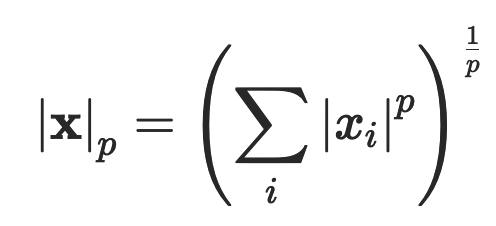
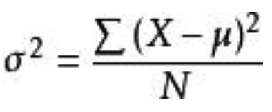
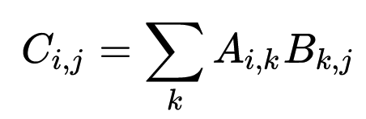
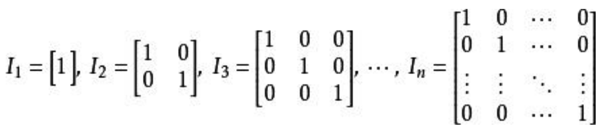
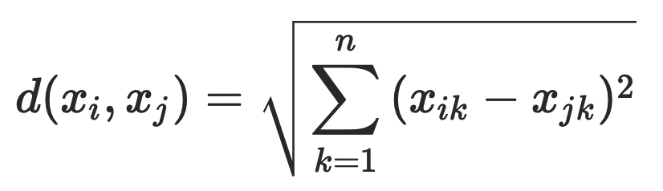
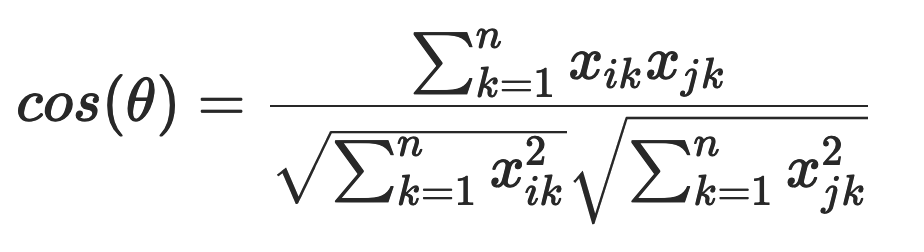

# 线性代数

## 简介

线性代数是用虚拟数字世界表示真实物理世界的工具，它把来自模拟世界的信号在定义域和值域上同时进行数字化，得到能被计算机存储和处理数字信号。在计算机存储中，标量占据的是零维数组；向量占据的是一维数组，例如语音信号；矩阵占据的是二维数组，例如灰度图像；张量占据的是三维乃至更高维度的数组，例如 RGB 图像和视频。

线性代数为数据分析提供了一条将大量数据列表概念化、可视化的渠道。它让数据样式变得非常清晰，从而让人大致了解特定运算的意义。

### 标量、张量

- 集合：由某些特定对象汇总而成的集体。
- 标量（scalar）：由单独的数 a 构成的元素被称为一个标量，标量可以是整数、实数或复数。
- 张量：张量是基于向量和矩阵的推广，可以将标量视为零阶张量，向量（矢量）视为一阶张量，那么矩阵就是二阶张量。例如，可以将任意一张彩色图片表示成一个三阶张量（就像C语言中的三维数组），三个维度分别是图片的高度、宽度和色彩数据。 使用字体 A 来表示张量 “A’’。张量 A 中坐标为 (i, j, k) 的元素记作 A_{i,j,k} 。

#### ？？？n维向量 vs. n阶张量

## 向量（Vector）

向量（vector）的定义是多个标量 a1,a2,⋯,an 按一定顺序组成一个序列被称为向量，给定表示索引的下标才能唯一地确定向量中的元素。从物理学的理解，向量是一个可以从任意点出发的箭头。从计算机学科理解，向量是一个n维有序的数字列表。

线性代数就是把以上两种观点抽象化，在一个n维坐标系中，向量是一个由原点发起的箭头，而有序的数组就对应向量的坐标。

- 单位向量：指范数等于1的向量，因为可以有不同的方向，所以单位向量有无数个。

### 线性组合

- 加法（向量+向量）：产生一个新的（从原点出发）的向量。向量表示了一种空间中点的变化，而2个向量的加法就是把点的变化叠加，从而产生一种新的点的变化。
- 乘法（标量*向量）：标量与向量的乘法表示了拉长或缩短原向量。
- 线性组合：加法和乘法的组成。

### 线性相关 & 张成空间

- 张成空间：多个向量的全部线性组合所构成的向量集合称为向量所张成的空间。
- 线性相关：向量组中的一个向量都可以用向量组中其他向量的线性组合来表示。换句话讲，这个向量已经落在其他向量的张成空间中，它对整个向量组张成空间没有贡献的，把它从向量组中拿掉并不会影响向量组的张成空间。
- 线性无关：向量组中任意一个向量无法用向量组中其他向量的线性组合表示。换句话说，向量组中的每一个向量都为向量组所张成的空间贡献了一个维度，每一个向量都缺一不可，少了任何一个向量，都会改变向量组所张成的空间。

### 向量运算

- 
- 范数（norm）：对单个向量大小的度量，其作用是将向量映射为一个非负的数值（在2维中对应的就是向量的长度）。L1 范数计算的是向量所有元素绝对值的和，L2 范数计算的是通常意义上的向量长度，L∞ 范数计算的则是向量中最大元素的取值。通用的 Lp 范数定义如下：
- 点积（映射）：点积可以看成是把一个向量映射到另一个向量上，点积对应一个 n \* 1 的matrix乘以一个n \* 1 的向量，也就是把向量映射到matrix对应的直线上（具体解释略微复杂），把向量从n维映射到1维的，而乘积的值则为映射值的乘积。
- 内积（inner product）：表示两个向量之间的相对位置，即向量之间的夹角。当内积为 0 时，在二维空间上这意味着两个向量的夹角为 90 度，即相互垂直。而在高维空间上，这种关系被称为正交（orthogonality）。如果两个向量正交，说明他们线性无关，相互独立，互不影响。两个相同维数向量内积的表达式为：
- 交叉积：
  - 2个2维向量的交叉积的结果表示2两向量所组成的平行四边形的面积，对应的就是由2个向量组成的matrix的det()。
  - 2个3维向量的交叉积为 ``p = v*w = det([u,v,w])``，其中p的方向与v、w垂直（右手定律），值为v、w的面积。当要计算一个向量u与v、w组成的体积时，也就是计算p与u的点积。
- 标准正交基（orthonormal basis）：在内积空间中，一组两两正交的向量构成这个空间的正交基（orthogonal basis），假若正交基中基向量的 L2 范数都是单位长度 1，这组正交基就是标准正交基（orthonormal basis）。当作为参考系的标准正交基确定后，空间中的点就可以用向量表示。
- 方差：是衡量随机变量或一组数据时离散程度的度量，其中 \sigma^{2} 为总体方差， X 为变量， \mu 为总体均值， N 为总体例数。
- 标准差：
- 协方差：

## 矩阵 & 线性变换

### 线性变换

点的变化对应着向量的线性变换（linear transformation），从向量运动的角度去理解，变换让向量从一个地方运动到了另一个地方。

从几何的角度考虑，线性变换必须满足两点要求，首先变换前后直线依旧是直线（即保持网格平行且等距分布的），其次原点保持不变。网格平行且等距分布的性质有一个重要的推论就是，**某一个向量在变换前后对于基向量的系数（坐标）不变**，也就是说**线性变换只是通过对基的变换从而实现向量的变换**，而不是基于基的向量的系数（坐标）。线性变换可以理解为：基向量相对原先的基坐标变换之后，向量相对的坐标保持不变，在原先基向量下表示变换后的向量。所以如何用数值描述线性变换，实际上只需记录两个基向量变换前后的位置即可。

### 矩阵（matrix）

变换本质上就是函数，它暗示了能够以某种方式可视化的方式描写“输入-输出”之间的关系。点的变化对应着向量的线性变换，而描述向量线性变换的数学语言正是矩阵。使某个点发生变化的方法是用代表变化的矩阵乘以代表对象的向量：**Ax=y**。

- 从向量变换的角度：向量 x 经过矩阵 A 所描述的变换（其实是通过坐标基向量的变换实现x的变换），向量 x 变换后变成了向量 y。
- 从基坐标系变换的角度：表示把新坐标系中的向量 x（x用新坐标系的坐标表示），用旧坐标系（往往是标准坐标系）来表示 y （相同向量在旧坐标系中的坐标）。
- 其实以上两种的本质是一回事

当我们将变换作用于某个空间，意思是**将该变换应用于空间中的每一个向量**，其本质就是将变换作用于空间的基向量，而矩阵就是表示基向量如何变换的。例如，在某个线性变换的作用下，i, j 以及 v 都运动到了新的位置。线性变换后的 v 是变换后的 i 和 j 的相同线性组合，这就意味着对于一个线性变换，可以跟踪基向量的变化从而掌握整个空间（即全部向量）的变化。我们将线性变换后的基向量坐标按列组合起来拼接成一个矩阵，对应线性变换的全部信息，矩阵表示为对空间的某种线性变换。

- 列空间（column space）：矩阵的所有column（也就是基向量）张成的空间
- 秩（rank）：线性变换后空间的维数，也就是列空间的维数
- 零空间（null space）、核：变换后落在原点的向量的集合

#### 矩阵乘法

矩阵乘法是矩阵运算中最重要的操作之一，两个矩阵 A 和 B 的 矩阵乘积（matrix product）是第三个矩阵 C。从几何的角度来看，矩阵相乘就是分别对相连做两次线性变换的综合结果。为了使乘法定义良好，矩阵 A 的列数必须和矩阵 B 的行数相等。如果矩阵 A 的形状是 m × n，矩阵 B 的形状是 n × p，那么矩阵C 的形状是 m × p。我们可以通过将两个或多个矩阵并列放置以书写矩阵乘法，例如C = AB。

- 矩阵乘积服从分配律：A(B + C) = AB + AC
- 矩阵乘积也服从结合律：A(BC) = (AB)C
- 但矩阵乘积并不满足交换律：(AB = BA 的情况并非总是满足)

#### 行列式（determinant）

其几何意义是相对于基向量所组成的面积（或则体积等），在矩阵对应线性变换之后面积的放大、缩小比例。如果把基向量的面积定为1，那么行列式就是线性变换后的实际面积。

#### 非方矩阵

m \* n 矩阵：

- m > n：例如 3 \* 2矩阵，把二维平面映射到三维空间中一个过原点的平面上
- m < n：例如 2 \* 3矩阵，把三维空间压缩到二维平面上去

### 线性方程（linear equation)

Ax=v

#### 恒等变换 & 单位矩阵 

- 恒等变换对应的是单位矩阵
- 单位矩阵： 任意向量和单位矩阵相乘，都不会改变。 我们将保持 n 维向量不变的单位矩阵记作：I_{n}。单位矩阵的结构很简单，所有沿主对角线的元素都是1，而所有其他位置的元素都是0。 如：

#### 逆变换 & 逆矩阵

- 逆变换 A^(-1)：

- 逆矩阵：矩阵A的逆矩阵记作 A^{-1} ，其定义的矩阵满足如下条件

  A^{-1}A=I_{n}。

### 坐标系

任何向量与一组数之间的转换都被称为坐标系。

- 基向量：向量空间的一组基向量是张成该空间的一个线性无关向量集。
- 基转换 `A * V`：V表示在新坐标系中的坐标，`A * V` 表示V向量在旧坐标系（也就是标准坐标系）中的表示。在保持向量不变的情况下，进行基转换，从而获得相同向量在旧坐标系中的坐标。
- 逆基转换 `A^{-1} * W`：W表示在旧坐标系（标准坐标系）中的向量，`A^{-1} * W` 表示W在新坐标系中的坐标。
- 连续转变`A^{-1} * M * A * V`：
  - `A^{-1} * M * A`：把新坐标系表示的向量V用旧坐标系（一般旧坐标系就是标准坐标系）来表示，在旧坐标系中实现线性变换M，然后再切换回新的坐标系中来表示。
  - 把在**新坐标系中**的向量V坐标进行基变换A到旧的坐标系中表示，在旧坐标系中执行线性转换操作M，再对线性变换后的向量进行逆基变换A^{-1}，用新的坐标系的坐标来表示。

### 特征空间

矩阵的特征值和特征向量的动态意义在于表示了变化的速度和方向，求解给定矩阵的特征值和特征向量的过程叫做特征值分解，就是计算方式：`det(A-uI) = 0`。

- 特征向量（eigenvector）：在线性变换过程中，仍然停留在原先向量的张成空间中的向量
- 特征值（eigenvalue）：特征向量在线性变换过程中的压缩比
- 特征基：基向量就是一组能张成整个空间的特征向量 y
- 连续转变`A^{-1} * M * A `：
  - 把特征向量坐标系中的向量用标准坐标系来表示，然后在标准坐标系中进行转变，所得的结果再用特性向量坐标系表示。
  - 通过特征向量基实现`A^{-1} * M * A`的最大意义在于所得到的线性变换永远是对角的，而且对角线上的值对应的就是特征值。原因在于线性变换M在特征向量的影响就是伸缩，所以最终变换矩阵必是对角的。**注意，这边选用的特征向量基是针对M的，所以才能满足特征向量基的要求。**

## 距离求值

### 欧式距离

对于数据 xi 和 xj，若其特征空间为 n 维实数向量空间 Rn，即 xi=(xi1,xi2,…,xin)，xj=(xj1,xj2,…,xjn)，则其欧氏距离计算公式为：

### 余弦相似度

不同于欧氏距离公式是计算空间距离，余弦相似度其实是计算向量的夹角。余弦相似度的值越接近 1 表示其越相似，越接近 0 表示其差异越大，使用余弦相似度可以消除数据的某些冗余信息，某些情况下更贴近数据的本质。

举个简单的例子，比如两篇文章的特征值都是：“大数据”“机器学习”和“极客时间”，A 文章的特征向量为（3, 3, 3），即这三个词出现次数都是 3；B 文章的特征向量为（6, 6, 6），即这三个词出现次数都是 6。如果光看特征向量，这两个向量差别很大，如果用欧氏距离计算确实也很大，但是这两篇文章其实非常相似，只是篇幅不同而已，它们的余弦相似度为 1，表示非常相似。

## Ref

1. [线性代数的本质](https://www.bilibili.com/video/av6731067)
2. 

