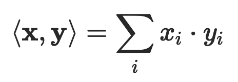

# 线性代数

## 简介

### 基本定义

- 集合：由某些特定对象汇总而成的集体。
- 标量（scalar）：由单独的数a构成的元素被称为一个标量，标量可以是整数、实数或复数。
- 向量（vector）：多个标量 a1,a2,⋯,an 按一定顺序组成一个序列被称为向量。向量可以看作标量的扩展。原始的一个数被替代为一组数，从而带来了维度的增加，给定表示索引的下标才能唯一地确定向量中的元素。**注意：向量可以分为：1维、2维、3维等，其实质是 n 维线性空间中的静止点**
- 矩阵（matrix）：将向量的所有标量都替换成相同规格的向量，得到的就是矩阵。相对于向量，矩阵同样代表了维度的增加，矩阵中的每个元素需要使用两个索引确定。
- 张量（tensor）：将矩阵中的每个标量元素再替换为向量，得到的就是张量。直观地理解，张量就是高阶的矩阵。
- 范数（norm）：对单个向量大小的度量，其作用是将向量映射为一个非负的数值（在2维中对应的就是向量的长度）。L1 范数计算的是向量所有元素绝对值的和，L2 范数计算的是通常意义上的向量长度，L∞ 范数计算的则是向量中最大元素的取值。通用的 Lp 范数定义如下：
- 内积（inner product）：表示两个向量之间的相对位置，即向量之间的夹角。当内积为 0，即 ⟨x,y⟩=0时，在二维空间上，这意味着两个向量的夹角为 90 度，即相互垂直。而在高维空间上，这种关系被称为正交（orthogonality）。如果两个向量正交，说明他们线性无关，相互独立，互不影响。两个相同维数向量内积的表达式为：
- 标准正交基（orthonormal basis）：在内积空间中，一组两两正交的向量构成这个空间的正交基（orthogonal basis），假若正交基中基向量的 L2 范数都是单位长度 1，这组正交基就是标准正交基（orthonormal basis）。当作为参考系的标准正交基确定后，空间中的点就可以用向量表示。
- 线性变换（linear transformation）：点的变化对应着向量的线性变换（linear transformation），而描述对象变化抑或向量变换的数学语言正是矩阵。使某个点发生变化的方法是用代表变化的矩阵乘以代表对象的向量：**Ax=y**。向量 x 经过矩阵 A 所描述的变换，变成了向量 y。

线性代数是用虚拟数字世界表示真实物理世界的工具，它把来自模拟世界的信号在定义域和值域上同时进行数字化，得到能被计算机存储和处理数字信号。在计算机存储中，标量占据的是零维数组；向量占据的是一维数组，例如语音信号；矩阵占据的是二维数组，例如灰度图像；张量占据的是三维乃至更高维度的数组，例如 RGB 图像和视频。

### 特征空间

- 特征值（eigenvalue）和特征向量（eigenvector）：矩阵特征值和特征向量的动态意义在于表示了变化的速度和方向，求解给定矩阵的特征值和特征向量的过程叫做特征值分解。

## 距离求值

### 欧式距离

对于数据 xi 和 xj，若其特征空间为 n 维实数向量空间 Rn，即 xi=(xi1,xi2,…,xin)，xj=(xj1,xj2,…,xjn)，则其欧氏距离计算公式为：

### 余弦相似度

不同于欧氏距离公式是计算空间距离，余弦相似度其实是计算向量的夹角。余弦相似度的值越接近 1 表示其越相似，越接近 0 表示其差异越大，使用余弦相似度可以消除数据的某些冗余信息，某些情况下更贴近数据的本质。

举个简单的例子，比如两篇文章的特征值都是：“大数据”“机器学习”和“极客时间”，A 文章的特征向量为（3, 3, 3），即这三个词出现次数都是 3；B 文章的特征向量为（6, 6, 6），即这三个词出现次数都是 6。如果光看特征向量，这两个向量差别很大，如果用欧氏距离计算确实也很大，但是这两篇文章其实非常相似，只是篇幅不同而已，它们的余弦相似度为 1，表示非常相似。

