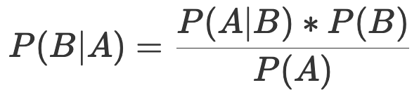

# 概率论

## 简介

### 频率（古典）学派 vs. 贝叶斯学派

对于样本分布F(X,O)，其中X是样本、O是概率分布。我们要对其中的未知O进行估计，让我们来看看频率学派与贝叶斯学派分别是如何做的。

频率学派认为，对于一批样本X，其概率分布O是确定的，只不过O未知。频率学派认为概率即是频率，某次得到的样本X只是无数次可能的试验结果的一个具体实现。样本中未出现的结果不是不可能出现，只是这次抽样没有出现而已。因此综合考虑已抽取到的样本X以及未被抽取的结果，可以认为总体概率分布是确定的，不过O未知。因为样本来自于总体，故其样本分布F(X,O)也同样的特点。  基于此，就可以根据X的分布去推断O。

贝叶斯学派否定了频率学派的观点，并且反对把样本X放到“无限多可能值之一”背景下去考虑，既然只得到了样本X，那么就只能依靠它去做推断，而不能考虑那些有可能出现而未出现的结果。与此同时，贝叶斯学派引入了主观概率的概念，认为一个事件在发生之前，人们应该对它是有所认知的，即F(X,O)中的O不是固定的，而是一个随机变量，并且服从分布H(O )，该分布称为“先验分布”（指抽样之前得到的分布）。当得到样本X后，我们对O的分布则有了新的认识，此时H(O)有了更新，这样就得到了“后验分布”（指抽样之后得到的分布）。此时可以再对O做点估计、区间估计，此时的估计不再依赖样本，完全只依赖O的后验分布了。

在贝叶斯学派眼中，概率描述的是随机事件的可信程度。如果手机里的天气预报应用给出明天下雨的概率是 85%，这就不能从频率的角度来解释了，而是意味着明天下雨这个事件的可信度是 85%。频率学派认为假设是客观存在且不会改变的，即存在固定的先验分布，只是作为观察者的我们无从知晓。因而在计算具体事件的概率时，要先确定概率分布的类型和参数，以此为基础进行概率推演。相比之下，贝叶斯学派则认为固定的先验分布是不存在的，参数本身也是随机数。换言之，假设本身取决于观察结果，是不确定并且可以修正的。数据的作用就是对假设做出不断的修正，使观察者对概率的主观认识更加接近客观实际。

## 频率（古典）学派

概率是对随机事件发生的可能性进行规范的数学描述。

- 古典概率模型：假设所有基本事件的数目为n，待观察的随机事件A中包含的基本事件数目为 k，则概率的计算公式为：P(A)=k/n。
- 联合概率（joint probability）：P(AB) 表示A和B两个事件共同发生的概率。如果联合概率等于两个事件各自概率的乘积，即 P(AB)=P(A)⋅P(B)，说明这两个事件的发生互不影响，即两者相互独立。
- 条件概率（conditional probability）：根据已有信息对样本空间进行调整后得到的新的概率分布。假定有两个随机事件A和B，条件概率就是指在事件B已经发生的条件下事件A发生的概率：P(A∣B)=P(AB)/P(B)。对于相互独立的事件，条件概率就是自身的概率是 P(A∣B)=P(A)。P(A∣B)可以看成B-->A的转换率，例如到车站B有40人，其中有10人会再到车站A，所以P(A∣B)=25%。
- 全概率公式（law of total probability）：将复杂事件的概率求解转化为在不同情况下发生的简单事件的概率求和，也就是有多条路径Bi到达A的概率是每条路径到A的概率总和。 

#### 最大似然估计法（maximum likelihood estimation）

最大似然估计法就是把训练数据的分布作为整体分布，其思想是使训练数据出现的概率最大化，依此确定概率分布中的未知参数，估计出的概率分布也就最符合训练数据的分布，所以最大似然估计法只需要使用训练数据。

##贝叶斯学派

贝叶斯（Bayesian）是一种基于条件概率的分类算法，如果已经知道 A 和 B 的发生概率，并且知道了 B 发生情况下 A 发生的概率，可以用贝叶斯公式计算 A 发生的情况下 B 发生的概率。事实上，可以根据 A 的情况，即输入数据，判断 B 的概率，即 B 的可能性，进而进行分类。

#### 公式

- 贝叶斯公式（逆概率）（该公式不重要）：在事件结果已经确定的条件下P(A)，推断各种假设发生的可能性P(Bi∣A)，也就是由Bi到A的概率：
- 贝叶斯公式等号右边的概率，可以通过对数据的统计获得，当有新的数据到来的时候，就可以带入上面的贝叶斯公式计算其概率。而如果设定概率超过某个值就认为其会发生，那么就对这个数据进行了分类和预测。
- 贝叶斯定理（Bayes' theorem）：任何事物的概率都不是固定的，根据新的观测结果可以更新原先的概率，也就是在原先的概率中根据观测结果会有不成比例的限制区域。新的概率P(A|B)（即观测到B的情况下A的新概率）为在原先A中观测/发生到B的概率除以所有情况下B的概率（即发生A和不发生A的情况下B的概率）。
-  P(B∣A) \* P(A) = P(A∣B)  \* P(B)：
  - P(B)：B是观测事件样本，P(B)表示观测事件发生的概率。
  - P(A) ：先验概率（prior probability），需要判断的事件A预先设定的假设成立的概率。
  - P(B∣A) ：似然概率（likelihood function），在A中观测到的假设成立的的比例，也就是在每个分类（假设）中观测到的概率。
  - P(A∣B) ：后验概率（posterior probability），在观测到结果的前提下假设成立的概率，也就是在B发生的情况下下定成立的概率。
- 官方表达式：

#### 例子

在看不见路况的情况下预测是否到了十字路口

- P(A)：车子开到十字路口的概率
- P(B)：车子打右转灯的概率
- P(B|A)：车子到了十字路口并且打右转灯的概率
- P(A|B)：后面的车打右转灯而正巧在十字路口的概率

P(A)=5%、P(B)=2%、P(B|A)=25% --> P(A|B) = 62.5%

#### 最大后验概率法（maximum a posteriori estimation）

最大后验概率法的思想则是根据训练数据和已知的其他条件，使未知参数出现的可能性最大化，并选取最可能的未知参数取值作为估计值。

最大后验概率法除了数据外还需要额外的信息，就是贝叶斯公式中的先验概率。

### 随机变量

#### 离散型随机变量（discrete random variable）

- 质量函数（probability mass function）：离散变量的每个可能的取值都具有大于 0 的概率，取值和概率之间一一对应的关系就是离散型随机变量的分布律，也叫概率质量函数。
- 两点分布（Bernoulli  distribution）：适用于随机试验的结果是二进制的情形，事件发生 / 不发生的概率分别为  p/(1−p)。任何只有两个结果的随机试验都可以用两点分布描述，抛掷一次硬币的结果就可以视为等概率的两点分布。
- 二项分布（Binomial  distribution）：将满足参数为 p 的两点分布的随机试验独立重复 n 次，事件发生的次数即满足参数为 (n,p)  的二项分布。二项分布的表达式可以写成 P(X=k)=Ckn⋅pk⋅(1−p)(n−k),0≤k≤n。
- 泊松分布（Poisson  distribution）：放射性物质在规定时间内释放出的粒子数所满足的分布，参数为 λ 的泊松分布表达式为  P(X=k)=λk⋅e−λ/(k!)。当二项分布中的 n 很大且 p 很小时，其概率值可以由参数为 λ=np 的泊松分布的概率值近似。

#### 连续型随机变量（continuous random variable）

- 密度函数（probability density function）：概率质量函数在连续型随机变量上的对应就是概率密度函数。概率密度函数体现的并非连续型随机变量的真实概率，而是不同取值可能性之间的相对关系，对概率密度函数进行积分，得到的才是连续型随机变量的取值落在某个区间内的概率。

- 均匀分布（uniform distribution）：在区间 (a, b) 上满足均匀分布的连续型随机变量，其概率密度函数为 1 / (b - a)，这个变量落在区间 (a, b) 内任意等长度的子区间内的可能性是相同的。

- 指数分布（exponential distribution）：满足参数为 θ 指数分布的随机变量只能取正值，其概率密度函数为 e−x/θ/θ,x>0。指数分布的一个重要特征是无记忆性：即 P(X > s + t | X > s) = P(X > t)。

- 正态分布（normal distribution）：参数为正态分布的概率密度函数为：

  当 μ=0,σ=1 时，上式称为标准正态分布。正态分布是最常见最重要的一种分布，自然界中的很多现象都近似地服从正态分布。

#### 特性的常数

- 数学期望（expected value）：体现的是随机变量可能取值的加权平均，即根据每个取值出现的概率描述作为一个整体的随机变量的规律。
- 方差（variance）：表示的则是随机变量的取值与其数学期望的偏离程度。方差较小意味着随机变量的取值集中在数学期望附近，方差较大则意味着随机变量的取值比较分散。
- 协方差（covariance）：度量了两个随机变量之间的线性相关性