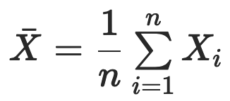
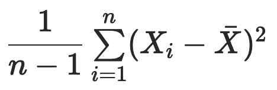
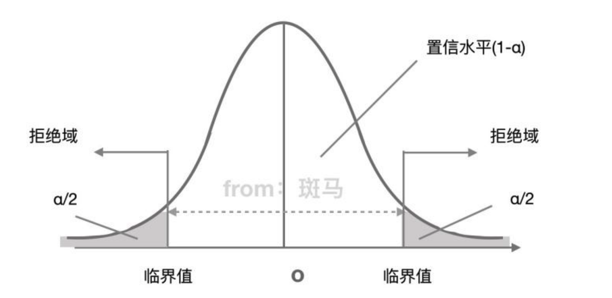

# 数理统计

## 简介

数理统计（mathematical statistics）根据观察或实验得到的数据来研究随机现象，并对研究对象的客观规律做出合理的估计和判断。

概率论作用的前提是随机变量的分布已知，根据已知的分布来分析随机变量的特征与规律。数理统计的研究对象则是未知分布的随机变量，研究方法是对随机变量进行独立重复的观察，根据得到的观察结果对原始分布做出推断，数理统计可以看成是逆向的概率论。

### 基本概念

- 总体（population）：观察对象所有的可能取值被称为总体。
- 样本（sample）：可用的资源是有限的数据集合，这个有限数据集被称为样本。
  - 样本均值：
  - 样本方差：

数理统计的任务就是根据样本推断总体的数字特征。样本通常由对总体进行多次独立的重复观测而得到，这保证了不同的样本值之间相互独立，并且都与总体具有相同的分布。

### 参数估计（estimation theory）

参数估计是通过随机抽取的样本来估计总体分布的方法

当在研究中从样本获得一组数据后，如何通过这组信息，对总体特征进行估计，也就是如何从局部结果推论总体的情况，称为总体参数估计。

- 矩表示的是随机变量的分布特征

#### 点估计（point estimation）

当总体的性质不清楚时，我们须利用某一量数作为估计数，以帮助了解总体的性质。如：样本平均数乃是总体平均数μ的估计数。当我们只用一个特定的值（一个数线上的点）作为估计值以估计总体时，就叫做点估计。点估计目的是依据样本X=(X1、X2…Xi)估计总体分布所含的未知参数θ或θ的函数g(θ)。一般θ或g(θ)是总体的某个特征值，如数学期望、方差、相关系数等，点估计的方法旨在用样本矩的函数估计总体矩的同一函数。

##### 矩估计法（method of moments）

用样本随机变量分布的某个函数的值来代替总体随机变量分布的该函数的值，也就是把样本的分布看做整体的分布。

其理论依据在于样本矩的函数几乎处处收敛于总体矩的相应函数（也就是用样本矩的函数代替总体矩的函数），这意味着当样本的容量足够大时，几乎每次都可以根据样本参数得到相应总体参数的近似值。

例如，若总体分布服从正态分布：N=(μ, σ~2)，其中μ是总体均值，σ~2是总体方差，未知参数可记为θ=(μ, σ)。σ/μ（μ≠0）称为变异系数，它是总体的一阶原点矩（即均值）μ与二阶中心矩（即方差）σ~2的函数。设有样本X=(X1、X2…Xi)，其一阶样本原点矩为μ，二阶样本中心矩为σ，而用估计σ/μ，就是一个典型的矩估计方法。

##### 最大似然估计法（maximum likelihood estimation）

似然是根据结果来判断这个事情本身的性质（参数）。似然描述的是结果已知的情况下，该事件在不同条件下发生的可能性，似然函数的值越大说明该事件在对应的条件下发生的可能性越大。

概率是在事件发生直接确定的，而似然刚好相反，是在确定的结果下去推测产生这个结果的可能性。拿抛硬币的例子来说，假设我们随机抛硬币1,000次，结果500次人头朝上，500次数字朝上。我们很容易判断这是一枚标准的硬币，两面朝上的概率均为50%，这个过程就是我们根据结果来判断这个事情本身的性质（这是一枚标准硬币），也就是似然。

- x：后验概率，即抛1000次硬币的实际结果
- θ：先验概率，即该硬币本身的概率
- L(θ|x)：θ的概率质量函数，这里x被看做一个常数

似然函数的最大值：概率描述的是在一定条件下某个事件发生的可能性，概率越大说明这件事情越可能会发生。而似然描述的是结果已知的情况下，该事件在不同条件下发生的可能性，似然函数的值越大说明该事件在对应的条件下发生的可能性越大。

既然抽样得到的是已有的样本值，就可以认为取到这一组样本值的概率较大，因而在估计参数θ的时候就需要让已有样本值出现的可能性最大。在最大似然估计中，似然函数被定义为样本观测值出现的概率，确定未知参数的准则是让似然函数的取值最大化，也就是微积分中求解函数最大值的问题。

#### 区间估计（interval estimation）

在估计未知参数 θ 的过程中，除了求出估计量，还需要估计出一个区间，并且确定这个区间包含 θ 真实值的可信程度。在数理统计中，这个区间被称为置信区间（confidence interval），这种估计方式则被称为区间估计。

每个置信区间都存在两种可能性：包含 θ 的真实值或不包含 θ 的真实值。如果对所有置信区间中包含 θ 真实值的比率进行统计，得到的比值就是置信水平。因此，区间估计相当于在点估计的基础上进一步提供了取值范围和误差界限，分别对应着置信区间和置信水平。

### 假设检验（hypothesis test）

假设检验是先对总体参数提出一个假设值，然后利用样本信息判断这一假设是否成立。

做假设检验时会设置两个假设：

- 一种叫原假设，也叫零假设，用H0表示。原假设一般是统计者想要拒绝的假设。
- 另外一种叫备择假设，用H1表示。备则假设是统计者想要接受的假设。

例子在进行假设检验时，我们希望接受版本2的假设，想拒绝接受版本1的假设。所以我们的假设设置为：H0 ：μ版本1 >= μ版本2 ，H1 : μ版本1 < μ版本2。

我们通过样本数据来判断总体参数的假设是否成立，但样本时随机的，因而有可能出现小概率的错误。这种错误分两种，一种是弃真错误，另一种是取伪错误。

- 弃真错误也叫第I类错误或α错误：它是指原假设实际上是真的，但通过样本估计总体后，拒绝了原假设。明显这是错误的，我们拒绝了真实的原假设，所以叫弃真错误，这个错误的概率我们记为α。这个值也是显著性水平，在假设检验之前我们会规定这个概率的大小。
  - 显著性水平：指当原假设实际上正确时，检验统计量落在拒绝域的概率，简单理解就是犯弃真错误的概率。
- 取伪错误也叫第II类错误或β错误：它是指原假设实际上假的，但通过样本估计总体后，接受了原假设。明显者是错误的，我们接受的原假设实际上是假的，所以叫取伪错误，这个错误的概率我们记为β。

现在清楚原假设一般都是想要拒绝的假设了么？因为原假设备被拒绝，如果出错的话，只能犯弃真错误，而犯弃真错误的概率已经被规定的显著性水平所控制了。这样对统计者来说更容易控制，将错误影响降到最小。

拒绝域的功能主要用来判断假设检验是否拒绝原假设的。如果样本观测计算出来的检验统计量的具体数值落在拒绝域内，就拒绝原假设，否则不拒绝原假设。给定显著性水平α后，查表就可以得到具体临界值，将检验统计量与临界值进行比较，判断是否拒绝原假设。

在数理统计中，发生概率小于 1%  的事件被称作小概率事件，在单次实验中被认为是不可能发生的。如果在一次观测得到的样本中出现了小概率事件，那么就有理由认为这不是真正意义上的小概率事件，原始的假设也就此被推翻。如果是备择假设被推翻，就意味着接受原假设；反之，如果是原假设被推翻，则意味着拒绝原假设。