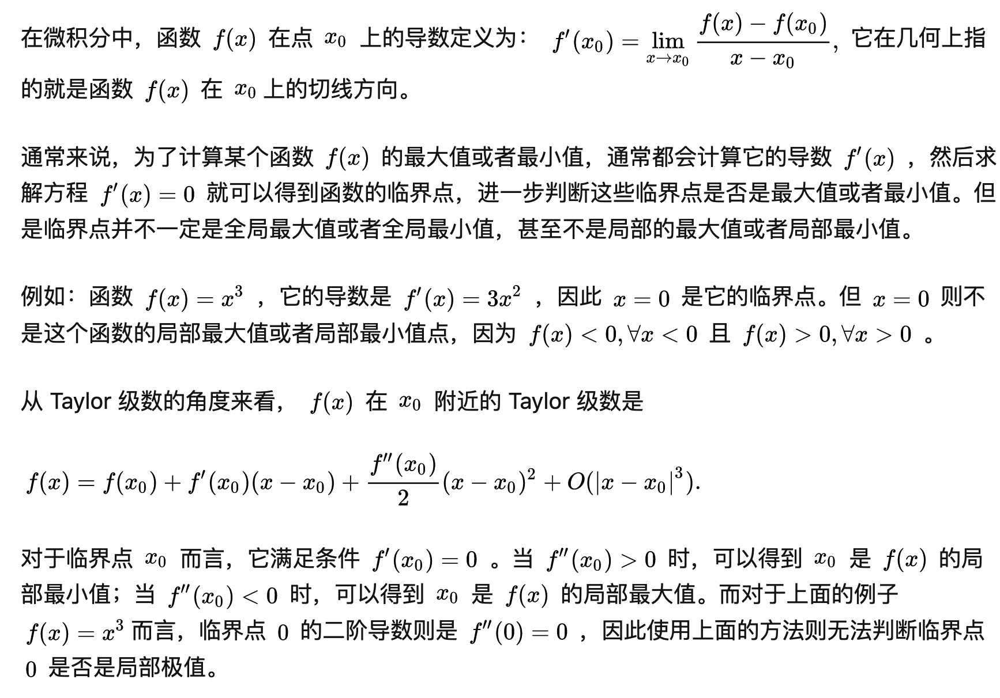
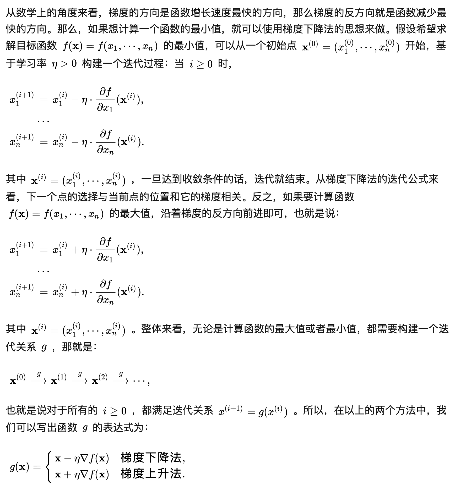

# 最优化理论（optimization）

## 简介

最优化理论是判定给定目标函数的最大值（最小值）是否存在，并找到令目标函数取到最大值（最小值）的数值。

### 基本概念

- 目标函数（objective function）：要实现最小化或最大化的函数被称为目标函数（或评价函数，大多数最优化问题都可以通过使目标函数 f(x) 最小化解决，最大化问题则可以通过最小化 −f(x) 实现。
- 实际的最优化算法既可能找到目标函数的全局最小值（global minimum），也可能找到局部极小值（local minimum）

### 无约束优化 vs. 约束优化

无约束优化（unconstrained optimization）对自变量 x 的取值没有限制，约束优化（constrained optimization）则把 x 的取值限制在特定的集合内，也就是满足一定的约束条件。

通过拉格朗日乘子（Lagrange multiplier）的引入可以将含有 n 个变量和 k 个约束条件的问题转化为含有 (n+k) 个变量的无约束优化问题：L(x,y,λ)=f(x,y)+λφ(x,y)。f(x,y) 为目标函数，φ(x,y) 则为等式约束条件，λ 是拉格朗日乘数。

### 梯度下降法

求解无约束优化问题最常用的方法是梯度下降法（gradient descent）。

#### 数学知识

#### 方法

#### 多样本训练

- 批处理模式（batch processing）：即计算出在每个样本上目标函数的梯度，再将不同样本的梯度进行求和，求和的结果作为本次更新中目标函数的梯度。在批处理模式中，每次更新都要遍历训练集中所有的样本，因而运算量较大。
- 随机梯度下降法（stochastic gradient descent）：它在每次更新中只使用一个样本，下一次更新再使用另外一个样本，在不断迭代的更新过程中实现对所有样本的遍历。有趣的是，事实表明当训练集的规模较大时，随机梯度下降法的性能更佳。

### 牛顿法

如果将二阶导数引入优化过程，得到的典型方法就是牛顿法（Newton's method）。在牛顿法中，目标函数首先被泰勒展开，写成二阶近似的形式（相比之下，梯度下降法只保留了目标函数的一阶近似）。此时再对二阶近似后的目标函数求导，并令其导数等于 0，得到的向量表示的就是下降最快的方向。相比于梯度下降法，牛顿法的收敛速度更快。

### 置信域方法

置信域方法先确定步长，以步长为参数划定一个区域，再在这个区域内寻找最快下降的方向。设定一个置信域半径 s，并在以当前点为中心、以 s 为半径的封闭球形区域作为置信域，在置信域内寻找目标函数的二次近似模型的最优点，最优点和当前点之间的距离就是计算出来的备选位移。在备选位移上，如果目标函数的二次近似产生了充分的下降，就将当前点移动到计算出的最优点，则继续按此规则迭代计算下去，并可以适当增加 s；如果目标函数的近似下降不够理想，则说明步子跨得太大，需要缩小 s 并计算出新的备选位移，直到满足终止条件。

### 启发式算法

启发式算法的核心思想就是大自然中 " 优胜劣汰 " 的生存法则，并在算法的实现中添加了选择和突变等经验因素。