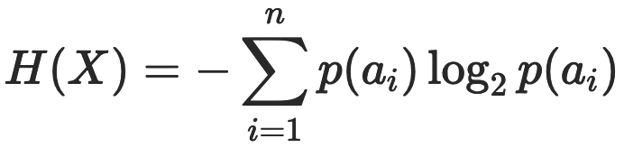
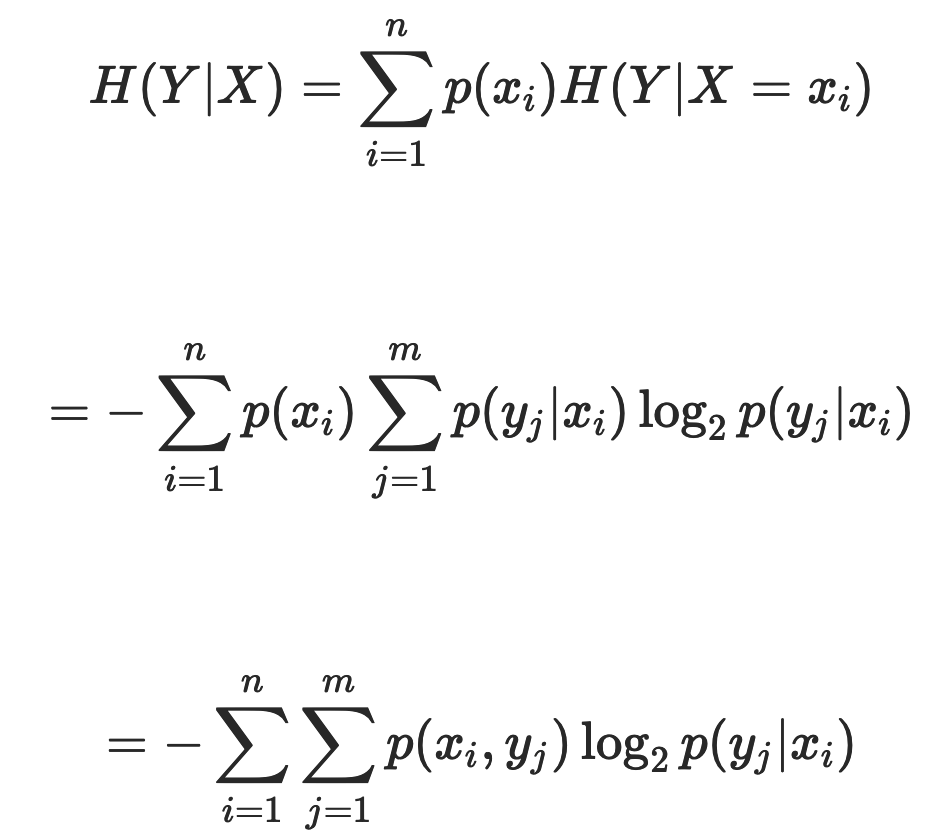
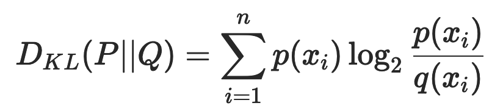

# 信息论

## 简介

信息论使用“信息熵”的概念，对单个信源的信息量和通信中传递信息的数量与效率等问题做出了解释，并在世界的不确定性和信息的可测量性之间搭建起一座桥梁。

信息的载体是消息，而不同的消息带来的信息即使在直观感觉上也是不尽相同的。以不确定性来度量信息是一种合理的方式。不确定性越大的消息可能性越小，其提供的信息量就越大。

### 基本概念

熵的本质是一个系统内在的混乱程度。

- 信息量：在信息论中，如果事件 A 发生的概率为 p(A)，则这个事件的自信息量的定义为h(A)=−log2p(A)。
- 包含多个符号的信源的信息熵：信源的信息熵是信源可能发出的各个符号的自信息量在信源构成的概率空间上的统计平均值。如果一个离散信源X包含n个符号，每个符号ai的取值（信息量）为p(ai)，则 X 的信源熵为：。信源熵描述了信源每发送一个符号所提供的平均信息量，是信源总体信息测度的均值。当信源中的每个符号的取值概率相等时，信源熵取到最大值log2n，意味着信源的随机程度最高。
- 条件熵：如果两个信源之间具有相关性，那么在已知其中一个信源 X 的条件下，另一个信源 Y 的信源熵就会减小。条件熵 H(Y∣X) 表示的是在已知随机变量 X 的条件下另一个随机变量 Y 的不确定性，也就是在给定 X 时，根据 Y 的条件概率计算出的熵再对 X 求解数学期望：。条件熵的意义在于先按照变量 X 的取值对变量 Y 进行了一次分类，对每个分出来的类别计算其单独的信息熵，再将每个类的信息熵按照 X 的分布计算其数学期望。
- 互信息（信息增益）：I(X;Y)=H(Y)−H(Y∣X)互信息等于 Y 的信源熵减去已知 X 时 Y 的条件熵，即由 X 提供的关于 Y 的不确定性的消除，也可以看成是 X 给 Y 带来的信息增益。
- 信息增益比：定义为 g(X,Y)=I(X;Y)/H(Y)。
- KL（Kullback-Leibler）散度：KL散度是描述两个概率分布 P 和 Q 之间的差异的一种方法。KL 散度是对额外信息量的衡量。给定一个信源，其符号的概率分布为 P(X)，就可以设计一种针对 P(X) 的最优编码，使得表示该信源所需的平均比特数最少（等于该信源的信源熵）。可是当信源的符号集合不变，而符合的概率分布变为 Q(X) 时，再用概率分布 P(X) 的最优编码对符合分布 Q(X) 的符号编码，此时编码结果的字符数就会比最优值多一些比特。KL 散度就是用来衡量这种情况下平均每个字符多用的比特数，也可以表示两个分布之间的距离。
- 特征函数：从训练数据T中抽取若干特征（一个函数），然后要求这些特征在T上关于经验分布的期望与它们在模型中关于p(x,y)的数学期望相等。
- 约束条件：一个特征就对应一个约束。比如：希望特征函数f的期望应该和从训练数据中得到的特征期望是一样的。
- 最大熵原理：随机变量的概率分布可有多种，其中有一种分布的熵最大。选用这种具有最大熵的分布作为该随机变量的分布，是一种有效的处理方法和准则。

### 机器学习中的信息增益

在机器学习中，信息增益常常被用于分类特征的选择。对于给定的训练数据集 Y，H(Y) 表示在未给定任何特征时，对训练集进行分类的不确定性；H(Y∣X) 则表示了使用特征 X 对训练集 Y 进行分类的不确定性。信息增益表示的就是特征 X 带来的对训练集 Y 分类不确定性的减少程度，也就是特征 X 对训练集 Y 的区分度。