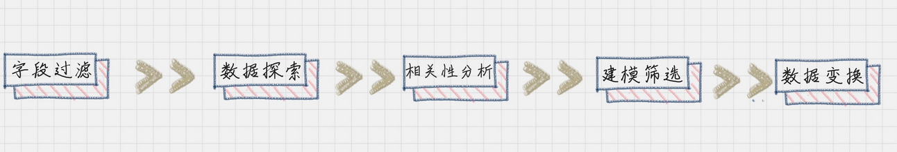
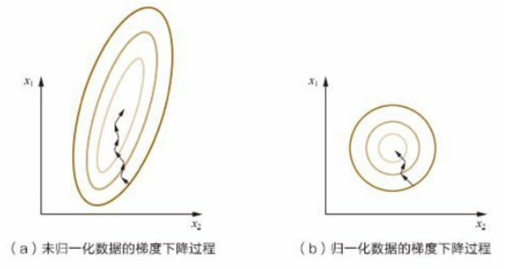
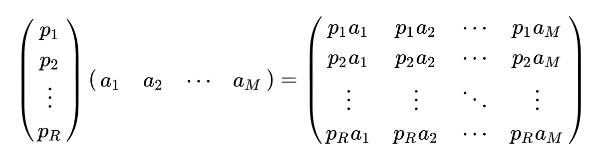
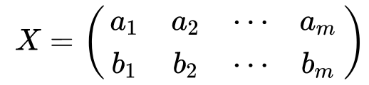
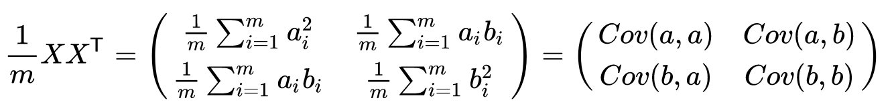
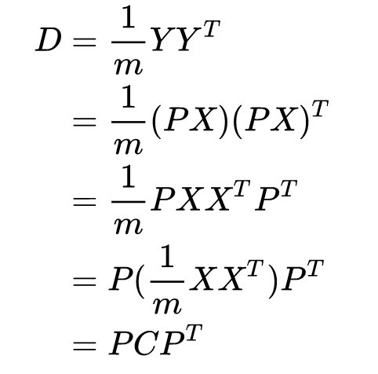
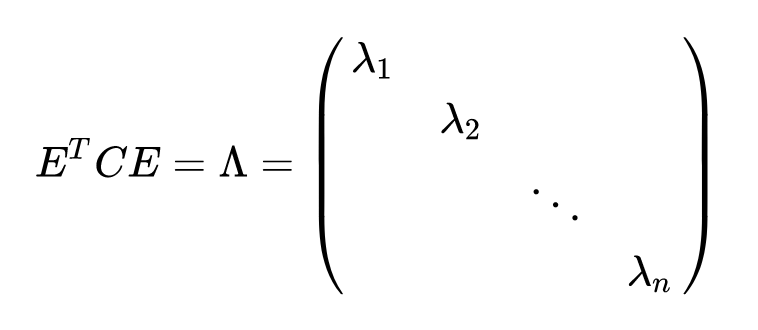

# 特征预处理

每种模型的特征预处理及衍生方式都不相同。

在特征选择前，需要先对字段进行筛选，然后对数据进行探索和相关性分析，接着是选择算法模型（这里暂时不需要进行模型计算），然后针对算法模型对数据的需求进行数据变换，从而完成机器学习前的准备工作。

## 单特征变换

需要让数据满足一定的规律，达到规范性的要求，便于进行训练，这就是特征变换的作用。

### 数字

#### Scaling 归一化

数据规范化是将不同渠道的数据，都按照同一种尺度来进行度量，这样做有两个好处，一是让数据之间具有可比较性；另一个好处就是方便后续运算，因为数据在同一个数量级上规整了，在机器学习迭代的时候，也会加快收敛效率。规范化具体是使属性数据按比例缩放，这样就将原来的数值映射到一个新的特定区域中。常用的方法有归一化、标准化等。

为了消除数据特征之间的量纲影响，需要对特征进行归一化处理，使得不同指标之间具有可比性。例如，分析一个人的身高和体重对健康的影响，如果使用米（m）和千克（kg）作为单位，那么身高特征会在 1.6～1.8m 的数值范围内，体重特征会在 50～100kg 的范围内，分析出来的结果显然会倾向于数值差别比较大的体重特征。想要得到更为准确的结果，就需要进行特征归一化（Normalization）处理，使各指标处于同一数值量级，以便进行分析。

tree-base 模型不依赖于特征的数量级，而 non-tree-base 模型依赖于特征的数量级。

##### 线性归一化

线性函数归一化（Min-Max Scaling）是一种缩放技术，对原始数据进行线性变换，使结果映射到 [0, 1] 的范围，实现对原始数据的等比缩放，用公式表示就是：$X_{norm}=\frac{X-X_{min}}{X_{max}-X_{min}}$。

##### 零均值归一化

零均值归一化（Z-score），也叫标准化，它会将原始数据映射到均值为 0、标准差为 1 的正态分布上。训练数据归一化后，容易更快地通过梯度下降找到最优解。

假设原始特征的均值为 $\mu$、标准差为 $\sigma$，那么 Z-Score 归一化的公式为：$z=\frac{x-\mu}{\sigma}$。

#### Outliers

某特殊值非常大或非常小的异常值

##### Winsorization

we can clip features values between two chosen values of lower bound and upper bound. We can choose them as some percentiles of that feature. For example, first and 99s percentiles. This procedure of clipping is well-known in financial data and it is called winsorization. 

##### Rank

把数值变为排序名次

#### log

#### 指数

#### box-cox

#### 离散化

去除数据中的噪声，将连续数据离散化。

- ? Dummy Coding

### 类别型

类别型特征（Categorical Feature）主要是指性别（男、女）、血型（A、B、 AB、O）等只在有限选项内取值的特征。类别型特征原始输入通常是字符串形 式，除了决策树等少数模型能直接处理字符串形式的输入，对于逻辑回归、SVM 等模型来说，类别型特征必须经过处理转换成数值型特征才能正确工作。

Ordinal 特征 是 Categorical 特征的一种特殊情况。

#### Label 编码

将类型名转换成数字，主要对 tree-base 模型比较有效

encode a categorical feature is to map it's unique values to different numbers

- alphabetical（sorted）：按照字母排序
- order of appearance：按照出现次序排序

#### Mean 编码

基于 label 编码，把 label 编码乘以二再除以该编码出现的次数。

#### Frequency 编码

按照频率排序，主要对 tree-base 模型比较有效

#### One-Hot 编码

one-hot 编码通常用于处理类别间不具有大小关系的特征。例如血型，一共有4个取值（A型血、B型血、AB型血、O型血），one-hot 编码会把血型变成一个 4 维稀疏向量，A 型血表示为（1, 0, 0, 0），B 型血表示为（0, 1, 0, 0），AB 型表示为（0, 0, 1, 0），O 型血表示为（0,  0, 0, 1）。对于类别取值较多的情况下使用独热编码，主要对 non-tree-base 模型比较有效。

#### 序号编码

序号编码通常用于处理类别间具有大小关系的类别数据（ordinal）。例如成绩，可以分为 低、中、高三档，并且存在“高>中>低”的排序关系。序号编码会按照大小关系对类别型特征赋予一个数值ID，例如高表示为 3、中表示为 2、低表示为 1，转换后依然保留了大小关系。

#### 数据概化

将数据由较低的概念抽象成为较高的概念，减少数据复杂度，即用更高的概念替代更低的概念。比如说上海、杭州、深圳、北京可以概化为中国。

### 文字

#### 预处理

- lowercase
- lemmatization：转换成中性词
- stemming：只留词根
- stopwords：去除无用的断词

#### Bag of Words

为每个单词创建一列，组成一个矩阵

TF-IDF

字词的重要性与其在文本中出现的频率成正比(TF)，与其在语料库中出现的频率成反比(IDF)。

- TF：词频。TF(w)=(词w在文档中出现的次数)/(文档的总词数)
- IDF：逆向文件频率。IDF(w)=log_e(语料库的总文档数)/(语料库中词w出现的文档数)

#### Word2vec

### 图像

### 时间

## 多特征

对当前学习有用的特征被称为“相关特征”，而没什么用的特征被称为“无关特征”。

### 降维

在高维情况下出现的数据样本稀疏、距离计算困难等问题是所有机器学习方法共同面临的障碍，被称为”维数灾难”。缓解维数灾难的重要途径就是降维，即通过数学变换将原始高维属性空间转变为一个低维“子空间”。在这个字空间中样本密度大幅提高，距离计算也变得更为容易。原始高维空间中的样本点，在低维子空间中更容易进行学习。

必要性：

1. 多重共线性和预测变量之间相互关联：多重共线性会导致解空间的不稳定，从而可能导致结果的不连贯。
2. 高维空间本身具有稀疏性：一维正态分布有68%的值落于正负标准差之间，而在十维空间上只有2%。
3. 过多的变量，对查找规律造成冗余麻烦。
4. 仅在变量层面上分析可能会忽略变量之间的潜在联系。例如几个预测变量可能落入仅反映数据某一方面特征的一个组内。

目的：

1. 使得数据集更容易使用
2. 降低很多算法的计算开销
3. 去除噪音
4. 使得结果易懂

#### PCA

主成分分析 PCA（Principal Component Analysis）是常用的降维方法，在数据压缩消除冗余和数据噪音消除等领域都有广泛的应用。其主要原理就是找出一个最主要的特征，然后进行分析，可用于提取数据的主要特征。它基本上从现有特征中衍生出新特征，同时保留了尽可能多的信息。PCA 的目的是通过使用较少的特征来尽可能多地解释原始数据集中的方差。 新派生的特征称为主成分，主成分的顺序是根据它们解释的原始数据集的方差分数确定的。

PCA 就是找出数据里最主要的方面，用数据里最主要的方面来代替原始数据。具体的，假如数据集是 n 维的，共有 m 个数据 $(𝑥^{(1)}, 𝑥^{(2)},..., 𝑥^{(𝑚)})$。希望将这 m 个数据的维度从 n 维降到 n' 维，希望这 m 个n' 维的数据集尽可能的代表原始数据集。

##### 原理

假如把 n' 从 1 维推广到任意维，则希望降维的标准为：样本点到这个超平面的距离足够近，或样本点在这个超平面上的投影能尽可能的分开。第一种解释是样本点到这个直线的距离足够近，第二种解释是样本点在这个直线上的投影能尽可能的分开。

###### 最小投影距离

其原理是找一个超平面，使样本点到这个超平面的距离足够近，或样本点在这个超平面上的投影能尽可能的分开。

1. 找出第一个主成分向量，也就是数据方差最大的向量。
2. 找出第二个主成分向量，也就是数据方差次大的向量，并且该向量与第一个主成分向量正交（orthogonal），如果是二维空间就叫垂直。
3. 通过这种方式计算出所有的主成分向量。

通过数据集的协方差矩阵及其特征值分析，就可以得到这些主成分的向量。一旦得到了协方差矩阵的特征值和特征向量，就可以保留最大的 N 个特征。这些特征向量也给出了 N 个最重要特征的真实结构，就可以通过将数据乘上这 N 个特征向量从而将它转换到新的空间上。

###### 最大投影方差

##### 向量基础

- 内积：向量 A 与 向量 B 的内积等于 A 到 B 的投影长度乘以 B 的模。如果 $|B|=1$，则 A 与 B 的内积等于 A 向 B 所在直线投影的标量大小。
- 基：要准确描述向量，首先要确定一组基，然后给出在基所在的各个直线上的投影值就可以了。为了方便求坐标，设定这组基向量模长为 1。因为向量的内积运算，当模长为 1 时，内积可以直接表示投影。还需要这组基是线性无关的，一般用正交基，非正交的基也是可以的，不过正交基有较好的性质。
- 基变换：$p_i$ 为转换向量，$a_M$ 为现有向量坐标。两个矩阵相乘的意义是将右边矩阵中的每一列向量变换到左边矩阵中以每一行行向量为基所表示的空间中去。

##### 算法

以上讨论了选择不同的基可以对同样一组数据给出不同的表示，如果基的维数少于向量本身的维数，则可以达到降维的效果。但关键问题在于：如何选择基才是最优的。一种直观的看法是：希望投影后的投影值尽可能分散，因为如果重叠就会有样本消失，也就是“最大可分性”。

- 方差：值的分散程度可以用方差来表述，一个变量的方差可以看做是每个元素与变量均值的差的平方和的均值，即：$Var(a)=\frac{1}{m}\sum_{i=1}^{m}(a_i-\mu)^2$。将每个变量的均值都化为 0，则可表示为：$Var(a)=\frac{1}{m}\sum_{i=1}^{m}a_i^2$。于是上面的问题被表述为：寻找一个一维基，使得所有数据变换为这个基上的坐标表示后，方差值最大。
- 协方差：在一维空间中可以用方差来表示数据的分散程度。而对于高维数据，可以用协方差进行约束，协方差可以表示两个变量的相关性 $Cov(a,b)=\frac{1}{m-1}\sum_{i=1}^{m}(a_i-\mu_a)(b_i-\mu_b)$。当均值为 0 时，可表示为： $Cov(a,b)=\frac{1}{m-1}\sum_{i=1}^{m}a_ib_i$。当协方差为 0 时，表示两个变量完全独立。为了让协方差为 0，选择第二个基时只能在与第一个基正交的方向上进行选择，因此最终选择的两个方向一定是正交的。

降维问题的优化目标：将一组 N 维向量降为 K 维，其目标是选择 K 个单位正交基，使得原始数据变换到这组基上后，变量方差则尽可能大（在正交的约束下，取最大的 K 个方差），而各变量两两间协方差为 0。

##### 具体细节

###### 协方差矩阵

假设我们只有 a 和 b 两个变量，那么将它们按行组成矩阵 X：，然后：。可以看到这个矩阵对角线上的分别是两个变量的方差，而其它元素是 a 和 b 的协方差，两者被统一到了一个矩阵里。

设我们有 m 个 n 维数据记录，将其排列成矩阵 $X_{n,m}$，设 $C=\frac{1}{m}XX^T$，则 C 是一个对称矩阵，其对角线分别对应各个变量的方差，而第 i 行 j 列和 j 行 i 列元素相同，表示 i 和 j 两个变量的协方差。

根据优化条件，需要将除对角线外的其它元素化为 0，并且在对角线上将元素按大小从上到下排列（变量方差尽可能大），这样就达到了优化目的。

###### 变换后协方差矩阵

设原始数据矩阵 X 对应的协方差矩阵为 C，而 P 是一组基按行组成的矩阵，设 Y=PX，则 Y 为 X 对 P 做基变换后的数据。设 Y 的协方差矩阵为 D，我们推导一下 D 与 C 的关系：

我们要找的 P 是能让原始协方差矩阵 C 对角化的 P。换句话说，优化目标变成了寻找一个矩阵 P，满足 $PCP^T$ 是一个对角矩阵，并且对角元素按从大到小依次排列，那么 P 的前 K 行就是要寻找的基，用 P 的前 K 行组成的矩阵乘以 X 就使得 X 从 N 维降到了 K 维并满足上述优化条件。

###### 求解 P 

因为协方差矩阵 C 是一个是对称矩阵，所有有：

- 实对称矩阵不同特征值对应的特征向量必然正交。
- 设特征向量 $\lambda$ 重数为 r，则必然存在 r 个线性无关的特征向量对应于 $\lambda$，因此可以将这 r 个特征向量单位正交化。

由上面两条可知，一个 n 行 n 列的实对称矩阵一定可以找到 n 个单位正交特征向量，设这 n 个特征向量为 $e_1,e_2, \dots,e_n$ ，将其按列组成矩阵： $E=(e_1,e_2,\dots,e_n)$，则对协方差矩阵 C 有：

到这里，我们已经找到了需要的矩阵 $P=E^T$ 。P 是协方差矩阵的特征向量单位化后按行排列出的矩阵，其中每一行都是 C 的一个特征向量。如果设 P 按照  $E^TCE$ 中特征值的从大到小，将特征向量从上到下排列，则用 P 的前 K 行组成的矩阵乘以原始数据矩阵 X，就得到了需要的降维后的数据矩阵 Y。

##### 具体步骤

设有 m 条 n 维数据要降维到的 n'，具体步骤为：

1. 将原始数据按列组成 n 行 m 列矩阵 X。
2. 将 X 的每一行进行零均值化，即减去这一行的均值 $𝑥^{(𝑖)}=𝑥^{(𝑖)}−\frac{1}{𝑚}∑_{𝑗=1}^𝑚 𝑥^{(𝑗)}$。
3. 求出协方差矩阵 $C=\frac{1}{m}XX^T$。
4. 对协方差矩阵进行特征值分解，求出协方差矩阵的特征值及对应的特征向量。
5. 将特征向量按对应特征值大小从上到下按行排列成矩阵，取前 K 行组成矩阵 P；
6. $Y=PX$  即为降维到 K 维后的数据。

##### 总结

###### 优点

- 仅仅需要以方差衡量信息量，不受数据集以外的因素影响。　
- 各主成分之间正交，可消除原始数据成分间的相互影响的因素。
- 计算方法简单，主要运算是特征值分解，易于实现。

###### 缺点

- 主成分各个特征维度的含义具有一定的模糊性，不如原始样本特征的解释性强。
- 方差小的非主成分也可能含有对样本差异的重要信息，因降维丢弃可能对后续数据处理有影响。

#### LDA

线性判别分析 LDA（Linear Discriminant Analysis）是一种经典的降维方法。与 PCA 不考虑样本类别输出的无监督降维技术不同，LDA 是一种监督学习的降维技术，数据集的每个样本都有标签。LDA 分类思想主要是：在多维空间中数据处理分类问题较为复杂，LDA 将多维空间中的数据投影到一个超平面上，将 N 维数据转化成 N' 维数据进行处理。

1. 对训练数据：设法将多维数据投影到一个超平面上，同类数据的投影点尽可能接近，异类数据点尽可能远离。
2. 对测试数据：将其投影到同样的这条直线上，再根据投影点的位置来确定样本的类别。

##### 原理

如果用一句话概括 LDA 思想即：投影后类内方差最小，类间方差最大。将数据在低维度上进行投影，投影后希望每一种类别数据的投影点尽可能的接近，而不同类别的数据的类别中心之间的距离尽可能的大。

##### 流程

输入：数据集 $𝐷={(𝑥_1,𝑦_1),(𝑥_2,𝑦_2),...,(𝑥_𝑚,𝑦_𝑚)}$，其中任意样本 $𝑥_𝑖$ 为 n 维向量，$𝑦_𝑖∈{𝐶_1,𝐶_2,...,𝐶_𝑘}$，降维到的维度 d。

输出：降维后的样本集 $D′$

1. 计算类内散度矩阵 $𝑆_𝑤$
2. 计算类间散度矩阵 $𝑆_𝑏$
3. 计算矩阵 $𝑆^{−1}_𝑤𝑆_𝑏$
4. 计算 $𝑆^{−1}_𝑤𝑆_𝑏$ 的最大的 d 个特征值和对应的 d 个特征向量 $(𝑤_1,𝑤_2,...𝑤_𝑑)$，得到投影矩阵 W*𝑊*
5. 对样本集中的每一个样本特征 $𝑥_i$，转化为新的样本 $𝑧_𝑖=𝑊^𝑇𝑥_𝑖$
6. 得到输出样本集 $𝐷′={(𝑧_1,𝑦_1),(𝑧_2,𝑦_2),...,(𝑧_𝑚,𝑦_𝑚)}$

实际上 LDA 除了可以用于降维以外，还可以用于分类。一个常见的 LDA 分类基本思想是假设各个类别的样本数据符合高斯分布，这样利用 LDA 进行投影后，可以利用极大似然估计计算各个类别投影数据的均值和方差，进而得到该类别高斯分布的概率密度函数。当一个新的样本到来后，可以将它投影，然后将投影后的样本特征分别带入各个类别的高斯分布概率密度函数，计算它属于这个类别的概率，最大的概率对应的类别即为预测类别。

##### LDA vs PCA

LDA 用于降维时和 PCA 有很多相同，也有很多不同的地方。

相同点：

- 两者均可以对数据进行降维。
- 两者在降维时均使用了矩阵特征分解的思想。
- 两者都假设数据符合高斯分布。

不同点：

- LDA 是有监督的降维方法，而 PCA 是无监督的降维方法。
- LDA 降维最多降到类别数 k-1 的维数，而 PCA 没有这个限制。
- LDA 除了可以用于降维，还可以用于分类。但是目前来说，主要还是用于降维。
- LDA 选择分类性能最好的投影方向，而 PCA 选择样本点投影具有最大方差的方向。

##### 总结

优点：

- LDA 在降维过程中可以使用类别的先验知识经验，而像 PCA 这样的无监督学习则无法使用先验知识。
- LDA 在样本分类信息依赖均值而不是方差的时候，比 PCA 之类的算法较优。

缺点：

- LDA 不适合对非高斯分布样本进行降维，PCA 也有这个问题。
- LDA 降维最多降到类别数 k-1 的维数，如果我们降维的维度大于 k-1，则不能使用 LDA。当然目前有一些 LDA 的进化版算法可以绕过这个问题。
- LDA 在样本分类信息依赖方差而不是均值的时候，降维效果不好。
- LDA 可能过度拟合数据。

#### 因子分析

因子分析（Factor Analysis）将多个变量转换为少数几个综合指标。它反映一种降维的思想，通过降维将相关性高的变量聚在一起，从而减少需要分析的变量的数量，减少问题分析的复杂性。

例如:  考察一个人的整体情况，就直接组合 3 样成绩看平均成绩就行（ 数学、语文、英语成绩）。

在因子分析中，假设观察数据的成分中有一些观察不到的隐变量（latent variable），假设观察数据是这些隐变量和某些噪音的线性组合，那么隐变量的数据可能比观察数据的数目少，也就说通过找到隐变量就可以实现数据的降维。

#### t-SNE

t-SNE（t-Distributed Stochastic Neighbor Embedding）是一种降维技术，用于在二维或三维的低维空间中表示高维数据集，从而使其可视化。与其他降维算法（如PCA）相比，t-SNE 创建了一个缩小的特征空间，相似的样本由附近的点建模，不相似的样本由高概率的远点建模。

t-SNE 为高维样本构建了一个概率分布，相似的样本被选中的可能性很高，而不同的点被选中的可能性极小。然后，t-SNE 为低维嵌入中的点定义了相似的分布。最后，t-SNE 最小化了两个分布之间关于嵌入点位置的 KL（Kullback-Leibler）散度。

##### 算法

t-SNE 算法的第一步是测量一个点相对于其他点的距离。不是直接处理这些距离，而是将它们映射到一个概率分布。在分布中，相对于当前点距离最小的点有很高的可能性属于同一类，而远离当前点的点有很低的可能性。

KL 散度是衡量一个概率分布与另一个概率分布的差异。KL 散度值越低，两个分布越接近。KL 散度为 0 意味着这两个分布是相同的。

##### 总结

t-SNE 是目前来说效果最好的数据降维与可视化方法，但是它的缺点也很明显，比如：

- 占内存大，运行时间长。
- 专用于可视化，即嵌入空间只能是 2 维或 3 维。
- 需要尝试不同的初始化点，以防止局部次优解的影响。

但是，当想要对高维数据进行分类，又不清楚这个数据集有没有很好的可分性（即同类之间间隔小，异类之间间隔大），可以通过 t-SNE 投影到 2 维或 3 维的空间中观察一下。如果在低维空间中具有可分性，则数据是可分的；如果在高维空间中不具有可分性，可能是数据不可分，也可能仅仅是因为不能投影到低维空间。

### 特征选择

从给定的特征集合中选择出相关特征的过程被称为“特征选择”，它们往往是根据训练模型选择所需的特征。

- 若能选出重要的特征使得后续学习过程仅需在一部分特征上构建模型，则维数灾难问题会大为减轻。
- 除去不相关特征往往会降低学习任务的难度

特征选择的过程必须确保不丢失重要特征，否则后续学习过程会因为重要信息的缺失而无法获得好的性能。

#### 选择方法

特征选择的过程大致分为 2 步：

- 产生一个候选子集：往往可以采用“前向”（逐步增加）及“后向”（逐步减少）搜索
- 评价该候选子集的好坏：通过信息增益来作为评价准则
- 迭代以上 2 步：基于评价结果产生下一个候选子集

例如决策树就是很好的特征选择方法。

#### 过滤式

过滤式方法先对数据集进行特征选择，然后再进行训练学习。因为特征选择与后续的学习算法无关，这相当于先用特征选择过程对初始数据集进行过滤，再用过滤后的特征来训练模型。

- 使用特征方差来过滤选择特征
- 使用相关系数，这个主要用于输出连续值的监督学习算法中。分别计算所有训练集中各个特征与输出值之间的相关系数，设定一个阈值，选择相关系数较大的部分特征。
- 使用假设检验，比如卡方检验。卡方检验可以检验某个特征分布和输出值分布之间的相关性，个人觉得它比粗暴的方差法好用。在 sklearn 中，可以使用 chi2 这个类来做卡方检验得到所有特征的卡方值与显著性水平 P 临界值，可以给定卡方值阈值， 选择卡方值较大的部分特征。除了卡方检验，还可以使用 F 检验和 t 检验，它们都是使用假设检验的方法，只是使用的统计分布不是卡方分布，而是 F 分布和 t 分布而已。在 sklearn 中，有 F 检验的函数 f_classif 和 f_regression，分别在分类和回归特征选择时使用。
- 互信息，即从信息熵的角度分析各个特征和输出值之间的关系评分。互信息值越大，说明该特征和输出值之间的相关性越大，越需要保留。在 sklearn 中，可以使用 mutual_info_classif（分类）和 mutual_info_regression（回归）来计算各个输入特征和输出值之间的互信息。

#### 包裹式

包裹式特征选择直接把最终将要使用的学习算法的性能作为特征子集的评价标准。换言之，包裹式特征选择的目的就是为了给定学习算法选择最有利于其性能的、“量身定做”的特征子集。但由于在特征选择过程中需要多次训练学习算法，因此包裹式特征选择的计算开销通常比过滤式大很多。

包装法会选择一个目标函数来一步步的筛选特征，最常用的包装法是递归消除特征法（RFE Recursive Feature Elimination）。递归消除特征法使用一个机器学习模型来进行多轮训练，每轮训练后，消除若干权值系数的对应的特征，再基于新的特征集进行下一轮训练。在 sklearn 中，可以使用 RFE 函数来选择特征。

例如经典的 SVM-RFE 算法，这个算法以 SVM 来做 RFE 的机器学习模型选择特征。它在第一轮训练的时候，会选择所有的特征来训练，得到了分类的超平面 $𝑤𝑥+𝑏=0$ 后，如果有 n 个特征，那么 RFE-SVM 会选择出 𝑤 中分量的平方值 $𝑤^2_𝑖$ 最小的那个序号 i 对应的特征，将其排除。在第二类的时候，特征数就剩下 n-1 个，继续用这 n-1 个特征和输出值来训练 SVM。同样的，去掉 $𝑤^2_𝑖$ 最小的那个序号 i 对应的特征。以此类推，直到剩下的特征数满足需求为止。

#### 嵌入式

嵌入式特征选择将特征选择的过程域学习算法训练过程融为一体，两者在同一个优化过程中完成，即在学习训练过程中自动地进行了特征选择。它和 RFE 的区别是它不是通过不停的筛掉特征来进行训练，而是使用的都是特征全集。在 sklearn 中，使用 SelectFromModel 函数来选择特征。

最常用的是使用 L1 正则化和 L2 正则化来选择特征。当正则化惩罚项越大，那么模型的系数就会越小。当正则化惩罚项大到一定的程度的时候，部分特征系数会变成 0，当正则化惩罚项继续增大到一定程度时，所有的特征系数都会趋于 0。但是会发现一部分特征系数会更容易先变成 0，这部分系数就是可以筛掉的。也就是说，选择特征系数较大的特征。常用的 L1 正则化和 L2 正则化来选择特征的基学习器是逻辑回归。

此外也可以使用决策树或 GBDT。那么是不是所有的机器学习方法都可以作为嵌入法的基学习器呢？也不是，一般来说，可以得到特征系数 coef 或可以得到特征重要度（feature importances）的算法才可以做为嵌入法的基学习算法。

#### 稀疏表示与字典学习

特征选择所考虑的问题是特征具有“稀疏性”，即许多特征与学习任务无关，通过特征选择去除这些特征，则学习算法训练过程仅需在较小的特征集中进行，学习任务的难度可能有所降低，设计的计算和存储开心会减少，学得模型的可解释性也会提高。

所谓字典学习（稀疏编码），就是为普通稠密表达的样本（即每行很多不为 0 项）找到合适的字典，将样本转化为合适的稀疏表示形式，从而使得学习任务得以简化。

## Lab

- [数据预处理](40_preprocess.ipynb)
- [数据预处理 Mushrooms](41_mushrooms-preprocess.ipynb)
- [数据预处理 PCA](42_pca.ipynb)
- [数据预处理 LDA](43_lda.ipynb)

## 推荐阅读

1. [ML特征工程和优化方法](https://github.com/NLP-LOVE/ML-NLP/tree/master/Machine%20Learning/8.%20ML%E7%89%B9%E5%BE%81%E5%B7%A5%E7%A8%8B%E5%92%8C%E4%BC%98%E5%8C%96%E6%96%B9%E6%B3%95)