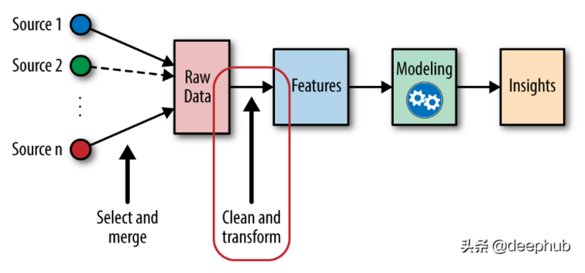

# 特征工程

## 简介

特征工程将实际业务中的数据转化成机器可理解的形式的过程。它具体是指从数据中提取特征，将原始数据转换成适合机器学习模型的格式，并且为模型和任务制定最佳特征的过程。它是数据处理中关键的一步，因为合适的特征可以降低建模的复杂度，这些解决数据问题的算法很多是基于规则的。

从本质上来讲，特征工程是一个表示和展现数据的过程。在实际工作中，**特征工程旨在去除原始数据中的杂质和冗余**，设计更高效的特征以刻画求解的问题与预测模型之间的关系。

## 特征方案确定

- 基于业务及模型，确定需要使用哪些特征
- 可用性评估
  - 获取难度
  - 覆盖率
  - 准确率

## 具体步骤

- 数据采集
- 数据探索
- 数据清洗
- 特征选择
- 数据分拆
- 特征监控
  - 有效性分析：特征的重要性、权重
  - 重要特征监控：防止质量下滑

