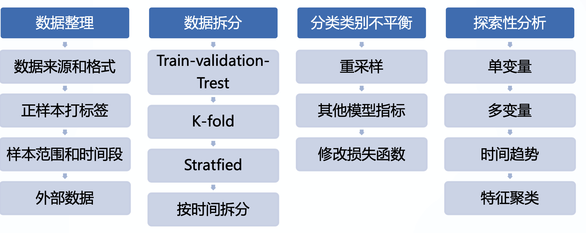

# 特征工程

## 简介

将实际业务中的数据转化成机器可理解的形式的过程，也可以称为特征工程。它具体是指从数据中提取特征，将原始数据转换成适合机器学习模型的格式，并且为模型和任务制定最佳特征的过程。它是数据处理中关键的一步，因为合适的特征可以降低建模的复杂度，这些解决数据问题的算法很多是基于规则的。

## 数据获取

### 数据采集

数据来源和格式 

- 数据字典和数据间关系

### 数据集成

- 正样本，打标签
  - 标签来源：专家意见， 大规模收集（crowdsourcing）
- 数据的范围
  - 多少人、多久?
  - 内部数据、外部数据？
  - 哪些不能用？
- 外部数据

详细见“大数据/数据集成”




## 数据探索

探索性分析，熟悉数据，分析数据

### 业务

- 是否有时间时间趋势? 
  - 周期性
  - 突变的峰值或低谷
  - 模型怎么才能非特异、可推广? 
- 相关场景和人群：需符合业务目标
- 采样是否有代表性：避免selection bias

### 数据

- 是否可读，多少行多少列，primary key是什么，是否有重复
- 数据的分布
- 是否有异常值、缺失值

### 可视化

可以把可视化视图划分为 4 类：

- 比较：比较数据间各类别的关系，或者是它们随着时间的变化趋势，比如折线图；
- 联系：查看两个或两个以上变量间的关系，比如散点图；
- 构成：每个部分占整体的百分比，或者是随着时间的百分比变化，比如饼图；
- 分布：关注单个变量，或者多个变量的分布情况，比如直方图。

按照变量的个数，可以把可视化视图划分为单变量分析和多变量分析：

- 单变量分析指的是一次只关注一个变量。比如我们只关注“身高”这个变量，来看身高的取值分布，而暂时忽略其他变量。
- 多变量分析可以让你在一张图上可以查看两个以上变量的关系。比如“身高”和“年龄”，你可以理解是同一个人的两个参数，这样在同一张图中可以看到每个人的“身高”和“年龄”的取值，从而分析出来这两个变量之间是否存在某种联系。

#### 工具

- Tableau
- PowerBI
- Python/Matplotlib
- Python/Seaborn

#### Python

##### 散点图

散点图的英文叫做 scatter plot，它将两个变量的值显示在二维坐标中，非常适合展示两个变量之间的关系。

```python
import numpy as np
import pandas as pd
import matplotlib.pyplot as plt
import seaborn as sns
# 数据准备
N = 1000
x = np.random.randn(N)
y = np.random.randn(N)
# 用Matplotlib画散点图
plt.scatter(x, y,marker='x')
plt.show()
# 用Seaborn画散点图
df = pd.DataFrame({'x': x, 'y': y})
sns.jointplot(x="x", y="y", data=df, kind='scatter');
plt.show()
```

##### 折线图

折线图可以用来表示数据随着时间变化的趋势。

```python
import pandas as pd
import matplotlib.pyplot as plt
import seaborn as sns
# 数据准备
x = [2010, 2011, 2012, 2013, 2014, 2015, 2016, 2017, 2018, 2019]
y = [5, 3, 6, 20, 17, 16, 19, 30, 32, 35]
# 使用Matplotlib画折线图
plt.plot(x, y)
plt.show()
# 使用Seaborn画折线图
df = pd.DataFrame({'x': x, 'y': y})
sns.lineplot(x="x", y="y", data=df)
plt.show()
```


## 数据清洗

好的数据分析师必定是一名数据清洗高手，要知道在整个数据分析过程中，不论是在时间还是功夫上，数据清洗大概都占到了 80%。

质量准则：

- 完整性：单条数据是否存在空值，统计的字段是否完善。
- 全面性：观察某一列的全部数值，比如在 Excel  表中，我们选中一列，可以看到该列的平均值、最大值、最小值。我们可以通过常识来判断该列是否有问题，比如：数据定义、单位标识、数值本身。
- 合法性：数据的类型、内容、大小的合法性。比如数据中存在非 ASCII 字符，性别存在了未知，年龄超过了 150  岁等。
- 唯一性：数据是否存在重复记录，因为数据通常来自不同渠道的汇总，重复的情况是常见的。行数据、列数据都需要是唯一的，比如一个人不能重复记录多次，且一个人的体重也不能在列指标中重复记录多次。

按照以上的原则，我们能解决数据清理中遇到的大部分问题，使得数据标准、干净、连续，为后续数据统计、数据挖掘做好准备。

### 完整性

#### 缺失值

在数据中有些年龄、体重数值是缺失的，这往往是因为数据量较大，在过程中，有些数值没有采集到。通常我们可以采用以下三种方法：

- 删除：删除数据缺失的记录；
- 均值：使用当前列的均值；
- 高频：使用当前列出现频率最高的数据。

比如我们想对 df[‘Age’]中缺失的数值用平均年龄进行填充，可以这样写：

```python
df['Age'].fillna(df['Age'].mean(), inplace=True)
```

#### 空行

我们发现数据中有一个空行，除了 index 之外，全部的值都是 NaN。Pandas 的 read_csv() 并没有可选参数来忽略空行，这样，我们就需要在数据被读入之后再使用 dropna() 进行处理，删除空行。

```python
df.dropna(how='all',inplace=True) 
```

### 全面性

#### 列数据单位不统一

```python
# 获取 weight 数据列中单位为 lbs 的数据
rows_with_lbs = df['weight'].str.contains('lbs').fillna(False)
print df[rows_with_lbs]
# 将 lbs转换为 kgs, 2.2lbs=1kgs
for i,lbs_row in df[rows_with_lbs].iterrows():
# 截取从头开始到倒数第三个字符之前，即去掉lbs。
weight = int(float(lbs_row['weight'][:-3])/2.2)
df.at[i,'weight'] = '{}kgs'.format(weight) 
```

### 合理性

#### 非 ASCII 字符

可以采用删除或者替换的方式来解决非 ASCII 问题，这里我们使用删除方法：

```python
df['first_name'].replace({r'[^\x00-\x7F]+':''}, regex=True, inplace=True)
df['last_name'].replace({r'[^\x00-\x7F]+':''}, regex=True, inplace=True)
```

### 唯一性

#### 一列有多个参数

在数据中不难发现，姓名列（Name）包含了两个参数 Firstname 和 Lastname。为了达到数据整洁目的，我们将 Name 列拆分成 Firstname 和 Lastname  两个字段。我们使用 Python 的 split 方法，str.split(expand=True)，将列表拆成新的列，再将原来的 Name  列删除。

```python
df[['first_name','last_name']] = df['name'].str.split(expand=True)
df.drop('name', axis=1, inplace=True)
```

#### 重复数据

校验一下数据中是否存在重复记录。如果存在重复记录，就使用 Pandas 提供的 drop_duplicates() 来删除重复数据。

```python
# 删除重复数据行
df.drop_duplicates(['first_name','last_name'],inplace=True)
```

没有高质量的数据，就没有高质量的数据挖掘，而数据清洗是高质量数据的一道保障。当你从事这方面工作的时候，你会发现养成数据审核的习惯非常重要。而且越是优秀的数据挖掘人员，越会有“数据审核”的“职业病”。这就好比编辑非常在意文章中的错别字、语法一样。数据的规范性，就像是你的作品一样，通过清洗之后，会变得非常干净、标准。


- 异常值
  - 异常值原因
    - 小概率事件(valid)
    - 数据问题(invalid)
  - 影响：模型权重，MSE计算偏重， boosting
  - 解决方法
    - Valid or not
    - 去掉异常值
    - 变换：log、开方、binning
    - 设置可取值范围
    - 选择更robust loss function，e.g. MAE
    - 对异常值不敏感的模型：tree-based model

- 缺失值
  - 缺失数据的原因：MCAR、MAR、NMAR
  - 解决方法：
    - 去掉不用：MAR或者数据足够多
    - Imputation：
      - Ad-hoc：均值，众数, 0， last obs carry forward
      - 用模型预测：kNN, multiple imputation
    - 加入新特征：是否缺失
    - 使用对缺失不敏感的模型：e.g. tree-based model

## 特征选择

在特征选择前，需要先对字段进行筛选，然后对数据进行探索和相关性分析，接着是选择算法模型（这里暂时不需要进行模型计算），然后针对算法模型对数据的需求进行数据变换，从而完成机器学习前的准备工作。


### 单特征变换

需要让数据满足一定的规律，达到规范性的要求，便于进行训练，这就是特征变换的作用。

#### 规范化

使属性数据按比例缩放，这样就将原来的数值映射到一个新的特定区域中。常用的方法有归一化、Z—score 规范化等。

数据规范化是更大的概念，它指的是将不同渠道的数据，都按照同一种尺度来进行度量，这样做有两个好处，一是让数据之间具有可比较性；另一个好处就是方便后续运算，因为数据在同一个数量级上规整了，在机器学习迭代的时候，也会加快收敛效率。

数据归一化和数据标准化都是数据规范化的方式。不同点在于数据归一化会让数据在一个[0,1]或者[-1,1]的区间范围内。而数据标准化会让规范化的数据呈现正态分布的情况，所以你可以这么记：归一化的“一”，是让数据在[0,1]的范围内。而标准化，目标是让数据呈现标准的正态分布。

##### log

##### 指数

##### 归一化/Min-max规范化

将原始数据变换到[0,1]的空间中。用公式表示就是：

新数值 =（原数值 - 极小值）/（极大值 - 极小值）。

```python
# coding:utf-8
from sklearn import preprocessing
import numpy as np
# 初始化数据，每一行表示一个样本，每一列表示一个特征
x = np.array([[ 0., -3.,  1.],
              [ 3.,  1.,  2.],
              [ 0.,  1., -1.]])
# 将数据进行[0,1]规范化
min_max_scaler = preprocessing.MinMaxScaler()
minmax_x = min_max_scaler.fit_transform(x)
print minmax_x
```


##### Z-Score 规范化

Z-Score 规范化可以直接将数据转化为正态分布

新数值 =（原数值 - 均值）/ 标准差

```python
from sklearn import preprocessing
import numpy as np
# 初始化数据
x = np.array([[ 0., -3.,  1.],
              [ 3.,  1.,  2.],
              [ 0.,  1., -1.]])
# 将数据进行Z-Score规范化
scaled_x = preprocessing.scale(x)
print scaled_x
```


##### box-cox

#### 数据平滑/离散化

去除数据中的噪声，将连续数据离散化。

- ? Dummy Coding

#### 数据概化

将数据由较低的概念抽象成为较高的概念，减少数据复杂度，即用更高的概念替代更低的概念。比如说上海、杭州、深圳、北京可以概化为中国。

### 多个特征

- 信息量太少
  - 缺失百分比太高，方差变化太小
  - 解决：去掉

#### 降维

多个特征聚类做新特征

X高度相关，X之间相关系数，共线性

- PCA
- LDA
- 聚类

#### 特征选择

X与Y的相关性太低

- filter
  - 相关系数
  - 卡方验证
- wrapper
- embedded
- 树模型筛选：RF/XGBoost特征重要性

### 衍生特征

构造出新的特征并添加到特征集中。这里会用到特征工程的知识，因为通过特征与特征的连接构造新的特征。

#### 非线性可分转线性可分


#### 二次元假设

- 从一元X空间变换到二元Z空间
- 在Z空间使用PLA：对应X空间的二次曲线


## 特征监控

### 有效性分析

特征的重要性、权重

### 重要特征监控

防止质量下滑

## 数据拆分

分为训练集、验证集、测试集

主要涉及数据清洗等工作。当数据本身没有什么问题后，将数据集分为3个份，训练集（60%）、验证集（20%）、测试集（20%），用于后面的验证和评估。划分方法包括：

- 留出法：直接将数据集分为训练集、测试集两个互斥的集合。单次采用留出法得到的估计结果不够稳定可靠，一般要采用若干次随机划分、重复进行试验评估后取平均值作为留出法的评估结果。一般测试集占数据集的65%-80%。
- 交叉验证法（Cross Validation）：将数据集划分为 k 个大小相似的互斥子集，每个子集都能尽可能保持分布的一致性。每次用 k-1 个子集作为训练集，余下的子集作为测试集，这样就获得 k 组训练/测试集。进行 k 次训练和测试，最终返回的结果是 k8 个测试结果的均值。
- 自助法（bootstrapping）：
- K-fold
- Stratfied
- 按时间分拆：不能用未来数据预测现在


