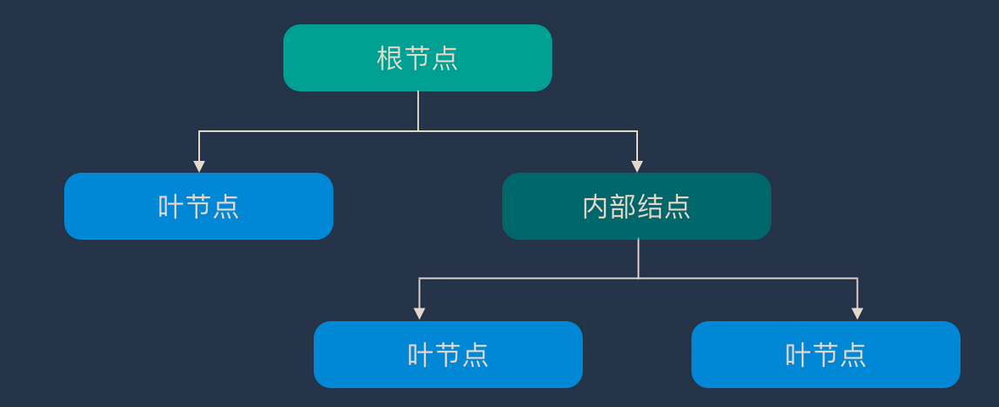
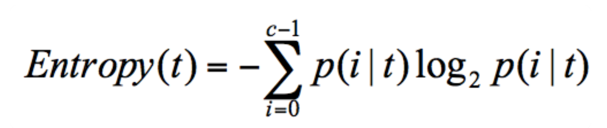
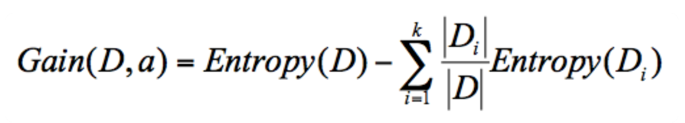
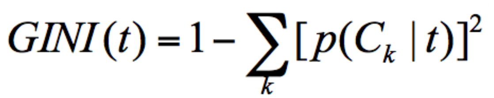
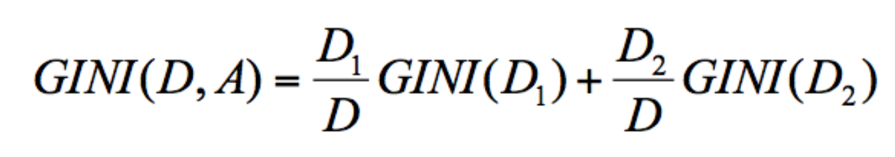
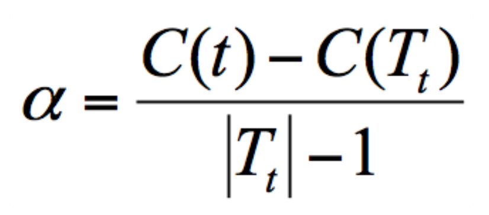

# 决策树

## 简介

决策树（Decision Tree）算法采用树形结构，使用层层推理来实现最终的分类。决策树是最简单的机器学习算法，它易于实现，可解释性强，完全符合人类的直观思维。

### 构造

构造就是生成一棵完整的决策树。构造的过程就是选择什么属性作为节点的过程，那么在构造过程中，会存在三种节点：

- 根节点：包含样本的全集
- 内部节点：对应特征属性测试
- 叶节点：就是树最底部的节点，代表决策的结果

节点之间存在父子关系。比如根节点会有子节点，子节点会有子子节点，但是到了叶节点就停止了，叶节点不存在子节点。那么在构造过程中，要解决三个重要的问题：选择哪个特征作为根节点；选择哪些特征作为子节点；什么时候停止并得到目标状态，即叶节点。

### 纯度/信息熵

特征选择决定了使用哪些特征来做判断。在训练数据集中，每个样本的属性可能有很多个，不同属性的作用有大有小。因而特征选择的作用就是筛选出跟分类结果相关性较高的特征，也就是分类能力较强的特征。在特征选择中通常使用的准则是：纯度，也就是在某个特征分类之下的纯度特别高。在构造决策树的时候，会基于纯度来构建。而经典的 “不纯度”的指标有三种，分别是信息增益（ID3 算法）、信息增益率（C4.5 算法）以及基尼指数（Cart 算法）。

可以把决策树的构造过程理解成为寻找纯净划分的过程。数学上，可以用纯度来表示，纯度换一种方式来解释就是让目标变量的分歧最小。信息熵（entropy）表示了信息的混乱性，即不确定度。信息熵越大，纯度越低。当集合中的所有样本均匀混合时，信息熵最大，纯度最低。在信息论中，随机离散事件出现的概率存在着不确定性。为了衡量这种信息的不确定性，信息学之父香农引入了信息熵的概念，并给出了计算信息熵的数学公式：。

选择好特征后，就从根节点触发，对节点计算所有特征的信息增益，选择信息增益最大的特征作为节点特征，根据该特征的不同取值建立子节点；对每个子节点使用相同的方式生成新的子节点，直到信息增益很小或者没有特征可以选择为止。

### 剪枝

剪枝就是给决策树瘦身，这一步想实现的目标就是，不需要太多的判断，同样可以得到不错的结果。之所以这么做，是为了防止“过拟合”（Overfitting）现象的发生。造成过拟合的原因之一就是因为训练集中样本量较小。如果决策树选择的属性过多，构造出来的决策树一定能够“完美”地把训练集中的样本分类，但是这样就会把训练集中一些数据的特点当成所有数据的特点，但这个特点不一定是全部数据的特点，这就使得这个决策树在真实的数据分类中出现错误，也就是模型的“泛化能力”差。泛化能力指的分类器是通过训练集抽象出来的分类能力，也可以理解是举一反三的能力。如果太依赖于训练集的数据，那么得到的决策树容错率就会比较低，泛化能力差。因为训练集只是全部数据的抽样，并不能体现全部数据的特点。一般来说，剪枝可以分为“预剪枝”（Pre-Pruning）和“后剪枝”（Post-Pruning）。

- 预剪枝是在决策树构造时就进行剪枝。方法是在构造的过程中对节点进行评估，如果对某个节点进行划分，在验证集中不能带来准确性的提升，那么对这个节点进行划分就没有意义，这时就会把当前节点作为叶节点，不对其进行划分。
- 后剪枝就是在生成决策树之后再进行剪枝，通常会从决策树的叶节点开始，逐层向上对每个节点进行评估。如果剪掉这个节点子树，与保留该节点子树在分类准确性上差别不大，或者剪掉该节点子树，能在验证集中带来准确性的提升，那么就可以把该节点子树进行剪枝。方法是：用这个节点子树的叶子节点来替代该节点，类标记为这个节点子树中最频繁的那个类。

### 预测

预测时，在树的内部节点处用某一属性值进行判断，根据判断结果决定进入哪个分支节点，直到到达叶节点处，得到分类结果。这是一种基于 if-then-else 规则的有监督学习算法，决策树的这些规则通过训练得到，而不是人工制定的。

## ID3算法

### 信息增益

ID3  算法计算的是信息增益，信息增益指的就是划分可以带来纯度的提高，信息熵的下降。它的计算公式，是父亲节点的信息熵减去所有子节点的信息熵。在计算的过程中，会计算每个子节点的归一化信息熵，即按照每个子节点在父节点中出现的概率，来计算这些子节点的信息熵。所以信息增益的公式可以表示为：

。公式中 D 是父亲节点，Di 是子节点，Gain(D,a) 中的 a 作为 D 节点的特征选择。

### 缺陷

 ID3 算法的缺陷在于倾向于选择取值比较多的属性。如果把“编号”作为一个属性，那么“编号”将会被选为最优属性 ，但实际上“编号”是无关属性的，它对分类并没有太大作用。

## C4.5算法

### 信息增益率

因为 ID3 在计算的时候，倾向于选择取值多的属性。为了避免这个问题，C4.5 采用信息增益率的方式来选择属性。信息增益率 = 信息增益 / 属性熵。当属性有很多值的时候，相当于被划分成了许多份，虽然信息增益变大了，但是对于 C4.5 来说，属性熵也会变大，所以整体的信息增益率并不大。

### 悲观剪枝

ID3 构造决策树的时候，容易产生过拟合。在 C4.5 中，会在决策树构造之后采用悲观剪枝（PEP），用于提升决策树的泛化能力。悲观剪枝是后剪枝技术中的一种，通过递归估算每个内部节点的分类错误率，比较剪枝前后这个节点的分类错误率来决定是否对其进行剪枝。这种剪枝方法不再需要一个单独的测试数据集。

### 特征值离散化

C4.5 可以处理连续属性的情况，对连续的特征进行离散化的处理。比如打篮球存在的“湿度”属性，不按照“高、中”划分，而是按照湿度值进行计算，那么湿度取什么值都有可能。该怎么选择这个阈值呢，C4.5 选择具有最高信息增益的划分所对应的阈值。

## Cart 算法

CART（Classification And Regression Tree）算法，中文叫做分类回归树。

### GINI系数

在经济学中，基尼系数是用来衡量一个国家收入差距的常用指标。当基尼系数大于 0.4 的时候，说明财富差异悬殊。基尼系数在 0.2-0.4  之间说明分配合理，财富差距不大。基尼系数本身反应了样本的不确定度。当基尼系数越小的时候，说明样本之间的差异性小，不确定程度低。分类的过程本身是一个不确定度降低的过程，即纯度的提升过程。所以 CART 算法在构造分类树的时候，会选择基尼系数最小的属性作为属性的划分。

GINI 系数的计算公式为：，这里 p(Ck|t) 表示节点 t 属于类别 Ck 的概率，节点 t 的基尼系数为 1 减去各类别 Ck 概率平方和。

节点 D 的基尼系数等于子节点 D1 和 D2 的归一化基尼系数之和，用公式表示为：，归一化基尼系数代表的是每个子节点的基尼系数乘以该节点占整体父亲节点 D 中的比例。

### 剪枝

CART 决策树的剪枝主要采用的是 CCP（Cost-Complexity Prune）方法，它是一种后剪枝的方法，中文叫做代价复杂度。这种剪枝方式用到一个指标叫做节点的表面误差率增益值，以此作为剪枝前后误差的定义。用公式表示则是：。其中 Tt 代表以 t  为根节点的子树，C(Tt) 表示节点 t 的子树没被裁剪时子树 Tt 的误差，C(t) 表示节点 t 的子树被剪枝后节点 t  的误差，|Tt|代子树 Tt 的叶子数，剪枝后，T 的叶子数减少了|Tt|-1。所以节点的表面误差率增益值等于节点 t  的子树被剪枝后的误差变化除以剪掉的叶子数量。

因为希望剪枝前后误差最小，所以要寻找的就是最小α值对应的节点，把它剪掉。这时候生成了第一个子树。重复上面的过程，继续剪枝，直到最后只剩下根节点，即为最后一个子树。得到了剪枝后的子树集合后，我们需要用验证集对所有子树的误差计算一遍。可以通过计算每个子树的基尼指数或者平方误差，取误差最小的那个树，得到想要的结果。