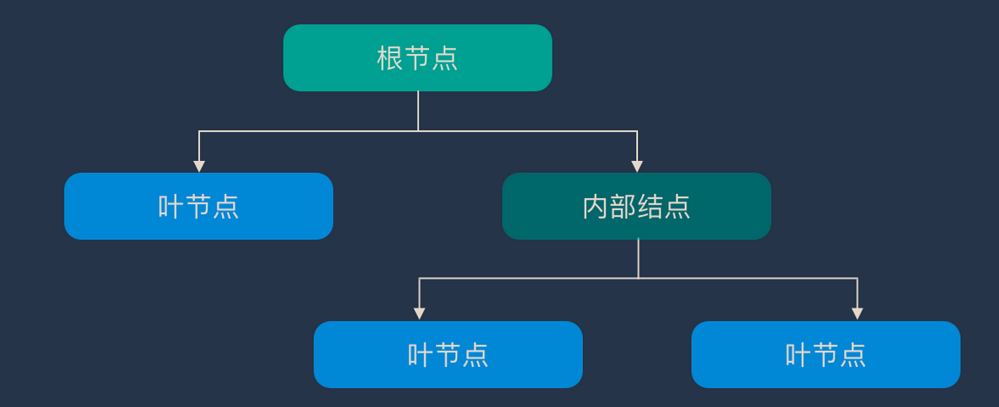

# 决策树

## 简介

决策树（Decision Tree）算法采用树形结构，使用层层推理来实现最终的分类。决策树由下面几种元素构成：

- 根节点：包含样本的全集
- 内部节点：对应特征属性测试
- 叶节点：代表决策的结果

预测时，在树的内部节点处用某一属性值进行判断，根据判断结果决定进入哪个分支节点，直到到达叶节点处，得到分类结果。这是一种基于 if-then-else 规则的有监督学习算法，决策树的这些规则通过训练得到，而不是人工制定的。决策树是最简单的机器学习算法，它易于实现，可解释性强，完全符合人类的直观思维。

### 步骤

- 特征选择：特征选择决定了使用哪些特征来做判断。在训练数据集中，每个样本的属性可能有很多个，不同属性的作用有大有小。因而特征选择的作用就是筛选出跟分类结果相关性较高的特征，也就是分类能力较强的特征。在特征选择中通常使用的准则是：信息增益。
- 决策树生成：选择好特征后，就从根节点触发，对节点计算所有特征的信息增益，选择信息增益最大的特征作为节点特征，根据该特征的不同取值建立子节点；对每个子节点使用相同的方式生成新的子节点，直到信息增益很小或者没有特征可以选择为止。
- 决策树剪枝：剪枝的主要目的是对抗「过拟合」，通过主动去掉部分分支来降低过拟合的风险。

## ID3算法（ID3 Algorithm）

ID3 是最早提出的决策树算法，他就是利用信息增益来选择特征的。

## C4.5算法（C4.5 Algorithm）

他是 ID3 的改进版，他不是直接使用信息增益，而是引入“信息增益比”指标作为特征的选择依据。

## C5.0算法（C5.0 Algorithm）

## 

## 

## 

## Tmp

### 决策残端（Decision Stump）

### SLIQ（Supervised Learning in Quest）

### 卡方自动交互检测（Chi-squared Automatic Interaction Detection，CHAID）