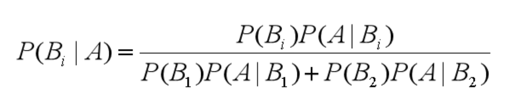
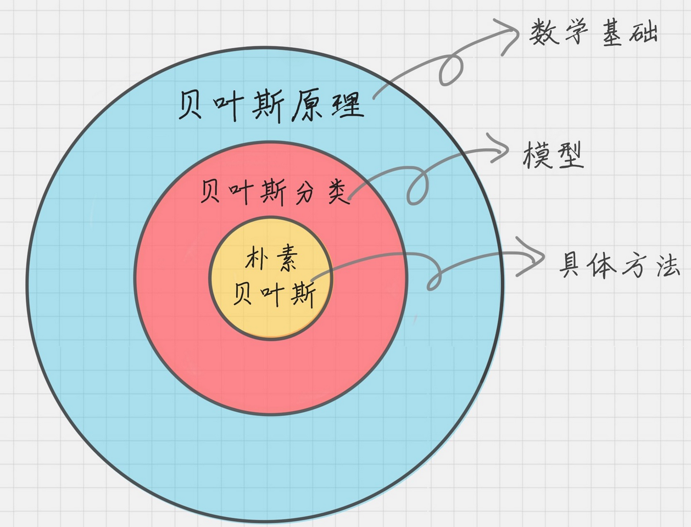
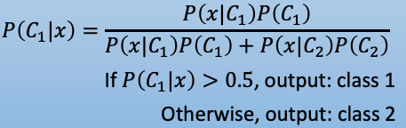
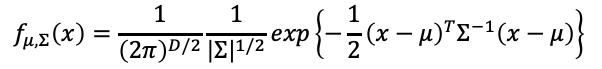
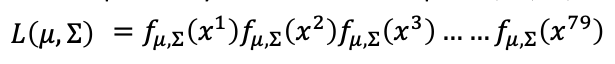
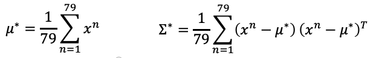
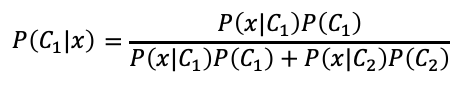

# 朴素贝叶斯方法

## 简介

贝叶斯原理是英国数学家托马斯·贝叶斯提出的，贝叶斯原理跟我们的生活联系非常紧密。举个例子，如果你看到一个人总是花钱，那么会推断这个人多半是个有钱人。当然这也不是绝对，也就是说，当你不能准确预知一个事物本质的时候，你可以依靠和事物本质相关的事件来进行判断，如果事情发生的频次多，则证明这个属性更有可能存在。贝叶斯为了解决一个叫“逆向概率”问题，所谓“逆向概率”是相对“正向概率”而言。正向概率很容易理解，比如我们已经知道袋子里面有 N 个球，不是黑球就是白球，其中 M  个是黑球，那么把手伸进去摸一个球，就能知道摸出黑球的概率是多少。但这种情况往往是上帝视角，即了解了事情的全貌再做判断。在现实生活中，我们很难知道事情的全貌。贝叶斯则从实际场景出发，提了一个问题：如果我们事先不知道袋子里面黑球和白球的比例，而是通过我们摸出来的球的颜色，能判断出袋子里面黑白球的比例么？这是因为，贝叶斯原理与其他统计学推断方法截然不同，它是建立在主观判断的基础上：在我们不了解所有客观事实的情况下，同样可以先估计一个值，然后根据实际结果不断进行修正。

### 术语

- 先验概率：通过经验来判断事情发生的概率。比如南方的梅雨季是 6-7 月，就是通过往年的气候总结出来的经验，这个时候下雨的概率就比其他时间高出很多。
- 后验概率：后验概率就是发生结果之后，推测原因的概率，它是属于条件概率的一种。
- 条件概率：事件 A 在另外一个事件 B 已经发生条件下的发生概率，表示为 P(A|B)，读作“在 B 发生的条件下 A 发生的概率”。
- 似然函数（likelihood  function）：你可以把概率模型的训练过程理解为求参数估计的过程。举个例子，如果一个硬币在 10  次抛落中正面均朝上。那么你肯定在想，这个硬币是均匀的可能性是多少？这里硬币均匀就是个参数，似然函数就是用来衡量这个模型的参数。似然在这里就是可能性的意思，它是关于统计参数的函数。

### 贝叶斯原理

贝叶斯原理就是求解后验概率：

- 先验概率： P(B1）、P(B2) ，类别概率，也就是观测值
- 似然函数： P(A|B1)、P(A|B2)，条件概率
- 后验概率： P(B1|A)、P(B2|A)，也就是无法观测的条件概率

#### 贝叶斯分类

#### 朴素贝叶斯分类

朴素贝叶斯（Naive Bayes Classifier）被称为朴素，因为它假设每个输入变量是独立的。这是一个强有力的假设，对于实际数据是不现实的，然而，该技术对于大范围的复杂问题非常有效。

### 分类

#### Bernoulli朴素贝叶斯

特征变量是布尔变量，符合 0/1 分布，在文档分类中特征是单词是否出现。伯努利朴素贝叶斯是以文件为粒度，如果该单词在某文件中出现了即为 1，否则为 0。

#### 多项式朴素贝叶斯

特征变量是离散变量，符合多项分布，在文档分类中特征变量体现在一个单词出现的次数，或者是单词的 TF-IDF 值等。多项式朴素贝叶斯是以单词为粒度，会计算在某个文件中的具体次数。

TF-IDF 是一个统计方法，用来评估某个词语对于一个文件集或文档库中的其中一份文件的重要程度。TF-IDF（Term Frequency - Inverse Document Frequency），分别代表了词频和逆向文档频率。词频 TF 计算了一个单词在文档中出现的次数，它认为一个单词的重要性和它在文档中出现的次数呈正比。逆向文档频率  IDF 是指一个单词在文档中的区分度。它认为一个单词出现在的文档数越少，就越能通过这个单词把该文档和其他文档区分开，IDF 越大就代表该单词的区分度越大。所以 TF-IDF 实际上是词频 TF 和逆向文档频率 IDF 的乘积。这样我们倾向于找到 TF 和 IDF 取值都高的单词作为区分，即这个单词在一个文档中出现的次数多，同时又很少出现在其他文档中，这样的单词适合用于分类。

#### 高斯朴素贝叶斯

特征变量是连续变量，符合高斯分布，比如说人的身高，物体的长度。高斯朴素贝叶斯适合处理特征变量是连续变量，且符合正态分布（高斯分布）的情况。

## 模型训练

### Model

- 采用贝叶斯：
- P(C1)、P(C2)：可以直接通过training set统计得出
- P(x|C1）、P(x|C2）：假设满足高斯分布
  - 高斯分布：

### Goodness Function

- Lost Function：假设 P(x|C1）、P(x|C2）是样本的最大似然数
  - Likehood： 
  - 然后通过样本估计最大似然高斯分布可以确定 P(x|C1）、P(x|C2），从而确定他们高斯分布的 mean μ 和 covariance Σ：

### Best Function

- 最大似然其实就是lost function的最小优化，最后通过获取的 P(x|C1）、P(x|C2）在 中判断

### 例子

贝叶斯分类的一个典型的应用场合是垃圾邮件分类，通过对样本邮件的统计，我们知道每个词在邮件中出现的概率 P(Ai)，我们也知道正常邮件概率 P(B0) 和垃圾邮件的概率 P(B1)，还可以统计出垃圾邮件中各个词的出现概率  P(Ai∣B1)，那么现在一封新邮件到来，我们就可以根据邮件中出现的词，计算  ``P(B1∣Ai) = P(B1) * P(Ai∣B1) / P(Ai)``，即得到这些词出现情况下，邮件为垃圾邮件的概率，进而判断邮件是否为垃圾邮件。

