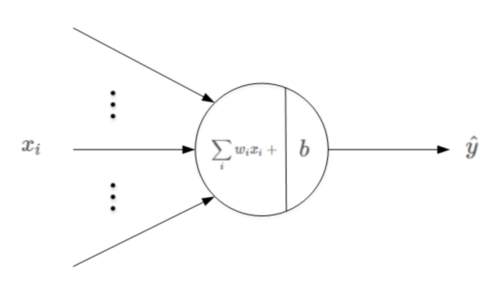
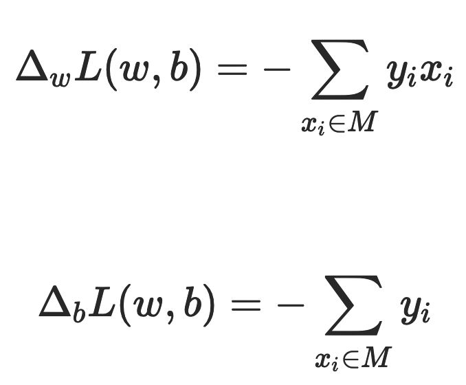
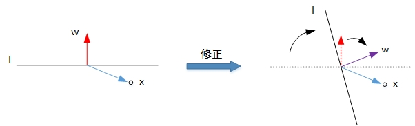

# 感知机

感知机（Perceptron）是一种比较简单的二分类模型，它就是将线性回归的思想用在分类中，它将输入特征分类为 +1、-1 两类。例如，二维平面上的点只有两个输入特征（横轴坐标和纵轴坐标），一条直线就可以分类。如果输入数据有更多维度的特征，那么就需要建立同样多维度的模型，高维度上的分类模型也被称为超平面。

## 算法

在一组点中，找出误分类的点到超平面的距离和最小的那条线。

### 模型

感知机是由 3 层组成：

- 输入处理层：接收外部信号后做线性叠加（线性回归）
- 激活函数层：阶跃函数 $sign()$ 。不同于逻辑回归，感知机采用不连续函数作为激活函数。
- 阈值判断层：$=1$ 为类 1，$=-1$ 为类 2。 

感知机具体数学模型如下：$f(x)=sign(wx+b)$，其中 x 代表输入的特征空间向量，输出空间是{-1, +1}，w 为权值向量，b 叫作偏置。

当感知机输出为 +1 表示输入值在超平面的上方，当感知机输出为 -1 表示输入值在超平面的下方。训练感知机模型就是要计算出 w 和 b 的值，当有新的数据需要分类的时候，输入感知机模型就可以计算出 +1 或者 -1 从而进行分类。

### 损失函数

偏差之和就是感知机的损失函数：$L(w,b)=-\sum_{{x_i}\in M}y_i(wx_i+b)$。其中 M 为误分类点集合，误分类点越少，损失函数的值越小。如果没有误分类点，损失函数值为 0。

### 损失函数求解

求模型的参数 w 和 b，就是求损失函数的极小值。

一般采用梯度下降法求损失函数极小值，实质上就是求导过程的数值计算方法。对于误分类点集合 M，损失函数 L(w,b) 变化的梯度，就是某个函数变量的变化引起的函数值的变化，根据感知机损失函数可知：

使用梯度下降更新 w 和 b，不断迭代使损失函数 L(w,b) 不断减小，直到为 0，也就是没有误分类点。感知机算法的实现过程：

1. 选择初始值 $w_0、b_0$。
2. 在样本集合中选择样本数据 $(x_i,y_i)$。
3. 如果 $y_i(wx_i+b)<0$，表示 $y_i$ 为误分类点，那么 $w=w+\eta y_ix_i、b=b+\eta y_i$，在梯度方向校正 w 和 b。其中 $\eta$ 为步长。步长选择要适当，步长太长会导致每次计算调整太大出现震荡，步长太短又会导致收敛速度慢、计算时间长。
4. 跳转回 2，直到样本集合中没有误分类点， 即全部样本数据 $y_i(wx_i+b)≥0$。

## PLA

PLA（Perceptron Lineair Algorithm）线性感知机算法，属于一种最简单的感知机模型。

### 算法

PLA 的基本原理就是**逐点修正**，首先在超平面上随意取一条分类面，统计分类错误的点；然后随机对某个错误点就行修正，即变换直线的位置，使该错误点得以修正；接着再随机选择一个错误点进行纠正，分类面不断变化，直到所有的点都完全分类正确了，就得到了最佳的分类面。

利用二维平面例子来进行解释，第一种情况是错误地将正样本（y=1）分类为负样本（y=-1）。此时，$wx<0$，即 w 与 x 的夹角大于 90 度，分类线 ll 的两侧。修正的方法是让夹角变小，修正 w 值，使二者位于直线同侧：$w:=w+x=w+yx$。修正过程示意图如下所示：

第二种情况是错误地将负样本（y=-1）分类为正样本（y=1）。此时，$wx>0$，即 w 与 x 的夹角小于 90 度，分类线 ll 的同一侧。修正的方法是让夹角变大，修正 w 值，使二者位于直线两侧：$w:=w−x=w+yx$，修正过程示意图如下所示：

经过两种情况分析，我们发现 PLA 每次 w 的更新表达式都是一样的：$w:=w+yx$。掌握了每次 w 的优化表达式，那么 PLA 就能不断地将所有错误的分类样本纠正并分类正确。

### Pocket PLA

当数据不是线性可分时，可以采用口袋 PLA 算法。

口袋算法基于贪心的思想，它的原理是让遇到的最好的线拿在自己的手上。 

- 首先手里有一条分割线，发现它在数据点上面犯了错误，那就纠正这个分割线。
- 遍历所有的数据，看哪条线犯的错误少。如果犯的错误少，那么就让替代，否则不变。 
- 怎样让算法停下来呢？：自己规定迭代的次数。由于口袋算法得到的线越来越好（PLA 就不一定了，PLA 是最终结果最好，其他情况就说不准了），所以就自己规定迭代的次数 。 

## 总结

感知机是单个的，只能解决线性可分问题。当需要解决非线性可分问题，需要考虑使用多层神经网络，也就是多层感知机。

