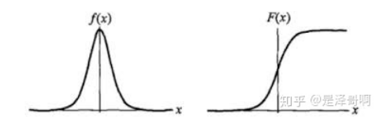
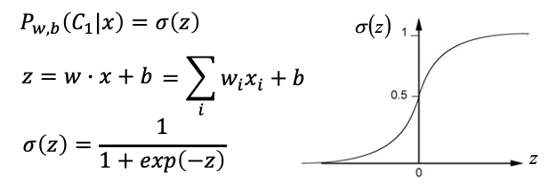

# 逻辑回归

## 简介

逻辑回归（Logistic Regression）虽然被称为回归，但其实际上是分类模型，并常用于二分类。逻辑回归的本质是：假设数据服从这个分布，然后使用极大似然估计做参数的估计。它可以用来表示某件事情发生的可能性，比如：一封邮件是垃圾邮件的肯能性（是、不是），你购买一件商品的可能性（买、不买），广告被点击的可能性（点、不点）。

## 模型

### 逻辑分布

逻辑分布是一种连续型的概率分布，其**分布函数**和**密度函数**分别为： 

其图像特征为：

常用到的 Sigmoid 函数就是逻辑分布函数在 $\mu=0,\gamma=1$ 的特殊形式。

为什么逻辑回归算法是基于 Sigmoid  函数实现的呢？你可以这样理解：我们要实现一个二分类任务，0 即为不发生，1 即为发生。我们给定一些历史数据 X 和 y。其中 X 代表样本的 n 个特征，y 代表正例和负例，也就是 0 或 1 的取值。通过历史样本的学习，我们可以得到一个模型，当给定新的 X 的时候，可以预测出  y。这里我们得到的 y 是一个预测的概率，通常不是 0% 和 100%，而是中间的取值，那么我们就可以认为概率大于 50%  的时候，即为发生（正例），概率小于 50% 的时候，即为不发生（负例）。这样就完成了二分类的预测。

### 逻辑回归模型

逻辑回归主要用于分类问题，以二分类为例，对于所给数据集假设存在这样的一条直线可以将数据完成线性可分。决策边界可以表示为 $w_1x_1+w_2x_2+b=0$ ，假设某个样本点 $h_w(x)=w_1x_1+w_2x_2+b>0$  那么可以判断它的类别为 1。

逻辑回归在决策边界之上还需要加一层，它要找到的是分类概率 $P(Y=1)$（分到 1 类的概率）与输入向量 x 的直接关系，然后通过比较概率值来分类，因此采用 Sigmoid 函数来表示：$P(Y=1|x)=\frac{1}{1+e^{-(w^Tx+b)}}$。也就是说，输出 Y=1 的对数几率是由输入 x 的线性函数表示的模型，这就是**逻辑回归模型**。

逻辑回归的思路是：

- 先拟合决策边界（不局限于线性，还可以是多项式）
- 再建立这个边界与分类的概率联系，从而得到了二分类情况下的概率。

### 损失函数

逻辑回归模型的数学形式确定后，剩下就是如何去求解模型中的参数。在统计学中，常常使用最大似然估计法来求解，即寻求一组参数，使得在这组参数下数据集的似然度（概率）最大。

假设：$P(Y=1|x)=p(x)$, $P(Y=0|x)=1-p(x)$

似然函数为：$L(w)=\Pi[p(x_i)]^{y_i}[1-p(x_i)]^{1-y_i}$

目标就是需要最大化 $L(w,b)$：$w^*,b^*=arg max_{w,b}L(w,b)$ 

两边同取对数化简后为：$J(w)=-\frac{1}{n}lnL(w)=-\frac{1}{n}(\sum_{i=1}^n(y_ilnp(x_i)+(1-y_i)ln(1-p(x_i))))$

损失函数最终推导为：

### 损失函数求解

也就是 Best Function 为对损失求一阶导数：

所以还是采用梯度下降法：

