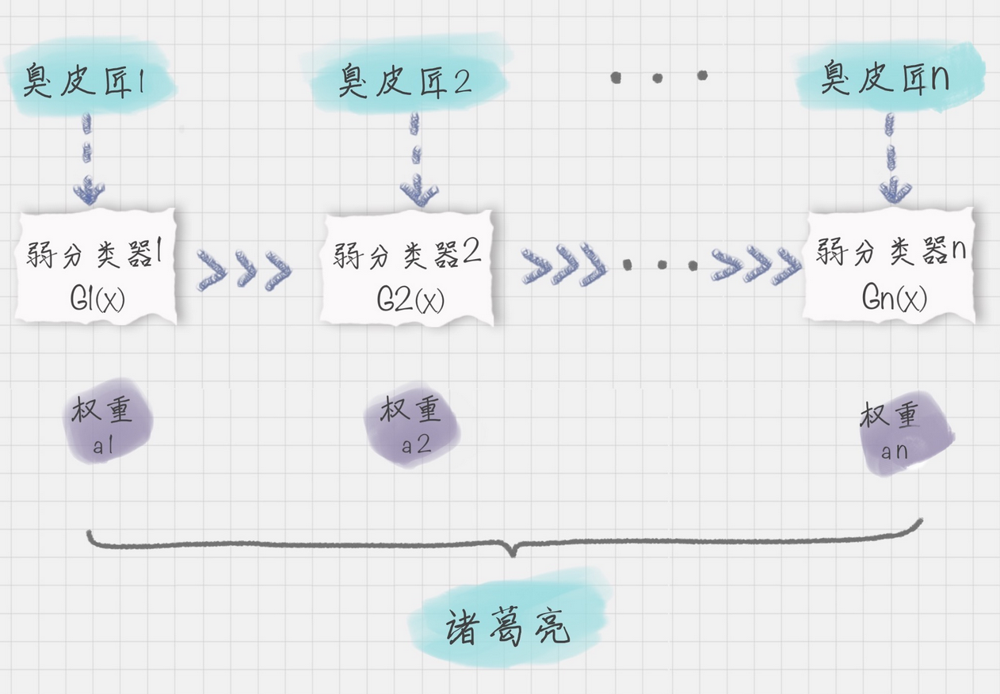
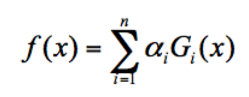
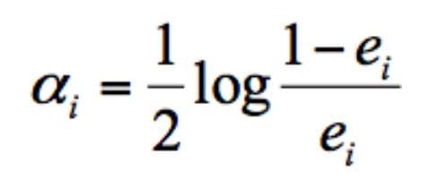
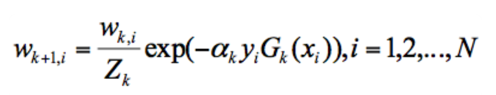
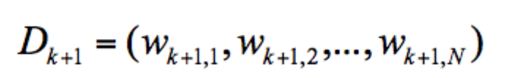
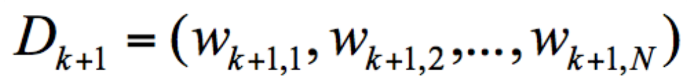
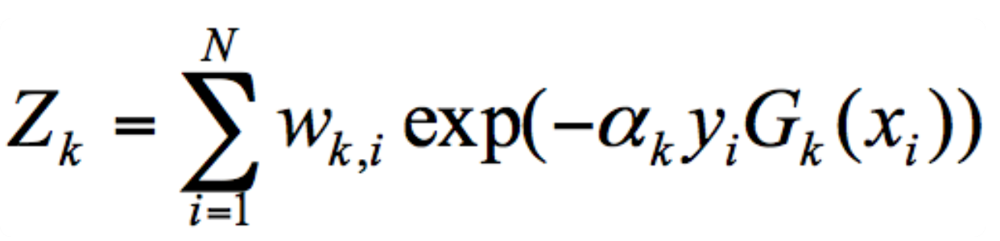

# AdaBoosting

## 简介

AdaBoost（Adaptive Boosting）由 Freund 等人于 1995 年提出，是对 Boosting 算法的一种实现。AdaBoost 算法是一个框架，你可以指定任意的分类器，通常我们可以采用 CART 分类器作为弱分类器。Boosting 算法是集成算法中一类算法的总称，这类算法通过训练多个弱分类器，将它们组合成一个强分类器，也就是我们俗话说的“三个臭皮匠，顶个诸葛亮”。最终得到的强分类器是通过一系列的弱分类器根据不同的权重组合而成的。

## 原理

AdaBoost 针对整个训练集的数据应用不同的弱分类器 $$G_i(x)$$，而且最终强分类器是一个由 K 个弱分类器组成的 f(x)：。如果弱分类器的分类效果好，那么权重应该比较大，如果弱分类器的分类效果一般，权重应该降低。

每次迭代中：

- 选择当前“权重训练集”下的一个最优弱分类器 $$G_i(x)$$：选择原则是基于这个弱分类器对样本的分类的“权重错误率”来决定的
- 重新计算本轮迭代最优弱分类器在强分类器中的权重 $$a_i$$：，其中 $$e_i$$ 为该弱分类器针对“权重训练集”的“权重错误率”
- 基于计算所得的 $$a_i$$，调整整体的“权重训练集”中各个训练样本的权重 $$w_{k+1,i}$$：。AdaBoost 算法是通过改变样本的数据分布来实现下一轮最优分类器的选择。AdaBoost 会判断每次训练的样本是否正确分类，对于正确分类的样本，降低它的权重，对于被错误分类的样本，增加它的权重。再基于本轮得到的分类准确率，来确定这次训练样本中每个样本的权重。然后将修改过权重的新数据集传递给下一轮迭代的分类器进行训练，第 k+1 轮中的样本权重，是根据该样本在第 k 轮的权重以及第 k 个分类器的准确率而定。这样做的好处就是，通过每一轮训练样本的动态权重，可以让训练的焦点集中到难分类的样本上，最终得到的弱分类器的组合更容易得到更高的分类准确率。对于有 N 个训练样本的“权重训练集”，用 Dk+1 代表第 k+1 轮训练中的样本的“权重训练集”，其中 Wk+1,1 代表第 k+1 轮中第一个样本的权重，以此类推 Wk+1,N  代表第 k+1 轮中第 N 个样本的权重，因此用公式表示为：
  - 其中 $$Z_k$$ 代表规范化因子，我们知道第 K+1 轮样本的权重为：。为了让样本权重之和为 1，需要除以规范化因子 Zk，所以：。
  - yi 代表的是目标的结果 labelSet，X 作为特征值 dataSet。

当然在每一轮的训练中，我们都需要从众多“臭皮匠”中选择一个拔尖的，也就是这一轮训练评比中的最优“臭皮匠”，对应的就是错误率最低的分类器。当然每一轮的样本的权重都会发生变化，这样做的目的是为了让之前错误分类的样本得到更多概率的重复训练机会。

## Tmp

AdaBoost用于短决策树。在创建第一个树之后，每个训练实例上的树的性能用于加权创建的下一个树应该关注每个训练实例的注意力。难以预测的训练数据被赋予更多权重，而易于预测的实例被赋予更少的权重。模型一个接一个地顺序创建，每个模型更新训练实例上的权重，这些权重影响序列中下一个树所执行的学习。构建完所有树之后，将对新数据进行预测，并根据训练数据的准确性对每棵树的性能进行加权。因为通过算法如此关注纠正错误，所以必须删除带有异常值的干净数据。

