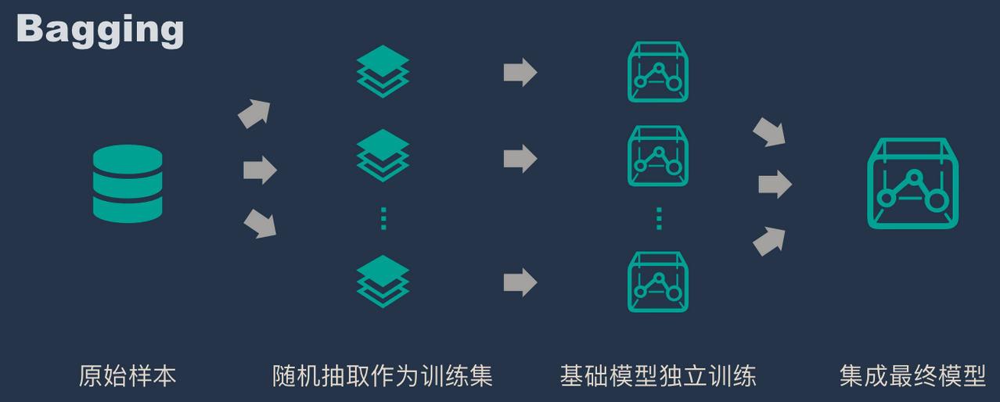
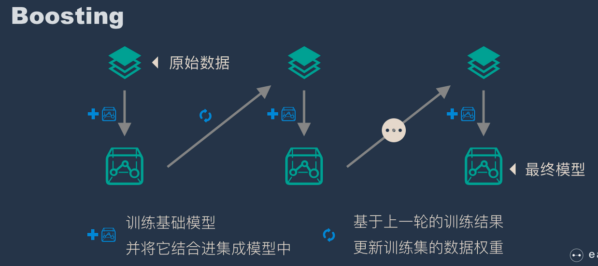

# 集成学习

集成学习就是集思广益，博取众长，当我们做决定的时候，先听取多个专家的意见，再做决定。集成算法通常有两种方式，分别是投票选举（bagging）和再学习（boosting）。

- 投票选举的场景类似把专家召集到一个会议桌前，当做一个决定的时候，让 K 个专家（K 个模型）分别进行分类，然后选择出现次数最多的那个类作为最终的分类结果。
- 再学习相当于把 K 个专家（K 个分类器）进行加权融合，形成一个新的超级专家（强分类器），让这个超级专家做判断。

Boosting  的含义是提升，它的作用是每一次训练的时候都对上一次的训练进行改进提升，在训练的过程中这 K 个“专家”之间是有依赖性的，当引入第 K 个“专家”（第 K 个分类器）的时候，实际上是对前 K-1 个专家的优化。而 bagging 在做投票选举的时候可以并行计算，也就是 K 个“专家”在做判断的时候是相互独立的，不存在依赖性。

## Bagging

### 简介

Bagging 套袋法（Bootstrap aggregating）的核心思想是民主，所有基础模型都一致对待，每个基础模型手里都只有一票，然后使用民主投票的方式得到最终的结果。大部分情况下，经过 bagging 得到的结果方差（variance）更小。

- 从原始样本集中抽取训练集：每轮从原始样本集中使用 Bootstraping 的方法抽取 n 个训练样本（在训练集中，有些样本可能被多次抽取到，而有些样本可能一次都没有被抽中）。共进行k轮抽取，得到k个训练集。（k个训练集之间是相互独立的）
- 每次使用一个训练集得到一个模型，k 个训练集共得到 k 个模型。（注：这里并没有具体的分类算法或回归方法，我们可以根据具体问题采用不同的分类或回归方法，如决策树、感知器等）
- 对分类问题：将上步得到的k个模型采用投票的方式得到分类结果；对回归问题，计算上述模型的均值作为最后的结果。（所有模型的重要性相同）

### 算法

- [随机森林 = bagging + 决策树](10_random-forest.md)

## Boosting

Boosting 和 bagging 最本质的差别在于他对基础模型不是一致对待的，而是经过不停的考验和筛选来挑选出「精英」，然后给精英更多的投票权，表现不好的基础模型则给较少的投票权，然后综合所有人的投票得到最终结果。大部分情况下，经过 boosting 得到的结果偏差（bias）更小。

- 通过加法模型将基础模型进行线性的组合。
- 每一轮训练都提升那些错误率小的基础模型权重，同时减小错误率高的模型权重。
- 在每一轮改变训练数据的权值或概率分布，通过提高那些在前一轮被弱分类器分错样例的权值，减小前一轮分对样例的权值，来使得分类器对误分的数据有较好的效果。

### 算法

- [Adaboost](40_adaboosting.md)
- Gradient boosting 

