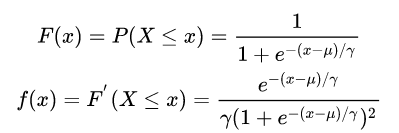
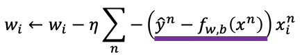

# 逻辑回归

## 简介

逻辑回归（Logistic Regression）虽然被称为回归，但其实际上是分类模型，并常用于二分类。它可以用来表示某件事情发生的可能性，比如：一封邮件是垃圾邮件的肯能性（是、不是），你购买一件商品的可能性（买、不买），广告被点击的可能性（点、不点）。

### 逻辑分布

逻辑回归的本质是假设数据集服从逻辑分布，然后使用最大似然估计做参数的估计。

逻辑分布是一种连续型的概率分布，其**分布函数**和**密度函数**分别为： 

其图像特征为：

常用到的 Sigmoid 函数就是逻辑分布函数在的特殊形式。

## 模型训练

### Model

逻辑回归主要用于分类问题，以二分类为例，对于所给数据集假设存在这样的一条直线可以将数据完成线性可分。决策边界可以表示为，假设某个样本点  那么可以判断它的类别为 1。

逻辑回归在决策边界之上还需要加一层，它要找到的是分类概率 P(Y=1)（分到 1 类的概率）与输入向量 x 的直接关系，然后通过比较概率值来判断类别。

因此选择采用对数几率函数（Sigmoid函数）来表示：

也就是说，输出 Y=1 的对数几率是由输入 x 的线性函数表示的模型，这就是**逻辑回归模型**。

逻辑回归的思路是，先拟合决策边界（不局限于线性，还可以是多项式），再建立这个边界与分类的概率联系，从而得到了二分类情况下的概率。

### Goodness Function 

逻辑回归模型的数学形式确定后，剩下就是如何去求解模型中的参数。在统计学中，常常使用最大似然估计法来求解，即找到一组参数，使得在这组参数下，数据集的似然度（概率）最大。

假设：

似然函数为：

目标就是需要最大化 L(w,b)： 

两边同取对数化简后为：

Lost Function 最终推导为：

### Best Function

所以还是采用梯度下降法：

