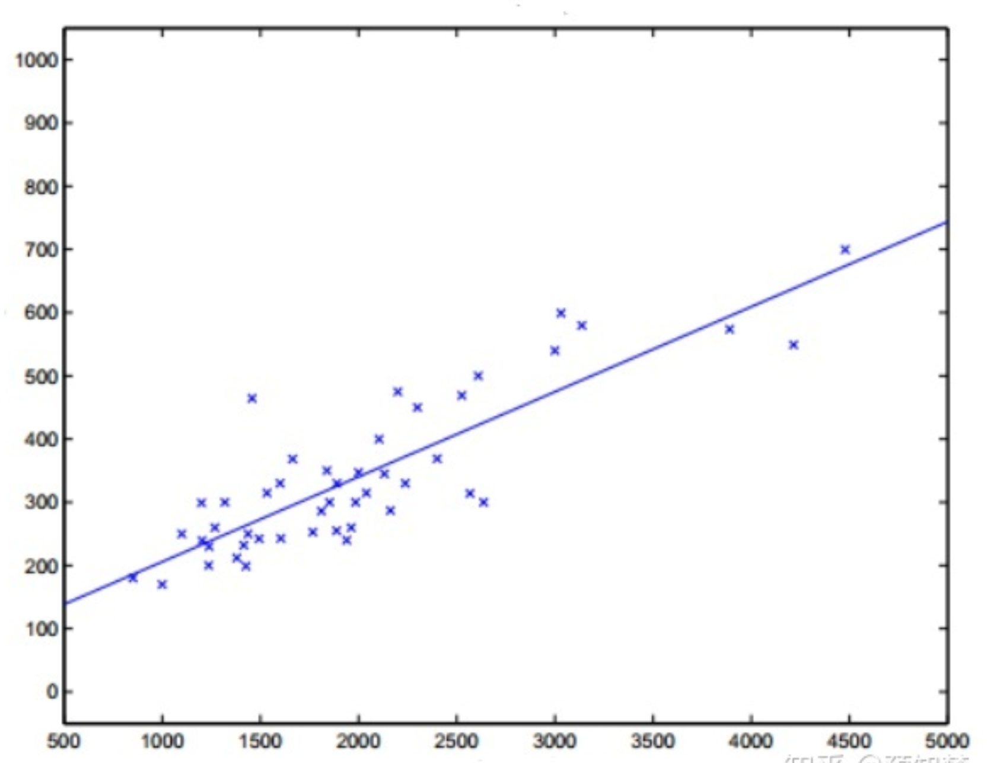
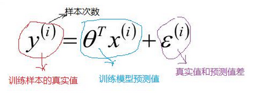
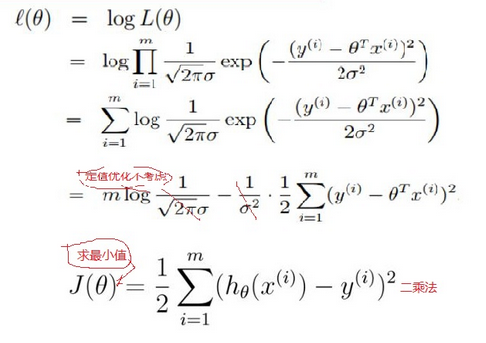
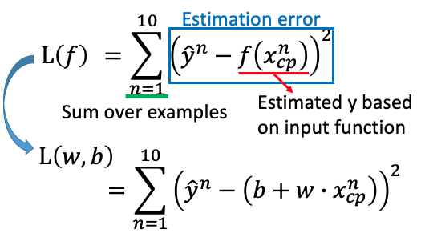
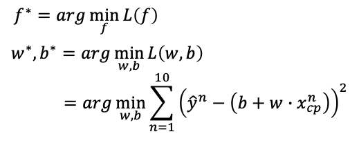
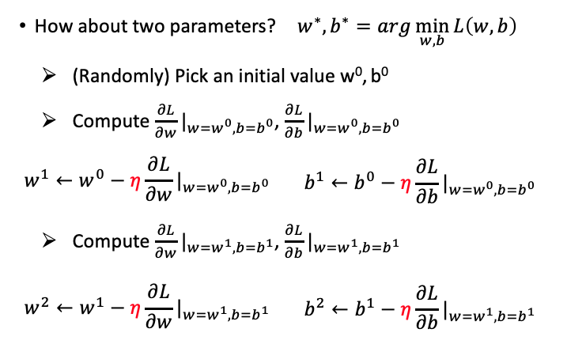
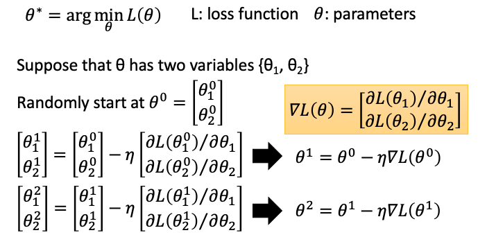
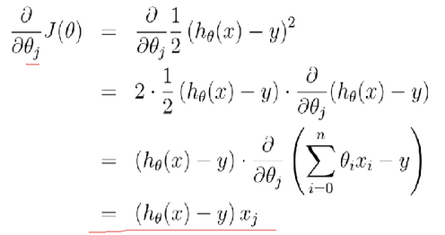
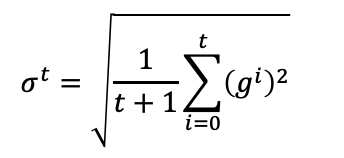
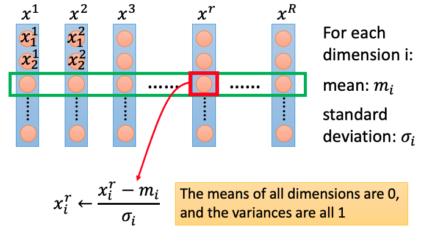

# 线性回归
## 简介

说到回归，一般都是指线性回归（linear regression）。线性回归意味着可以将输入项分别乘以一些常量，再将结果加起来得到输出。线性回归假设特征和结果满足线性关系。其实线性关系的表达能力非常强大，每个特征对结果的影响强弱可以由前面的参数体现，而且每个特征变量可以首先映射到一个函数，然后再参与线性计算，这样就可以表达特征与结果之间的非线性关系。

线性回归本来是是统计学里的概念，现在经常被用在机器学习中。如果 2 个或者多个变量之间存在“线性关系”，那么就可以通过历史数据摸清变量之间的“套路”，建立一个有效的模型，来预测未来的变量结果。线性回归假设输出变量是若干输入变量的线性组合，并根据这一关系求解线性组合中的最优系数。

## 原理

### 模型定义

$$x^{(i)}_j$$表示数据集第 i 个数据的第 j 个属性取值。

线性回归模型定义为：$$f(x) = w_0 + w_1x_1 + w_2x_2 + ... + w_nx_n$$ 。

如果用矩阵来表示就是 $f(x) = XW $，其中：$W=\left[ \begin{matrix} w_0 \\ w_1 \\ \vdots \\ w_n \end{matrix} \right]$ 是所要求得一系列参数，$X=\left[ \begin{matrix} 1 & x_1^{(1)} &\cdots & x_m^{(1)} \\ 1 & x_1^{(2)} &\cdots & x_m^{(2)} \\ \vdots \\ 1 & x_1^{(m)} &\cdots & x_m^{(m)} \end{matrix} \right]$ 是输入的数据矩阵，因为考虑 $$w_0$$ 常数项，所以在 X 的第一列加上了一列 1。 $X$ 的一行可以看做一个完整的输入数据，n 代表一个数据有 n 个特征属性，m 行代表一共是 m 个数据。数据集标签（label set）为 $Y=\left[ \begin{matrix} y^{(1)} \\ y^{2)} \\ \vdots \\ y^{(m)} \end{matrix} \right]$ 。

线性回归模型的目标就是找到一系列参数 $W$，使得 $$f(x) = XW$$ 尽可能地贴近 $Y$ 。具体目标如图找到一条直线使得尽可能符合数据的分布，从而有一个新的样本点时，可利用学习得到的这条直线进行预测。

### 数学原理

以下解释为什么最小二乘法能用于求线性模型的损失函数最小值。

假设采用线性模型 $f(x)=XW=\theta^TX $，把训练集的 label $Y$ 代入模型，可获得：

训练模型和真实样本之间有误差，假设训练集量很大，其误差 $\sum\epsilon$ 满足高斯分布 $(\mu,\delta^2)$ ，且 $\mu=0$，所以高斯分布为 $(0,\delta^2)$，总体可写成：。

根据高斯分布，对于每个样本 x，都可以得到一个获得 y 值的概率 $p(y|x, \theta)$。**似然函数**的本质是描述出现这个情形的概率，最大化它即表示这个情形出现的概率最大，也就是认为出现训练集值的概率最大。又因为样本是独立分布的，对其求最大似然函数：$L(\theta) = \Pi_{i=1}^mP(y^{(i)}|x^{(i)};\theta)=\Pi_{i=1}^m\frac{1}{\sqrt{2\pi}\sigma}exp(-\frac{(y^{(i)}-\theta^Tx^{(i)})^2}{2\sigma^2})$ 。

对最大似然函数化简后后得：，也就得到了线性回归的均方差损失函数的**最小二乘法**公式。

总结：根据最大似然函数，获取样本的概率为最大，相应求出了损失函数的**最小二乘法**公式。

### 损失函数

在训练集上确定系数 w 和 b（也就是 $w_0$）时，预测输出 f(x) 和真实输出 y 之间的误差是关注的核心指标。在线性回归中，这一误差是以均方误差来定义。当线性回归的模型为二维平面上的直线时，均方误差就是预测输出和真实输出之间的欧几里得距离，也被称为**最小二乘法**。也就是找到一个直线，使得所有样本到直线的欧式距离最小。损失函数定义为：$L(w)=\frac{1}{m}\sum_{i=1}^{m}(f(x^{(i)})-y^{i})^2=\frac{1}{m}(XW-y)^T(XW-y)$  ，

展开后得到：$L(w)=\frac{1}{m}(W^TX^TXW-W^TX^Ty-y^TXW+y^Ty)=\frac{1}{m}(W^TX^TXW-2W^TX^Ty+y^Ty)$ 。另一种表示为： ，也可以定义损失函数为：$L(w,b) = ∑_{n=1}^{10} (y^n - (b + wx_{cp}^n ))^2$。

### 求解损失函数

损失函数求解的目的是：找出最佳的w、b，使损失函数最小。

而以使均方误差取得最小值为目标的模型求解方法就是最小二乘法。在单变量线性回归任务中，最小二乘法的作用就是找到一条直线，使`所有样本到直线的欧式距离之和最小。

当 $$X^TX$$ 为满秩矩阵或者正定矩阵时，可使用正规方程法，直接求得闭式解。令 $\frac{\partial L(w)}{\partial w}=0$ ，即：$\frac{\partial L(w)}{\partial w}=\frac{2X^T(XW-y)}{m}=0$ ，可得：$W^*=(X^TX)^{-1}X^Ty$。

但一般 $$X^TX$$ 不能满足满秩矩阵或正定矩阵的条件，此时可使用梯度下降法，其迭代更新为：$W \leftarrow W - \alpha \frac{\partial L(W)}{\partial W}$，其中 $$\alpha$$ 是学习率，是一个梯度下降需要的超参数。可得到梯度下降迭代过程，即：$W \leftarrow W - \frac{2}{m}\alpha X^T(XW-y)$。

## 梯度下降法

梯度下降法（Gradient Descent）在有些场景无法求出全局最小值，只能求出局部最小值，但是在线性回归领域可以求出全局最小值。

更通用些，把w、b 都看成统一变量 $θ$，则变成：

梯度下降法先假设一定点，然后按一定的步长顺着这个点的梯度进行更新，迭代下去，最后能找到一个局部最优点。具体操作方法为，任意选一个起始点 $θ^0$，移到 $θ^1 = θ^0 - η∇L(θ^0)$，再移到 $θ^2 = θ^1 – η∇L(θ^1)$，依次类推，直到获得最小值。

以样本与计算差 $h(x)-y$ 作为梯度：，最后获得梯度下降法：$w_i\leftarrow w_i-\eta\sum_n(f_{w,b}(x^n)-y^n)x_i^n$。

### Learning Rate

计算合理的 $\eta$（learning rate），不能始终使用相同的 $\eta$。

- Vanilla gradient descent（以下的 w 可以理解为是 $\theta$）：$w^{t+1}\leftarrow w^t-\eta^tg^t$ 

- Adagrad

最终结果：

### Feautre Scaling

把不同的 feature 放缩到差不多的数量级

## Ref

1. [线性回归原理和实现基本认识](https://blog.csdn.net/lisi1129/article/details/68925799)
2. [线性回归原理及实现(Linear Regression)](https://www.jianshu.com/p/54d1c0c79588)