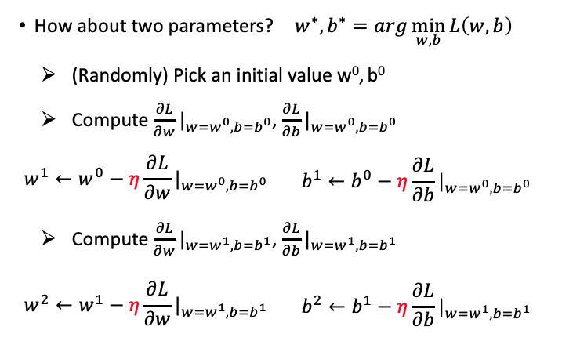
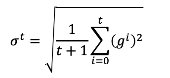
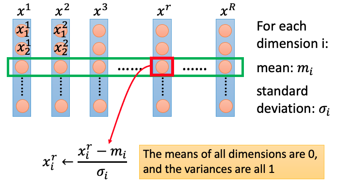
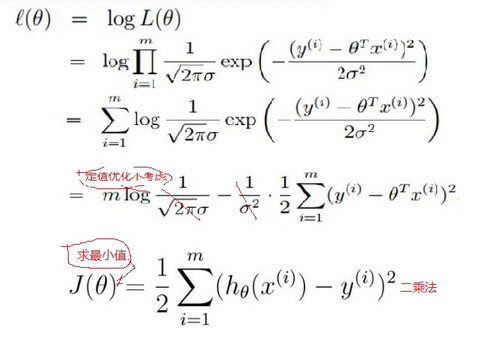

# 线性回归
适用于训练时间短、线性模型的场景。

## 简介

线性回归（Linear Regression）本来是是统计学里的概念，现在经常被用在机器学习中。如果 2 个或者多个变量之间存在“线性关系”，那么就可以通过历史数据摸清变量之间的“套路”，建立一个有效的模型，来预测未来的变量结果。线性回归假设输出变量是若干输入变量的线性组合，并根据这一关系求解线性组合中的最优系数。


## 模型训练

### Model

采用 Linear Model

```math
y=b+ ∑ w_i * x_i 
x_i：feature，w_i：weight，b：bias
```

### Goodness Function

在训练集上确定系数 w和 b 时，预测输出 f(x) 和真实输出 y^ 之间的误差是关注的核心指标。在线性回归中，这一误差是以均方误差来定义。当线性回归的模型为二维平面上的直线时，均方误差就是预测输出和真实输出之间的欧几里得距离，也被称为最小二乘法。


因此 lost function 定义为：L(w,b)=∑_(n=1)^10 (y ̂^n - (b+w∙x_cp^n ))^2 

### Best Function

找出最佳的w、b，使 lost function 最小：

最后获得梯度下降法：

而以使均方误差取得最小值为目标的模型求解方法就是最小二乘法。在单变量线性回归任务中，最小二乘法的作用就是找到一条直线，使`所有样本到直线的欧式距离之和最小。

## Gradient Descent

梯度下降法（Gradient Descent）在有些场景无法求出全局最小值，只能求出局部最小值，但是在线性回归领域可以求出全局最小值。



更通用些，把w、b 都看成统一变量 θ，则变成：


具体操作方法为，任意选一个起始点 θ^0，移到 θ^1 = θ^0 - η∇L(θ^0 )，再移到 θ^2 = θ^1 – η∇L(θ^1 )，依次类推，直到获得最小值。

### Learning Rate

计算合理的 η（learning rate），不能始终使用相同的 η。

- Vanilla gradient descent（以下的 w 可以理解为是 θ）：η^t=η ∕ √(t+1) 


- Adagrad

最终结果：

### Feautre Scaling

把不同的 feature 放缩到差不多的数量级



## 数学原理

假设采用线性模型：

确定模型后，把训练集代入模型，可以通过模型预测样本最终值：

训练模型和真实样本之间有误差，假设训练集量很大，其误差满足高斯分布，且 u=0，所以高斯分布为，总体可写成：

根据高斯分布，对于每个样本 x，都可以得到一个获得 y 值的概率 p(y|x, Q)。似然函数的本质是描述出现这个情形的概率，最大化它即表示这个情形出现的概率最大，也就是认为出现训练集的概率最大。又因为样本是独立分布的，对其求最大似然函数：

对最大似然函数化简后变成：

也就得到了线性回归的 lost function **最小二乘法**公式。

对该 lost function 求 w、b，使得其最小，往往采用梯度下降法：先假设一定点，然后按一定的步长顺着这个点的梯度进行更新，迭代下去，最后能找到一个局部最优点。

以样本与计算差 h(x)-y 作为梯度：


## Ref

1. [线性回归原理和实现基本认识](https://blog.csdn.net/lisi1129/article/details/68925799)
2. [线性回归原理及实现(Linear Regression)](https://www.jianshu.com/p/54d1c0c79588)