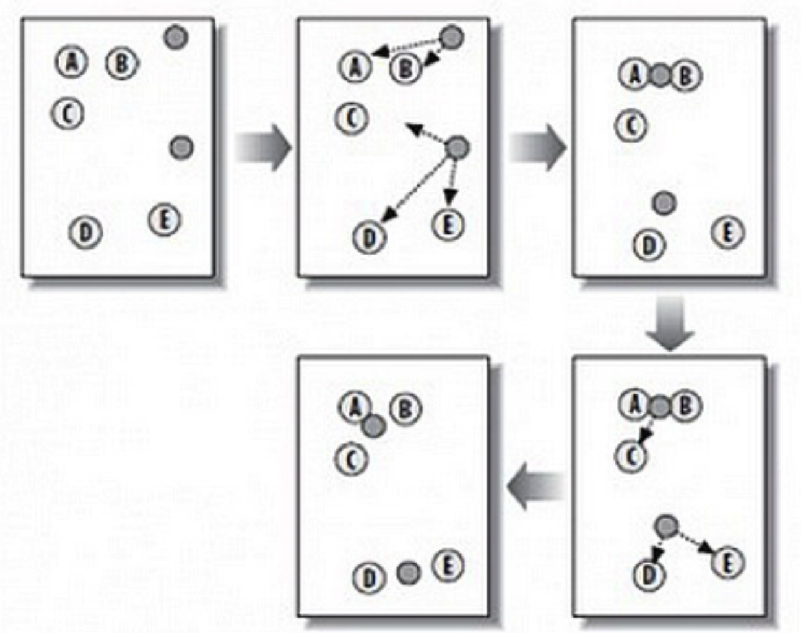

# K-means

## 简介

K-means 聚类，K 代表的是 K 簇，Means 代表的是中心，可以理解这个算法的本质是确定 K 簇的中心点，当找到了这些中心点也就完成了聚类。

K-means 是一种在给定分组个数后，能够对数据进行自动归类的聚类算法。K-Means 是发现给定数据集的 K 个簇的聚类算法，之所以称之为 `K-均值` 是因为它可以发现 K 个不同的簇，且每个簇的中心采用簇中所含值的均值计算而成。簇个数 K 是用户指定的，每一个簇通过其质心（centroid），即簇中所有点的中心来描述。

## 算法

### 损失函数

$E=\displaystyle \sum_{i=1}^{k}\sum_{x\in C_i}||x-\mu_i||_2^2$，其中$\mu_i=\frac{1}{|C_i|}\sum_{x\in C_i}x$ 是簇 $C_i$ 的均值向量。损失函数刻画了簇内样本围绕簇均值向量的紧密程度，E 值越小则簇内样本相似度越高。

### 步骤

K-Means 算法有自我纠正机制，在不断的迭代过程中，会纠正中心点。中心点在整个迭代过程中并不是唯一的，只是需要一个初始值，一般算法会随机设置初始的中心点。K-Means 的工作原理如下：

- 第 1 步：随机在图中取 K 个种子点，图中 K=2，即图中的实心小圆点。
- 第 2 步：求图中所有点到这 K 个种子点的距离，假如一个点离种子点 X 最近，那么这个点属于 X 点群。在图中，可以看到 A、B 属于上方的种子点，C、D、E 属于中部的种子点。
- 第 3 步：对已经分好组的两组数据，分别求其中心点。对于图中二维平面上的数据，求中心点最简单暴力的算法就是对当前同一个分组中所有点的 X 坐标和 Y 坐标分别求平均值，得到的 就是中心点。
- 第 4 步：重复第 2 步和第 3 步，直到每个分组的中心点不再移动或者达到最大迭代数。这时候，距每个中心点最近的点数据聚类为同一组数据。

## 总结

### 缺点

- **需手动设置k值**。 在算法开始预测之前，需要手动设置k值，即估计数据大概的类别个数，不合理的k值会使结果缺乏解释性
- 可能收敛到局部最小值, 在大规模数据集上收敛较慢
- 对于异常点、离群点敏感

