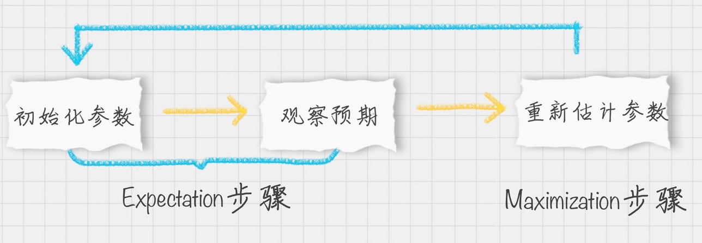

# EM 聚类

## 简介

EM（Expectation Maximization）最大期望算法

### 原理

EM 算法是一种采用最大似然估计方法来求参数的方法，它通过观测样本来找出样本的模型参数。EM 算法中的 E 步骤就是通过旧的参数来计算隐藏变量。然后在 M 步骤中，通过得到的隐藏变量的结果来重新估计参数。直到参数不再发生变化，得到想要的结果。

 E 步骤就是通过旧的参数来计算隐藏变量。然后在 M 步则是通过得到的隐藏变量的结果来重新估计参数。直到参数不再发生变化，得到我们想要的结果。

### vs. KNN

K-Means 是通过距离来区分样本之间的差别的，且每个样本在计算的时候只能属于一个分类，称之为是硬聚类算法。而 EM 聚类在求解的过程中，实际上每个样本都有一定的概率和每个聚类相关，叫做软聚类算法。

## 框架

EM 算法是一个框架，在这个框架中可以采用不同的模型来用 EM 进行求解

### GMM 

GMM（Gaussian Mixed Model）高斯混合模型是通过概率密度来进行聚类，聚成的类符合高斯分布（正态分布）。

GMM 可以给出一个样本对于所有类别的概率。GMM不仅仅可以用于聚类，还可以用于概率密度的估计，也可以用于生成新的样本。GMM是一个生成模型，它假设数据是从多个高斯分布中生成的，可以这样理解生成流程：有 K 个高斯分布，赋予每一个分布一个权重，每当生成一个数据时，就按权重的比例随机选择一个分布，然后按照该分布生成数据。

### HMM 隐马尔科夫模型

HMM 用到了马尔可夫过程，在这个过程中，我们通过状态转移矩阵来计算状态转移的概率。HMM 在自然语言处理和语音识别领域中有广泛的应用。

