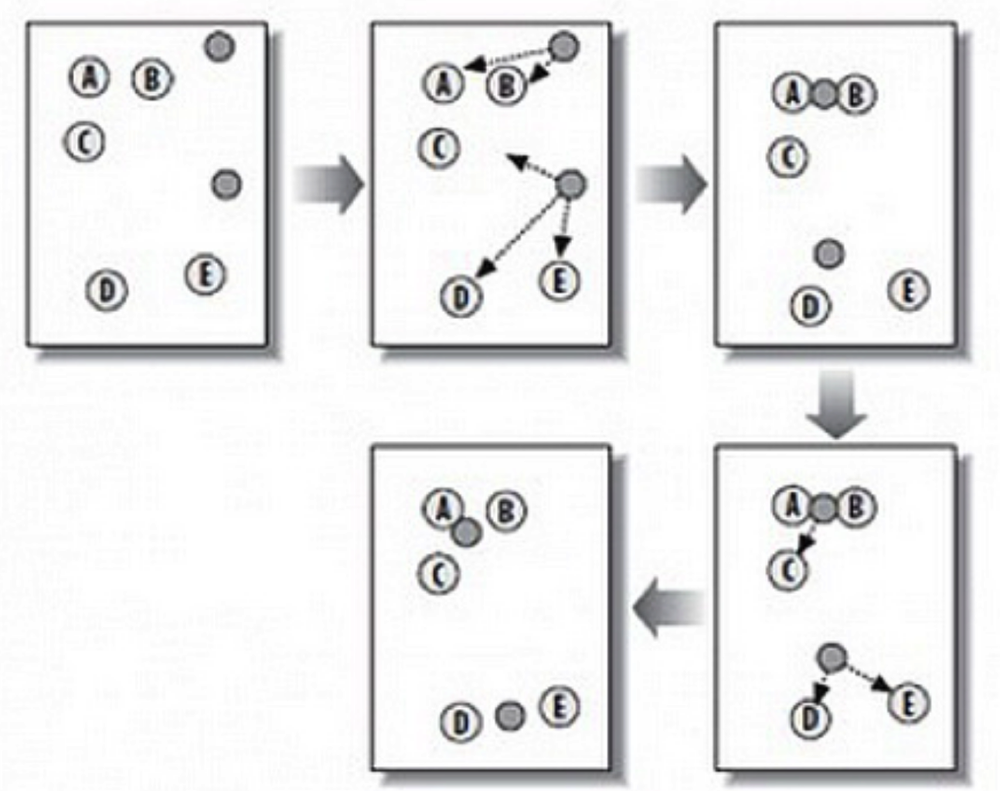

# K-means

K-means 聚类（K-means Clustering）

## 简介

K-means 是一种在给定分组个数后，能够对数据进行自动归类的聚类算法。

## 算法

- 第 1 步：随机在图中取 K 个种子点，图中 K=2，即图中的实心小圆点。
- 第 2 步：求图中所有点到这 K 个种子点的距离，假如一个点离种子点 X 最近，那么这个点属于 X 点群。在图中，可以看到 A、B 属于上方的种子点，C、D、E 属于中部的种子点。
- 第 3 步：对已经分好组的两组数据，分别求其中心点。对于图中二维平面上的数据，求中心点最简单暴力的算法就是对当前同一个分组中所有点的 X 坐标和 Y 坐标分别求平均值，得到的 就是中心点。
- 第 4 步：重复第 2 步和第 3 步，直到每个分组的中心点不再移动。这时候，距每个中心点最近的点数据聚类为同一组数据。

