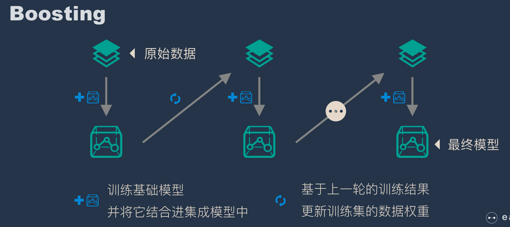

# 集成学习

## 套袋法-Bagging（Bootstrap aggregating）

### 简介

Bagging 的核心思路是民主，Bagging 的思路是所有基础模型都一致对待，每个基础模型手里都只有一票，然后使用民主投票的方式得到最终的结果。大部分情况下，经过 bagging 得到的结果方差（variance）更小。

- 从原始样本集中抽取训练集。每轮从原始样本集中使用Bootstraping的方法抽取n个训练样本（在训练集中，有些样本可能被多次抽取到，而有些样本可能一次都没有被抽中）。共进行k轮抽取，得到k个训练集。（k个训练集之间是相互独立的）
- 每次使用一个训练集得到一个模型，k个训练集共得到k个模型。（注：这里并没有具体的分类算法或回归方法，我们可以根据具体问题采用不同的分类或回归方法，如决策树、感知器等）
- 对分类问题：将上步得到的k个模型采用投票的方式得到分类结果；对回归问题，计算上述模型的均值作为最后的结果。（所有模型的重要性相同）

### 算法

- [随机森林 = bagging + 决策树](random-forest.md)

## Boosting

Boosting 和 bagging 最本质的差别在于他对基础模型不是一致对待的，而是经过不停的考验和筛选来挑选出「精英」，然后给精英更多的投票权，表现不好的基础模型则给较少的投票权，然后综合所有人的投票得到最终结果。大部分情况下，经过 boosting 得到的结果偏差（bias）更小。

- 通过加法模型将基础模型进行线性的组合。
- 每一轮训练都提升那些错误率小的基础模型权重，同时减小错误率高的模型权重。
- 在每一轮改变训练数据的权值或概率分布，通过提高那些在前一轮被弱分类器分错样例的权值，减小前一轮分对样例的权值，来使得分类器对误分的数据有较好的效果。

### 算法

- Adaboost
- Gradient boosting 

