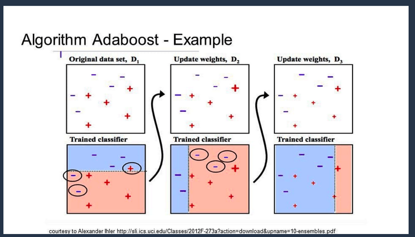

# AdaBoosting

## 简介

AdaBoost用于短决策树。在创建第一个树之后，每个训练实例上的树的性能用于加权创建的下一个树应该关注每个训练实例的注意力。难以预测的训练数据被赋予更多权重，而易于预测的实例被赋予更少的权重。模型一个接一个地顺序创建，每个模型更新训练实例上的权重，这些权重影响序列中下一个树所执行的学习。构建完所有树之后，将对新数据进行预测，并根据训练数据的准确性对每棵树的性能进行加权。因为通过算法如此关注纠正错误，所以必须删除带有异常值的干净数据。

