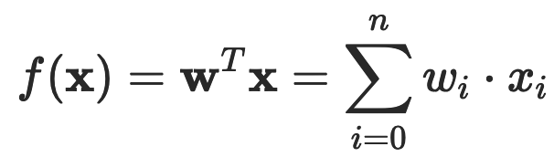
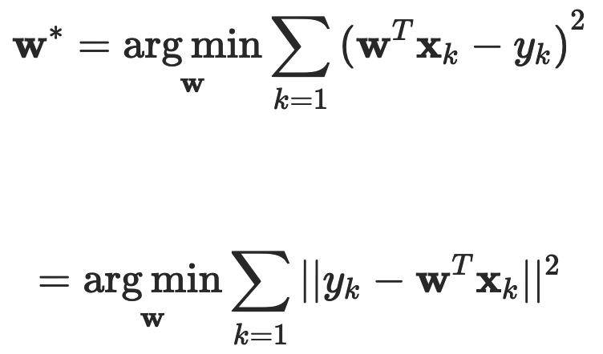

# 线性回归（Linear Regression）
适用于训练时间短、线性模型的场景。

## 简介

线性回归假设输出变量是若干输入变量的线性组合，并根据这一关系求解线性组合中的最优系数。

### 基本概念

假定一个实例可以用列向量 x=(x1;x2;⋯,xn) 表示，每个 xi 代表了实例在第 i 个属性上的取值，线性回归的作用就是习得一组参数 wi,i=0,1,⋯,n，使预测输出可以表示为以这组参数为权重的实例属性的线性组合。如果引入常量 x0=1，线性回归试图学习的模型就是：

### 最小二乘法

在训练集上确定系数 wi 时，预测输出 f(x) 和真实输出 y 之间的误差是关注的核心指标。在线性回归中，这一误差是以均方误差来定义的。当线性回归的模型为二维平面上的直线时，均方误差就是预测输出和真实输出之间的欧几里得距离，也就是两点间向量的 L2 范数。而以使均方误差取得最小值为目标的模型求解方法就是最小二乘法：

式中每个 xk 代表训练集中的一个样本。在单变量线性回归任务中，最小二乘法的作用就是找到一条直线，使所有样本到直线的欧式距离之和最小。

