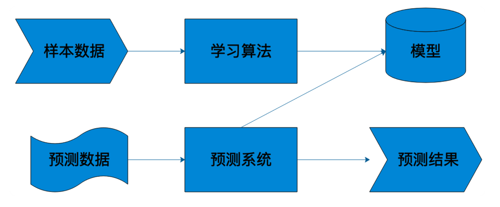
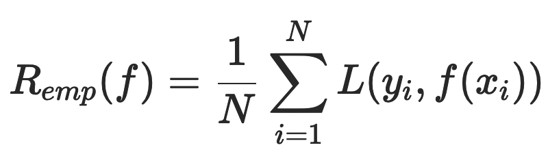
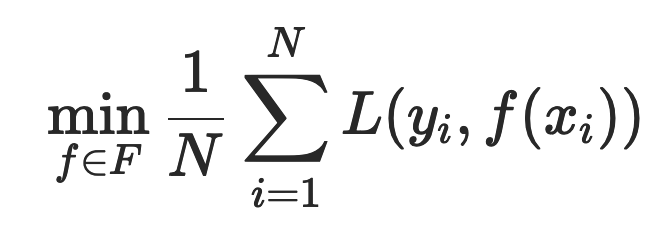

# 机器学习基础

## 简介

机器学习是计算机基于数据构建概率统计模型并运用模型对数据进行预测与分析的学科。

机器学习是从大量现象中提取反复出现的规律与模式。假设已有数据具有一定的统计特性，则不同的数据可以视为满足独立同分布的样本。机器学习要做的就是根据已有的训练数据推导出描述所有数据的模型，并根据得出的模型实现对未知的测试数据的最优预测。

学习器依赖已知数据对真实情况进行拟合，即由学习器得到的模型要尽可能逼近真实模型，因此要在训练数据集中尽可能提取出适用于所有未知数据的普适规律。

### 基本概念

- 属性：对于对象某些性质的描述。被描述的性质叫作属性，属性的取值称为属性值。
- 数据：不同的属性值有序排列得到的向量就是数据，也叫实例。
- 特征值：机器学习中的数据都可能有n维的维度，每个维度被称为一个特征值。
- 特征空间：机器学习中的数据都可能有n维的维度，从而组成了n维的特征空间。
- 特征向量：不同于线性代数中的“特征向量”，机器学习中的每个数据有n个特征值，这n个特征值组成的向量被称为特征向量，对应n维特征空间的一个点。
- 特征向量、特征空间：数据的不同属性之间可以视为相互独立，因而每个属性都代表了一个不同的维度，这些维度共同张成了特征空间。每一组属性值的集合都是这个空间中的一个点，因而每个实例都可以视为特征空间中的一个向量，即特征向量。
- 误差：误差被定义为学习器的实际预测输出与样本真实输出之间的差异。在分类问题中，常用的误差函数是错误率，即分类错误的样本占全部样本的比例。
  - 训练误差：指的是学习器在训练数据集上的误差，也称经验误差。训练误差描述的是输入属性与输出分类之间的相关性，能够判定给定的问题是不是一个容易学习的问题。
  - 测试误差：指的是学习器在新样本上的误差，也称泛化误差。测试误差则反映了学习器对未知的测试数据集的预测能力。
- 过拟合现象：把训练数据的特征错当做整体的特征。过拟合出现的原因通常是学习时模型包含的参数过多，从而导致训练误差较低但测试误差较高。
- 欠拟合现象：造成欠拟合的原因就是学习能力太弱，以致于训练数据的基本性质都没能学到。
- 交叉验证：重复利用有限的训练样本，通过将数据切分成若干子集，让不同的子集分别组成训练集与测试集，并在此基础上反复进行训练、测试和模型选择，达到最优效果。

### 基本流程

利用样本数据经过算法训练得到模型，这个模型会和预测系统部署在一起，当外部需要预测的数据到达预测系统的时候，预测系统调用模型，就可以立即计算出预测结果。

#### 样本

样本就是通常我们常说的“训练数据”，包括输入和结果两部分。比如我们要做一个自动化新闻分类的机器学习系统，对于采集的每一篇新闻，能够自动发送到对应新闻分类频道里面，比如体育、军事、财经等。这时候我们就需要批量的新闻和其对应的分类类别作为训练数据。通常随机选取一批现成的新闻素材就可以，但是分类需要人手工进行标注，也就是需要有人阅读每篇新闻，根据其内容打上对应的分类标签。

数学上，样本通常表示为：T=(x1,y1),(x2,y2),…,(xn,yn)其中 xn 表示一个输入，比如一篇新闻；yn  表示一个结果，比如这篇新闻对应的类别。样本的数量和质量对机器学习的效果至关重要，如果样本量太少或者样本分布不均衡，对训练出来的模型就有很大的影响。

#### 模型

**模型就是映射样本输入与样本结果的函数 f**，可能是一个条件概率分布，也可能是一个决策函数。一个具体的机器学习系统所有可能的函数构成了模型的**假设空间**，数学表示是：``F=f∣Y=f(X)``。其中 X 是样本输入，Y 是样本输出，f 就是建立 X 和 Y 映射关系的函数，**所有 f 的可能结果构成了模型的假设空间 F**。很多时候 F 的函数类型是明确的，需要计算的是函数的参数，比如确定 f 函数为一个线性函数，那么 f 的函数表示就可以写为：``y=a1x+a0`` 这时候需要计算的就是 a1 和 a0 两个参数的值。这种情况下模型的假设空间的数学表示是：``F={f∣Y=fθ(X),θ∈Rn}``其中 θ 为 f 函数的参数取值空间，一个 n 维欧氏空间，被称作参数空间。

#### 算法

算法就是要从模型的假设空间中寻找一个最优的函数，使得样本空间的输入 X 经过该函数的映射得到的 f(X)，和真实的 Y  值之间的距离最小。这个最优的函数通常没办法直接计算得到，即没有解析解，需要用数值计算的方法不断迭代求解。因此如何寻找到 f  函数的全局最优解，以及使寻找过程尽量高效，就构成了机器学习的算法。如何保证 f 函数或者 f  函数的参数空间最接近最优解，就是算法的策略。

机器学习中用损失函数来评估模型是否最接近最优解。损失函数用来计算模型预测值与真实值的差距，常用的有  0-1  损失函数、平方损失函数、绝对损失函数、对数损失函数等。以平方损失函数为例，损失函数如下：``L(Y,f(X))=(Y−f(X))^2``。对于一个给定的样本数据集T={(x1,y1),(x2,y2),…,(xn,yn)}，模型 f(X)  相对于真实值的平均损失为每个样本的损失函数的求和平均值：

这个值被称作经验风险，如果样本量足够大，那么使经验风险最小的 f 函数就是模型的最优解，即求：

## 

### 输入/输出类型

在实际的机器学习任务中，根据输入输出类型的不同，预测问题可以分为以下三类：

- 分类问题：输出变量为有限个离散变量，当个数为 2 时即为最简单的二分类问题。分类也是大数据常见的应用场景之一，通过对历史数据规律的统计，将大量数据进行分类然后发现数据之间的关系。这样当有新的数据进来时，计算机就可以利用这个关系自动进行分类了，从而使这个分类结果被证实。
- 回归问题：输入变量和输出变量均为连续变量；
- 标注问题：输入变量和输出变量均为变量序列。

### 学习类型

- 监督学习：基于已知类别的训练数据进行学习。监督学习假定训练数据满足独立同分布的条件，并根据训练数据学习出一个由输入到输出的映射模型。反映这一映射关系的模型可能有无数种，所有模型共同构成了假设空间。监督学习的任务就是在假设空间中根据特定的误差准则找到最优的模型。
  - 生成方法是根据输入数据和输出数据之间的联合概率分布确定条件概率分布 P(Y∣X)，这种方法表示了输入 X 与输出 Y 之间的生成关系；
  - 判别方法则直接学习条件概率分布 P(Y∣X) 或决策函数 f(X)，这种方法表示了根据输入 X 得出输出 Y 的预测方法。
- 无监督学习：基于未知类别的训练数据进行学习；
- 半监督学习：同时使用已知类别和未知类别的训练数据进行学习。