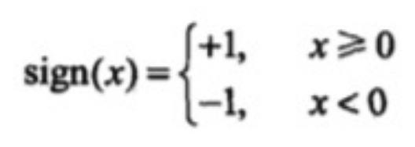

# Perceptron（感知器）

## 简介

感知机是一种比较简单的二分类模型，将输入特征分类为 +1、-1 两类。二维平面上的点只有两个输入特征（横轴坐标和纵轴坐标），一条直线就可以分类。如果输入数据有更多维度的特征，那么就需要建立同样多维度的模型，高维度上的分类模型也被称为超平面。

## 模型

感知机模型如下：``f(x)=sign(w⋅x+b)``

其中 x 代表输入的特征空间向量，输出空间是{-1, +1}，w 为权值向量，b 叫作偏置，sign 是一个符号函数：

w⋅x+b=0 为超平面的方程：当感知机输出为  +1 表示输入值在超平面的上方，当感知机输出为 -1 表示输入值在超平面的下方。训练感知机模型就是要计算出 w 和 b  的值，当有新的数据需要分类的时候，输入感知机模型就可以计算出 +1 或者 -1 从而进行分类。

## 损失函数

偏差之和就是感知机的损失函数：

其中 M 为误分类点集合，误分类点越少，损失函数的值越小；如果没有误分类点，损失函数值为 0。求模型的参数 w 和 b，就是求损失函数的极小值。

机器学习采用梯度下降法求损失函数极小值，实质上就是求导过程的数值计算方法。对于误分类点集合 M，损失函数 L(w,b) 变化的梯度，就是某个函数变量的变化引起的函数值的变化，根据感知机损失函数可知：

使用梯度下降更新 w 和 b，不断迭代使损失函数 L(w,b) 不断减小，直到为 0，也就是没有误分类点。感知机算法的实现过程：

- 1. 选择初始值 w0,b0。
  2. 在样本集合中选择样本数据 xi,yi。
  3. 如果 yi(w⋅xi+b)<0，表示 yi 为误分类点，那么 w=w+ηyixi、b=b+ηyi，在梯度方向校正 w 和 b。其中 η 为步长，步长选择要适当，步长太长会导致每次计算调整太大出现震荡；步长太短又会导致收敛速度慢、计算时间长。
  4. 跳转回 2，直到样本集合中没有误分类点， 即全部样本数据 yi(w⋅xi+b)≥0。

