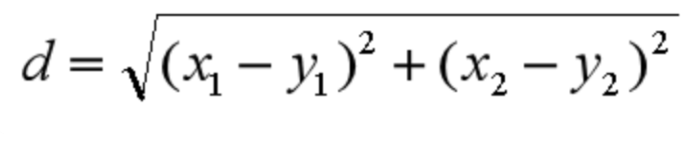
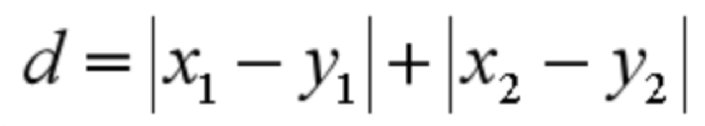
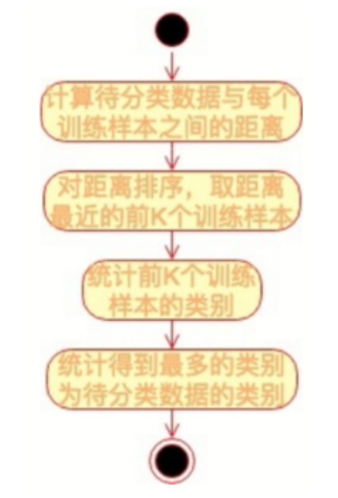

# KNN

KNN-K 近邻（K Nearest Neighbour）算法是基本的监督学习分类算法，用于多分类。

## 算法

对于一个需要分类的数据，将其和一组已经分类标注好的样本集合进行比较，得到距离最近的 K 个样本，K 个样本最多归属的类别就是这个需要分类数据的类别。整个计算过程分为三步：

- 计算待分类物体与其他物体之间的距离；
- 统计距离最近的 K 个邻居；
- 对于 K 个最近的邻居，它们属于哪个分类最多，待分类物体就属于哪一类。

### 距离计算

KNN 算法的关键是要比较需要分类的数据与样本数据之间的距离，通常的做法是：提取数据的特征值，根据特征值组成一个 n 维实数向量空间（特征空间），然后计算向量之间的空间距离。空间之间的距离计算方法有很多种，常用的有欧氏距离、余弦距离等。

关于距离的计算方式有下面五种方式：

- 欧氏距离：
- 曼哈顿距离：
- 闵可夫斯基距离：
- 切比雪夫距离：
- 余弦距离：

对于数据 x_i 和 x_j，若其特征空间为 n 维实数向量空间 R^n，即 x_i=(x_i1,x_i2,…,x_in)，xj=(x_j1,x_j2,…,x_jn)，则其欧氏距离计算公式为：

在文本数据以及用户评价数据的机器学习中，更常用的距离计算方法是余弦相似度：。余弦相似度其实是计算向量的夹角，余弦相似度更关注数据的相似性。余弦相似度的值越接近 1 表示其越相似，越接近 0 表示其差异越大

### 损失函数

与大部分算法相比，KNN 没有显示的训练过程，它仅仅把训练样本保存起来，训练时间开销为 0。

## 回归

KNN 不仅可以做分类，还可以做回归。要预测某个属性值，会先计算待测点到已知点的距离，选择距离最近的 K 个点，那么它的特征值就是这 k 个点的该属性值的平均值

