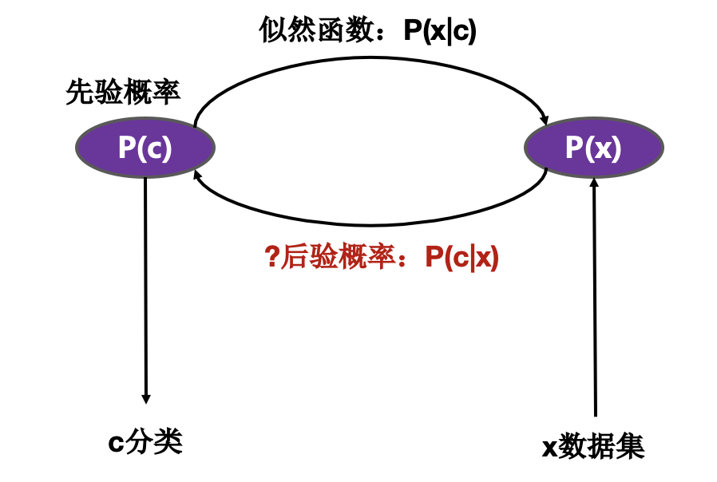
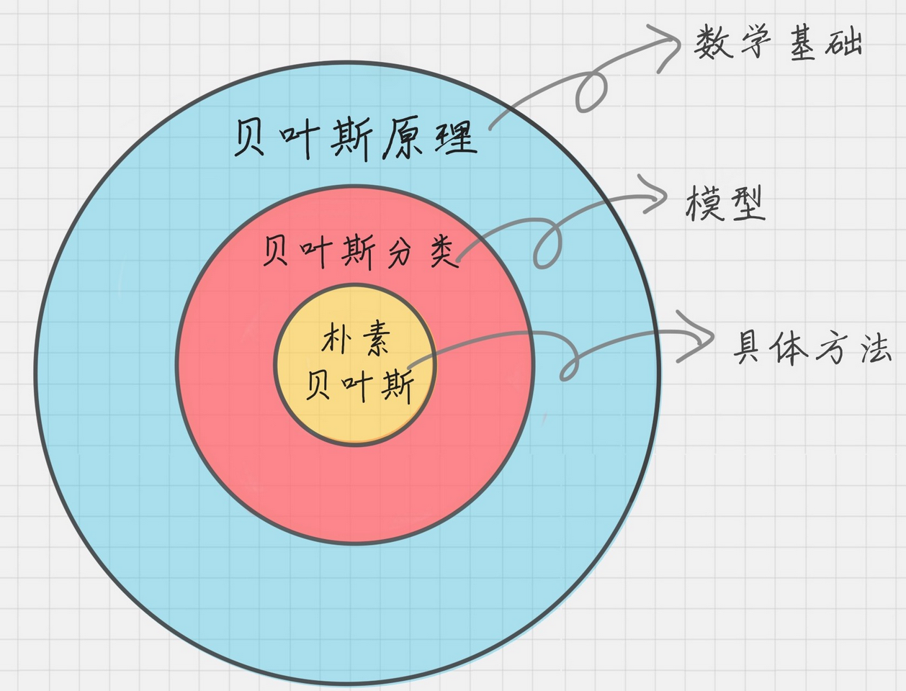
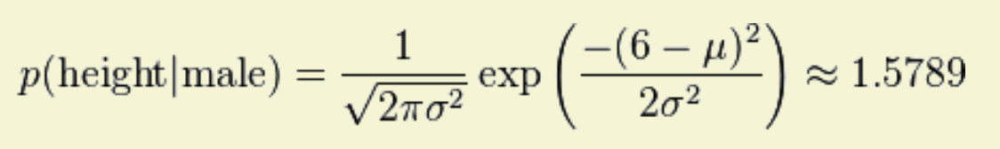

# 贝叶斯分类

在所有的机器学习分类算法中，朴素贝叶斯和其他绝大多数的分类算法都不同。对于大多数的分类算法，比如决策树、KNN、逻辑回归、SVM 支持向量机等，都是判别式方法，也就是直接学习出特征输出 Y 和特征 X 之间的关系，要么是决策函数 𝑌=𝑓(𝑋)，要么是条件分布 𝑃(𝑌|𝑋)。但是朴素贝叶斯却是生成式方法，采用统计学计算每种分类的概率。也就是直接找出特征输出 Y 和特征 X 的联合分布 𝑃(𝑋,𝑌)，然后用 𝑃(𝑌|𝑋)=𝑃(𝑋,𝑌)/𝑃(𝑋) 得出。

## 简介

贝叶斯原理是英国数学家托马斯·贝叶斯提出的，贝叶斯原理跟我们的生活联系非常紧密。举个例子，如果你看到一个人总是花钱，那么会推断这个人多半是个有钱人。当然这也不是绝对，也就是说，当你不能准确预知一个事物本质的时候，你可以依靠和事物本质相关的事件来进行判断，如果事情发生的频次多，则证明这个属性更有可能存在。贝叶斯为了解决一个叫“逆向概率”问题，所谓“逆向概率”是相对“正向概率”而言。正向概率很容易理解，比如我们已经知道袋子里面有 N 个球，不是黑球就是白球，其中 M  个是黑球，那么把手伸进去摸一个球，就能知道摸出黑球的概率是多少。但这种情况往往是上帝视角，即了解了事情的全貌再做判断。在现实生活中，我们很难知道事情的全貌。贝叶斯则从实际场景出发，提了一个问题：如果我们事先不知道袋子里面黑球和白球的比例，而是通过我们摸出来的球的颜色，能判断出袋子里面黑白球的比例么？这是因为，贝叶斯原理与其他统计学推断方法截然不同，它是建立在主观判断的基础上：在不了解所有客观事实的情况下，同样可以先估计一个值，然后根据实际结果不断进行修正。

### 贝叶斯原理

- 条件概率：事件 A 在另外一个事件 B 已经发生条件下的发生概率，表示为 P(A|B)，读作“在 B 发生的条件下 A 发生的概率”。
- 先验概率：事情发生的实际概率。比如南方的梅雨季是 6-7 月，就是通过往年的气候总结出来的经验，这个时候下雨的概率就比其他时间高出很多。
- 似然函数（likelihood  function）：可以把概率模型的训练过程理解为求参数估计的过程。举个例子，如果一个硬币在 10 次抛落中正面均朝上。那么你肯定在想，这个硬币是均匀的可能性是多少？这里硬币均匀就是个参数，似然函数就是用来衡量这个模型的参数。似然在这里就是可能性的意思，它是关于统计参数的函数。
- 后验概率：后验概率就是发生结果之后，推测原因的概率，它是属于条件概率的一种。

贝叶斯原理就是求解后验概率：$P(c_i|x)=\frac{P(c_i)P(x|c_i)}{P(c_1)P(x|c_1)+P(c_2)P(x|c_2)}$。

- 先验概率：$P(c_1）、P(c_2)$  是类别概率，也就是观测值
- 似然函数：$P(x|c_1)、P(x|c_2)$ 是条件概率
- 后验概率：$P(c_1|x)、P(c_2|x)$ 是无法观测的条件概率

### 贝叶斯分类

在所有相关概率都已知的情况下，贝叶斯分类是考虑如何基于这些概率来选择最优的类别标记。用 p1(x,y) 表示数据点 (x,y) 属于类别 1 的概率，用 p2(x,y) 表示数据点 (x,y) 属于类别 2 的概率，那么对于一个新数据点 (x,y)，可以用下面的规则来判断它的类别: 

- 如果 p1(x,y) > p2(x,y) ，那么类别为1
- 如果 p2(x,y) > p1(x,y) ，那么类别为2

也就是说，会选择高概率对应的类别。这就是贝叶斯决策理论的核心思想，即选择具有最高概率的决策。使用 p1() 和 p2() 只是为了尽可能简化描述，真正需要计算和比较的是 p(c1|x, y) 和 p(c2|x, y) 。这些符号所代表的具体意义是: 给定某个由 x、y  表示的数据点，那么该数据点来自类别 c1 的概率是多少？数据点来自类别 c2 的概率又是多少？注意这些概率与概率 p(x, y|c1)  并不一样，不过可以使用贝叶斯准则来交换概率中条件与结果。具体地，应用贝叶斯准则得到：$P(c_i|x)=\frac{P(c_i)P(x|c_i)}{P(c_1)P(x|c_1)+P(c_2)P(x|c_2)}$。

使用上面这些定义，可以定义贝叶斯分类准则为:

- 如果 P(c1|x, y) > P(c2|x, y)，那么属于类别 c1。
- 如果 P(c2|x, y) > P(c1|x, y)，那么属于类别 c2。

### 例子

贝叶斯分类的一个典型的应用场合是垃圾邮件分类，通过对样本邮件的统计，我们知道每个词在邮件中出现的概率 $P(A_i)$，我们也知道正常邮件概率 $P(B_0)$ 和垃圾邮件的概率 $P(B_1)$，还可以统计出垃圾邮件中各个词的出现概率 $P(A_i∣B_1)$，那么现在一封新邮件到来，我们就可以根据邮件中出现的词计算 $P(B_1∣A_i) = P(B_1) * P(A_i∣B_1) / P(A_i)$，即得到这些词出现情况下，邮件为垃圾邮件的概率，进而判断邮件是否为垃圾邮件。

### 优缺点
- 优点: 在数据较少的情况下仍然有效，可以处理多类别问题。
- 缺点: 对于输入数据的准备方式较为敏感。
- 适用数据类型: 标称型数据。

## 算法

### 数据集

- $X\in R^n$
- $Y$：类型

### 表示：假设

采用贝叶斯：$P(c_1|x)=\frac{P(c_1)P(x|c_1)}{P(x)}=\frac{P(c_1)P(x|c_1)}{P(c_1)P(x|c_1)+P(c_2)P(x|c_2)}$。

对于二分类问题，如果 $P(c_1|x)>0.5$ 则为 $c_1$，否则为 $c_2$。

### 评估

估算概率，所以不需要。

### 优化：学习算法

因为$P(c_i|x)=\frac{P(c_i)P(x|c_i)}{P(c_1)P(x|c_1)+P(c_2)P(x|c_2)}$，贝叶斯分类问题就转化为如何基于训练数据 D 来估计先验概率 $P(c)$ 和似然概率 $P(x|c)$。

#### 先验概率 $P(c)$

表示样本空间中各类样本所占的比例

- 假设 1：训练集中不同类型样本独立且具有相同类型的分布
- 假设 2：根据大数定律，当训练集中不同类型包含充足的样本
- 结论：$P(c)$ 可以通过各类样本的频率来进行统计估计

#### 似然函数 $P(x|c)$ 

类型为 c 的数据的分布，也就是 c 的值为 $x_1,x_2,\dots,x_n$ 的概率/比例/频率/分布各为多少。由于 x 所有特征的所有可能值组合数远远大于样本数，很多样本取值没出现在训练集中，直接使用训练集频率来估计 $P(x|c)$ 不可行。整个算法的核心就转变为如何基于训练集来计算 $P(x|c)$。

##### 单属性

  - 假设 1：$D_c$ 为训练集 D 中第 c 类样本的集合，假设每个类别的样本都独立且具有相同的分布，该分布通过参数 $\theta_c$ 来确定 $D_c$ 的分布。
  - 假设 2：假设获得训练集样本的似然（可能性）最大，也就是运用了MLE 最大似然法来估算参数 $\theta_c$ 。
    - $D_c$ 数据的似然（概率）为：$P(D_c|\theta_c)=\Pi_{x\in D_c}P(x|\theta_c)$
    - 找到 $\hat\theta_c$ 使 $D_c$ 的似然最大：$\hat\theta_c=argmax_{\theta_c}\displaystyle\sum_{x\in D_c}logP(x|\theta_c)$

目前问题的核心变为如何获取第 c 类样本属性值的假设分布，针对不同数据类型的特征属性，可以采用不同分布假设。假设训练集样本 $D_c$ 符合某种分布：

- Bernoulli 分布：特征变量是布尔变量，符合 0/1 分布，如在文档分类中单词是否出现。伯努利朴素贝叶斯是以文件为粒度，如果该单词在某文件中出现了即为 1，否则为 0。
- 多项式分布：特征变量是离散变量，符合多项分布，如在文档分类中一个单词出现的次数，或者是单词的 TF-IDF 值等。多项式朴素贝叶斯是以单词为粒度，会计算在某个文件中的具体次数。如为 **Bernoulli** 或 **多项式分布**：则每个属性值的概率即为样本中出现的频率。
- 高斯/正态分布：特征变量是连续变量，符合高斯分布，如人的身高、物体的长度。高斯朴素贝叶斯适合处理特征变量是连续变量，且符合高斯/正态分布的情况。则 $\hat\theta_c$ 为 $\mu_c,\sigma_c$，通过 MLE 可得 $\hat\mu_c=\frac{1}{|D_c|}\displaystyle \sum_{x\in D_c}x$ 时最大，也就是得到正态分布的所有参数，如均值就是样本的平均值时似然最大。

结论：

- 如果训练集样本为 Bernoulli 或多项式分布，则 $P(x_i|c)$ 可以通过样本中每个属性值的平均值求得。
- 如果训练集样本为连续正态分布，则 $P(x_i|c)$ 可用之前估算得来 $P(x|\theta_c)$求得。

##### 多属性：朴素贝叶斯分类

以上的算法只能用于训练样本只有单个属性，当存在多个属性时，$P(x|c)$ 是所有属性的联合概率，难以求解。针对多属性可以采用朴素贝叶斯分类（Naive Bayes Classifier），被称为朴素，因为它假设每个输入变量是独立的。这是一个强有力的假设，对于实际数据是不现实的，然而，该技术对于大范围的复杂问题非常有效。

朴素贝叶斯分类器（Naive Bayes Classifier）采用了“属性条件独立性假设”，假设所有属性相互独立。基于此假设，有：$P(c|x)=\frac{P(c)P(x|c)}{P(x)}=\frac{P(c)}{P(x)}\Pi_{i=1}^{d}P(x_i|c)$，其中 $d$ 为属性数目，$x_i$ 为 x 在第 i 个属性上的取值。因此，在使用朴素贝叶斯分类器时，需要为每个分类的每个特征属性单独估算。

从上式可以看出，这个很难的条件分布大大的简化了，但是这也可能带来预测的不准确性。但如果特征之间非常不独立怎么办？如果真是非常不独立，那就尽量不要使用朴素贝叶斯模型，考虑使用其他的分类方法比较好。但是一般情况下，样本的特征之间独立这个条件的确是弱成立的，尤其是数据量非常大的时候。虽然我们牺牲了准确性，但是得到的好处是模型的条件分布的计算大大简化了，这就是贝叶斯模型的选择。

###### 拉普拉斯修正

对于多项式分布，在以上公式中，若某个属性值未在样本中出现（为0），则造成整体 $P(c|x)$ 为 0，不合理。为此可采取“拉普拉斯修正”实现“平滑”，具体表现为：$\hat P(c)=\frac{|D_c|+1}{|D|+N}$，$\hat P(x_i|c)=\frac{|D_{c,x_i}|+1}{|D_c|+N_i}$，其中 N 为分类 c 的个数，而 $N_i$ 为某 c 类中属性值的个数。

## 举例

### 性别预测（正态）

性别　　身高（英尺）　体重（磅）　　脚掌（英寸）

 　男 　　　6 　　　　　　180　　　　　12 
 　男 　　　5.92　　　　　190　　　　　11 
 　男 　　　5.58　　　　　170　　　　　12 
 　男 　　　5.92　　　　　165　　　　　10 
 　女 　　　5 　　　　　　100　　　　　6 
 　女 　　　5.5 　　　　　150　　　　　8 
 　女 　　　5.42　　　　　130　　　　　7 
 　女 　　　5.75　　　　　150　　　　　9  

已知某人身高6英尺、体重130磅，脚掌8英寸，请问该人是男是女？

采用贝叶斯分类器：$P(身高|性别)\times P(体重|性别)\times P(脚掌|性别)\times P(性别)$

因为所有特征属性都是连续值，所以对每个特征采用正态分布。计算得到男性的身高是均值 5.855、方差 0.035 的正态分布。所以，男性的身高为 6 英尺的概率的相对值等于 1.5789（大于1并没有关系，因为这里是密度函数的值，只用来反映各个值的相对可能性）。

计算每个似然函数的正态分布参数，最终获得：

-	$P(身高=6|男)\times P(体重=130|男)\times P(脚掌=8|男)\times P(男)= 6.1984\times e^{-9}$
- $P(身高=6|女)\times P(体重=130|女)\times P(脚掌=8|女)\times P(女)=5.3778\times e^{-4}$

因此判断为“女性”！

### 诊断（多项式）

  症状　　职业　　　疾病  
  打喷嚏　护士　　　感冒 
  打喷嚏　农夫　　　过敏 
  头痛　　建筑工人　脑震荡 
  头痛　　建筑工人　感冒 
  打喷嚏　教师　　　感冒 
  头痛　　教师　　　脑震荡   

现在又来了第七个病人，是一个打喷嚏的建筑工人。请问他患上感冒的概率有多大？

$P(c|x) = \frac{P(x|c) P(c)}{P(x)}$，c：疾病，x：$症状 \times 职业$ 

$P(感冒|打喷嚏 \times 建筑工人)=\frac{P(打喷嚏 \times 建筑工人|感冒)P(感冒)}{P(打喷嚏 \times 建筑工人)}=\frac{P(打喷嚏|感冒) \times P(建筑工人|感冒) \times P(感冒)}{P(打喷嚏) \times P(建筑工人)}$

- $P(打喷嚏|感冒)=2/3=0.66$
- $P(建筑工人|感冒)=1/3=0.33$
- $P(感冒)=3/6=0.5$
- $P(打喷嚏)=3/6=0.5$
- $P(建筑工人)=2/6=0.33$
- $P(感冒|打喷嚏 \times 建筑工人)=(0.66\times0.33\times0.5)/(0.5\times0.33)=0.66$ 

## Lab

### 贝叶斯算法实现

构建一个快速过滤器来屏蔽在线社区留言板上的侮辱性言论。如果某条留言使用了负面或者侮辱性的语言，那么就将该留言标识为内容不当。对此问题建立两个类别: 侮辱类和非侮辱类，使用 1 和 0 分别表示。

- [朴素贝叶斯算法1](10_bayes-algorithm1.py)
- [朴素贝叶斯算法2](11_bayes-algorithm2.py)

### 应用

- [朴素贝叶斯分类](20_nb-classify.ipynb)

## Ref

1. [朴素贝叶斯分类器的应用](http://www.ruanyifeng.com/blog/2013/12/naive_bayes_classifier.html)
2. 