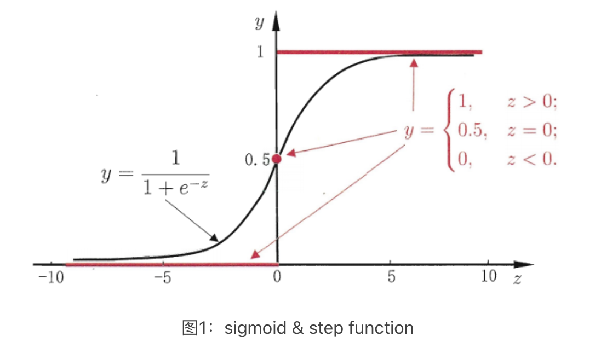

# 逻辑回归

## 简介

逻辑回归（Logistic Regression）虽然被称为回归，但实际是分类模型，并常用于二分类。逻辑回归用线性模型进行分类任务，它计算表示某件事情**发生的可能性**。比如：一封邮件是垃圾邮件的肯能性（是、不是），你购买一件商品的可能性（买、不买），广告被点击的可能性（点、不点）。**逻辑回归是基于概率分布来实现分类**。假设要实现一个二分类任务，0 即为不发生，1 即为发生。给定一些历史数据 X 和 Y，其中 X 代表样本的 n 个特征，Y 代表正例和负例，也就是 0 或 1 的取值。通过历史样本的学习，可以得到一个概率分布模型，当给定新的 x 样例时，可以预测出分类标签 y 的概率。这里得到的 y 是一个预测的概率，通常不是 0% 和 100%，而是中间的取值。那么就可以认为概率大于 50%  的时候为发生（正例），概率小于 50% 的时候不发生（负例），这样就完成了二分类的预测。

### 对数几率函数

逻辑回归有时也被称为对数几率回归，它用了和回归类似的方法来解决了分类问题。假设有一个二分类问题，输出为 $y\in\{ 0,1\}$，线性回归模型产生的预测值为 $z=w^Tx+b$ 是实数值。感知机使用阶跃函数来实现 z 值到 0/1 值的转化。然而阶跃函数不连续，因此希望有一个单调可微的函数来代替阶跃函数，因此采用了对数几率函数 $y=\frac{1}{1+e^{-z}}$ ，两者对比如下图。

从广义线性模型的角度，也就是用对数几率函数 $y=\frac{1}{1+e^{-z}}$ 作为广义线性模型的联系函数。所以逻辑回归实际上是在用线性回归模型的预测结果去逼近真实标记的对数几率 $ln \frac{y}{1-y}$。

### 逻辑回归 vs. 感知机

简单的逻辑回归和感知机类似，都是数据 x 乘上一个系数矩阵 w 得到一个数 y。两者的区别在于逻辑回归的激活函数是连续的对数几率函数，而感知机的激活函数一般是不连续的阶跃函数 sign()、relu()。

感知机因为激活函数不连续，其损失函数可能有多种方法，可能有多层感知机，但他们本质的思想都是使预测的结果与真实结果误差更小，通过函数拟合求得分类超平面。逻辑回归的损失函数由最大似然估值法推导而来，**力图使预测概率分布与真实概率分布接近**。

## 算法

逻辑回归的核心是在一组点中，找出误分类的点的概率总和最小的超平面。相较于感知机，逻辑回归认为点到超平面的距离不是确定的，而是一个概率分布。因此逻辑回归计算的不是距离最小，而是使训练集点到超平面距离的概率最大（最大似然估计法）。

### 数据集

#### X：伯努利分布

#### Y：逻辑分布

有了对数几率函数之后，Y 空间的取值在 [0,1]，就可以将其视为类别 1 的后验概率估计 $p(y=1∣x)$。可理解为如果有了一个测试点 x，那么就可以用对数几率函数算出的结果来当做该点 x 属于类别 1 的概率。非常自然地把对数几率函数计算得到的值大于等于 0.5 的归为类别 1，小于 0.5 的归为类别 0，而这种概率的分布被称为逻辑分布。

### 表示：假设

逻辑分布是一种连续型的概率分布，其数学表示为：$h(x)=\frac{1}{1+e^{-(𝜃x-\mu)/\gamma}}$，常用到的 Sigmoid() 函数就是逻辑分布函数在 $\mu=0、\gamma=1$ 的特殊形式。

#### 直观解释

逻辑回归模型主要用于分类问题，与感知机相似，它也包含 3 层：

- 输入处理层：接收外部信号后做线性叠加，可以表示为 $z=𝜃x=w^Tx+b=w_1x_1+w_2x_2+\dots+w_nx_n+b$。
- 激活函数层：采用对数几率函数 $y=\frac{1}{1+e^{-z}}$
- 阈值判断层：结果 $>0.5$ 为类 1，$<0.5$ 为类 0。

逻辑回归的本质是在在决策边界之上加了分类概率 $P(Y=1|x)$，其思路是：

$f(x)=P(Y=1|x)=\frac{1}{1+e^{-(𝜃x-\mu)/\gamma}}$，表示分到分类 1 的概率与输入向量 x 的直接关系。如常采用的 Sigmoid 函数，则可表示为：$P(Y=1|x)=\frac{1}{1+e^{-(𝜃x)}}$。也就是说，输出 $Y=1$ 的对数几率是由输入 x 的线性函数表示的模型，这就是逻辑回归模型。

### 评估

#### 损失函数：样本出现概率

当前样本出现概率：$[p(x_i)]^{y_i}[1-p(x_i)]^{1-y_i}$。

#### 代价函数：交叉熵

从非连续数据集推导出连续函数很难，概率类损失（代价）函数通常采用最大似然估计法来求解假设 h 的系数 𝜃，使得在这组稀疏下似然值最大、也就是损失函数最小。即当前数据样本出现的概率最高时，就得到了 Y 的概率分布函数。

假设 $P(Y=1|x)=p(x)$，$P(Y=0|x)=1-p(x)$。当前数据样本出现的概率（似然函数）为各个样本出现概率的乘积：$L(\theta)=\Pi[p(x_i)]^{y_i}[1-p(x_i)]^{1-y_i}$。

为了方便求解，两边同取对数后得到数据集的交叉熵为损失（代价）函数 𝐽(𝜃)：$J(\theta)=-lnL(\theta)=-\sum_{i=1}^n(y_ilnf_\theta(x_i)+(1-y_i)ln(1-f_\theta(x_i)))$。

### 优化：学习算法

其目标就变成最大化 $J(𝜃)$：$𝜃^*=argmax_{𝜃}J(𝜃)$ 。因为损失函数是continuous、differentiable、convex 但非线性，所以采用梯度下降法。

#### 梯度

求解过程为对损失函数求一阶导数：$\frac{J(𝜃)}{\partial 𝜃_j}=-\sum_{i=1}^{n}(y^{(i)}-f_𝜃(x^{(i)}))x_j^{(i)}$（计算步骤省略）。

#### 采样

##### 批量梯度下降

得到梯度下降法公式：$𝜃_j \leftarrow 𝜃_j+\eta\sum_{i=1}^{n}(y^{(i)}-f_𝜃(x^{(i)}))x_j^{(i)}$。

此式与线性回归时更新权重 𝜃 用的式子极为相似，也许这也是逻辑回归要在后面加上回归两个字的原因吧。

##### 随机梯度下降

在样本量极大的时候，每次更新权重会非常耗费时间，这时可以采用随机梯度下降法，这时每次迭代时需要将样本重新打乱，然后用下式不断更新权重。也就是去掉了求和，而是针对每个样本点都进行更新：$𝜃_j \leftarrow 𝜃_j+\eta(y^{(i)}-f_𝜃(x^{(i)}))x_j^{(i)}$ for i in range(n)。

## Lab

- [逻辑回归 Iris](20_iris-logistic-regression.ipynb)
- [逻辑回归](22_logistic-regression.ipynb)
- [逻辑回归 Digits](24_digits-logistic-regression.ipynb)

## Ref

1. [逻辑回归(logistic regression)的本质——极大似然估计](https://blog.csdn.net/zjuPeco/article/details/77165974)

