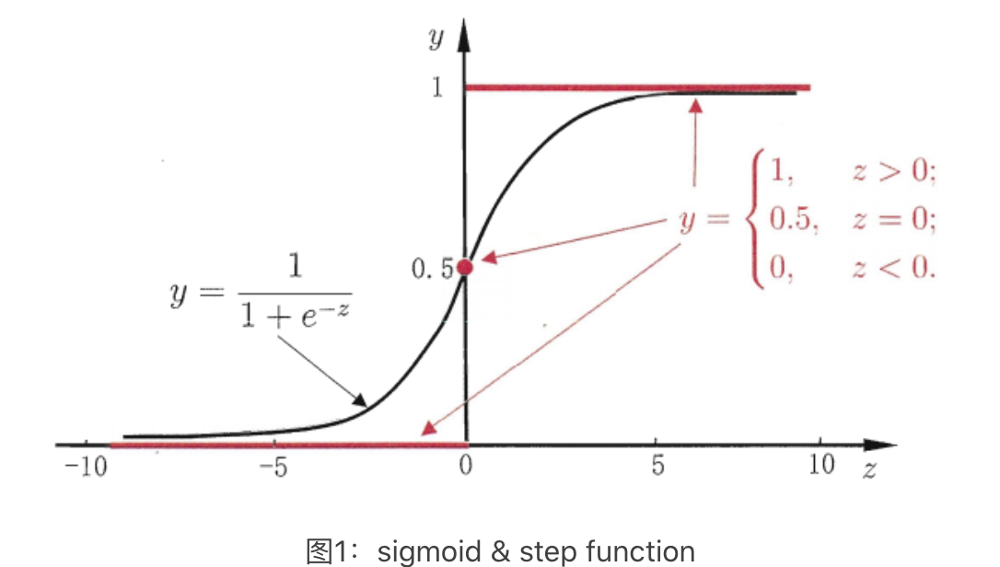
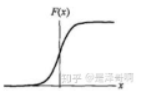
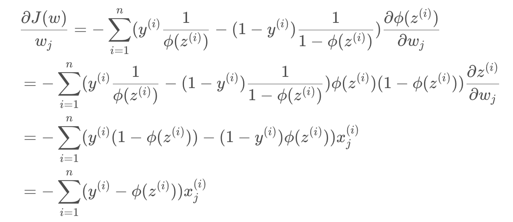

# 逻辑回归

## 简介

对于要分类的点，找出误分类概率最小的线，无线性可分假设。

逻辑回归（Logistic Regression）虽然被称为回归，但实际是分类模型，并常用于二分类。逻辑回归用线性模型进行分类任务，它计算表示某件事情**发生的可能性**。比如：一封邮件是垃圾邮件的肯能性（是、不是），你购买一件商品的可能性（买、不买），广告被点击的可能性（点、不点）。

**逻辑回归是基于概率分布来实现分类**。假设要实现一个二分类任务，0 即为不发生，1 即为发生。给定一些历史数据 X 和 Y，其中 X 代表样本的 n 个特征，Y 代表正例和负例，也就是 0 或 1 的取值。通过历史样本的学习，可以得到一个概率分布模型，当给定新的 x 样例时，可以预测出分类标签 y 的概率。这里得到的 y 是一个预测的概率，通常不是 0% 和 100%，而是中间的取值。那么就可以认为概率大于 50%  的时候为发生（正例），概率小于 50% 的时候不发生（负例），这样就完成了二分类的预测。

### 对数几率函数

逻辑回归有时也被称为对数几率回归，它用了和回归类似的方法来解决了分类问题。假设有一个二分类问题，输出为 $y\in\{ 0,1\}$，而线性回归模型产生的预测值为 $z=w^Tx+b$ 是实数值。感知机使用阶跃函数来实现 z 值到 0/1 值的转化。然而阶跃函数不连续，因此希望有一个单调可微的函数来代替阶跃函数，因此采用了对数几率函数 $y=\frac{1}{1+e^{-z}}$ ，两者的图像如下图所示。

从广义线性模型的角度，也就是用对数几率函数 $y=\frac{1}{1+e^{-z}}$ 作为广义线性模型的联系函数。所以**逻辑回归实际上是在用线性回归模型的预测结果**去逼近真实标记的对数几率 $ln \frac{y}{1-y}$。

### 逻辑分布

有了对数几率函数之后，由于其取值在 [0,1]，就可以将其视为类别 1 的后验概率估计 $p(y=1∣x)$。可理解为如果有了一个测试点 x，那么就可以用对数几率函数算出的结果来当做该点 x 属于类别 1 的概率。非常自然地把对数几率函数计算得到的值大于等于 0.5 的归为类别 1，小于 0.5 的归为类别 0，而这种概率的分布被称为逻辑分布。

逻辑分布是一种连续型的概率分布，其分布函数为：$F(x)=P(X<x)=\frac{1}{1+e^{-(x-\mu)/\gamma}}$，其图像为：。常用到的 Sigmoid() 函数就是逻辑分布函数在 $\mu=0、\gamma=1$ 的特殊形式。

### 逻辑回归 vs. 感知机

简单的逻辑回归和感知机类似，都是数据 x 乘上一个系数矩阵 w 得到一个数 y。两者的区别在于逻辑回归的激活函数是**连续**的对数几率函数而感知机的激活函数一般是**不连续**的阶跃函数 sign、relu。

感知机因为激活函数不连续，其损失函数可能有多种方法，可能有多层感知机，但他们本质的思想都是使预测的结果与真实结果误差更小，通过函数拟合求得分类超平面。逻辑回归的损失函数由最大似然估值法推导而来，力图使预测概率分布与真实概率分布接近。

## 算法

在一组点中，找出误分类的点的概率总和最小的超平面的那条线。相较于感知机，逻辑回归认为点到超平面的距离不是确定的，而是一个概率分布。因此逻辑回归计算的不是距离最小，而是使训练集点到超平面距离的概率最大（最大似然估计法）。

### 逻辑回归模型

逻辑回归模型主要用于分类问题，与感知机相似，它也包含 3 层：

- 输入处理层：接收外部信号后做线性叠加，可以表示为 $w^Tx+b=w_1x_1+w_2x_2+\dots+w_nx_n+b$。
- 激活函数层：采用对数几率函数 $y=\frac{1}{1+e^{-z}}$
- 阈值判断层：结果 $>0.5$ 为类 1，$<0.5$ 为类 2。

逻辑回归的本质是在在决策边界之上加了分类概率 $P(Y=1|x)$，其思路是：

$f(x)=P(Y=1|x)=\frac{1}{1+e^{-(x-\mu)/\gamma}}$，表示分到分类 1 的概率与输入向量 x 的直接关系。如常采用的 Sigmoid 函数，则可表示为：$P(Y=1|x)=\frac{1}{1+e^{-(w^Tx+b)}}$。也就是说，输出 $Y=1$ 的对数几率是由输入 x 的线性函数表示的模型，这就是**逻辑回归模型**。

### 损失函数

假设 $P(Y=1|x)=p(x)$，$P(Y=0|x)=1-p(x)$

逻辑回归模型的损失函数定义为：$L(\theta)=\Pi[p(x_i)]^{y_i}[1-p(x_i)]^{1-y_i}$

两边同取对数化简后得训练集的交叉熵：$J(\theta)=-lnL(\theta)=-\sum_{i=1}^n(y_ilnf_\theta(x_i)+(1-y_i)ln(1-f_\theta(x_i)))$

### 损失函数求解

概率类损失函数通常采用最大似然估计法来求解参数 $\theta(w、b)$，使得在这组参数下似然值最大、也就是损失函数最小。其目标就变成最大化 $J(w,b)$：$w^*,b^*=arg  max_{w,b}J(w,b)$ 

#### 批量梯度下降

求解过程为对损失求一阶导数：$\frac{J(w,b)}{\partial w_j}=-\sum_{i=1}^{n}(y^{(i)}-f_{w,b}(x^{(i)}))x_j^{(i)}$

得到梯度下降法公式：$w_j \leftarrow w_j+\eta\sum_{i=1}^{n}(y^{(i)}-f_{w,b}(x^{(i)})x_j^{(i)}$

此式与线性回归时更新权重用的式子极为相似，也许这也是逻辑回归要在后面加上回归两个字的原因吧。

#### 随机梯度下降

在样本量极大的时候，每次更新权重会非常耗费时间，这时可以采用随机梯度下降法，这时每次迭代时需要将样本重新打乱，然后用下式不断更新权重。也就是去掉了求和，而是针对每个样本点都进行更新：$w_j \leftarrow w_j+\eta(y^{(i)}-f_{w,b}(x^{(i)})x_j^{(i)}$ for i in range(n)

## Ref

1. [逻辑回归(logistic regression)的本质——极大似然估计](https://blog.csdn.net/zjuPeco/article/details/77165974)

