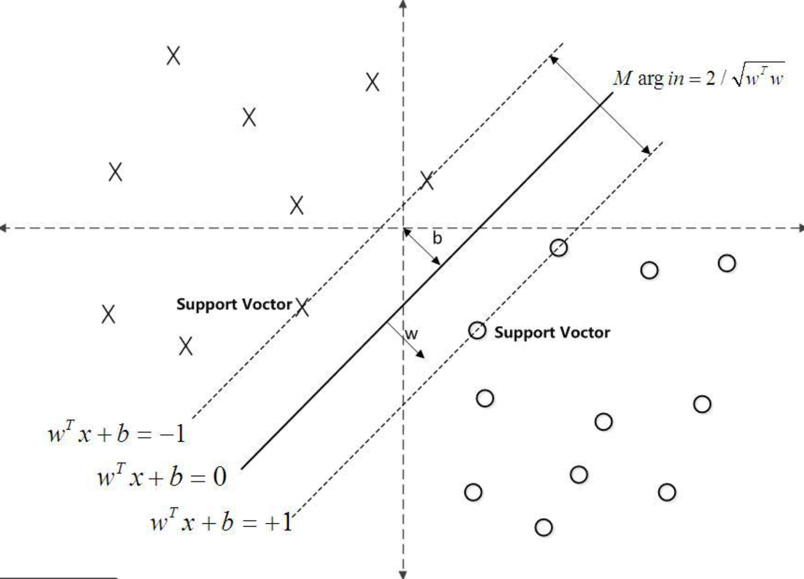
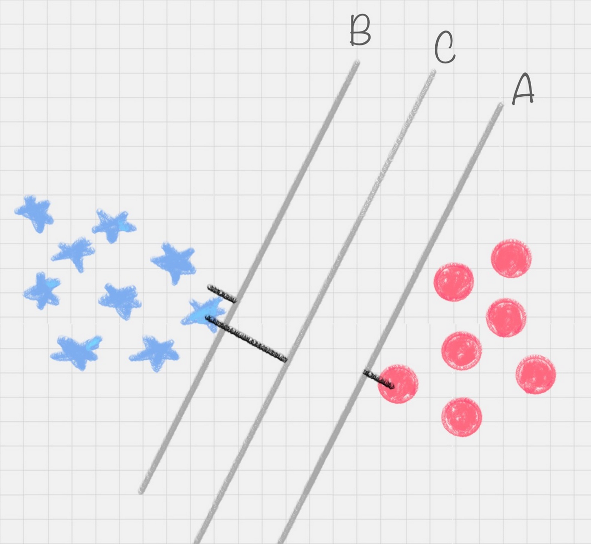
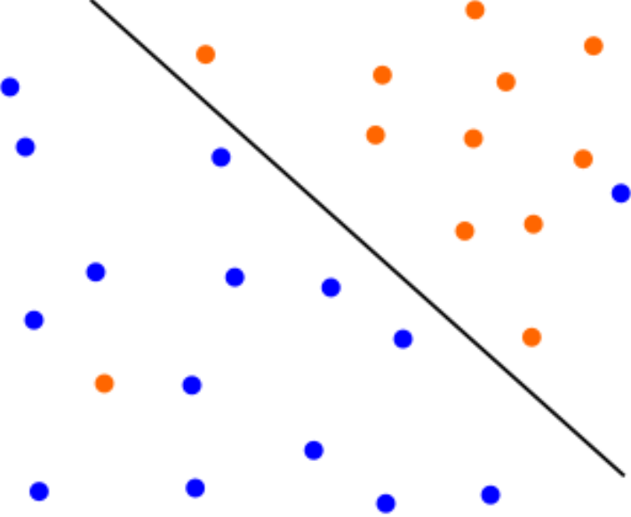
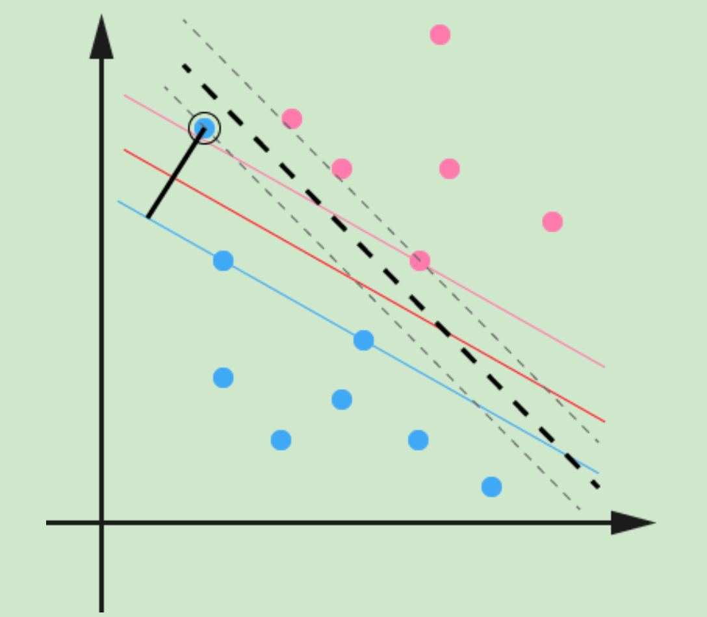

# SVM

## 简介

支持向量机（SVM - Support Vecor  Machine）虽然诞生只有短短的二十多年，但是自一诞生便由于它良好的分类性能席卷了机器学习领域，并牢牢压制了神经网络领域好多年。如果不考虑集成学习的算法，不考虑特定的训练数据集，在分类算法中的表现 SVM 说是排第一估计是没有什么异议的。SVM 是一个二元分类算法，线性分类和非线性分类都支持。经过演进，现在也可以支持多元分类，同时经过扩展，也能应用于回归问题。

对于要分类的点，SVM 找出分类间隔最大的那条钱，但假设前提是要分类的点**线性可分**。在SVM中，选择超平面以最佳地将输入变量空间中的点与它们的类（0级或1级）分开，所以主要是针对**二分类**。在二维中，可以将其视为一条线，并假设所有输入点都可以被这条线完全分开。

### 术语

- 支持向量（Support Vector）就是离分隔超平面最近的那些点。
- 机（Machine）就是表示一种算法，而不是表示机器。
- 分类间隔：在保证决策面不变，且分类不产生错误的情况下，可以移动决策面 C，直到产生两个极限的位置：决策面 A 和决策面 B。极限的位置是指，如果越过了这个位置，就会产生分类错误。这样的话，两个极限位置 A 和 B 之间的分界线 C 就是最优决策面。极限位置到最优决策面 C 之间的距离，就是“分类间隔”。如果转动这个最优决策面，会发现可能存在多个最优决策面都能把数据集正确分开，这些最优决策面的分类间隔可能是不同的，而那个拥有“最大间隔”的决策面就是 SVM 要找的最优解。

### 原理

感知机的分类原理就是尝试找到一条直线，能够把二元数据隔离开。放到三维空间或者更高维的空间，感知机尝试找到一个超平面，能够把所有的二元类别隔离开。对于这个分离的超平面，定义为 $𝑤^𝑇𝑥+𝑏=0$。在超平面上方的点定义为 𝑦=1，在超平面下方的点定义为 𝑦=−1。可以看出满足这个条件的超平面并不止一个，这么多的可以分类的超平面，哪个是最好的呢？或者说哪个是泛化能力最强的呢?

在感知机模型中，可以找到多个可以分类的超平面将数据分开，并且优化时希望所有的点都被准确分类。但是实际上离超平面很远的点已经被正确分类，它对超平面的位置没有影响。最重要的是那些离超平面很近的点，这些点很容易被误分类。如果可以让离超平面比较近的点尽可能的远离超平面，最大化几何间隔，那么分类效果会更好一些，这也就是 SVM 的思想。

分离超平面为 $𝑤^𝑇𝑥+𝑏=0$ ，如果所有的样本不光可以被超平面分开，还和超平面保持一定的函数距离，那么这样的分类超平面是比感知机的分类超平面优的。可以证明，这样的超平面只有一个。和超平面平行的保持一定的函数距离的这两个超平面对应的向量，被定义为支持向量，如下图虚线所示。

SVM 通过绘制决策边界来区分类。在创建决策边界之前，将每个观察值（或数据点）绘制在 n 维空间中（n 是所使用特征的数量）。 例如，如果使用"长度"和"宽度"对不同的"单元格"进行分类，则观察结果将绘制在二维空间中，并且决策边界为一条线。如果使用 3 个特征，则决策边界是 3 维空间中的平面。 如果使用 3 个以上的特征，则决策边界将变成一个很难可视化的超平面。

SVM学习算法找到导致超平面最好地分离类的系数。决策边界以与支持向量的距离最大的方式绘制。 如果决策边界距离支持向量太近，它将对噪声高度敏感并且不能很好地泛化。 即使自变量的很小变化也可能导致分类错误。超平面与最近数据点之间的距离称为边距。可以将两个类分开的最佳或最佳超平面是具有最大边距的线，只有这些点与定义超平面和分类器的构造有关，这些点称为支持向量。它们支持或定义超平面。对于 SVM 来说，它是最大化两个类别边距的那种方式，换句话说：超平面（在本例中是一条线）对每个类别最近的元素距离最远。

SVM 就是找到一个超平面，这个超平面能将不同的样本划分开，同时使得样本集中的点到这个分类超平面的最小距离（即分类间隔）最大化。在这个过程中，支持向量就是离分类超平面最近的样本点，实际上如果确定了支持向量也就确定了这个超平面。所以支持向量决定了分类间隔到底是多少，而在最大间隔以外的样本点，其实对分类都没有意义。

## 算法

### 数据集

- $X\in R^n$
- $Y=\{-1,+1\}$

### 表示：假设

假设超平面 $w^Tx+b=0$ 能够将训练样本正确分类。

如果超平面能正确二分类，则对于 $(x_i,y_i)\in D$，若 $y_i=+1$ 则有 $w^Tx_i+b>0$；若 $y_i=-1$，则有 $w^Tx_i+b<0$。

### 评估

#### 损失函数

样本空间任一点 x 到超平面的距离为：$r=\frac{|w^Tx+b|}{|w|}$。

令 $$\begin{cases}
w^Tx_i+b\geq+1,& y_i=+1\\
w^Tx_i+b\leq-1,& y_i=-1
\end{cases}$$

距离超平面最近的样本，也就是使得等号成立的样本，它们被称为“支持向量”，两个异类支持向量到超平面的距离之和被称为“间隔” $r=\frac{2}{|w|}$。

### 优化：学习算法

#### 硬间隔

SVM 就是为了找到具有最大间隔的划分超平面，也就是找到 w、b，使得间隔最大 $max_{w,b}\frac{2}{|w|}$，因此可以推出支持向量机的模型 $min_{w,b}\frac{1}{2}|w|^2$。

#### 软间隔

##### 问题

有时候本来数据的确是可分的，也就是说可以用线性分类 SVM 的学习方法来求解，但是却因为混入了异常点，导致不能线性可分。比如下图，本来数据是可以按下面的实线来做超平面分离的，可以由于一个橙色和一个蓝色的异常点导致**线性不可分**。

另外一种情况没有这么糟糕到不可分，但是会严重影响模型的泛化预测效果。比如下图，本来如果不考虑异常点，SVM 的超平面应该是下图中的红色线所示，但是由于有一个蓝色的异常点，导致学习到的超平面是下图中的粗虚线所示，这样会严重影响的分类模型预测效果。

##### 定义

所谓的软间隔，是相对于硬间隔说的，可以认为线性分类 SVM 的学习方法属于硬间隔最大化。软间隔引入了一个松弛变量 $𝜉_𝑖≥0$，使函数间隔加上松弛变量大于等于1，也就是说：

$𝑦_𝑖(𝑤∙𝑥_𝑖+𝑏)≥1−𝜉_𝑖$。

对比硬间隔最大化，可以看到软间隔对样本到超平面的函数距离的要求放松了，之前是一定要大于等于 1，现在只需要加上一个大于等于 0 的松弛变量能大于等于 1 就可以了。

## 核函数

### 原理

数据点并非总是线性可分离。在这些情况下，SVM 使用内核技巧来测量较高维空间中数据点的相似性（或接近度），以使它们线性可分离。它将样本从原始空间映射到一个更高维的特征空间中，使得样本在新的空间中线性可分。这样就可以使用原来的推导来进行计算，只是所有的推导是在新的空间，而不是在原来的空间中进行。如果原本的空间是有限维，那么就一定存在一个高维特征空间使样本可分。

<!--内核功能是一种相似性度量，输入是原始要素，输出是新要素空间中的相似性度量，这里的相似度表示紧密度，实际上将数据点转换为高维特征空间是一项昂贵的操作，该算法实际上并未将数据点转换为新的高维特征空间。内核化SVM无需实际进行变换就可以根据高维特征空间中的相似性度量来计算决策边界。在维数大于样本数的情况下，SVM特别有效。 找到决策边界时，SVM使用训练点的子集而不是所有点，从而提高了存储效率。 另一方面，大型数据集的训练时间会增加，这会对性能产生负面影响。-->

所以在非线性 SVM 中，核函数的选择就是影响 SVM 最大的变量。最常用的核函数有线性核、多项式核、高斯核、拉普拉斯核、sigmoid 核或这些核函数的组合。这些函数的区别在于映射方式的不同。通过这些核函数，就可以把样本空间投射到新的高维空间中。

### 模型

令 $\phi(x)$ 表示将 x 映射后的特征向量，于是新的超平面可以表示为：$f(x)=w^T\phi(x)+b$。

## 支持向量回归

支持向量回归 SVR（Support Vector Regression）假设能容忍 $f(x)$ 与 y 之间有最多 $\epsilon$ 的偏差，即仅当 $f(x)$ 与 y 之间的差别绝对值大于 $\epsilon$ 时才计算损失。

## Lab

- [SVM 分类](20_svm-classify.ipynb)
- [SVM 分类 Brest](22_svm-brest-classify.ipynb)
- [SVM 分类 高斯](24_gaussian-svm-classify.ipynb)
