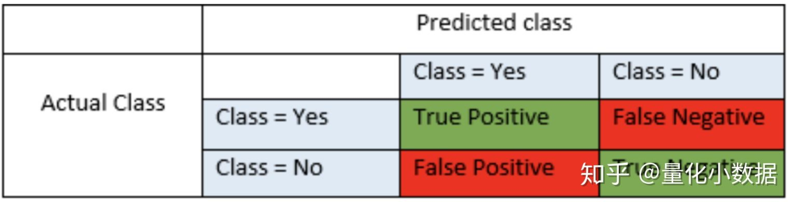
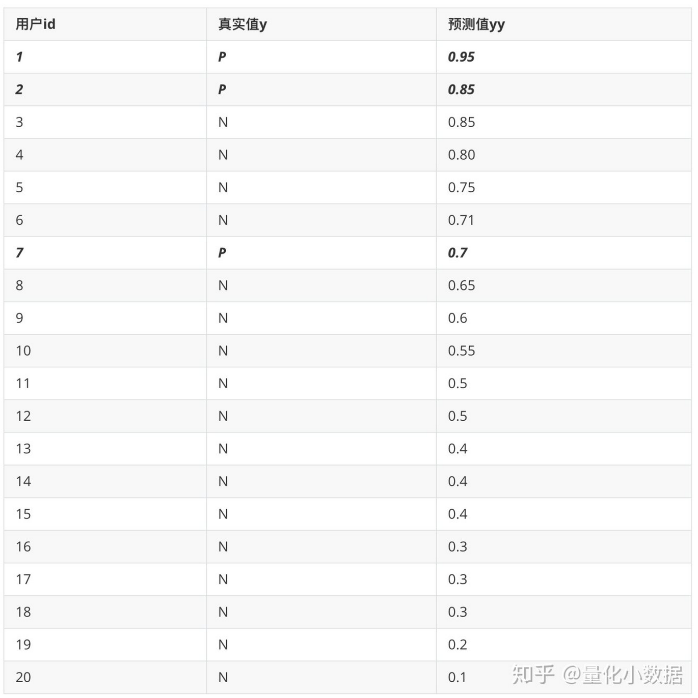
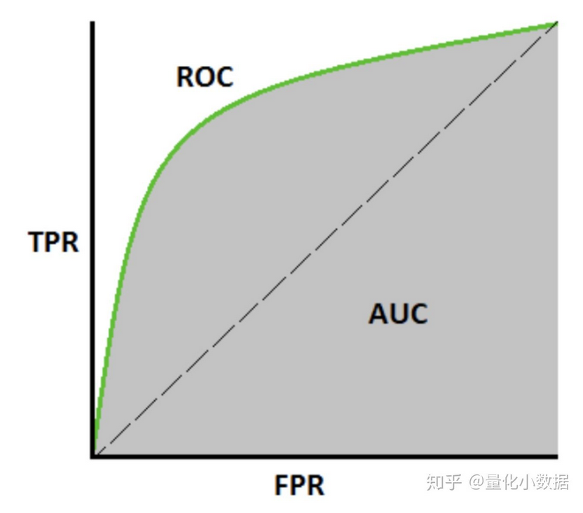
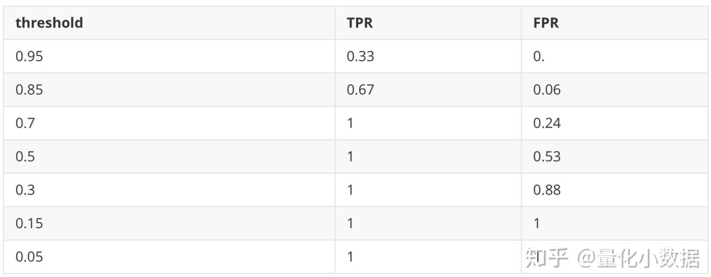
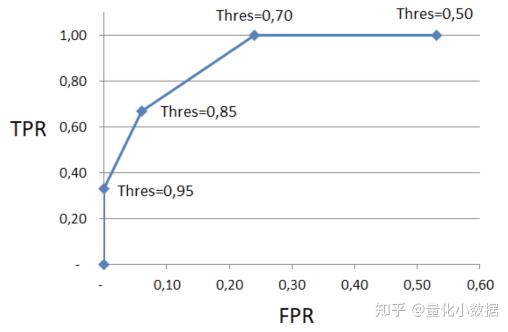
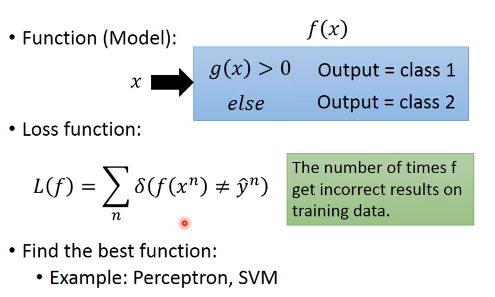

# 分类算法

## 简介

## Metrics

### Accuracy

Accuracy 是最直观、最常用的分类器评价指标，说白了就是该模型有多少比例的结果预测对了，无论预测对了正例（TP）还是反例（TN）。

Accuracy 是一个简单指标，只适用于数据分布平均的数据集，例如用于辨识性别，由于世界上男女数量大致相等，如果 Accuracy 高，说明这个模型是可以正确分辨性别的。但不适用于数据分布不均的数据集，例如用于辨识游戏中的作弊用户。假设1万名玩家中，有1位是作弊用户（TP），即便模型什么都没有学习到，模型只用回答所有玩家都不是作弊玩家，那么 Accuracy 依然高达 9999/10000=99.99%。

### LogLoss

### AUC ROC

AUC-ROC 指标用于解决 Accuracy 中数据集分布不均的问题。

#### True/False Positive/Negative

True Positive（TP）, True Negative（TN） 都是正确的预测。False Positive（FP）, False Negative（FN） 都是错误的预测。

- True/False：表示预测值与实际值是否相同
- Positive/Negative：表示预测值为 Yes 还是 No
- precision 查准率：在全部被预测为正例（P）的数据中，有多少是真正的正例（TP）？即TP/(TP + FP)，主要用来预测的准不准确了，体现为"准"。
- recall 查全率：全部事实正例（P）中，有多少被正确的预测？即TP/(TP + FN) ，主要用来观察在全部正例集合中，有多少能被预测出来，体现为"全"。

例如，以检测游戏中的作弊玩家为例，模型的输出是 0～1 的闭区间中的一个数字 yy，我们认为当 yy 大于某个 threshold 值时，该玩家被预测为作弊玩家。反之，yy 小于该 threshold 值，该玩家为非作弊玩家。

选用不同的 threshold 得到的 accuracy、recall、precision都是不一样的。在二分类问题中，输出 yy 的值介于 0～1 之间。比如可以假设 threshold=0.7，表格中加黑斜体的部分就是 TP，用户 id3，4，5，6 就是 FP，从而得到当 threshold=0.7 时，

- accuracy =（3 + 13）/20 = 0.8
- precision = 3 / （3+4）= 0.43
- recall = 3 / 3 = 1

AUC（Area Under Curve）用于二分类器，AUC as the probability of object pairs to be correctly ordered by our model。它就是为了反映在不同的 threshold 下，得到的 TPR（TP rate） 和 FPR（FP rate）的情况：
- TPR = TP / P = recall
- FPR = FP / N  （某种程度上，FPR是错误分类的"recall"）

ROC代表（Receiver Operating  Characteristics）：如图，ROC 是通过将不同 threshold 的 x 轴（FPR）和 y 轴（TPR）的点连接而成的曲线，  AUC 就是 ROC下的面积。AUC 的另一个解释是分类错误的对在所有对中的比例。

设置不同的threshold，可以得到如下结果：

将FPR当作x轴，TPR当作Y轴，可以绘制出：

上面的曲线就是ROC曲线。TPR、FPR的值也都是 0～1 之间，故AUC的最大值为1。在实际使用中，类似tensorflow/sklearn/R之类的类库或语言，都会自动调整 threshold 来计算 AUC。最终得到的 AUC 数值，即 ROC 曲线下的面积，AUC 越接近于 1，说明这个二分类器越好。

### 常用算法

分类（Classification）与回归最大的区别在于，不同的分类之前没有任何关联。

- 逻辑回归：常用
- 朴素贝叶斯（Naive Bayes）：用于 NLP
- 支持向量机 SVM（Support Vector Classifier）：中小型数据集表现好
- 决策树（Decision Tree Classifier）：常用
- 随机森林（Random Forest）：
- K-近邻算法 KNN（K-Nearest Neighbors）：较少用

## 算法

## 多分类器拓展

### 一对多法

假设我们要把物体分成  A、B、C、D 四种分类，那么我们可以先把其中的一类作为分类 1，其他类统一归为分类 2。这样我们可以构造 4 种 SVM，分别为以下的情况：

- 样本 A 作为正集，B，C，D 作为负集；
- 样本 B 作为正集，A，C，D 作为负集；
- 样本 C  作为正集，A，B，D 作为负集；
- 样本 D 作为正集，A，B，C 作为负集。

这种方法，针对 K 个分类，需要训练 K  个分类器，分类速度较快，但训练速度较慢，因为每个分类器都需要对全部样本进行训练，而且负样本数量远大于正样本数量，会造成样本不对称的情况，而且当增加新的分类，比如第 K+1 类时，需要重新对分类器进行构造。

### 一对一法

一对一法的初衷是想在训练的时候更加灵活。可以在任意两类样本之间构造一个 SVM，这样针对 K 类的样本，就会有 C(k,2) 类分类器。比如我们想要划分 A、B、C 三个类，可以构造 3 个分类器：

- 分类器  1：A、B；
- 分类器 2：A、C；
- 分类器 3：B、C。

当对一个未知样本进行分类时，每一个分类器都会有一个分类结果，即为 1 票，最终得票最多的类别就是整个未知样本的类别。这样做的好处是，如果新增一类，不需要重新训练所有的  SVM，只需要训练和新增这一类样本的分类器。而且这种方式在训练单个 SVM 模型的时候，训练速度快。但这种方法的不足在于，分类器的个数与 K  的平方成正比，所以当 K 较大时，训练和测试的时间会比较慢。

## 