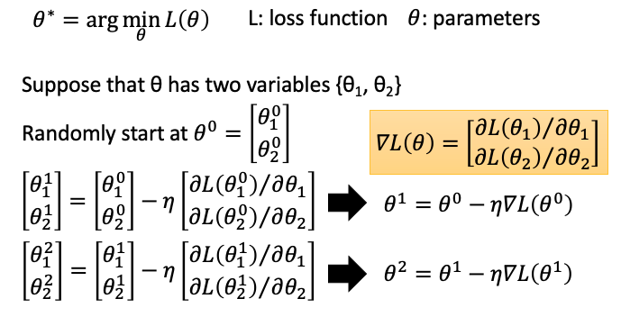

# 线性回归
## 简介

说到回归，一般都是指线性回归（linear regression）。线性回归是一种有监督的学习算法，它通过对数据拟合线性方程，尝试对连续目标变量和一个或多个自变量之间的关系进行建模。为了使线性回归成为一个不错的选择，自变量和目标变量之间必须存在线性关系。

线性回归意味着可以将输入项分别乘以一些常量，再将结果加起来得到输出。线性回归假设特征和结果满足线性关系。其实线性关系的表达能力非常强大，每个特征对结果的影响强弱可以由前面的参数体现，而且每个特征变量可以首先映射到一个函数，然后再参与线性计算，这样就可以表达特征与结果之间的非线性关系。

线性回归本来是是统计学里的概念，现在经常被用在机器学习中。如果 2 个或者多个变量之间存在“线性关系”，那么就可以通过历史数据摸清变量之间的“套路”，建立一个有效的模型，来预测未来的变量结果。线性回归假设输出变量是若干输入变量的线性组合，并根据这一关系求解线性组合中的最优系数。

## 算法

### 模型定义

$x^{(i)}_j$表示数据集第 i 个数据的第 j 个属性取值。

线性回归模型定义为：$f(x)=wx+b$，其中 $w$ 称为 x 的系数，b 称为偏置项。

也可表示为：$f(x)=w_0 + w_1x_1 + w_2x_2 + ... + w_nx_n$。

如果用矩阵来表示就是 $f(x) = \theta ^TX$，其中：$\theta=\left[ \begin{matrix} w_0 \\ w_1 \\ \vdots \\ w_n \end{matrix} \right]$ 是所要求得一系列参数，$X=\left[ \begin{matrix} 1 & x_1^{(1)} &\cdots & x_n^{(1)} \\ 1 & x_1^{(2)} &\cdots & x_n^{(2)} \\ \vdots \\ 1 & x_1^{(m)} &\cdots & x_n^{(m)} \end{matrix} \right]$ 是输入的数据矩阵，因为考虑用 $w_0$ 常数项代替 $b$，所以在 X 的第一列加上了一列 1。 $X$ 的一行可以看做一个完整的输入数据，n 代表一个数据有 n 个特征属性，m 行代表一共是 m 个数据。数据集标签（label set）为 $Y=\left[ \begin{matrix} y^{(1)} \\ y^{(2)} \\ \vdots \\ y^{(m)} \end{matrix} \right]$ 。

线性回归模型的目标就是找到一系列参数 $W$，使得 $f(x)=\theta^TX$ 尽可能地贴近 $Y$ 。也就是如图找到一条直线使得尽可能符合数据的分布，从而有一个新的样本点时，可利用学习得到的这条直线进行预测。

### 损失函数

在训练集上确定系数 $w、b$ 时，预测输出 $f(x)$ 和真实输出 $y$ 之间的误差是关注的核心指标。在线性回归中，这一误差是以均方误差 MSE（Mean Squart Error）来定义。当线性回归的模型为二维平面上的直线时，均方误差就是预测输出和真实输出之间的欧几里得距离。

其损失函数定义为：$L(w)=\frac{1}{m}\displaystyle\sum_{i=1}^{m}(f(x^{(i)})-y^{(i)})^2=\frac{1}{m}(XW-Y)^T(XW-Y)$

展开后得到：$L(w)=\frac{1}{m}(W^TX^TXW-W^TX^Ty-y^TXW+y^Ty)=\frac{1}{m}(W^TX^TXW-2W^TX^Ty+y^Ty)$

### 概率解释

以下解释如何通过函数过渡到“概率分布”，用 MSE 作为线性模型的损失函数。

假设采用线性模型 $f(x)=\theta^TX$，把训练集的标签 $Y$ 代入模型，可获得：$y^{(i)}=\theta^Tx^{(i)}+\epsilon^{(i)}$，其中 $y^{(i)}$ 为真实训练标签值，$\theta^Tx^{(i)}$ 为基于训练数据样本的预测值，$\epsilon^{(i)}$ 为误差值。

训练模型和真实样本之间有误差，假设训练集量很大，其误差 $\sum\epsilon$ 满足高斯分布 $(\mu,\delta^2)$ ，且 $\mu=0$，所以高斯分布为 $(0,\delta^2)$，总体可写成：。

根据高斯分布，对于每个样本 x 都可以得到一个获得 y 值的概率 $p(y|x; \theta)$。**似然函数**的本质是描述出现这个情形的概率，最大化它即表示这个情形出现的概率最大，也就是认为出现训练集值的概率最大。又因为样本是独立分布的，对其求最大似然函数：$L(\theta)=\Pi_{i=1}^mP(y^{(i)}|x^{(i)};\theta)=\Pi_{i=1}^m\frac{1}{\sqrt{2\pi}\sigma}exp(-\frac{(y^{(i)}-\theta^Tx^{(i)})^2}{2\sigma^2})$ 。

化简最大似然函数后得：，也就得到了线性回归的 MSE 损失函数公式。

总结：根据“概率分布”的最大似然估计法，假设获取训练集的概率为最大，相应求出了损失函数为 MSE 公式。

### 求解损失函数

#### 最小二乘法

基于 MSE，通过矩阵运算来直接进行模型求解的过程被称为**最小二乘法**。在单变量线性回归任务中，最小二乘法的作用就是找到一条直线，使所有样本到直线的欧式距离之和最小。其数学表达式为：找出最佳的 $\theta 也就是w、b$ 使损失函数  $\theta=argmin_{\theta}(Y-X\theta)^T(Y-X\theta)$ 最小。

令 $E(\theta)=(Y-X\theta)^T(Y-X\theta)$，对 $\theta$ 求导得到：$\frac{\partial E(\theta)}{\partial \theta}=\frac{2X^T(X\theta-Y)}{m}=0$ ，可得：$\theta=(X^TX)^{-1}X^TY$。

- 当 $X^TX$ 为满秩矩阵或正定矩阵时，可使用正规方程法直接求得闭式解： $f(x_i)=x_i^T(X^TX)^{-1}X^T$Y。
- 但一般**$X^TX$ 不能满足满秩矩阵或正定矩阵的条件，此时可使用梯度下降法**。其迭代更新为：$\theta \leftarrow \theta - \alpha \frac{\partial E(\theta)}{\partial \theta}$，其中 $$\alpha$$ 是学习率，是一个梯度下降需要的超参数。可得到梯度下降迭代过程，即：$\theta \leftarrow \theta - \frac{2}{m}\alpha X^T(X\theta-Y)$。

#### 梯度下降法

非线性最小二乘法无闭式解，一般通过迭代的梯度下降法来求得。梯度下降法利用沿着梯度下降最快的方向求偏导数，得到损失函数的全局最小值时的参数。梯下降法在有些场景无法求出全局最小值，只能求出局部最小值，但是在线性回归领域可以求出全局最小值。

更通用些，把w、b 都看成统一变量 $θ$，则变成：

梯度下降法先假设一定点，然后按一定的步长顺着这个点的梯度进行更新，迭代下去，最后能找到一个局部最优点。具体操作方法为，任意选一个起始点 $θ^0$，移到 $θ^1 = θ^0 - η∇L(θ^0)$，再移到 $θ^2 = θ^1 – η∇L(θ^1)$，依次类推，直到获得最小值。

以样本与计算差 $h(x)-y$ 作为梯度：

##### 批量梯度下降法

批量梯度下降法（Batch gradient descent）每次迭代都需要用到训练集所有的数据，收敛速度较慢。其表达式为：$\theta_{i+1}\leftarrow \theta_i-\eta\sum_n(f_\theta(x^n)-y^n)x_i^n$。

##### 随机梯度下降法

随机梯度下降法（Stochastic gradient descent）也叫增量梯度下降法（Incremental gradient descent），随机梯度下降通过每个样本来迭代更新一次参数，可能未遍历整个样本就已经找到最优解，大大提高了算法的收敛速度。最小化每个样本的损失函数，虽然每次迭代结果不一定都是全局最优解，却总是沿着这个方向发展，故最终结果总是接近全局最优解。其表达式为：$\theta_{i+1}\leftarrow \theta_i-\eta(f_\theta(x^n)-y^n)x_i^n$。

#### 学习率

计算合理的学习率 $\eta$（learning rate），不能始终使用相同的 $\eta$。

- Vanilla gradient descent（以下的 w 可以理解为是 $\theta$）：$w^{t+1}\leftarrow w^t-\eta^tg^t$ 

- Adagrad

最终结果：

#### 特征放缩

特征放缩（Feautre Scaling）是把不同的特征放缩到差不多的数量级

## 过拟合/欠拟合

解决过拟合和欠拟合的方法是使用正则化项，也就是给损失函数加上一个参数项，正则化项有**L1正则化、L2正则化、ElasticNet**。加入这个正则化项好处：

- 控制参数幅度，不让模型“无法无天”。
- 限制参数搜索空间。
- 解决欠拟合与过拟合的问题。

### L2 正则化（Ridge 回归）

损失函数 $L=L_0 + \lambda \sum_w w^2$。 $L_0$ 表示原先的损失函数 ，在其基础上加入所有参数 $w$ 的平方和乘以 $\lambda$。

只要数据线性相关，用线性回归拟合的不是很好，**需要正则化**，可以考虑使用 L2 岭回归。如果输入特征的维度很高，而且是稀疏线性关系的话，L2 岭回归就不太合适，考虑使用 Lasso 回归。Ridge 回归在不抛弃任何一个变量的情况下缩小了回归系数，使得模型相对而言比较的稳定。但这会使得模型的变量特别多，模型解释性差。

### L1 正则化（Lasso 回归）

L1 正则化与 L2 正则化的区别在于惩罚项的不同：$L=L_0+\lambda(|w_1|+|w_2|)$。

L1 Lasso 回归可以使得一些特征的系数变小，甚至还使一些绝对值较小的系数直接变为 0，从而增强模型的泛化能力。对于高的特征数据，尤其是线性关系是稀疏的，就采用 L1 Lasso回归。或是要在一堆特征里面找出主要的特征，那么 L1 Lasso回归更是首选。

Lasso 回归使得一些系数变小，甚至还是一些绝对值较小的系数直接变为 0，因此特别适用于参数数目缩减与参数的选择，因而用来估计稀疏参数的线性模型。但 Lasso 回归有一个很大的问题，就是它的损失函数不是连续可导的，由于 L1 范数用的是绝对值之和，导致损失函数有不可导的点。也就是说最小二乘法、梯度下降法、牛顿法与拟牛顿法对它统统失效。那怎么才能求有这个 L1 范数的损失函数极小值呢？主要靠：两种全新的求极值解法：坐标轴下降法（Coordinate Descent）和最小角回归法（ Least Angle Regression， LARS）。

#### 坐标轴下降法

https://www.cnblogs.com/pinard/p/6018889.html

#### 最小角回归法

### ElasticNet 回归

ElasticNet 可以看做 Lasso 和 Ridge 的中庸化的产物。它也是对普通的线性回归做了正则化，但是它的损失函数既不全是 L1 的正则化，也不全是 L2 的正则化，而是用一个权重参数来平衡 L1 和 L2 正则化的比重。ElasticNet 综合了 L1 正则化项和 L2 正则化项：$min(\frac{1}{2m}[\sum_{i=1}^{m}(y‘=y_i)^2+\lambda\sum_j=1^n\theta_j^2]+\lambda\sum_{j=1}^n|\theta|)$

ElasticNet 在用 Lasso 回归太过（太多特征被稀疏为0），而 Ridge 回归不够（回归系数衰减太慢）的时候，可以考虑使用 ElasticNet 回归来综合，得到比较好的结果。

## 广义线性模型

### 简介

广义线性模型（generalized linear model）表示为 $y=g^{-1}(w^Tx+b)$，其中 $g(x)$ 称为联系函数（link function）。

### 对数线性回归

而对数函数是广义线性模型在 $g(x)=ln(x)$ 时的特例。对数线性回归（log-linear regression）是将输出标记的对数作为线性模型逼近的目标，即：$ln(y)=w^Tx+b$。它企图让 $e^{w^Tx+b}$ 逼近 y，实际上已是在求输入空间到输出空间的非线性映射。

## Lab

### 算法实现

- [算法1](10_linear-regression-algorithm1.py)
- [算法2](11_linear-regression-algorithm2.py)
- [算法3](19_linear-regression-algorithm.py)（未完成）

### 算法应用

#### 随机数据回归

- [随机数据回归](25_linear-regression.ipynb)

#### 房价预测

- [房价预测](30_houce-linear-regression.ipynb)

## Ref

1. [线性回归原理和实现基本认识](https://blog.csdn.net/lisi1129/article/details/68925799)
2. [线性回归原理及实现(Linear Regression)](https://www.jianshu.com/p/54d1c0c79588)