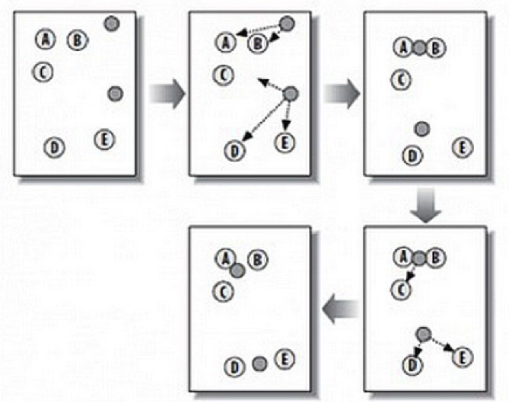

# K-means

## 简介

K-means 聚类，K 代表的是 K 簇，Means 代表的是中心，可以理解这个算法的本质是确定 K 簇的中心点，当找到了这些中心点也就完成了聚类。

K-means 是一种在给定分组个数后，能够对数据进行自动归类的聚类算法。K-Means 是发现给定数据集的 K 个簇的聚类算法，之所以称之为 `K-均值` 是因为它可以发现 K 个不同的簇，且每个簇的中心采用簇中所含值的均值计算而成。簇个数 K 是用户指定的，每一个簇通过其质心（centroid），即簇中所有点的中心来描述。

## 算法

### 损失函数

$E=\displaystyle \sum_{i=1}^{k}\sum_{x\in C_i}||x-\mu_i||_2^2$，其中$\mu_i=\frac{1}{|C_i|}\sum_{x\in C_i}x$ 是簇 $C_i$ 的均值向量。损失函数刻画了簇内样本围绕簇均值向量的紧密程度，E 值越小则簇内样本相似度越高。

### 步骤

K-Means 算法有自我纠正机制，在不断的迭代过程中，会纠正中心点。中心点在整个迭代过程中并不是唯一的，只是需要一个初始值，一般算法会随机设置初始的中心点。K-Means 的工作原理如下：

- 第 1 步：随机在图中取 K 个种子点，图中 K=2，即图中的实心小圆点。
- 第 2 步：求图中所有点到这 K 个种子点的距离，假如一个点离种子点 X 最近，那么这个点属于 X 点群。在图中，可以看到 A、B 属于上方的种子点，C、D、E 属于中部的种子点。
- 第 3 步：对已经分好组的两组数据，分别求其中心点。对于图中二维平面上的数据，求中心点最简单暴力的算法就是对当前同一个分组中所有点的 X 坐标和 Y 坐标分别求平均值，得到的 就是中心点。
- 第 4 步：重复第 2 步和第 3 步，直到每个分组的中心点不再移动或者达到最大迭代数。这时候，距每个中心点最近的点数据聚类为同一组数据。

## 优化

### 初始化优化 K-Means++

k 个初始化的质心的位置选择对最后的聚类结果和运行时间都有很大的影响，因此需要选择合适的 k 个质心。如果仅仅是完全随机的选择，有可能导致算法收敛很慢。K-Means++ 算法就是对 K-Means 随机初始化质心的方法的优化。

K-Means++ 的对于初始化质心的优化策略如下：

- a) 从输入的数据点集合中随机选择一个点作为第一个聚类中心 $𝜇_1$
- b) 对于数据集中的每一个点 $𝑥_𝑖$，计算它与已选择的聚类中心中最近聚类中心的距离 $𝐷(𝑥_𝑖)=𝑎𝑟𝑔𝑚𝑖𝑛||𝑥_𝑖−𝜇_𝑟||^2_2, 𝑟=1,2,...𝑘$
- c) 选择一个新的数据点作为新的聚类中心，选择的原则是：𝐷(𝑥) 较大的点，被选取作为聚类中心的概率较大
- d) 重复 b 和 c 直到选择出 k 个聚类质心
- e) 利用这 k 个质心来作为初始化质心去运行标准的 K-Means 算法

### 距离计算优化 elkan K-Means

在传统的 K-Means 算法中，在每轮迭代时，要计算所有的样本点到所有的质心的距离，这样会比较的耗时。那么，对于距离的计算有没有能够简化的地方呢？elkan K-Means 算法就是从这块入手加以改进。elkan K-Means 利用了两边之和大于等于第三边，以及两边之差小于第三边的三角形性质，来减少距离的计算。

- 第一种规律是对于一个样本点 𝑥：和两个质心 $𝜇_{𝑗1}, 𝜇_{𝑗2}$。如果预先计算出了这两个质心之间的距离 $𝐷(𝑗_1, 𝑗_2)$，则如果计算发现 $2𝐷(𝑥,𝑗_1)≤𝐷(𝑗_1,𝑗_2)$，立即就可以知道 $𝐷(𝑥,𝑗_1)≤𝐷(𝑥,𝑗_2)$。此时就不需要再计算 $𝐷(𝑥,𝑗_2)$，也就是说省了一步距离计算。
- 第二种规律是对于一个样本点 𝑥：和两个质心 $𝜇_{𝑗1},𝜇_{𝑗2}$。可以得到 $𝐷(𝑥,𝑗_2)≥𝑚𝑎𝑥{0, 𝐷(𝑥,𝑗_1)−𝐷(𝑗_1,𝑗_2)}$，这个从三角形的性质也很容易得到。

利用上边的两个规律，elkan K-Means 比起传统的 K-Means 迭代速度有很大的提高。但是如果的样本的特征是稀疏的，有缺失值的话，这个方法就不使用了，此时某些距离无法计算，则不能使用该算法。

### 大样本优化 Mini Batch K-Means

在统的 K-Means 算法中，要计算所有的样本点到所有的质心的距离。如果样本量非常大，比如达到 10 万以上，特征有 100 以上，此时用传统的 K-Means 算法非常的耗时，就算加上elkan K-Means 优化也依旧。

此时Mini Batch K-Means应运而生。Mini Batch 用样本集中的一部分的样本来做传统的 K-Means，这样可以避免样本量太大时的计算难题，算法收敛速度大大加快。当然此时的代价就是聚类的精确度也会有一些降低。一般来说这个降低的幅度在可以接受的范围之内。

在 Mini Batch K-Means 中，会选择一个合适的批样本大小 batch size，仅仅用 batch size 个样本来做 K-Means 类。那么这batch size个样本怎么来的？一般是通过无放回的随机采样得到的。为了增加算法的准确性，一般会多跑几次 Mini Batch K-Means 算法，用得到不同的随机采样集来得到聚类簇，选择其中最优的聚类簇。

## 总结

### 优点

- 原理比较简单，实现也是很容易，收敛速度快。
- 聚类效果较优。
- 算法的可解释度比较强。
- 主要需要调参的参数仅仅是簇数 k。

### 缺点

- **需手动设置k值**。 在算法开始预测之前，需要手动设置k值，即估计数据大概的类别个数，不合理的k值会使结果缺乏解释性
- 对于不是凸的数据集比较难收敛，可能收敛到局部最小值, 在大规模数据集上收敛较慢
- 对于异常点、离群点敏感
- 如果各隐含类别的数据不平衡，比如各隐含类别的数据量严重失衡，或者各隐含类别的方差不同，则聚类效果不佳。

## Lab

- [K-Means Football](20_kmeans-football.ipynb)
- [K-Means](22_kmeans.ipynb)
- [K-Means](24_kmeans.ipynb)