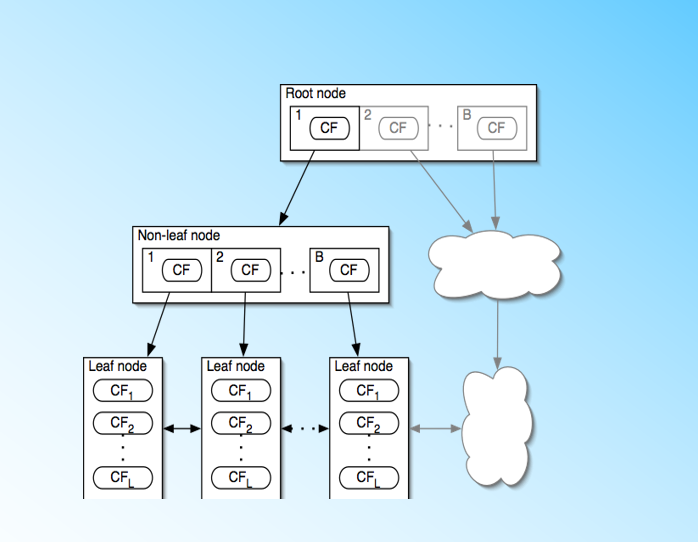
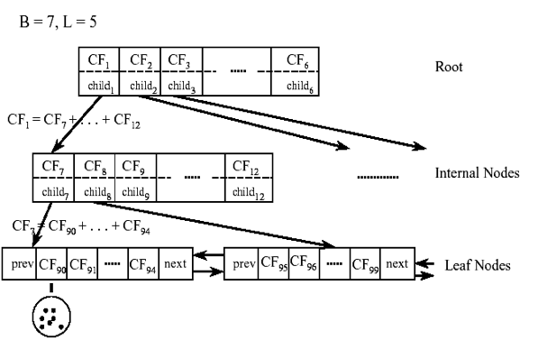
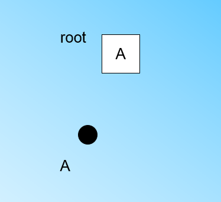
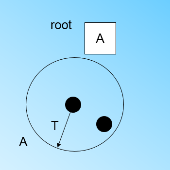
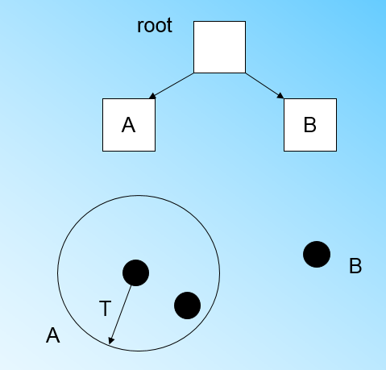
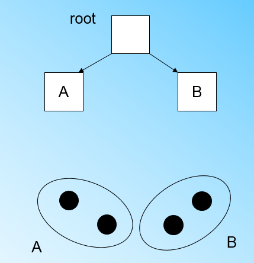
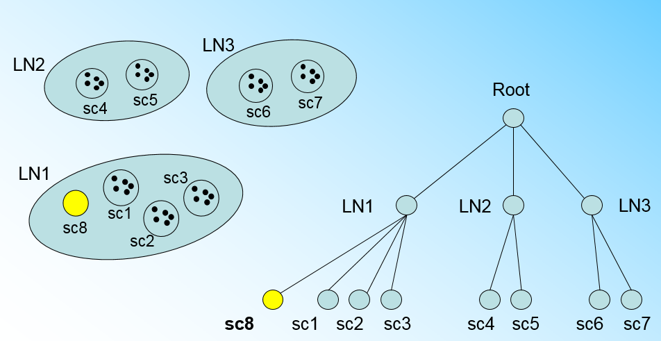
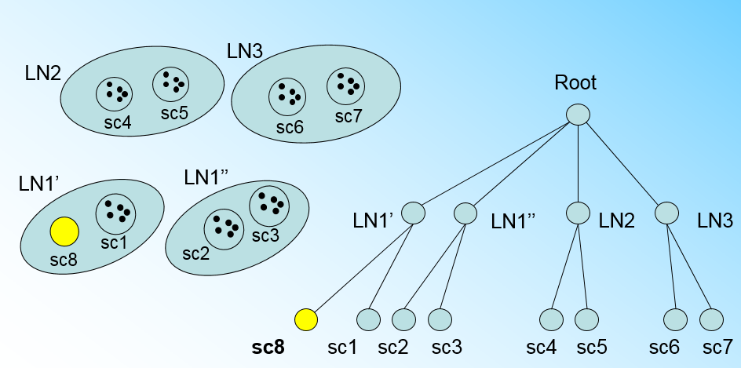
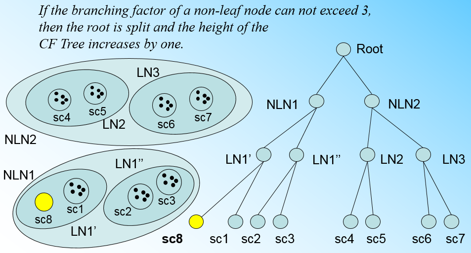

# BIRCH

## 简介

BIRCH （Balanced Iterative Reducing and  Clustering Using  Hierarchies）是用层次方法来聚类和规约数据。

## 原理

### CF Tree

BIRCH快速聚类，这个数结构类似于平衡 B+ 树，一般将它称之为聚类特征树（CF Tree - Clustering  Feature Tree）。这颗树的每一个节点是由若干个聚类特征（CF - Clustering  Feature）组成，每个节点包括叶子节点都有若干个 CF，而内部节点的 CF 有指向孩子节点的指针，所有的叶子节点用一个双向链表链接起来。

在聚类特征树中，一个聚类特征 CF 是这样定义的：每一个 CF 是一个三元组（N，LS，SS）表示。其中 N 代表了这个 CF 中拥有的样本点的数量；LS 代表了这个 CF 中拥有的样本点各特征维度的和向量，SS 代表了这个 CF 中拥有的样本点各特征维度的平方和。

举例如下，在 CF Tree 中的某一个节点的某一个 CF 中，有下面 5 个样本 (3,4), (2,6), (4,5), (4,7), (3,8)。则它对应的 N=5，LS=(3+2+4+4+3,4+6+5+7+8)=(16,30)，SS =(32+22+42+42+32+42+62+52+72+82)=(54+190)=244。

CF 有一个很好的性质，就是满足线性关系，也就是 $𝐶𝐹_1+𝐶𝐹_2=(𝑁_1+𝑁_2,𝐿𝑆_1+𝐿𝑆_2,𝑆𝑆_1+𝑆𝑆_2)$。如果把这个性质放在 CF Tree 上，对于每个父节点中的 CF 节点，它的 (N,LS,SS) 三元组的值等于这个 CF 节点所指向的所有子节点的三元组之和。从下图中可以看出，根节点的 CF1 的三元组的值，可以从它指向的 6 个子节点（CF7 - CF12）的值相加得到。

对于 CF  Tree，一般有几个重要参数，第一个参数是每个内部节点的最大 CF 数 B，第二个参数是每个叶子节点的最大 CF 数 L，第三个参数是针对叶子节点中某个 CF 中的样本点来说的，它是叶节点每个 CF 的最大样本半径阈值T，也就是说，在这个CF中的所有样本点一定要在半径小于T的一个超球体内。对于上图中的CF Tree，限定了 B=7，L=5，也就是说内部节点最多有 7 个 CF，而叶子节点最多有 5 个 CF。

### CF Tree 的生成

先定义好 CF Tree 的参数：即内部节点的最大 CF 数 B， 叶子节点的最大 CF 数 L，叶节点每个 CF 的最大样本半径阈值 T。

在最开始的时候，CF Tree是空的，没有任何样本，我们从训练集读入第一个样本点，将它放入一个新的 CF 三元组 A，这个三元组的 N=1，将这个新的 CF 放入根节点。

继续读入第二个样本点，我们发现这个样本点和第一个样本点 A，在半径为 T 的超球体范围内，也就是说他们属于一个 CF，将第二个点也加入 CF A。此时 A 的三元组更新为 N=2。

此时来了第三个节点，结果发现这个节点不能融入刚才前面的节点形成的超球体内，也就是需要一个新的 CF 三元组 B 来容纳这个新的值。此时根节点有两个 CF 三元组 A 和 B。

当来到第四个样本点的时候，发现和 B 在半径小于 T 的超球体，这样加入 B。

那么什么时候 CF Tree 的节点需要分裂呢？假设现在的 CF Tree 如下图， 叶子节点 LN1 有三个 CF，LN2 和LN3 各有两个CF。叶子节点的最大CF数 L=3。此时一个新的样本点来了，发现它离 LN1 节点最近，因此开始判断它是否在 sc1、sc2、sc3 这 3 个 CF 对应的超球体之内。但是很不幸，它不在，因此它需要建立一个新的 CF，即 sc8 来容纳它。问题是 L=3，也就是说 LN1 的 CF 个数已经达到最大值了，不能再创建新的CF了，此时就要将 LN1 叶子节点一分为二了。

将 LN1 里所有 CF 元组中找到两个最远的 CF 做这两个新叶子节点的种子 CF，然后将 LN1 节点里所有 CF  sc1、sc2、sc3，以及新的 sc8 划分到两个新的叶子节点上。

如果我们的内部节点的最大  CF 数 B=3，则此时叶子节点一分为二会导致根节点的最大 CF 数超了，也就是说根节点现在也要分裂，分裂的方法和叶子节点分裂一样。

总结下CF Tree的插入：

1. 从根节点向下寻找和新样本距离最近的叶子节点和叶子节点里最近的 CF 节点
2. 如果新样本加入后，这个 CF 节点对应的超球体半径仍然满足小于阈值 T，则更新路径上所有的 CF 三元组，插入结束。否则转入 3。
3. 如果当前叶子节点的 CF 节点个数小于阈值L，则创建一个新的 CF 节点，放入新样本，将新的 CF 节点放入这个叶子节点，更新路径上所有的 CF 三元组，插入结束。否则转入 4。
4. 将当前叶子节点划分为两个新叶子节点，选择旧叶子节点中所有 CF 元组里超球体距离最远的两个 CF 元组，分布作为两个新叶子节点的第一个 CF 节点。将其他元组和新样本元组按照距离远近原则放入对应的叶子节点。依次向上检查父节点是否也要分裂，如果需要按和叶子节点分裂方式相同。

## 算法

上面讲了 CF Tree，现在可以步入正题 BIRCH 算法。其实将所有的训练集样本建立了 CF  Tree，一个基本的 BIRCH 算法就完成了，对应的输出就是若干个 CF 节点，每个节点里的样本点就是一个聚类的簇。也就是说 BIRCH 算法的主要过程，就是建立 CF Tree 的过程。

1. 将所有的样本依次读入，在内存中建立一颗CF Tree, 建立的方法参考上一节。
2. （可选）将第一步建立的 CF Tree 进行筛选，去除一些异常 CF 节点，这些节点一般里面的样本点很少，对于一些超球体距离非常近的元组进行合并。
3. （可选）利用其它的一些聚类算法比如 K-Means 对所有的 CF 元组进行聚类，得到一颗比较好的 CF Tree。这一步的主要目的是消除由于样本读入顺序导致的不合理的树结构，以及一些由于节点 CF 个数限制导致的树结构分裂。
4. （可选）利用第三步生成的 CF Tree 的所有 CF 节点作为初始质心点，对所有的样本点按距离远近进行聚类。这样进一步减少了由于 CF Tree 的一些限制导致的聚类不合理的情况。

BIRCH算法的关键就是步骤1，也就是CF Tree的生成，其他步骤都是为了优化最后的聚类结果。

## 总结

BIRCH 算法可以不用输入类别数 K 值，这点和K-Means不同。如果不输入 K 值，则最后的 CF 元组的组数即为最终的 K，否则会按照输入的 K 值对 CF 元组按距离大小进行合并。

一般来说，BIRCH 算法适用于样本量较大的情况，这点和 Mini Batch  K-Means 类似。但是 BIRCH 适用于类别数比较大的情况，而 Mini Batch  K-Means 一般用于类别数适中或者较少的时候。BIRCH 除了聚类还可以额外做一些异常点检测和数据初步按类别规约的预处理。但是如果数据特征的维度非常大，比如大于 20，则 BIRCH 不太适合，此时 Mini Batch K-Means的表现较好。

对于调参，BIRCH 要比 K-Means，Mini Batch K-Means 复杂，因为它需要对 CF Tree 的几个关键的参数进行调参，这几个参数对CF Tree的最终形式影响很大。

### 优点

- 节约内存，所有的样本都在磁盘上，CF Tree 仅仅存了 CF 节点和对应的指针。
- 聚类速度快，只需要一遍扫描训练集就可以建立 CF Tree，CF Tree 的增删改都很快。
- 可以识别噪音点，还可以对数据集进行初步分类的预处理。

### 缺点

- 由于 CF Tree 对每个节点的 CF 个数有限制，导致聚类的结果可能和真实的类别分布不同。
- 对高维特征的数据聚类效果不好，此时可以选择 Mini Batch K-Means。
- 如果数据集的分布簇不是类似于超球体，或者说不是凸的，则聚类效果不好。

## Lab

- [Birch](20_birch-cluster.ipynb)