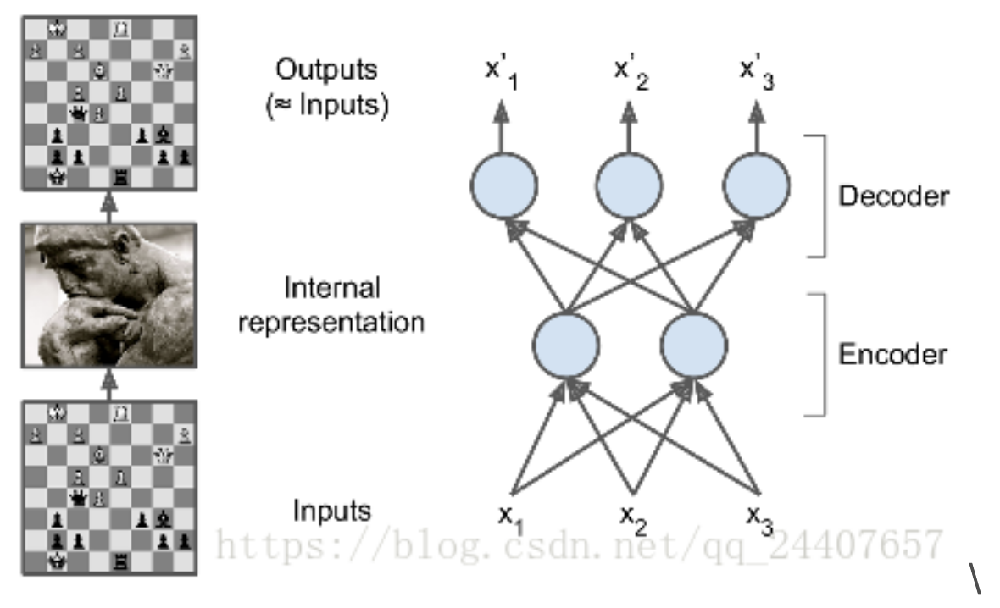

# 自编码器

## 简介

自编码器（Auto-Encoder）是一种能够通过无监督学习，学到输入数据高效表示的人工神经网络。输入数据的这一高效表示称为编码（codings），其维度一般远小于输入数据，使得自编码器可用于降维。此外，自编码器还可以随机生成与训练数据类似的数据，这被称作生成模型（generative model）。

要对自编码器增加约束来强制它去探索数据中的模式。

自编码器接收输入，将其转换成高效的内部表示，然后再输出输入数据的类似物。其算法背后并不是训练“映射”模型，而是去学习数据本身的内在结构和特征（隐层也不称为 feature detector）。通常隐层的神经元要比输入、输出层少，这就使 NN 只学习到了最重要的特征，并且实现了特征的降维。

自编码器通常包括两部分：encoder（也称为识别网络）将输入转换成内部表示，decoder（也称为生成网络）将内部表示转换成输出。

## 训练

自编码器就是要解决无标签数据时，如何得到误差，进而纠正其中的值的问题。它通过比较重建后的数据与原始输入数据的差异来训练（因为没有标签数据）。通过调整 encoder 和 decoder 的参数，使重构误差最小。