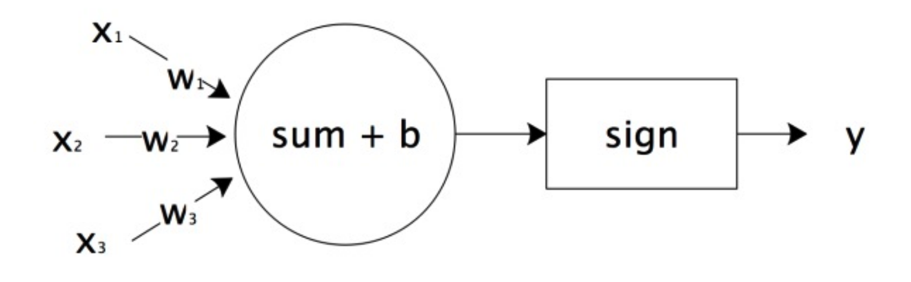
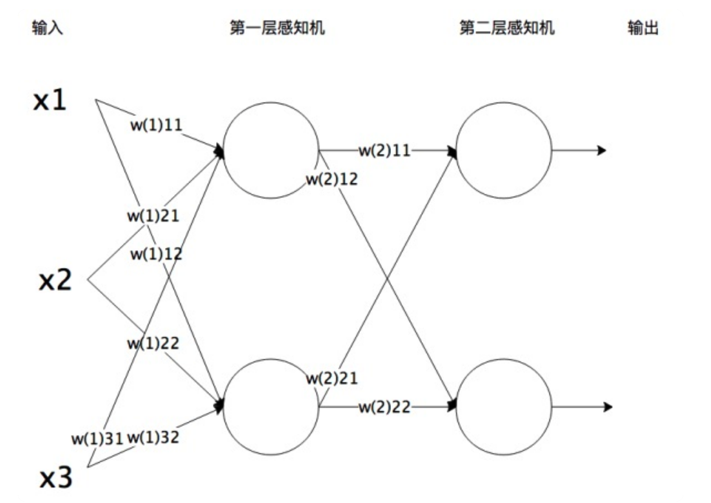

# 神经网络（Neural Network）

## 简介

### 模型

人脑神经元可以通过感知机进行模拟，每个感知机相当于一个神经元，使用 sign 函数的感知机输出也是只有两个值，跟人脑神经元一样。

x1,x2,x3  相当于神经元的树突，实现信号的输入；sum()+b 及 sign 函数相当于神经元细胞，完成输入的计算；y  是神经元的输出。用数学形式表达的话是``y=sign(w1x1+w2x2+w3x3+b)``它是感知机 y=sign(w⋅x+b)  向量展开形式。

将感知机组成一层或者多层网络状结构，就构成了机器学习神经网络。在多层神经网络中，每一层都由多个感知机组成。将输入的特征向量 x 传递给第一层的每一个感知机，运算以后作为输出传递给下一层的每一个感知机，直到最后一层感知机产生最终的输出结果。这就是机器学习神经网络的实现过程，通过模拟人脑神经网络，利用样本数据训练每个感知机神经元的参数，在某些场景下得到的模型可以具有不可思议的效果。

### 算法

使用梯度下降算法，利用样本数据，可以训练神经网络、计算每个感知机的 w 和 b 参数值。当所有的感知机参数都计算出来，神经网络也就训练出来了。

训练神经网络的时候采用一种**反向传播**的算法，针对每个样本，从最后一层，也就是输出层开始，利用样本结果使用梯度下降算法计算每个感知机的参数。然后以这些参数计算出来的结果作为倒数第二层的输出计算该层的参数。然后逐层倒推，反向传播，计算完所有感知机的参数。

#### 两层神经网络

当选择两层神经网络的时候，原始感知机的 sign 函数表现并不太好，更常用的是 sigmoid 函数。

#### 两层以上的多层神经网络

对于两层以上的多层神经网络，ReLU 函数的效果更好一些。ReLU  函数表达式非常简单``y=max(x,0)``当 x 大于 0，输出 x；当 x 小于 0，输出 0。

## 前馈神经网络（Feedforward Neural Network）

# _Tmp

## 反向传播（Back Propagation）

## 波尔兹曼机（Boltzmann Machine）

## 卷积神经网络（Convolutional Neural Network）

## Hopfield网络（Hopfield Network）

## 多层感知器（Multilyer Perceptron）

## 径向基函数网络（Radial Basis Function Network，RBFN）

## 受限波尔兹曼机（Restricted Boltzmann Machine）

## 回归神经网络（Recurrent Neural Network，RNN）

## 自组织映射（Self-organizing Map，SOM）

## 尖峰神经网络（Spiking Neural Network）

## 生成对抗网络（Generative Adversarial Networks，GAN）

## 逻辑学习机（Logic Learning Machine）

## 自组织映射（Self-organizing Map）