# 深度学习

## 简介

深度学习属于机器学习的一种，与传统的机器学习算法不同，它是通过神经网络来实现的。神经网络就好比是机器的大脑，刚开始就像一个婴儿一样，是一张白纸。但通过多次训练之后，“大脑”就可以逐渐具备某种能力。这个训练过程中，只需要告诉这个大脑输入数据是什么，以及对应的输出结果是什么即可。通过多次训练，“大脑”中的多层神经网络的参数就会自动优化，从而得到一个适应于训练数据的模型。这类模型可以看成在传统的机器学习模型中，都会讲解模型的算法原理，比如 K-Means 的算法原理，KNN 的原理等。而到了神经网络，更关注的是网络结构，以及网络结构中每层神经元的传输机制。不需要告诉机器具体的特征规律是什么，只需把想要训练的数据和对应的结果告诉机器大脑即可。深度学习会自己找到数据的特征规律！而传统机器学习往往需要专家来告诉机器采用什么样的模型算法，这就是深度学习与传统机器学习最大的区别。另外深度学习的神经网络结构通常比较深，一般都是 5 层以上，甚至也有 101 层或更多的层数。这些深度的神经网络可以让机器更好地自动捕获数据的特征。

理论上参数越多的模型复杂度越高、容量越大。深度模型是很深的神经网络，是一种简单的通过增加隐层提升容量的办法。

### 历史

-	1958: Perceptron (linear model)
-	1969: Perceptron has limitation
-	1980s: Multi-layer perceptron: Do not have significant difference from DNN today
-	1986: Backpropagation: Usually more than 3 hidden layers is not helpful
-	1989: 1 hidden layer is “good enough”, why deep?
-	2006: RBM initialization
-	2009: GPU
-	2011: Start to be popular in speech recognition
-	2012: win ILSVRC image competition 
-	2015.2: Image recognition surpassing human-level performance 
-	2016.3: Alpha GO beats Lee Sedol
-	2016.10: Speech recognition system as good as humans

### 深度学习 vs.  传统机器学习

- 传统机器学习的特征提取主要依赖人工，针对特定简单任务的时候人工提取特征会简单有效，但是并不能通用。
- 深度学习的特征提取并不依靠人工，而是机器自动提取的。这也是为什么大家都说深度学习的可解释性很差，因为有时候深度学习虽然能有好的表现，但是我们并不知道他的原理是什么。

### 分类

- Supervised
- Unsupervised

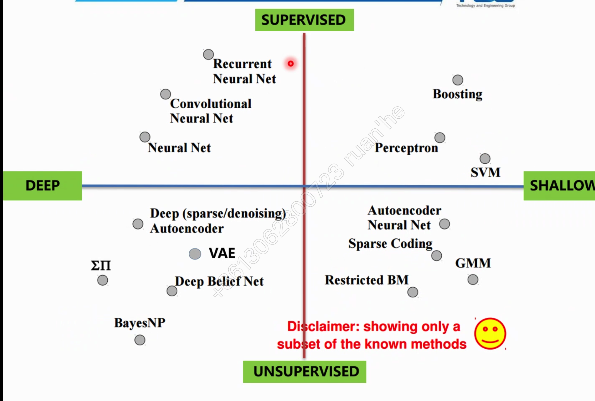

## 神经网络

### 简介

神经网络是一个具有相互连接的节点的计算系统，其节点的工作方式更像是人脑中的神经元（neuron）。这些神经元在它们之间进行处理并传递信息。神经网络就好比一个黑盒子，只需要告诉这个黑盒子输入数据和输出数据，神经网络就可以自我训练。一旦训练好之后，就可以像黑盒子一样使用，当你传入一个新的数据时，它就会告诉你对应的输出结果。在训练过程中，神经网络主要是通过前向传播和反向传播机制运作的。每个神经网络都是一系列的算法，这些算法试图通过一个模拟人类大脑运作的过程来识别一组数据中的潜在关系。【1】当神经网络层数比较多的时候，称它们为深度学习神经网络。

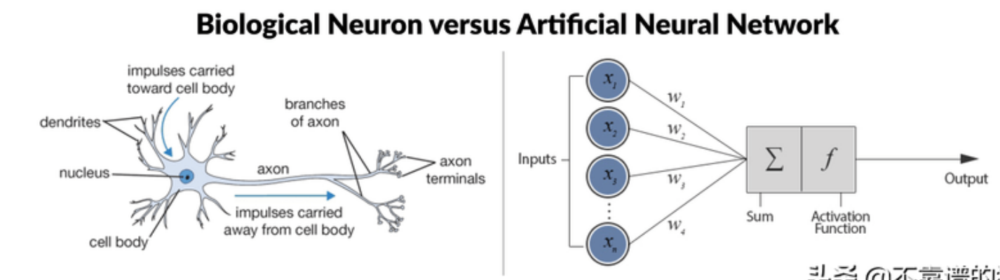

人脑神经元可以通过感知机进行模拟，每个感知机相当于一个神经元，使用阶跃函数 sign 的感知机输出也是只有两个值，跟人脑神经元一样。如图，x1、x2、x3 相当于神经元的树突；实现信号的输入 $sum()+b$ 及 sign 函数相当于神经元细胞，完成输入的计算；y  是神经元的输出。用数学形式表达的话是 $y=sign(w1x1+w2x2+w3x3+b)$，它是感知机 $y=sign(wx+b)$  向量展开形式。

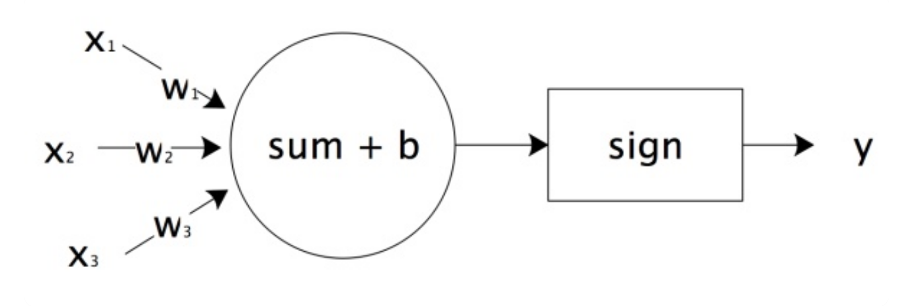

将感知机组成一层或者多层网络状结构，就构成了机器学习的神经网络（Neural Network）。在多层神经网络中，每一层都由多个感知机组成。将输入的特征向量 X 传递给第一层的每一个感知机，运算以后作为输出传递给下一层的每一个感知机，直到最后一层感知机产生最终的输出结果。这就是机器学习神经网络的实现过程，通过模拟人脑神经网络，利用样本数据训练每个感知机神经元的参数，神经网络学到的东西都在 $w、b$ 中。

### 网络结构

- 节点：神经网络是由神经元（感知机）组成的，也称之为节点，它们分布在神经网络的各个层中，这些层包括输入层，输出层和隐藏层。
- 输入层（非功能层）：只接收信号，并分发到隐藏层，不对数据进行加工。
- 隐藏层（功能层）：隐藏层可以是一层也可以是多层，每个隐藏层都会把前一层节点传输出来的数据进行计算，这相当于把数据抽象到另一个维度的空间中，可以更好地提取和计算数据的特征。
- 输出层（功能层）：与隐层一样进行计算，并将计算结果输出。一般来说输出层节点数等于要分类的个数。

### 训练模式

神经网络的训练包括：

- 前向传播：数据从输入层传递到输出层的过程叫做前向传播。这个过程的计算结果通常是通过上一层的神经元的输出经过矩阵运算和激活函数得到的，这样就完成了每层之间的神经元数据的传输。
- 反向传播：当前向传播作用到输出层得到分类结果之后，需要与实际值进行比对，从而得到误差。反向传播也叫作误差反向传播，核心原理是通过代价函数对网络中的参数进行修正，这样更容易让网络参数得到收敛。

整个神经网络训练的过程就是不断地通过前向/反向传播迭代完成的，当达到指定的迭代次数或达到收敛标准的时候即可以停止训练。然后就可以拿训练好的网络模型对新的数据进行预测。

### 深度神经网络

深度神经网络是基于神经网络发展起来的，它的原理与神经网络的原理一样，只不过强调了模型结构的深度，通常有 5 层以上，这样模型的学习能力会更强大。

## 算法

### 模型

神经网络的模型也就是 network structure，多少层、每层多少个 neuron

#### 激活函数

为了解决非线性的分类或回归问题，激活函数（activation funciton）必须是非线性的函数，另外使用基于梯度的方式来训练模型，因此激活函数也必须是连续可导的。 

- 两层神经网络：当选择两层神经网络时，原始感知机的 sign 函数表现并不太好，常用的是 sigmoid 函数。
- 多层神经网络（两层以上）：对于两层以上的多层神经网络，ReLU 函数的效果更好一些。ReLU 函数表达式是：``y=max(x,0)``当 x 大于 0，输出 x；当 x 小于 0，输出 0。

### 损失函数

- 每个 lost：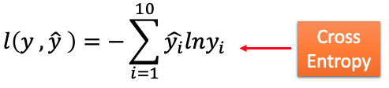
- total lost：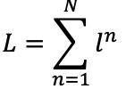

## BP 算法

BP（Backpropagation）反向传播算法算法利用样本数据，可以训练神经网络、计算每个感知机的 w 和 b 参数值。当所有的感知机参数都计算出来，神经网络也就训练出来了。反向传播的算法针对每个样本，从最后一层，也就是输出层开始，利用样本结果使用梯度下降算法计算每个感知机的参数。然后以这些参数计算出来的结果作为倒数第二层的输出计算该层的参数。然后逐层倒推，反向传播，计算完所有感知机的参数。

BP 算法的基本想法是：由信号正向传播和误差反向传播。它基于 output 层的误差建立一个反向的类似于 NN 的计算链路，从而计算出基于误差的每个 w 权重的调整。反向传播计算 lost function 的导数表达式，它是每一层之间从左到右的导数乘积，而每一层之间的权重梯度是对部分乘积的简单修改（“反向传播误差”）。BP 将误差分摊给各个层的所有单元，从而获得各层单元的误差信号，此误差信号作为修正各个单元权值的依据。只有在 5 层内的 NN 会使用 BP，5 层以上 BP 就很不理想了。

### 数学原理

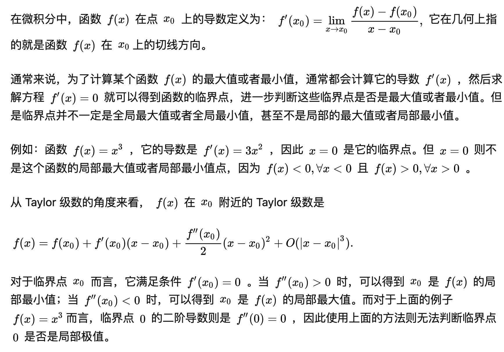

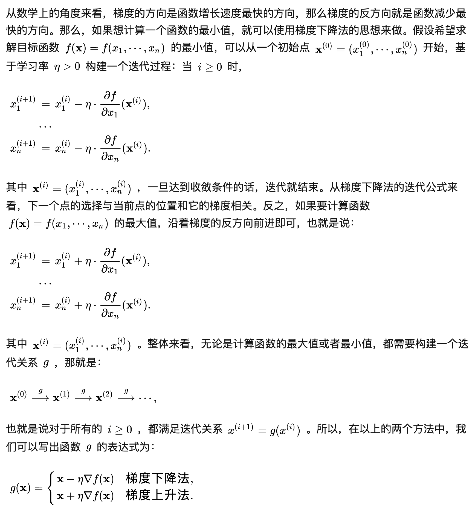

对于：$z=x_1 w_1+x_2 w_2+b$，有：$∂l∕∂w = ∂z∕∂w * ∂l∕∂z$

- forward pass：∂z∕∂w，值就是 x_1、x_2

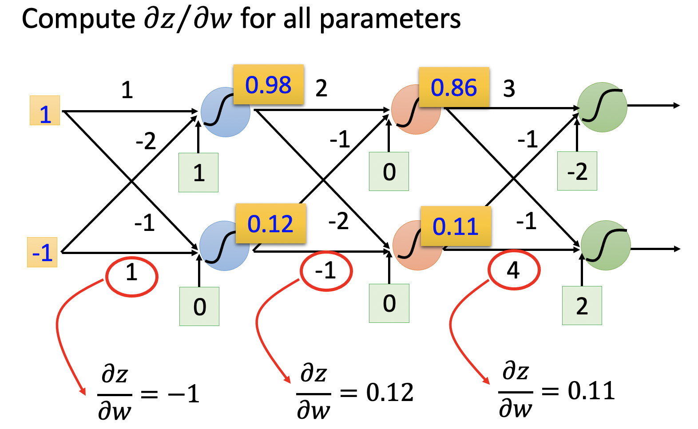

- backward pass：∂l∕∂z = ∂l∕∂a * ∂a∕∂z，其中 ∂a∕∂z 为常数 σ′(z)，而 ∂l∕∂a 为下一层 BP 的输出值

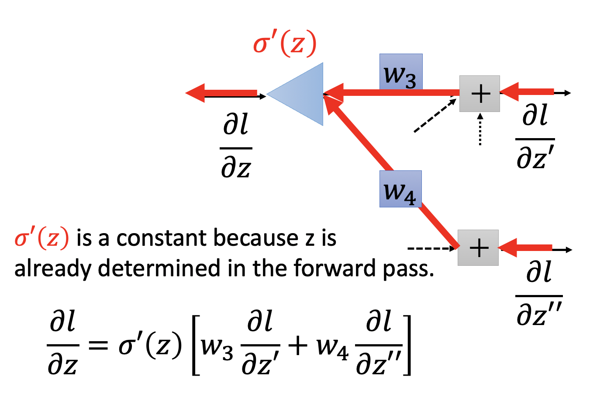

### 多样本训练

- 批处理模式（batch processing）：即计算出在每个样本上目标函数的梯度，再将不同样本的梯度进行求和，求和的结果作为本次更新中目标函数的梯度。在批处理模式中，每次更新都要遍历训练集中所有的样本，因而运算量较大。
- 随机梯度下降法（stochastic gradient descent）：它在每次更新中只使用一个样本，下一次更新再使用另外一个样本，在不断迭代的更新过程中实现对所有样本的遍历。有趣的是，事实表明当训练集的规模较大时，随机梯度下降法的性能更佳。

##现有模型

神经网络中每个感知机的参数可以通过训练获得，也就是 w 和 b 可以计算得到，但是一个神经网络应该设置多少层，每层应该有多少个 neuron，这些参数必须要算法工程师设置，因此这些参数也被称为超级参数。超级参数如何设置目前还没有太好的方法，只能依赖算法工程师的经验和不断尝试去优化。一个神经网络就是一个模型（function set），需要去设计层数，每个层有多少个neuron等，是设计这个model。

- 全连接神经网络：全连接的意思是每一层的神经元与上一层的所有神经元都是连接的。不过在实际使用中，全连接的参数会过多，导致计算量过大。因此在实际使用中全连接神经网络的层数一般比较少。

- FNN（Feedforward Neural Network）：前馈神经网络采用一种单向多层结构。其中每一层包含若干个神经元。在此种神经网络中，每一层的神经元可以接收前一层神经元的信号，并产生输出到下一层。第 0 层叫输入层，最后一层叫输出层，其他中间层叫做隐层（或隐藏层、隐层）。隐层可以是一层，也可以是多层。其最大特点是**整个网络中无反馈，信号从输入层到输出层单向传播，可用一个有向无环图表示**。

- CNN（Convolutional Neural Network）：卷积神经网络在图像处理中有广泛的应用。CNN 包括了卷积层、池化层和全连接层，使用反向传播算法进行训练。
  
  - 卷积层：相当于特征提取，起到滤镜的作用，它可以把图像进行分块，对每一块的图像进行变换操作。
  - 池化层：相当于对数据进行降维处理，这样输出的维数就会减少很多，从而降低整体的计算量。
  - 全连接层：通常是输出层的上一层，它将上一层神经元输出的数据转变成一维向量。
  
- RNN（Recurrent Neural Network）：循环神经网络的特点是神经元的输出可以在下一个时刻作用到自身，这样 RNN 就可以看做是在时间上传递的神经网络。它可以应用在语音识别、自然语言处理等与上下文相关的场景。

深度学习网络往往包括了这三种网络的变种形成，常用的深度神经网络包括：

- LeNet
- AlexNet
- VGG19
- GoogleNet
- ResNet 

### Other

- 递归神经网络
- 自编码器：自编码器可在输出处恢复输入信号。它们内部有一个隐藏层。自编码器设计为无法将输入准确复制到输出，但是为了使误差最小化，网络被迫学习选择最重要的特征。

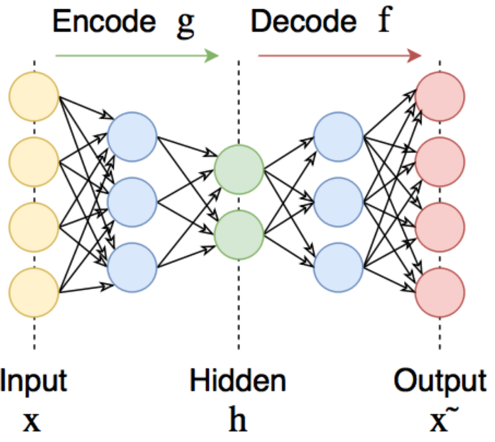

GAN 生成对抗网络有两个部分：

- 生成器：学习生成可信的数据。生成的实例成为判别器的负面训练实例。
- 判别器：学会从数据中分辨出生成器的假数据。判别器对产生不可信结果的发生器进行惩罚。

建立 GAN 的第一步是识别所需的最终输出，并根据这些参数收集初始训练数据集。然后将这些数据随机化并输入到生成器中，直到获得生成输出的基本精度为止。然后，将生成的图像与原始概念的实际数据点一起馈入判别器。判别器对信息进行过滤，并返回0到1之间的概率来表示每个图像的真实性（1与真相关，0与假相关）。然后检查这些值是否成功，并不断重复，直到达到预期的结果。

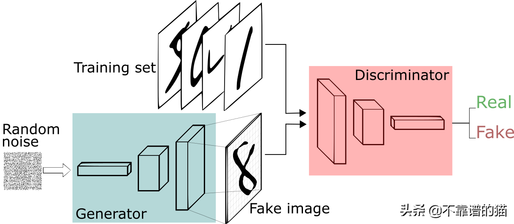

## 优化

### 训练集表现不佳

#### Adaptive Learning Rate

- Vanilla
- Adagrad
- RMSProp

#### New Activation Function

- ReLU
- Maxout

### 测试集表现不佳

#### Dropout

每次训练前先去掉一些用不到的 neuron

#### Regularization

在 lost funciton 上再加上一个 regularization term：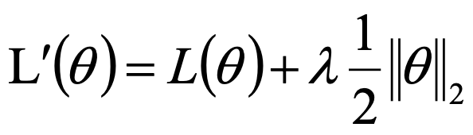

#### Early Stopping

## Ref

1. [深度学习算法完整简介](https://www.toutiao.com/i6812916374394896910/?tt_from=weixin&utm_campaign=client_share&wxshare_count=1&timestamp=1602943120&app=news_article&utm_source=weixin&utm_medium=toutiao_ios&use_new_style=1&req_id=202010172158390100120640510F6549D8&group_id=6812916374394896910)
2. [反向传播——通俗易懂](https://blog.csdn.net/weixin_38347387/article/details/82936585)
3. 

## 

