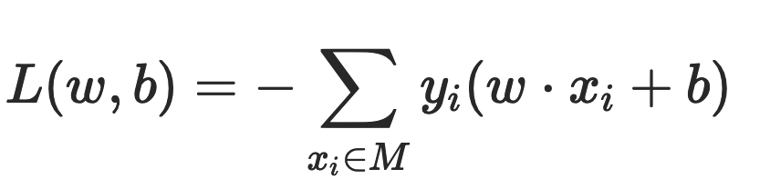

# 深度学习

## 简介

深度学习属于机器学习的一种，与传统的机器学习算法不同，它是通过神经网络来实现的。神经网络就好比是机器的大脑，刚开始就像一个婴儿一样，是一张白纸。但通过多次训练之后，“大脑”就可以逐渐具备某种能力。这个训练过程中，我们只需要告诉这个大脑输入数据是什么，以及对应的输出结果是什么即可。通过多次训练，“大脑”中的多层神经网络的参数就会自动优化，从而得到一个适应于训练数据的模型。所以能看到在传统的机器学习模型中，都会讲解模型的算法原理，比如 K-Means 的算法原理，KNN 的原理等。而到了神经网络，更关注的是网络结构，以及网络结构中每层神经元的传输机制。不需要告诉机器具体的特征规律是什么，只需把想要训练的数据和对应的结果告诉机器大脑即可。深度学习会自己找到数据的特征规律！而传统机器学习往往需要专家来告诉机器采用什么样的模型算法，这就是深度学习与传统机器学习最大的区别。另外深度学习的神经网络结构通常比较深，一般都是 5 层以上，甚至也有 101 层或更多的层数。这些深度的神经网络可以让机器更好地自动捕获数据的特征。

神经网络是一个具有相互连接的节点的计算系统，其节点的工作方式更像是人脑中的神经元。这些神经元在它们之间进行处理并传递信息。每个神经网络都是一系列的算法，这些算法试图通过一个模拟人类大脑运作的过程来识别一组数据中的潜在关系。【1】当神经网络层数比较多的时候，称它们为深度学习神经网络。

### 历史

-	1958: Perceptron (linear model)
-	1969: Perceptron has limitation
-	1980s: Multi-layer perceptron: Do not have significant difference from DNN today
-	1986: Backpropagation: Usually more than 3 hidden layers is not helpful
-	1989: 1 hidden layer is “good enough”, why deep?
-	2006: RBM initialization
-	2009: GPU
-	2011: Start to be popular in speech recognition
-	2012: win ILSVRC image competition 
-	2015.2: Image recognition surpassing human-level performance 
-	2016.3: Alpha GO beats Lee Sedol
-	2016.10: Speech recognition system as good as humans

### 深度学习 vs.  传统机器学习

- 传统机器学习的特征提取主要依赖人工，针对特定简单任务的时候人工提取特征会简单有效，但是并不能通用。
- 深度学习的特征提取并不依靠人工，而是机器自动提取的。这也是为什么大家都说深度学习的可解释性很差，因为有时候深度学习虽然能有好的表现，但是我们并不知道他的原理是什么。

### 分类

- Supervised
- Unsupervised

## 感知机

感知机（Perceptron）就是一个 neuron，是一种比较简单的二分类模型，它将输入特征分类为 +1、-1 两类。它是由 2 层组成，输入层接收外部信号后传递给输出层，输出层进行激活函数的处理得到分类。例如，二维平面上的点只有两个输入特征（横轴坐标和纵轴坐标），一条直线就可以分类。如果输入数据有更多维度的特征，那么就需要建立同样多维度的模型，高维度上的分类模型也被称为超平面。

### 模型

感知机模型如下：``f(x)=sign(w⋅x+b)``

其中 x 代表输入的特征空间向量，输出空间是{-1, +1}，w 为权值向量，b 叫作偏置，sign 是一个符号函数：

w⋅x+b=0 为超平面的方程：当感知机输出为 +1 表示输入值在超平面的上方，当感知机输出为 -1 表示输入值在超平面的下方。训练感知机模型就是要计算出 w 和 b  的值，当有新的数据需要分类的时候，输入感知机模型就可以计算出 +1 或者 -1 从而进行分类。

### 损失函数

偏差之和就是感知机的损失函数：。其中 M 为误分类点集合，误分类点越少，损失函数的值越小；如果没有误分类点，损失函数值为 0。求模型的参数 w 和 b，就是求损失函数的极小值。

一般采用梯度下降法求损失函数极小值，实质上就是求导过程的数值计算方法。对于误分类点集合 M，损失函数 L(w,b) 变化的梯度，就是某个函数变量的变化引起的函数值的变化，根据感知机损失函数可知：

使用梯度下降更新 w 和 b，不断迭代使损失函数 L(w,b) 不断减小，直到为 0，也就是没有误分类点。感知机算法的实现过程：

1. 选择初始值 w0、b0。
2. 在样本集合中选择样本数据 xiyi。
3. 如果 yi(w⋅xi+b)<0，表示 yi 为误分类点，那么 w=w+ηyixi、b=b+ηyi，在梯度方向校正 w 和 b。其中 η 为步长，步长选择要适当，步长太长会导致每次计算调整太大出现震荡；步长太短又会导致收敛速度慢、计算时间长。
4. 跳转回 2，直到样本集合中没有误分类点， 即全部样本数据 yi(w⋅xi+b)≥0。

## 神经网络

### 简介

人脑神经元可以通过感知机进行模拟，每个感知机相当于一个神经元，使用 sign 函数的感知机输出也是只有两个值，跟人脑神经元一样。

x1,x2,x3  相当于神经元的树突，实现信号的输入；sum()+b 及 sign 函数相当于神经元细胞，完成输入的计算；y  是神经元的输出。用数学形式表达的话是``y=sign(w1x1+w2x2+w3x3+b)``，它是感知机 y=sign(w⋅x+b)  向量展开形式。

将感知机组成一层或者多层网络状结构，就构成了机器学习的神经网络（Neural Network）。在多层神经网络中，每一层都由多个感知机组成。将输入的特征向量 x 传递给第一层的每一个感知机，运算以后作为输出传递给下一层的每一个感知机，直到最后一层感知机产生最终的输出结果。这就是机器学习神经网络的实现过程，通过模拟人脑神经网络，利用样本数据训练每个感知机神经元的参数，在某些场景下得到的模型可以具有不可思议的效果。

### 算法

使用梯度下降算法，利用样本数据，可以训练神经网络、计算每个感知机的 w 和 b 参数值。当所有的感知机参数都计算出来，神经网络也就训练出来了。

训练神经网络的时候采用一种**反向传播**的算法，针对每个样本，从最后一层，也就是输出层开始，利用样本结果使用梯度下降算法计算每个感知机的参数。然后以这些参数计算出来的结果作为倒数第二层的输出计算该层的参数。然后逐层倒推，反向传播，计算完所有感知机的参数。

#### 激活函数

为了解决非线性的分类或回归问题，激活函数（activation funciton）必须是非线性的函数，另外使用基于梯度的方式来训练模型，因此激活函数也必须是连续可导的。 

- 两层神经网络：当选择两层神经网络时，原始感知机的 sign 函数表现并不太好，更常用的是 sigmoid 函数。
- 两层以上的多层神经网络：对于两层以上的多层神经网络，ReLU 函数的效果更好一些。ReLU 函数表达式是：``y=max(x,0)``当 x 大于 0，输出 x；当 x 小于 0，输出 0。

#### Model

也就是 network structure，多少层、每层多少个 neuron

#### Lost Function

- 每个 lost：
- total lost：

#### Best Function

还是采用梯度下降法

后续会采用 backprogapation 来有效的算 ∂L∕∂w。

### BP 算法

BP 反向传播算法（Backpropagation Algorithm）的基本想法是：由信号正向传播和误差反向传播。它基于 output 层的误差建立一个反向的类似于 NN 的计算链路，从而计算出基于误差的每个 w 权重的调整。反向传播计算 lost function 的导数表达式，它是每一层之间从左到右的导数乘积，而每一层之间的权重梯度是对部分乘积的简单修改（“反向传播误差”）。BP 将误差分摊给各个层的所有单元，从而获得各层单元的误差信号，此误差信号作为修正各个单元权值的依据。只有在 5 层内的 NN 会使用 BP，5 层以上 BP 就很不理想了。

我们向网络提供数据，它产生一个输出，我们将输出与期望的输出进行比较(使用损失函数)，然后根据差异重新调整权重。然后重复此过程。权重的调整是通过一种称为随机梯度下降的非线性优化技术来实现的。

对于：z=x_1 w_1+x_2 w_2+b，有：∂l∕∂w = ∂z∕∂w * ∂l∕∂z

- forward pass：∂z∕∂w，值就是 x_1、x_2

- backward pass：∂l∕∂z = ∂l∕∂a * ∂a∕∂z，其中 ∂a∕∂z 为常数 σ′(z)，而 ∂l∕∂a 为下一层 BP 的输出值

###网络结构

神经网络中每个感知机的参数可以通过训练获得，也就是 w 和 b 可以计算得到，但是一个神经网络应该设置多少层，每层应该有多少个 neuron，这些参数必须要算法工程师设置，因此这些参数也被称为超级参数。超级参数如何设置目前还没有太好的方法，只能依赖算法工程师的经验和不断尝试去优化。

一个神经网络就是一个model（function set），需要去设计层数，每个层有多少个neuron等，是设计这个model。

- FNN
- CNN
- RNN
- 递归神经网络
- 自编码器：自编码器可在输出处恢复输入信号。它们内部有一个隐藏层。自编码器设计为无法将输入准确复制到输出，但是为了使误差最小化，网络被迫学习选择最重要的特征。

### GAN

GAN 生成对抗网络有两个部分：

- 生成器：学习生成可信的数据。生成的实例成为判别器的负面训练实例。
- 判别器：学会从数据中分辨出生成器的假数据。判别器对产生不可信结果的发生器进行惩罚。

建立 GAN 的第一步是识别所需的最终输出，并根据这些参数收集初始训练数据集。然后将这些数据随机化并输入到生成器中，直到获得生成输出的基本精度为止。然后，将生成的图像与原始概念的实际数据点一起馈入判别器。判别器对信息进行过滤，并返回0到1之间的概率来表示每个图像的真实性（1与真相关，0与假相关）。然后检查这些值是否成功，并不断重复，直到达到预期的结果。

## 优化

### 训练集表现不佳

#### Adaptive Learning Rate

- Vanilla
- Adagrad
- RMSProp

#### New Activation Function

- ReLU
- Maxout

### 测试集表现不佳

#### Dropout

每次训练前先去掉一些用不到的 neuron

#### Regularization

在 lost funciton 上再加上一个 regularization term：

#### Early Stopping

## Ref

1. [深度学习算法完整简介](https://www.toutiao.com/i6812916374394896910/?tt_from=weixin&utm_campaign=client_share&wxshare_count=1&timestamp=1602943120&app=news_article&utm_source=weixin&utm_medium=toutiao_ios&use_new_style=1&req_id=202010172158390100120640510F6549D8&group_id=6812916374394896910)

## 

