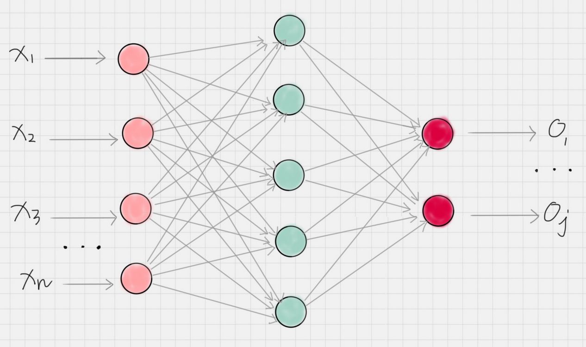
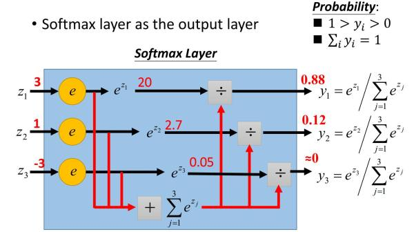
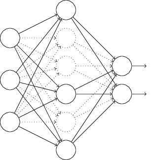

# 深度学习

## 简介

深度学习属于机器学习的一种，与传统的机器学习算法不同，它是通过神经网络来实现的。神经网络就好比是机器的大脑，刚开始就像一个婴儿一样，是一张白纸。但通过多次训练之后，“大脑”就可以逐渐具备某种能力。这个训练过程中，只需要告诉这个大脑输入数据是什么，以及对应的输出结果是什么即可。通过多次训练，“大脑”中的多层神经网络的参数就会自动优化，从而得到一个适应于训练数据的模型。这类模型可以看成在传统的机器学习模型中，都会讲解模型的算法原理，比如 K-Means 的算法原理，KNN 的原理等。而到了神经网络，更关注的是网络结构，以及网络结构中每层神经元的传输机制。不需要告诉机器具体的特征规律是什么，只需把想要训练的数据和对应的结果告诉机器大脑即可。深度学习会自己找到数据的特征规律！而传统机器学习往往需要专家来告诉机器采用什么样的模型算法，这就是深度学习与传统机器学习最大的区别。另外深度学习的神经网络结构通常比较深，一般都是 5 层以上，甚至也有 101 层或更多的层数。这些深度的神经网络可以让机器更好地自动捕获数据的特征。

理论上参数越多的模型复杂度越高、容量越大。深度模型是很深的神经网络，是一种简单的通过增加隐层提升容量的办法。

### 历史

-	1958: Perceptron (linear model)
-	1969: Perceptron has limitation
-	1980s: Multi-layer perceptron: Do not have significant difference from DNN today
-	1986: Backpropagation: Usually more than 3 hidden layers is not helpful
-	1989: 1 hidden layer is “good enough”, why deep?
-	2006: RBM initialization
-	2009: GPU
-	2011: Start to be popular in speech recognition
-	2012: win ILSVRC image competition 
-	2015.2: Image recognition surpassing human-level performance 
-	2016.3: Alpha GO beats Lee Sedol
-	2016.10: Speech recognition system as good as humans

### 深度学习 vs. 传统机器学习

- 传统机器学习的特征提取主要依赖人工，针对特定简单任务的时候人工提取特征会简单有效，但是并不能通用。
- 深度学习的特征提取并不依靠人工，而是机器自动提取的。这也是为什么大家都说深度学习的可解释性很差，因为有时候深度学习虽然能有好的表现，但是并不知道它的原理是什么。

### 分类

- Supervised
- Unsupervised

## 神经网络

### 神经元

神经网络是一个具有相互连接的节点的计算系统，其节点的工作方式更像是人脑中的神经元（neuron）。这些神经元在它们之间进行处理并传递信息。神经网络就好比一个黑盒子，只需要告诉这个黑盒子输入数据和输出数据，神经网络就可以自我训练。一旦训练好之后，就可以像黑盒子一样使用，当你传入一个新的数据时，它就会告诉你对应的输出结果。在训练过程中，神经网络主要是通过前向传播和反向传播机制运作的。每个神经网络都是一系列的算法，这些算法试图通过一个模拟人类大脑运作的过程来识别一组数据中的潜在关系。【1】当神经网络层数比较多的时候，称它们为深度学习神经网络。

人脑神经元可以通过感知机进行模拟，每个感知机相当于一个神经元，使用阶跃函数 sign 的感知机输出也是只有两个值，跟人脑神经元一样。如图，x1、x2、x3 相当于神经元的树突；实现信号的输入 $sum()+b$ 及 sign 函数相当于神经元细胞，完成输入的计算，y  是神经元的输出。用数学形式表达的话是 $y=sign(w1x1+w2x2+w3x3+b)$，它是感知机 $y=sign(wx+b)$  向量展开形式。

### 神经网络

但感知机模型只能用于二元分类，且无法学习比较复杂的非线性模型，因此在工业界无法使用。而神经网络则在感知机的模型上做了扩展，将感知机组成一层或者多层网络状结构，就构成了机器学习的神经网络（Neural Network）。在多层神经网络中，每一层都由多个感知机组成。将输入的特征向量 X 传递给第一层的每一个感知机，运算以后作为输出传递给下一层的每一个感知机，直到最后一层感知机产生最终的输出结果。这就是机器学习神经网络的实现过程，通过模拟人脑神经网络，利用样本数据训练每个感知机神经元的参数，神经网络学到的东西都在 $w、b$ 中。

- 节点：神经网络是由神经元（感知机）组成的，也称之为节点，它们分布在神经网络的各个层中，这些层包括输入层，输出层和隐藏层。
- 输入层（非功能层）：只接收信号，并分发到隐藏层，不对数据进行加工。
- 隐藏层（功能层）：隐藏层可以是一层也可以是多层，每个隐藏层都会把前一层节点传输出来的数据进行计算，这相当于把数据抽象到另一个维度的空间中，可以更好地提取和计算数据的特征。
- 输出层（功能层）：与隐层一样进行计算，并将计算结果输出。一般来说输出层节点数等于要分类的个数。

神经网络在感知机的模型上做了以下 3 方面的扩展：

1. 加入了隐藏层：隐藏层可以有多层，增强模型的表达能力。当然增加了这么多隐藏层模型的复杂度也增加了好多。
2. 输出层的神经元也可以不止一个输出，可以有多个输出：这样模型可以灵活的应用于分类回归，以及其他的机器学习领域比如降维和聚类等。多个神经元输出的输出层对应的一个实例如下图，输出层现在有4个神经元了。
3. 对激活函数做扩展：感知机的激活函数是 $𝑠𝑖𝑔𝑛(𝑧)$，虽然简单但是处理能力有限，因此神经网络中一般使用的其他的激活函数，比如我们在逻辑回归里面使用过的 Sigmoid 函数，即：$𝑓(𝑧)=\frac{1}{1+𝑒^{−𝑧}}$。还有后来出现的 tanx、softmax 和 ReLU 等。通过使用不同的激活函数，神经网络的表达能力进一步增强。

### DNN

DNN（Deep Neuron Network）深度神经网络是基于神经网络发展起来的，它的原理与神经网络的原理一样，只不过强调了模型结构的深度，通常有 5 层以上，这样模型的学习能力会更强大。

DNN 内部的神经网络层可以分为三类，输入层，隐藏层和输出层,如下图示例，一般来说第一层是输入层，最后一层是输出层，而中间的层数都是隐藏层。

层与层之间是全连接的，也就是说第 i 层的任意一个神经元一定与第 i+1 层的任意一个神经元相连。虽然 DNN 看起来很复杂，但是从小的局部模型来说，还是和感知机一样，即一个线性关系 $𝑧=∑𝑤_𝑖𝑥_𝑖+𝑏$ 加上一个激活函数 𝜎(𝑧)。

由于 DNN 层数多，则线性关系系数 𝑤 和偏倚 𝑏 的数量也就是很多了。具体的参数在 DNN 是如何定义的呢？

- 首先来看看线性关系系数 𝑤 的定义。以下图一个三层的 DNN 为例，第二层的第 4 个神经元到第三层的第 2 个神经元的线性系数定义为 $𝑤^3_{24}$，上标 3 代表线性系数 𝑤 所在的层数，而下标对应的是输出的第三层索引 2 和输入的第二层索引 4。也许会问，为什么不是 $𝑤^3_{42}$ 而是 $𝑤^3_{24}$ 呢？这主要是为了便于模型用于矩阵表示运算，如果是 $𝑤^3_{42}$ 而每次进行矩阵运算是 $𝑤^𝑇𝑥+𝑏$ 需要进行转置。将输出的索引放在前面的话，则线性运算不用转置，即直接为 $𝑤𝑥+𝑏$。总结下，第 𝑙−1 层的第 k 个神经元到第 𝑙 层的第 j 个神经元的线性系数定义为 $𝑤^𝑙_{𝑗𝑘}$。注意，输入层是没有 𝑤 参数的。
- 再来看看偏倚 𝑏 的定义：还是以这个三层的 DNN 为例，第二层的第三个神经元对应的偏倚定义为 $𝑏^2_3$。其中，上标 2 代表所在的层数，下标 3 代表偏倚所在的神经元的索引。同样的道理，第三个的第一个神经元的偏倚应该表示为 $𝑏^3_1$。同样的，输入层是没有偏倚参数*𝑏*的。

## 算法

### 模型

#### 网络结构

神经网络的模型也就是 network structure，多少层、每层多少个 neuron

#### 激活 & 损失函数

为了解决非线性的分类或回归问题，激活函数（activation funciton）必须是非线性的函数，另外使用基于梯度的方式来训练模型，因此激活函数也必须是连续可导的。 

- 两层神经网络：当选择两层神经网络时，原始感知机的 sign 函数表现并不太好，常用的是 sigmoid 函数。
- 多层神经网络（两层以上）：对于两层以上的多层神经网络，ReLU 函数的效果更好一些。ReLU 函数表达式是：``y=max(x,0)``当 x 大于 0，输出 x；当 x 小于 0，输出 0。

##### Sigmoid + SME

激活函数 Sigmoid 的表达式为：$𝜎(𝑧)=\frac{1}{1+𝑒^{−𝑧}}$，函数图像如下：

对于 Sigmoid，当 𝑧 的取值越来越大后，函数曲线变得越来越平缓，意味着此时的导数 𝜎′(𝑧) 也越来越小。同样的，当*𝑧*的取值越来越小时，也有这个问题。仅仅在 𝑧 取值为 0 附近时，导数 𝜎′(𝑧) 的取值较大。

对于反向传播算法，每一层向前递推都要乘以 𝜎′(𝑧)，得到梯度变化值。Sigmoid 的这个曲线意味着在大多数时候的梯度变化值很小，导致 𝑊、𝑏 更新到极值的速度较慢，也就是算法收敛速度较慢。

##### Sigmoid + 交叉熵

用交叉熵损失函数来代替 SME 损失函数，二分类时每个样本的交叉熵损失函数的形式：$𝐽(𝑊,𝑏,𝑎,𝑦)=−[𝑦𝑙𝑛(𝑎)+(1−𝑦)𝑙𝑛(1−𝑎)]$。

使用交叉熵得到的的 $𝛿^𝑙$ 梯度表达式没有了 𝜎′(𝑧)，梯度为预测值和真实值的差距，这样求得的$𝑊^𝑙,𝑏^𝑙$ 的梯度也不包含 𝜎′(𝑧)，因此避免了反向传播收敛速度慢的问题。通常情况下，如果使用了 sigmoid 激活函数，交叉熵损失函数肯定比 SME 损失函数好用。

##### softmax + 对数似然

在之前的 DNN 中，都假设输出是连续可导的值。但是如果是分类问题，那么输出是一个个的类别，那怎么用 DNN 来解决呢？

比如假设有一个三个类别的分类问题，这样 DNN 输出层应该有三个神经元，假设第一个神经元对应类别一，第二个对应类别二，第三个对应类别三，这样期望的输出应该是 (1,0,0)，（0,1,0）和（0,0,1）这三种。即样本真实类别对应的神经元输出应该无限接近或等于 1，而非该样本真实输出对应的神经元的输出应该无限接近或者等于 0。

在现有的 DNN 模型中，可以将输出层第 i 个神经元的激活函数定义为如下形式：$𝑎^𝐿_𝑖=\frac{𝑒^{𝑧^𝐿_𝑖}}{∑_{𝑗=1}^{𝑛_𝐿}𝑒^{𝑧^𝐿_𝑗}}$。其中，$N_𝐿$ 是输出层第 L 层的神经元个数，也就是分类问题的类别数。容易看出，所有的 $𝑎^𝐿_𝑖$ 都是在 (0,1) 之间的数字，而 $∑_{𝑗=1}^{𝑛^𝐿}𝑒^{𝑧^𝐿_𝑗}$ 作为归一化因子保证了所有的 $𝑎^𝐿_𝑖$ 之和为 1。

这个方法很简洁漂亮，仅仅只需要将输出层的激活函数从 Sigmoid 之类的函数转变为上式的 softmax 激活函数。它在分类问题中有广泛的应用。将 DNN 用于分类问题，在输出层用softmax 激活函数也是最常见的了。

例如，假设输出层为三个神经元，而未激活的输出为 3、1 和 -3，求出各自的指数表达式为 20、2.7 和 0.05，归一化因子即为 22.75，这样就求出了三个类别的概率输出分布为 0.88、0.12 和 0。

当用 softmax 激活函数作为 DNN 的分类问题时，对应的损失函数一般是对数似然函数：$𝐽(𝑊,𝑏,𝑎^𝐿,𝑦)=−∑_𝑘𝑦_𝑘𝑙𝑛𝑎^𝐿_𝑘$，其中 $𝑦_𝑘$ 的取值为 0 或 1。如果某一训练样本的输出为第 i 类，则 $𝑦_𝑖=1$，其余的 $𝑗≠𝑖$ 都有 $𝑦_𝑗=0$。由于每个样本只属于一个类别，所以这个对数似然函数可以简化为：$𝐽(𝑊,𝑏,𝑎^𝐿,𝑦)=−𝑙𝑛𝑎^𝐿_𝑖$，其中 𝑖 即为训练样本真实的类别序号。

可见损失函数只和真实类别对应的输出有关，这样假设真实类别是第 i 类，对于真实类别第 i 类，他对应的第 j 个 w 链接 $𝑤^𝐿_{𝑖𝑗}$ 对应的梯度计算为：$\frac{∂𝐽(𝑊,𝑏,𝑎^𝐿,𝑦)}{∂𝑤^𝐿_{𝑖𝑗}}=(𝑎^𝐿_𝑖−1)𝑎^{𝐿−1}_𝑗$。

同样的可以得到 $𝑏^𝐿_𝑖$ 的梯度表达式为：$\frac{∂𝐽(𝑊,𝑏,𝑎^𝐿,𝑦)}{∂𝑏^𝐿_𝑖}=𝑎^𝐿_𝑖−1$。

可见，梯度计算也很简洁，也没有之前的训练速度慢的问题。举个例子，假如对于第 2 类的训练样本，通过前向算法计算的未激活输出为（1,5,3），则得到 softmax 激活后的概率输出为：(0.015,0.866,0.117)。由于类别是第二类，则反向传播的梯度应该为：(0.015,0.866-1,0.117)。

当 softmax 输出层的反向传播计算完以后，后面的普通 DNN 层的反向传播计算和之前讲的普通 DNN 没有区别。

##### ReLU

梯度爆炸和梯度消失：就是在反向传播的算法过程中，由于使用了是矩阵求导的链式法则，有一大串连乘，如果连乘的数字在每层都是小于 1 的，则梯度越往前乘越小，导致梯度消失。而如果连乘的数字在每层都是大于 1 的，则梯度越往前乘越大，导致梯度爆炸。

对于无法完美解决的梯度消失问题，一个可能部分解决梯度消失的办法是使用 ReLU（Rectified Linear  Unit）激活函数。ReLU 在 CNN 中得到了广泛的应用，在 CNN 中梯度消失似乎不再是问题。其表达式为：$𝜎(𝑧)=𝑚𝑎𝑥(0,𝑧)$，也就是说大于等于 0 则不变，小于 0 则激活后为 0。

### 训练模式

神经网络的训练包括前向传播和反向传播。整个神经网络训练的过程就是不断地通过前向/反向传播迭代完成的，当达到指定的迭代次数或达到收敛标准的时候即可以停止训练。然后就可以拿训练好的网络模型对新的数据进行预测。

#### 前向传播

数据从输入层传递到输出层的过程叫做前向传播。这个过程的计算结果通常是通过上一层的神经元的输出经过矩阵运算和激活函数得到的本层神经元的输出，这样就完成了每层之间的神经元数据的传输。

假设选择的激活函数是 𝜎(𝑧)，隐藏层和输出层的输出值为 𝑎。对于下图的三层 DNN，利用与感知机一样的思路，可以基于上一层的输出计算下一层的输出，也就是所谓的 DNN 前向传播算法。

假设第 𝑙−1 层共有 m 个神经元，而第 𝑙 层共有 n 个神经元。则第 𝑙 层的线性系数 𝑤 组成了一个 𝑛×𝑚 的矩阵 $𝑊^𝑙$，第 𝑙 层的偏倚 𝑏 组成了一个 𝑛×1 的向量 $𝑏^𝑙$，第 𝑙−1 层的的输出 𝑎 组成了一个 𝑚×1 的向量 $𝑎^{𝑙−1}$,第 𝑙 层的的未激活前线性输出 𝑧 组成了一个 𝑛×1 的向量 $𝑧^𝑙$，第 𝑙 层的的输出 𝑎 组成了一个 𝑛×1 的向量 $𝑎^𝑙$。则用矩阵法表示，第 l 层的输出为：$𝑎^𝑙=𝜎(𝑧^𝑙)=𝜎(𝑊^𝑙𝑎^{𝑙−1}+𝑏𝑙)$。

所谓 DNN 的前向传播算法也就是利用若干个权重系数矩阵 𝑊 和偏倚向量 𝑏 来和输入值向量 𝑥 进行一系列线性运算和激活运算。从输入层开始，一层层的向后计算，一直到运算到输出层，得到输出结果为值。

#### 反向传播

对 DNN 的损失函数用梯度下降法进行迭代优化求极小值的过程即为反向传播算法。当前向传播作用到输出层得到分类结果之后，需要与实际值进行比对，从而得到误差。反向传播 BP（Backpropagation）也叫作误差反向传播，核心原理是通过代价函数对网络中的参数进行修正，这样更容易让网络参数得到收敛。

反向传播算法利用样本数据，可以训练神经网络、计算每个神经元的 w 和 b 参数值。当所有的神经元参数都计算出来，神经网络也就训练出来了。反向传播的算法针对每个样本，从最后一层，也就是输出层开始，利用样本结果使用梯度下降算法计算每个神经元的参数。然后以这些参数计算出来的结果作为倒数第二层的输出计算该层的参数。然后逐层倒推，反向传播，计算完所有感知机的参数。

BP 算法的基本想法是：由信号正向传播和误差反向传播。它基于输出层的误差建立一个反向的类似于 NN 的计算链路，从而计算出基于误差的每个 w 权重的调整。反向传播计算损失函数的导数表达式，它是每一层之间从左到右的导数乘积，而每一层之间的权重梯度是对部分乘积的简单修改（“反向传播误差”）。BP 将误差分摊给各个层的所有单元，从而获得各层单元的误差信号，此误差信号作为修正各个单元权值的依据。只有在 5 层内的 NN 会使用 BP，5 层以上 BP 就很不理想了。

##### 数学原理

对于：$z=x_1 w_1+x_2 w_2+b$，有：$∂l∕∂w = ∂z∕∂w * ∂l∕∂z$

- forward pass：∂z∕∂w，值就是 x_1、x_2

- backward pass：∂l∕∂z = ∂l∕∂a * ∂a∕∂z，其中 ∂a∕∂z 为常数 σ′(z)，而 ∂l∕∂a 为下一层 BP 的输出值

### 梯度下降法

对于 DNN，输入层有 $𝑛_{𝑖𝑛}$ 个神经元，而输出层有 $𝑛_{𝑜𝑢𝑡}$ 个神经元，再加上一些含有若干神经元的隐藏层。此时需要找到合适的所有隐藏层和输出层对应的线性系数矩阵 𝑊 及偏倚向量 𝑏，让所有的训练样本输入计算出的输出尽可能的等于或很接近样本输出。

传统的机器学习的算法的过程是用一个合适的损失函数来度量训练样本的输出损失，接着对这个损失函数进行优化求最小化的极值，对应的一系列线性系数矩阵 𝑊 及偏倚向量 𝑏 即为最终结果。在 DNN 中，损失函数优化极值求解的过程最常见的一般是通过梯度下降法来一步步迭代完成的，当然也可以是其他的迭代方法比如牛顿法与拟牛顿法。

#### 梯度

在微积分里面，对多元函数的参数求 ∂ 偏导数，把求得的各个参数的偏导数以向量的形式写出来就是梯度。比如函数 f(x,y) 分别对 x、y 求偏导数，求得的梯度向量就是 (∂f/∂x, ∂f/∂y)，简称 grad f(x,y) 或 ▽f(x,y)。对于在点 $(x_0,y_0)$ 的具体梯度向量就是 $(∂f/∂x_0, ∂f/∂y_0)^T$，或$▽f(x_0,y_0)$。如果是 3 个参数的向量梯度就是 $(∂f/∂x, ∂f/∂y, ∂f/∂z)^T$ 以此类推。

那么这个梯度向量求出来有什么意义呢？它的意义从几何意义上讲，就是函数变化增加最快的方向。具体来说，对于函数 $f(x,y)$ 在点 $(x_0, y_0)$，沿着梯度向量的方向 $(∂f/∂x_0, ∂f/∂y_0)^T$ 的方向是 $f(x,y)$ 增加最快的方向。或者说，沿着梯度向量的方向，更加容易找到函数的最大值。反过来说，沿着梯度向量相反的方向，也就是 $-(∂f/∂x_0, ∂f/∂y_0)^T$ 的方向，是梯度减少最快，也就是更加容易找到函数的最小值。在机器学习算法中，在最小化损失函数时，可以通过梯度下降法来一步步的迭代求解，得到最小化的损失函数及其模型参数值。

#### 算法详解

##### 直观解释

梯度下降的一个直观的解释：比如我们在一座大山上的某处位置，由于我们不知道怎么下山，于是决定走一步算一步，也就是在每走到一个位置的时候，求解当前位置的梯度，沿着梯度的负方向，也就是当前最陡峭的位置向下走一步，然后继续求解当前位置梯度，向这一步所在位置沿着最陡峭最易下山的位置走一步。这样一步步的走下去，一直走到觉得我们已经到了山脚。当然这样走下去，有可能我们不能走到山脚，而是到了某一个局部的山峰低处。因此梯度下降不一定能够找到全局的最优解，有可能是一个局部最优解。当然，如果损失函数是凸函数，梯度下降法得到的解就一定是全局最优解。

##### 相关概念

- 步长（Learning rate）：步长决定了在梯度下降迭代的过程中，每一步沿梯度负方向前进的长度。用上面下山的例子，步长就是在当前这一步所在位置沿着最陡峭最易下山的位置走的那一步的长度。
- 特征（feature）：指的是样本中输入部分，比如 2 个单特征的样本 $(𝑥^{(0)}, 𝑦^{(0)})$、$(𝑥^{(1)}, 𝑦^{(1)})$，则第一个样本特征为 $𝑥^{(0)}$、第一个样本输出为 $𝑦^{(0)}$。
- 假设函数（hypothesis function）：在监督学习中，为了拟合输入样本，而使用的假设函数，记为 $ℎ_𝜃(𝑥)$。比如对于单个特征的 m 个样本 $(𝑥_𝑖, 𝑦_i) (𝑖=1,2,...𝑚)$，可以采用拟合函数如下： $ℎ_𝜃(𝑥)=𝜃_0+𝜃_1𝑥$。
- 损失函数（loss function）：为了评估模型拟合的好坏，通常用损失函数来度量拟合的程度。损失函数极小化，意味着拟合程度最好，对应的模型参数即为最优参数。在线性回归中，损失函数通常为样本输出和假设函数的 MSE。比如对于m个样本  $(𝑥_𝑖, 𝑦_i) (𝑖=1,2,...𝑚)$，采用线性回归，损失函数为：$𝐽(𝜃_0,𝜃_1)=\sum_{i=1}^m(ℎ_𝜃(𝑥_𝑖)−𝑦_𝑖)^2$。其中 $𝑥_𝑖$ 表示第 i 个样本，$𝑦_𝑖$ 表示第 i 个样本对应的输出，$ℎ_𝜃(𝑥_𝑖)$ 为假设函数。  

#### 算法表达

梯度下降法的算法可以有代数法和矩阵法两种表示，如果对矩阵分析不熟悉，则代数法更加容易理解。不过矩阵法更加的简洁，且由于使用了矩阵，实现逻辑更加的一目了然。

##### 代数方式描述

- 先决条件：确认优化模型的假设函数和损失函数。比如对于线性回归，假设函数表示为 $ℎ_𝜃(𝑥_1,𝑥_2,...𝑥_𝑛)=𝜃_0+𝜃_1𝑥_1+...+𝜃_𝑛𝑥_𝑛$，其中$𝜃_𝑖 (i = 0,1,2... n)$ 为模型参数，$𝑥_𝑖 (i = 0,1,2... n)$ 为每个样本的 n 个特征值。这个表示可以简化，增加一个特征 $𝑥_0=1$ ，这样 $ℎ_𝜃(𝑥_0,𝑥_1,...𝑥_𝑛)=\sum_{i=0}^n𝜃_𝑖𝑥_𝑖$。对应于上面的假设函数，损失函数为：$𝐽(𝜃_0,𝜃_1...,𝜃_𝑛)=\frac{1}{2𝑚}\sum_{𝑗=1}^{𝑚}(ℎ_𝜃(𝑥^{(𝑗)}_0,𝑥^{(𝑗)}_1,...𝑥^{(𝑗)}_𝑛)−𝑦^𝑗)^2$。 
- 算法相关参数初始化：主要是初始化 $𝜃_0,𝜃_1...,𝜃_𝑛$，算法终止距离 𝜀 以及步长 𝛼。在没有任何先验知识的时候，可以将所有的 𝜃 初始化为 0，将步长初始化为 1，在调优的时候再 优化。
- 算法过程：
  - 确定当前位置的损失函数的梯度，对于 $𝜃_𝑖$，其梯度表达式如下：$\frac{∂}{∂𝜃_𝑖}𝐽(𝜃_0,𝜃_1,...,𝜃_𝑛)$
  - 用步长乘以损失函数的梯度，得到当前位置下降的距离，即 $𝛼\frac{∂}{∂𝜃_𝑖}𝐽(𝜃_0,𝜃_1,...,𝜃_𝑛)$，对应于前面登山例子中的某一步。
  - 确定是否所有的梯度下降的距离 $𝜃_𝑖$ 都小于 𝜀，如果小于*𝜀*则算法终止，当前所有的 $𝜃_𝑖$ (i=0,1,...n) 即为最终结果。否则进入下一步
  - 更新所有的 𝜃，对于 $𝜃_𝑖$，其更新表达式如下 $𝜃_𝑖=𝜃_i−𝛼\frac{∂}{∂𝜃_𝑖}𝐽(𝜃_0,𝜃_1,...,𝜃_𝑛)$。更新完毕后继续迭代第一步。

下面用线性回归的例子来具体描述梯度下降。假设样本是 $(𝑥^{(0)}_1,𝑥^{(0)}_2,...𝑥^{(0)}_𝑛,𝑦_0),(𝑥^{(1)}_1,𝑥^{(1)}_2,...𝑥^{(1)}_𝑛,𝑦_1),...(𝑥^{(𝑚)}_1,𝑥^{(𝑚)}_2,...𝑥^{(𝑚)}_𝑛,𝑦_𝑚)$ ，损失函数如前面先决条件所述：$𝐽(𝜃_0,𝜃_1...,𝜃_𝑛)=\frac{1}{2𝑚}\sum_{𝑗=1}^{𝑚}(ℎ_𝜃(𝑥^{(𝑗)}_0,𝑥^{(𝑗)}_1,...𝑥^{(𝑗)}_𝑛)−𝑦^𝑗)^2$。

则在算法过程步骤 1 中对于 $𝜃_𝑖$ 的偏导数计算如下：$\frac{∂}{∂𝜃_𝑖}𝐽(𝜃_0,𝜃_1...,𝜃_𝑛)=\frac{1}{𝑚}\sum_{𝑗=0}^𝑚(ℎ_𝜃(𝑥^{(𝑗)}_0,𝑥^{(𝑗)}_1,...𝑥^{(𝑗)}_𝑛)−𝑦^𝑗)𝑥^{(𝑗)}_𝑖$

由于样本中没有 $𝑥_0$，上式中令所有的 $𝑥^𝑗_0$ 为 1，步骤 4 中 $𝜃_𝑖$ 的更新表达式如下：$𝜃_𝑖=𝜃_𝑖−𝛼\frac{1}{𝑚}\sum_{𝑗=0}^𝑚(ℎ_𝜃(𝑥^{(𝑗)}_0,𝑥^{(𝑗)}_1,...𝑥^{(𝑗)}_𝑛)−𝑦^𝑗)𝑥^{(𝑗)}_𝑖$

从这个例子可以看出当前点的梯度方向是由所有的样本决定的，加1/𝑚 是为了好理解。由于步长也为常数，他们的乘机也为常数，所以这里*𝛼*1/𝑚可以用一个常数表示。后续会详细讲到的梯度下降法的变种，他们主要的区别是对样本的采用方法不同，这里采用的是用所有样本。

##### 矩阵方式描述

这一部分主要讲解梯度下降法的矩阵方式表述，相对于代数法，要求有一定的矩阵分析的基础知识，尤其是矩阵求导的知识。

- 先决条件： 需要确认优化模型的假设函数和损失函数。对于线性回归，假设函数 $ℎ_𝜃(𝑥_1,𝑥_2,...𝑥_𝑛)=𝜃_0+𝜃_1𝑥_1+...+𝜃_𝑛𝑥_𝑛$ 的矩阵表达方式为：$ℎ_𝜃(𝐗)=𝐗𝜃$。其中， 假设函数 $ℎ_𝜃(𝐗)$ 为 $m\times1$ 的向量，𝜃 为 $(n+1) \times 1$ 的向量，里面有 n+1 个代数法的模型参数。𝐗 为 $m\times(n+1)$ 维的矩阵。m 代表样本的个数，n+1 代表样本的特征数。损失函数的表达式为：$𝐽(𝜃)=\frac{1}{2}(𝐗𝜃−𝐘)^𝑇(𝐗𝜃−𝐘)$，其中 𝐘 是样本的输出向量，维度为 $m\times1$。
- 算法相关参数初始化: 𝜃 向量可以初始化为默认值，或者调优后的值。算法终止距离 𝜀 ，步长 𝛼 和之前比没有变化。
- 算法过程：
  - 确定当前位置的损失函数的梯度，对于 𝜃 向量，其梯度表达式如下：$\frac{∂}{∂𝜃}𝐽(𝜃)$
  - 用步长乘以损失函数的梯度，得到当前位置下降的距离，即 $𝛼\frac{∂}{∂𝜃}𝐽(𝜃)$ 对应于前面登山例子中的某一步。
  - 确定 𝜃：判断向量里面的每个值梯度下降的距离都小于 𝜀，如果小于 𝜀则算法终止，当前 𝜃 向量即为最终结果。否则进入下一步。
  - 更新 𝜃 向量：$𝜃=𝜃−𝛼\frac{∂}{∂𝜃}𝐽(𝜃)$。更新完毕后继续转入步骤1。　　　

还是用线性回归的例子来描述具体的算法过程，损失函数对于 𝜃 向量的偏导数计算如下：$\frac{∂}{∂𝜃}𝐽(𝜃)=𝐗^𝑇(𝐗𝜃−𝐘)$。步骤 4 中 𝜃 向量的更新表达式如下：$𝜃=𝜃−𝛼𝐗^𝑇(𝐗𝜃−𝐘)$。

相对于数法，可以看到矩阵法要简洁很多。

#### 具体步骤

输入：总层数 L 以及各隐藏层与输出层的神经元个数、激活函数 $𝜎$、损失函数 $𝛿$、迭代步长 𝛼、最大迭代次数 MAX 与停止迭代阈值 𝜖，输入的 m 个训练样本 ${(𝑥_1,𝑦_1),(𝑥_2,𝑦_2),...,(𝑥_𝑚,𝑦_𝑚)}$。

输出：各隐藏层与输出层的线性关系系数矩阵 𝑊 和偏倚向量 𝑏

前向传播：$𝑎^𝑙=𝜎(𝑧^𝑙)=𝜎(𝑊^𝑙𝑎^{𝑙−1}+𝑏^𝑙)$，计算到输出层第 $l$ 层对应的 $𝑎^l$ 即为前向传播算法计算出来的输出。

1. 初始化各隐藏层与输出层的线性关系系数矩阵 𝑊 和偏倚向量 𝑏 的值为一个随机值。
2. for 迭代=1 to MAX：
   1. for i=1 to m（样本个数）：
      1. 将 DNN 的输入 $𝑎^1$ 设置为 $𝑥_𝑖$
      2. 前向传播：for 𝑙=2 to L，计算 $𝑎^{𝑖,𝑙}=𝜎(𝑧^{𝑖,𝑙})=𝜎(𝑊^𝑙𝑎^{𝑖,𝑙−1}+𝑏^𝑙)$
      3. 损失函数：计算输出层的损失函数 $𝛿^{𝑖,𝐿}$
       4. 反向传播：for 𝑙=L-1 to 2，计算 $𝛿^{𝑖,𝑙}=(𝑊^{𝑙+1})^𝑇𝛿^{𝑖,𝑙+1}⊙𝜎′(𝑧^{𝑖,𝑙})$
     2. for 𝑙 = 2 to L，更新第 𝑙 层的参数 $𝑊^𝑙, 𝑏^𝑙$：
        1. $𝑊^𝑙=𝑊^𝑙−𝛼∑_{𝑖=1}^𝑚𝛿^{𝑖,𝑙}(𝑎^{𝑖,𝑙−1})^𝑇$
        2. $𝑏^𝑙=𝑏^𝑙−𝛼∑_{𝑖=1}^𝑚𝛿^{𝑖,𝑙}$
     3. 如果所有 𝑊，𝑏 的变化值都小于停止迭代阈值 𝜖，则跳出迭代循环到步骤 3。
  4. 输出各隐藏层与输出层的线性关系系数矩阵 𝑊 和偏倚向量 𝑏。

#### 参数调优

在使用梯度下降时，需要进行调优，具体包括：

- 算法的步长选择：在前面的算法描述中，取步长为1，但是实际上取值取决于数据样本，可以多取一些值，从大到小，分别运行算法，看看迭代效果，如果损失函数在变小，说明取值有效，否则要增大步长。步长太大，会导致迭代过快，甚至有可能错过最优解。步长太小，迭代速度太慢，很长时间算法都不能结束。所以算法的步长需要多次运行后才能得到一个较为优的值。
- 法参数的初始值选择：初始值不同，获得的最小值也有可能不同，因此梯度下降求得的只是局部最小值。当然如果损失函数是凸函数则一定是最优解。由于有局部最优解的风险，需要多次用不同初始值运行算法，关键损失函数的最小值，选择损失函数最小化的初值。
- 归一化：由于样本不同特征的取值范围不一样，可能导致迭代很慢，为了减少特征取值的影响，可以对特征数据归一化。这样特征的新期望为0，新方差为1，迭代速度可以大大加快。

#### 正则化

DNN 常用 L2 正则化，它只针对线性系数矩阵 𝑊，而不针对偏倚系数 𝑏。假设每个样本的损失函数是 SME，则所有 m 个样本的损失函数为：$𝐽(𝑊,𝑏)=\frac{1}{2𝑚}∑_{𝑖=1}{𝑚}|𝑎^𝐿−𝑦|^2_2$。

加上了 L2 正则化后的损失函数是：$𝐽(𝑊,𝑏)=\frac{1}{2𝑚}∑_{𝑖=1}{𝑚}|𝑎^𝐿−𝑦|^2_2+\frac{𝜆}{2𝑚}∑_{l=2}^𝐿|𝑤|^2_2$，其中  𝜆 即正则化超参数，实际使用时需要调参。而 𝑤 为所有权重矩阵 𝑊 的所有列向量。

如果使用上式的损失函数，进行反向传播算法时，则加入 L2 正则化后迭代更新为：$𝑊^𝑙=𝑊^𝑙−𝛼∑_{𝑖=1}^𝑚𝛿^{𝑖,𝑙}(𝑎^{𝑖,𝑙−1})^𝑇−𝛼𝜆𝑊^𝑙$。

注意到上式中的梯度计算中1/𝑚 被忽略了，因为 𝛼 是常数，而除以 𝑚 也是常数，所以等同于用了新常数 𝛼 来代替 𝛼/𝑚。进而简化表达式，但是不影响损失算法。类似的 L2 正则化方法可以用于交叉熵损失函数或其他的 DNN 损失函数。

##### dropout 正则化

所谓 Dropout 指的是在用前向传播算法和反向传播算法训练 DNN 模型时，一批数据迭代时，随机的从全连接 DNN 网络中去掉一部分隐藏层的神经元。

假设 DNN 模型对应的结构是这样的：

在对训练集中的一批数据进行训练时，随机去掉一部分隐藏层的神经元，并用去掉隐藏层的神经元的网络来拟合一批训练数据。如下图，去掉了一半的隐藏层神经元：

然后用这个去掉隐藏层的神经元的网络来进行一轮迭代，更新所有的 𝑊、𝑏，这就是所谓的dropout。

当然，dropout 并不意味着这些神经元永远的消失了。在下一批数据迭代前，会把 DNN 模型恢复成最初的全连接模型，然后再用随机的方法去掉部分隐藏层的神经元，接着去迭代更新𝑊、𝑏。当然，这次用随机的方法去掉部分隐藏层后的残缺 DNN 网络和上次的残缺 DNN 网络并不相同。

#### 类型

##### 批量梯度下降法

批量梯度下降法 BGD（Batch Gradient Descent）是梯度下降法最常用的形式，具体做法也就是在更新参数时使用所有的样本来进行更新。计算出在每个样本上目标函数的梯度，再将不同样本的梯度进行求和，求和的结果作为本次更新中目标函数的梯度。在批处理模式中，每次更新都要遍历训练集中所有的样本，因而运算量较大。这个方法对应于前面的线性回归的梯度下降算法，也就是说前面的梯度下降算法就是批量梯度下降法。由于有 m 个样本，这里求梯度的时候就用了所有 m 个样本的梯度数据。

##### 随机梯度下降法

随机梯度下降法 SGD（Stochastic Gradient Descent）其实和批量梯度下降法原理类似，区别在与求梯度时没有用所有的 m 个样本的数据，而是仅仅选取一个样本 j 来求梯度。它在每次更新中只使用一个样本，下一次更新再使用另外一个样本，在不断迭代的更新过程中实现对所有样本的遍历。有趣的是，事实表明当训练集的规模较大时，随机梯度下降法的性能更佳。对应的更新公式是：$𝜃_𝑖=𝜃_𝑖−𝛼(ℎ_𝜃(𝑥^{(𝑗)}_0,𝑥^{(𝑗)}_1,...𝑥^{(𝑗)}_𝑛)−𝑦_𝑗)𝑥^{(𝑗)}_𝑖$。

随机梯度下降法与批量梯度下降法是两个极端，一个采用所有数据来梯度下降，一个用一个样本来梯度下降。自然各自的优缺点都非常突出。对于训练速度来说，随机梯度下降法由于每次仅仅采用一个样本来迭代，训练速度很快，而批量梯度下降法在样本量很大的时候，训练速度不能让人满意。对于准确度来说，随机梯度下降法用于仅仅用一个样本决定梯度方向，导致解很有可能不是最优。对于收敛速度来说，由于随机梯度下降法一次迭代一个样本，导致迭代方向变化很大，不能很快的收敛到局部最优解。

##### 小批量梯度下降法

小批量梯度下降法 MBGD（Mini-batch Gradient Descent）是批量梯度下降法和随机梯度下降法的折衷，也就是对于 m 个样本，采用 x 个样子来迭代，1<x<m。一般可以取 x=10，当然根据样本的数据，可以调整这个 x 的值。对应的更新公式是：$𝜃_𝑖=𝜃_𝑖−𝛼\sum_{𝑗=𝑡}^{𝑡+𝑥−1}(ℎ_𝜃(𝑥^{(𝑗)}_0,𝑥^{(𝑗)}_1,...𝑥^{(𝑗)}_𝑛)−𝑦^𝑗)𝑥^{(𝑗)}_𝑖$。

##现有模型

神经网络中每个感知机的参数可以通过训练获得，也就是 w 和 b 可以计算得到，但是一个神经网络应该设置多少层，每层应该有多少个 neuron，这些参数必须要算法工程师设置，因此这些参数也被称为超级参数。超级参数如何设置目前还没有太好的方法，只能依赖算法工程师的经验和不断尝试去优化。一个神经网络就是一个模型（function set），需要去设计层数，每个层有多少个神经元等，是设计这个model。

- 全连接神经网络：全连接的意思是每一层的神经元与上一层的所有神经元都是连接的。不过在实际使用中，全连接的参数会过多，导致计算量过大。因此在实际使用中全连接神经网络的层数一般比较少。

- 前馈神经网络 FNN（Feedforward Neural Network）采用一种单向多层结构，各神经元分层排列。每一层的神经元可以接收前一层神经元的信号，并产生输出到下一层。由于从输入到输出的过程中不存在与模型自身的反馈连接，因此被称为“前馈”。其最大特点是**整个网络中无反馈，信号从输入层到输出层单向传播，可用一个有向无环图表示**。

  - 第 0 层叫输入层，最后一层叫输出层，其他中间层叫做隐层。隐层可以是一层，也可以是多层。

  - 每一层是全连接的：层中的每个神经元都与下一层中的所有其他神经元相连

  - 多层神经元网络：单层感知器只能学习线性可分离的模式，而多层感知器则可以学习数据之间的非线性的关系

    

- CNN（Convolutional Neural Network）：卷积神经网络在图像处理中有广泛的应用。CNN 包括了卷积层、池化层和全连接层，使用反向传播算法进行训练。
  
  - 卷积层：相当于特征提取，起到滤镜的作用，它可以把图像进行分块，对每一块的图像进行变换操作。
  - 池化层：相当于对数据进行降维处理，这样输出的维数就会减少很多，从而降低整体的计算量。
  - 全连接层：通常是输出层的上一层，它将上一层神经元输出的数据转变成一维向量。
  
- RNN（Recurrent Neural Network）：循环神经网络的特点是神经元的输出可以在下一个时刻作用到自身，这样 RNN 就可以看做是在时间上传递的神经网络。它可以应用在语音识别、自然语言处理等与上下文相关的场景。

深度学习网络往往包括了这三种网络的变种形成，常用的深度神经网络包括：

- LeNet
- AlexNet
- VGG19
- GoogleNet
- ResNet 

### Other

- 递归神经网络
- 自编码器：自编码器可在输出处恢复输入信号。它们内部有一个隐藏层。自编码器设计为无法将输入准确复制到输出，但是为了使误差最小化，网络被迫学习选择最重要的特征。

GAN 生成对抗网络有两个部分：

- 生成器：学习生成可信的数据。生成的实例成为判别器的负面训练实例。
- 判别器：学会从数据中分辨出生成器的假数据。判别器对产生不可信结果的发生器进行惩罚。

建立 GAN 的第一步是识别所需的最终输出，并根据这些参数收集初始训练数据集。然后将这些数据随机化并输入到生成器中，直到获得生成输出的基本精度为止。然后，将生成的图像与原始概念的实际数据点一起馈入判别器。判别器对信息进行过滤，并返回0到1之间的概率来表示每个图像的真实性（1与真相关，0与假相关）。然后检查这些值是否成功，并不断重复，直到达到预期的结果。

## 优化

### 训练集表现不佳

#### Adaptive Learning Rate

- Vanilla
- Adagrad
- RMSProp

#### New Activation Function

- ReLU
- Maxout

### 测试集表现不佳

#### Dropout

每次训练前先去掉一些用不到的 neuron

#### Regularization

在 lost funciton 上再加上一个 regularization term：

#### Early Stopping

## Ref

1. [深度学习算法完整简介](https://www.toutiao.com/i6812916374394896910/?tt_from=weixin&utm_campaign=client_share&wxshare_count=1&timestamp=1602943120&app=news_article&utm_source=weixin&utm_medium=toutiao_ios&use_new_style=1&req_id=202010172158390100120640510F6549D8&group_id=6812916374394896910)
2. [反向传播——通俗易懂](https://blog.csdn.net/weixin_38347387/article/details/82936585)
3. 

## 

