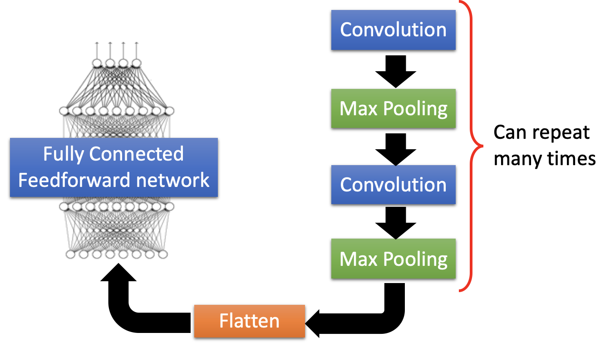

# CNN

## 简介

卷积神经网络 CNN 将复杂问题简化，把大量参数降维成少量参数，再做处理。更重要的是：我们在大部分场景下，降维并不会影响结果。比如1000像素的图片缩小成200像素，并不影响肉眼认出来图片中是一只猫还是一只狗，机器也是如此。

### 图形处理 3 大特征

1. pattern 要比原图小
2. pattern 可以出现在原图的各个位置
3. 压缩原图（subsampling）不会改变对其的认知

其中 1、2 通过卷积（convolution）解决，而 3 通过池化（pooling）解决。

## 结构

CNN 符合多个“卷积层+池化层”对 input 进行加工，然后再连接到一个连接层实现与输出目标之间的映射。

### 卷积层

卷积层的目的是提取特征，它的运算过程用一个 filter（卷积核）扫完整张图片，这个过程可以理解为使用一个 filter 来过滤图像的各个小区域，从而得到这些小区域的特征值。

每次卷积操作，可以对相同的原图使用多个不同的 filter。每个 filter 卷积计算的结果就是卷积层中的一个 feature map，因此每个卷积层可以包含多个 feature map，其数量等于 filter 的数量，也被称为“频道数”。

在具体应用中，往往有多个 filter，每个 filter 代表了一种图像模式，如果某个图像块与此 filter 卷积出的值大，则认为此图像块十分接近于此 filter。如果设计了 6 个 filter，可以理解：认为这个图像上有 6 种底层纹理模式，也就是用 6 种基础模式就能描绘出一副图像。

卷积的 filter 可以看做是一个window，例如有一个 6X6 的网络以及一个 3X3 的 filter，其中 filter 的每个格子上有权值。拿着 filter 在网络上去移动，直到所有的小格子都被覆盖到，每次移动，都将 filter “观察”到的内容，与之权值相乘作为结果输出。最后可以得到一个 4X4 的网格矩阵。

可以认为 convolution 是全连接的一种特殊情况，1/ 只让一部分 weight 有权值，2/ 让多个 weight 共享相同的权重值。

- 填充：卷积后的矩阵大小与一开始的不一致，那么需要对边缘进行填充（Padding）以保证尺寸一致。
- 步长：步长（Stride）就是 filter 移动的步伐大小，上面的例子为1，其实可以指定，有点像是学习率。
- 深度：深度（Depth）指的是图片的深度，一张 6X6X3 大小的图片经过 3X3X3 的 Filter 过滤后会得到一个 4X4X1 大小的图片，因此深度为 1。也可以通过增加 Filter 的个数来增加深度。

### 池化层

池化层的作用是基于局部相关性原理进行采样，从而在减少数据量的同时保留有用信息。其目的是数据降维，避免过拟合，简单说就是下采样，它可以大大降低数据的维度。即使做完了卷积，图像仍然很大（因为 filter 比较小），所以为了降低数据维度，就进行下采样。池化层相比卷积层可以更有效的降低数据维度，这么做不但可以大大减少运算量，还可以有效的避免过拟合。

最常用的池化有 Maxpooling，其原理如下图：

### 连接层

经过卷积层和池化层处理过的数据输入到连接层，得到最终想要的结果。经过卷积层和池化层降维过的数据，连接层才能”跑得动”，不然数据量太大，计算成本高，效率低下。

##  LeNet-5

卷积层 – 池化层- 卷积层 – 池化层 – 卷积层 – 全连接层

