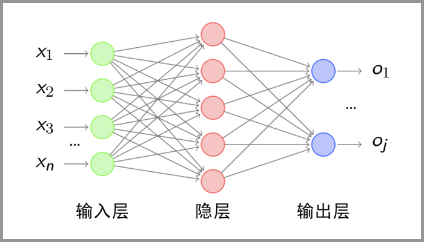

# 卷积神经网络–CNN

## 简介

CNN 将复杂问题简化，把大量参数降维成少量参数，再做处理。更重要的是：我们在大部分场景下，降维并不会影响结果。比如1000像素的图片缩小成200像素，并不影响肉眼认出来图片中是一只猫还是一只狗，机器也是如此。

## 算法

### 卷积—提取特征

卷积层的运算过程用一个卷积核扫完整张图片，这个过程我们可以理解为我们使用一个过滤器（卷积核）来过滤图像的各个小区域，从而得到这些小区域的特征值。

在具体应用中，往往有多个卷积核，可以认为，每个卷积核代表了一种图像模式，如果某个图像块与此卷积核卷积出的值大，则认为此图像块十分接近于此卷积核。如果我们设计了6个卷积核，可以理解：我们认为这个图像上有6种底层纹理模式，也就是我们用6中基础模式就能描绘出一副图像。

### 池化层—数据降维，避免过拟合

池化层简单说就是下采样，他可以大大降低数据的维度。即使做完了卷积，图像仍然很大（因为卷积核比较小），所以为了降低数据维度，就进行下采样。池化层相比卷积层可以更有效的降低数据维度，这么做不但可以大大减少运算量，还可以有效的避免过拟合。

### 全连接层—输出结果

经过卷积层和池化层处理过的数据输入到全连接层，得到最终想要的结果。经过卷积层和池化层降维过的数据，全连接层才能”跑得动”，不然数据量太大，计算成本高，效率低下。

##  LeNet-5

卷积层 – 池化层- 卷积层 – 池化层 – 卷积层 – 全连接层

