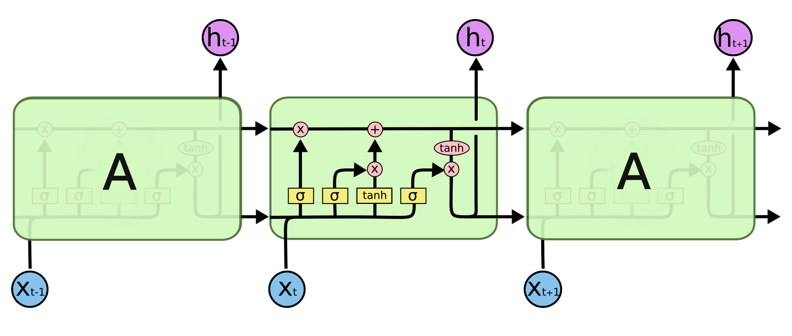
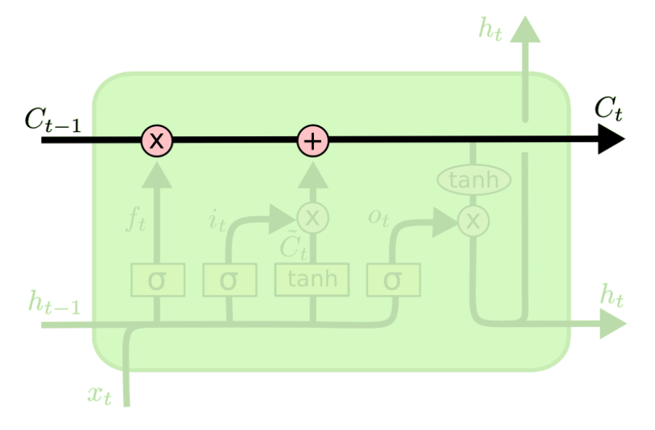
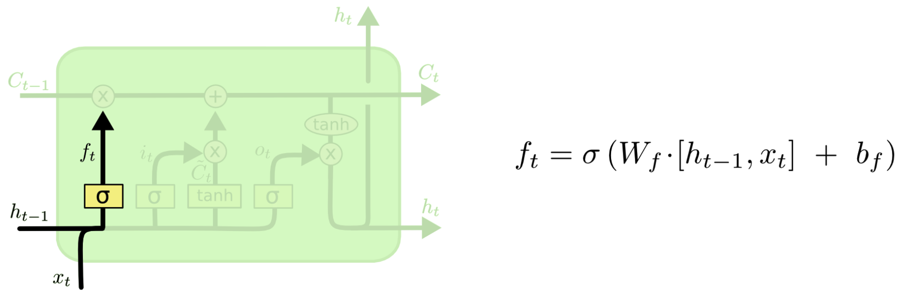
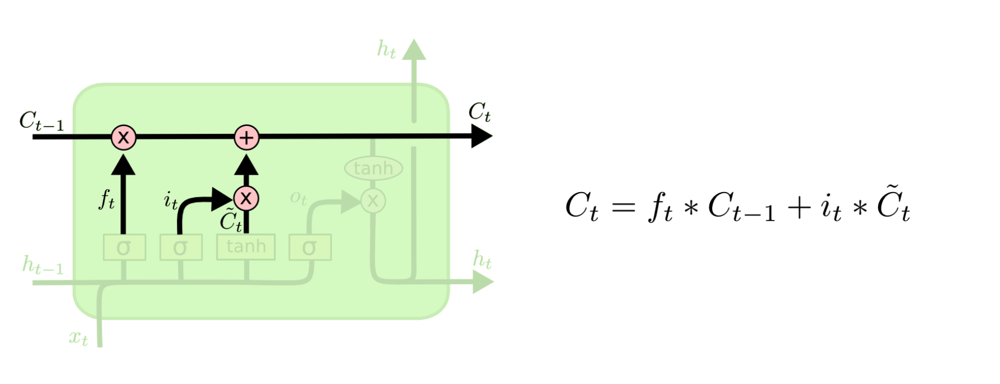
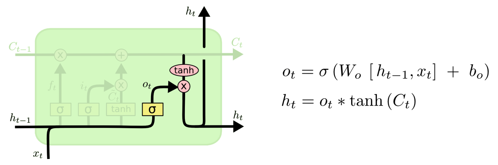

# LSTM

## 简介

Long Short Term Mermory network（LSTM）是一种特殊的RNNs，可以很好地解决长时依赖问题。

## 算法

- 方框内上方的那条水平线，被称为cell state（单元状态），它就像一个传送带，可以控制信息传递给下一时刻。
- LSTM第一步是用来决定什么信息可以通过cell state。这个决定由“forget gate”层通过sigmoid来控制，它会根据上一时刻的输出通过或部分通过。
- 第二步是产生我们需要更新的新信息。这一步包含两部分，第一个是一个“input gate”层通过sigmoid来决定哪些值用来更新，第二个是一个tanh层用来生成新的候选值相加，得到了候选值，一二步结合起来就是丢掉不需要的信息，
- 最后一步是决定模型的输出，首先是通过sigmoid层来得到一个初始输出，然后使用tanh将值缩放到-1到1间，再与sigmoid得到的输出逐对相乘，从而得到模型的输出。

