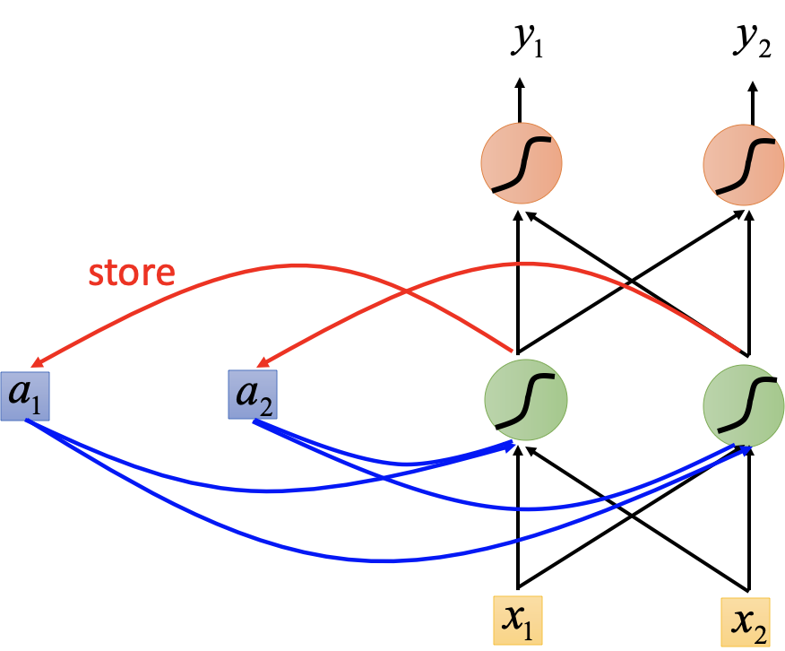
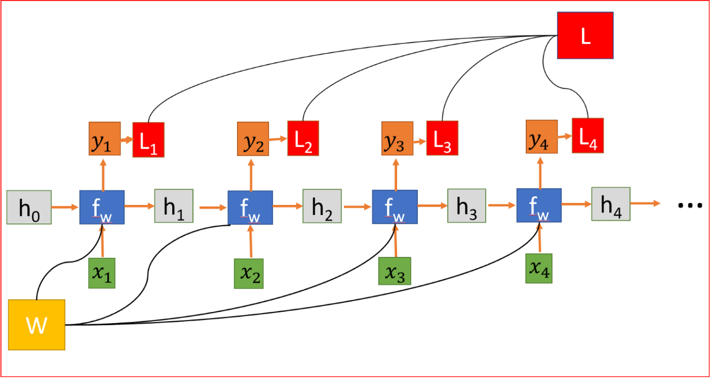
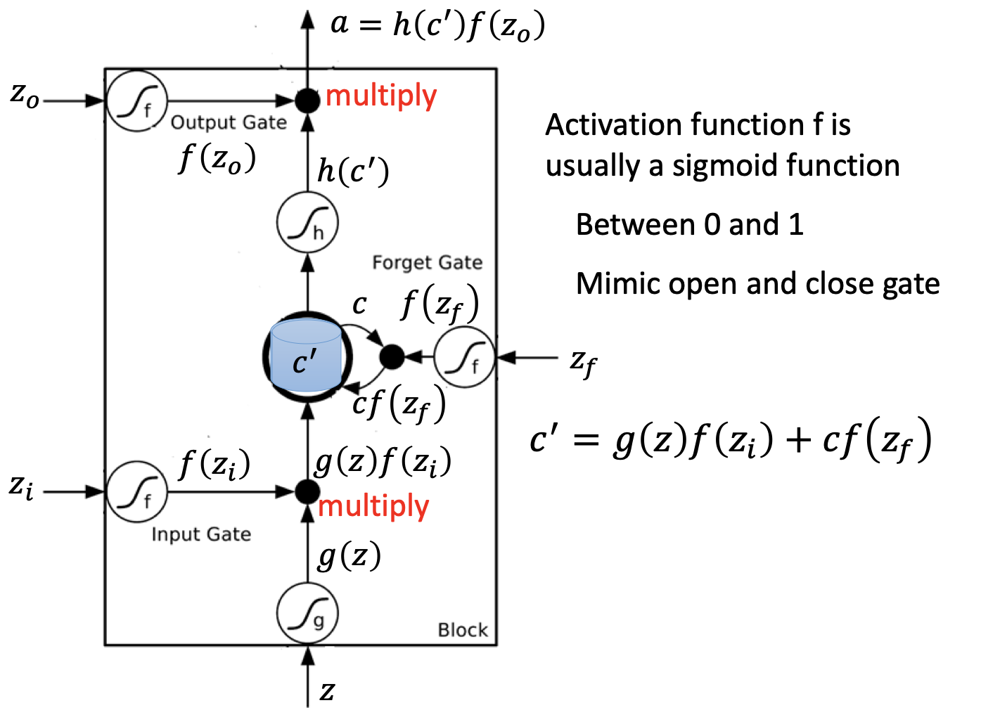

# RNN

## 简介

CNN 和普通的算法大部分都是输入和输出的一一对应，也就是一个输入得到一个输出。不同的输入之间是没有联系的。需要处理「序列数据 – 一串相互依赖的数据流」的场景就需要使用 RNN 来解决了。RNN 之所以能够有效的处理序列数据，主要是基于他的比较特殊的运行原理。RNN 跟传统神经网络最大的区别在于每次都会将前一次的输出结果，带到下一次的隐藏层中，一起训练。RNN 有短期记忆问题，无法处理很长的输入序列。

RNN 的结果与传统神经网络有一些不同，它带有一个指向自身的环，用来表示它可以传递当前时刻处理的信息给下一时刻使用，每一时刻的神经网络会传递信息给下一时刻。

### 分类

- Elman Network：存储隐层的参数
- Jordan Network：存储 output 层的参数

## 原理

隐藏状态连接来自前一个状态的信息，因此充当RNN的记忆。任何时间步的输出都取决于当前输入以及以前的状态。与其他对每个隐藏层使用不同参数的深层神经网络不同，RNN在每个步骤共享相同的权重参数。

### 训练方法

- BPTT：BackPropagation Through Time

## LSTM

为了预测下一个单词，需要返回几个时间步骤来了解前面的单词。有可能在两个相关信息之间有足够的差距。随着差距的扩大，RNN 很难学习和连接信息，但这反而是LSTM的强大功能。LSTM 能够更快地学习长期依赖关系，它可以学习跨1000步的时间间隔。这是通过一种高效的基于梯度的算法实现的。

- input：
- input gate：
- forget gate：
- output gate：

在深层 LSTM 中，只是把原先 NN 中的 neuron 用 LSTM 替换。

## GRU

GRU使用两个门，重置门和一个更新门，这与LSTM中的三个步骤不同。GRU没有内部记忆重置门决定如何将新输入与前一个时间步的记忆相结合。

