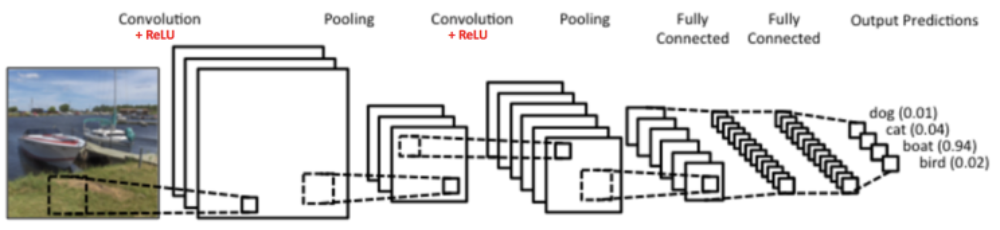

# CNN

## 简介

卷积神经网络 CNN（Convolutional Neural Network）属于前馈神经网络，其特点是每层的神经元节点只响应前一层局部区域范围内的神经元（DNN 全连接网络中每个神经元节点则是响应前一层的全部节点）。在数学中，卷积是一个函数越过另一个函数时两个函数重叠多少的积分度量。

### 图形处理 3 大特征

1. pattern 要比原图小
2. pattern 可以出现在原图的各个位置
3. 压缩原图（subsampling）不会改变对其的认知

其中 1、2 通过卷积（convolution）解决，而 3 通过池化（pooling）解决。

### 权值共享

较前馈神经网络而言，其参数更少。因为 CNN 让一组神经元使用相同的连接权。

## 结构

CNN 模型般由若干卷积层叠加若干全连接层组成，中间包含各种的非线性操作、池化操作。CNN 符合多个“卷积层+池化层”对输入进行加工，然后再连接到一个连接层实现与输出目标之间的映射。

例如上图，最左边船的图像就是输入层，计算机理解为输入若干个矩阵。接着是卷积层（Convolution Layer），卷积层的激活函数使用 ReLU（𝑅𝑒𝐿𝑈(𝑥)=𝑚𝑎𝑥(0,𝑥)）。在卷积层后面是池化层（Pooling Layer），池化层没有激活函数。卷积层+池化层的组合可以在隐藏层出现很多次，上图中出现两次。可以灵活使用使用卷积层+卷积层，或卷积层+卷积层+池化层的组合，这些在构建模型的时候没有限制。但是最常见的 CNN 都是若干卷积层+池化层的组合。在若干卷积层+池化层后面是全连接层（FC - Fully Connected Layer），全连接层其实就是 DNN 结构，只是输出层采用了 Softmax 激活函数来做图像识别的分类。

CNN 相对于 DNN 的特殊之处是卷积层和池化层：

- 卷积运算主要用于处理网格结构的数据，那就是 CNN 是利用卷积层（滤波器 Filter）自动抽取特征，将相邻像素之间的轮廓过滤出来。实际上每个卷积核都是一种滤波器，它们把图像中符合条件的部分筛选出来，也就相当于做了某种特征提取。在 CNN 的卷积层中可以有多个卷积核，以 LeNet 为例，它的第一层卷积核有 6 个，因此可以提取出图像的 6 个特征，从而得到 6 个特征图（feature maps）。
- 利用池化操作，将复杂问题简化，把大量参数降维成少量参数再做处理。重要的是在大部分场景下，降维并不会影响结果。比如 1000 像素的图片缩小成 200 像素，并不影响肉眼认出来图片中是一只猫还是一只狗，机器也是如此。

### 卷积层

卷积层的目的是**自动提取特征**，它的运算过程用一个 filter（卷积核）扫完整张图片，这个过程可以理解为使用一个 filter 来过滤图像的各个小区域，从而得到这些小区域的特征值。每次卷积操作，可以对相同的原图使用多个不同的 filter。每个 filter 卷积计算的结果就是卷积层中的一个 feature map，因此每个卷积层可以包含多个 feature map，其数量等于 filter 的数量，也被称为“频道数”。

在具体应用中，往往有多个 filter，每个 filter 代表了一种图像模式，如果某个图像块与此 filter 卷积出的值大，则认为此图像块十分接近于此 filter。如果设计了 6 个 filter，可以理解：认为这个图像上有 6 种底层纹理模式，也就是用 6 种基础模式就能描绘出一副图像。

卷积的 filter 可以看做是一个window，例如有一个 6X6 的网络以及一个 3X3 的 filter，其中 filter 的每个格子上有权值。拿着 filter 在网络上去移动，直到所有的小格子都被覆盖到，每次移动，都将 filter “观察”到的内容，与之权值相乘作为结果输出。最后可以得到一个 4X4 的网格矩阵。

可以认为卷积是全连接的一种特殊情况，1/ 只让一部分 weight 有权值，2/ 让多个 weight 共享相同的权重值。

- 填充：卷积后的矩阵大小与一开始的不一致，那么需要对边缘进行填充（Padding）以保证尺寸一致。
- 步长：步长（Stride）就是 filter 移动的步伐大小，上面的例子为1，其实可以指定，有点像是学习率。
- 深度：深度（Depth）指的是图片的深度，一张 6X6X3 大小的图片经过 3X3X3 的 Filter 过滤后会得到一个 4X4X1 大小的图片，因此深度为 1。也可以通过增加 filter 的个数来增加深度。

### 激活函数

激活函数是卷积操作的最后一步，其作用是在做完卷积操作之后，通常还需要使用激活函数对图像进一步处理。在逻辑回归中使用的 Sigmoid 函数在深度学习中有广泛的应用，除了 Sigmoid 外，tanh、ReLU  都是常用的激活函数。这些激活函数通常都是非线性的函数，使用它们的目的是把线性数值映射到非线性空间中。卷积操作实际上是两个矩阵之间的乘法，得到的结果也是线性的。只有经过非线性的激活函数运算之后，才能映射到非线性空间中，这样也可以让神经网络的表达能力更强大。

### 池化层

池化层通常在两个卷积层之间，它的作用相当于对神经元的数据做降维处理，这样就能降低整体计算量。所谓的池化，个人理解就是对输入张量的各个子矩阵进行压缩。假如是 2x2 的池化，那么就将子矩阵的每 2x2 元素变成一个元素，如果是 3x3 的池化，那么就将子矩阵的每 3x3 个元素变成一个元素，这样输入矩阵的维度就变小了。

要想将输入子矩阵的每 nxn 个元素变成一个元素，那么需要一个池化标准。常见的池化标准有 2 个，MAX 或 Average，即取对应区域的最大值或者平均值作为池化后的元素值。

下面这个例子采用取最大值的池化方法，采用 2x2 的池化、步幅为2。首先对红色 2x2区 域进行池化，由于此 2x2 区域的最大值为6，那么对应的池化输出位置的值为 6。由于步幅为 2，此时移动到绿色的位置去进行池化，输出的最大值为 8。同样的方法，可以得到黄色区域和蓝色区域的输出值。最终，输入 4x4 的矩阵在池化后变成了 2x2 的矩阵，进行了压缩。

池化目的是**数据降维**，避免过拟合，它可以大大降低数据的维度。即使做完了卷积，图像仍然很大（因为 filter 比较小），所以为了降低数据维度，就进行下采样。池化层相比卷积层可以更有效的降低数据维度，这么做不但可以大大减少运算量，还可以有效的避免过拟合。

### 连接层

在神经网络中，可以叠加多个卷积层和池化层来提取更抽象的特征。经过几次卷积和池化之后，通常会有一个或多个全连接层。全连接层将前面一层的输出结果与当前层的每个神经元都进行了连接。这样就可以把前面计算出来的所有特征，通过全连接层将输出值输送给分类器，比如 Softmax 分类器。

经过卷积层和池化层处理过的数据输入到连接层，得到最终想要的结果。经过卷积层和池化层降维过的数据，连接层才能”跑得动”，不然数据量太大，计算成本高，效率低下。

### 分类器

在深度学习中，Softmax 是个很有用的分类器，通过它可以把输入值映射到 0-1 之间，而且所有输出结果相加等于  1。其实你可以换种方式理解这个概念，假设我们想要识别一个数字，从 0 到 9 都有可能。那么通过 Softmax 层，对应输出 10  种分类结果，每个结果都有一个概率值，这些概率相加为 1，我们就可以知道这个数字是 0 的概率是多少，是 1 的概率是多少……是 9  的概率又是多少，从而也就帮我们完成了数字识别的任务。

## 前向 & 反向

### 前向传播

- 输入层-卷积层：一般输入层对应的都是卷积层。以图像识别为例，先考虑最简单的二维的黑白图片。这样输入层 𝑋 就是一个矩阵，矩阵的值等于图片的各个像素位置的值。这时和卷积层相连的卷积核 𝑊 就也是矩阵。如果样本都是有 RGB 的彩色图片，这样输入层 𝑋 就是 3 个矩阵，分别对应 R、G 和 B 的矩阵。这时和卷积层相连的卷积核 𝑊 也都是 3 个子矩阵组成。前向传播的过程可以表示为：$𝑎^2=𝜎(𝑧^2)=𝜎(𝑎^1∗𝑊^2+𝑏^2)$。其中，上标代表层数、星号代表卷积、而 b 代表偏倚、𝜎 为激活函数，这里是 ReLU。和 DNN 的前向传播比较一下，其实形式非常的像，只是这里是张量的卷积，而不是矩阵的乘法。同时由于 𝑊 是张量，那么同样的位置，𝑊 参数的个数就比 DNN 多很多了。
- 隐藏层-卷积层：假设隐藏层的输出是 M 个矩阵对应的三维张量，则输出到卷积层的卷积核也是 M 个子矩阵对应的三维张量。这时表达式和输入层的很像：$𝑎^𝑙=𝜎(𝑧^𝑙)=𝜎(𝑎^{𝑙−1}∗𝑊^𝑙+𝑏^𝑙)$。其中，上标代表层数、星号代表卷积、而 b 代表偏倚、𝜎 为激活函数，这里是 ReLU。这里的输入是隐藏层来的，而不是输入的原始图片样本形成的矩阵。
- 隐藏层-池化层：池化层的处理逻辑是比较简单的，就是对输入的矩阵进行缩小。比如输入的若干矩阵是 NxN 维的，而池化大小是 kxk 的区域，则输出的矩阵都是 $\frac{𝑁}{𝑘}×\frac{𝑁}{𝑘}$ 维。这里需要定义的参数是：1）池化区域的大小 k、2）池化的标准，一般是 MAX 或Average。
- 隐藏层-全连接层：由于全连接层就是普通的 DNN 模型结构，因此可以直接使用 DNN 的前向传播算法逻辑，即：$𝑎^𝑙=𝜎(𝑧^𝑙)=𝜎(𝑊^𝑙𝑎^{𝑙−1}+𝑏^𝑙)$，这里的激活函数一般是 sigmoid 或 tanh。
- 全连接-输出层：经过了若干全连接层之后，最后的一层为 Softmax 输出层。此时输出层和普通的全连接层唯一的区别是，激活函数是softmax函数。这里需要定义的 CNN 模型参数是：1）全连接层的激活函数、2）全连接层各层神经元的个数。

#### 具体步骤

- 输入：

  - 1 个图片样本
  - CNN 模型的层数 L 和所有隐藏层的类型
  - 对于卷积层，要定义卷积核的大小 K，卷积核子矩阵的维度 F，填充大小 P，步幅 S。
  - 对于池化层，要定义池化区域大小 k 和池化标准（MAX或Average）。
  - 对于全连接层，要定义全连接层的激活函数（输出层除外）和各层的神经元个数。

- 输出：CNN 模型的输出 $𝑎^𝐿$

1. 根据输入层的填充大小 P，填充原始图片的边缘，得到输入张量 $𝑎^1$。
2. 初始化所有隐藏层的参数 𝑊、𝑏
3. for 𝑙=2 to 𝐿−1：
   1. 如果第 𝑙 层是卷积层，则输出为 $𝑎^𝑙=𝑅𝑒𝐿𝑈(𝑧^𝑙)=𝑅𝑒𝐿𝑈(𝑎^{𝑙−1}∗𝑊^𝑙+𝑏^𝑙)$
   2. 如果第 𝑙 层是池化层，则输出为 $𝑎^𝑙=𝑝𝑜𝑜𝑙(𝑎^{𝑙−1})$，这里的 pool 指按照池化区域大小 k 和池化标准将输入张量缩小的过程。
   3. 如果第 𝑙 层是全连接层，则输出为 $𝑎^𝑙=𝜎(𝑧^𝑙)=𝜎(𝑊^𝑙𝑎^{𝑙−1}+𝑏^𝑙)$
4. 对于输出层 L：$𝑎^𝐿=𝑠𝑜𝑓𝑡𝑚𝑎𝑥(𝑧^𝐿)=𝑠𝑜𝑓𝑡𝑚𝑎𝑥(𝑊^𝐿𝑎{𝐿−1}+𝑏^𝐿)$

### 反向传播

#### 具体步骤

- 输入：

  - m 个图片样本
  - CNN 模型的层数 L 和所有隐藏层的类型
  - 对于卷积层，要定义卷积核的大小 K、卷积核子矩阵的维度 F、填充大小 P、步幅 S。
  - 对于池化层，要定义池化区域大小 k 和池化标准（MAX 或 Average）
  - 对于全连接层，要定义全连接层的激活函数（输出层除外）和各层的神经元个数
  - 梯度迭代参数：迭代步长𝛼、最大迭代次数 MAX 与停止迭代阈值 𝜖。

- 输出：CNN 模型各隐藏层与输出层的 𝑊、𝑏

#### 具体步骤

1. 初始化各隐藏层与输出层的各 𝑊、𝑏 的值为一个随机值。
2. for 迭代=1 to MAX：
   1. for i =1 to m（样本数）：
      1. 将 CNN 输入 $𝑎^1$ 设置为 $𝑥^𝑖$ 对应的张量
      2. for 𝑙=2 to L-1，根据下面 3 种情况进行前向传播算法计算：
         1. 如果当前是全连接层：则有 $𝑎^{𝑖,𝑙}=𝜎(𝑧^{𝑖,𝑙})=𝜎(𝑊^𝑙𝑎^{𝑖,𝑙−1}+𝑏^𝑙)$
         2. 如果当前是卷积层：则有 $𝑎^{𝑖,𝑙}=𝜎(𝑧^𝑖,𝑙)=𝜎(𝑊^𝑙∗𝑎^{𝑖,𝑙−1}+𝑏^𝑙)$
         3. 如果当前是池化层：则有 $𝑎^{𝑖,𝑙}=𝑝𝑜𝑜𝑙(𝑎^{𝑖,𝑙−1})$，这里的 pool 指按照池化区域大小 k 和池化标准将输入张量缩小的过程。
       4. 对于输出层第 L 层：$𝑎^{𝑖,𝐿}=𝑠𝑜𝑓𝑡𝑚𝑎𝑥(𝑧^{𝑖,𝐿})=𝑠𝑜𝑓𝑡𝑚𝑎𝑥(𝑊^𝐿𝑎^{𝑖,𝐿−1}+𝑏^𝐿)$
       4. 通过损失函数计算输出层的 $𝛿^{𝑖,𝐿}$ 
       5. for 𝑙=L-1 to 2, 根据下面 3 种情况进行进行反向传播算法计算：
          1. 如果当前是全连接层：$𝛿^{𝑖,𝑙}=(𝑊^{𝑙+1})^𝑇𝛿^{𝑖,𝑙+1}⊙𝜎′(𝑧^{𝑖,𝑙})$
          2. 如果当前是卷积层：$𝛿^{𝑖,𝑙}=𝛿^{𝑖,𝑙+1}∗𝑟𝑜𝑡180(𝑊^{𝑙+1})⊙𝜎′(𝑧^{𝑖,𝑙})$
          3. 如果当前是池化层：$𝛿^{𝑖,𝑙}=𝑢𝑝𝑠𝑎𝑚𝑝𝑙𝑒(𝛿^{𝑖,𝑙+1})⊙𝜎′(𝑧^{𝑖,𝑙})$
    2. for 𝑙=2 to L，根据下面 2 种情况更新第 𝑙 层的 $𝑊^𝑙、𝑏^𝑙$：
       1. 如果当前是全连接层：$𝑊^𝑙=𝑊^𝑙−𝛼∑_{𝑖=1}^𝑚𝛿{𝑖,𝑙}(𝑎^{𝑖,𝑙−1})^𝑇$，$𝑏^𝑙=𝑏^𝑙−𝛼∑_{𝑖=1}^𝑚𝛿^{𝑖,𝑙}$
       2. 如果当前是卷积层，对于每一个卷积核有：$𝑊^𝑙=𝑊^𝑙−𝛼∑_{𝑖=1}^𝑚𝑎^{𝑖,𝑙−1}∗𝛿^{𝑖,𝑙}，𝑏^𝑙=𝑏^𝑙−𝛼∑_{𝑖=1}^𝑚∑_{𝑢,𝑣}(𝛿^{𝑖,𝑙})_{𝑢,𝑣}$
     3. 如果所有 𝑊、𝑏 的变化值都小于停止迭代阈值 𝜖，则跳出迭代循环到步骤 3。
4. 输出各隐藏层与输出层的线性关系系数矩阵 𝑊 和偏倚向量 𝑏。

## 总结

CNN  网络结构中每一层的作用：它通过卷积层提取特征，通过激活函数让结果映射到非线性空间，增强了结果的表达能力，再通过池化层压缩特征图，降低了网络复杂度，最后通过全连接层归一化，然后连接 Softmax 分类器进行计算每个类别的概率。通常我们可以使用多个卷积层和池化层，最后再连接一个或者多个全连接层，这样也就产生了不同的网络结构，比如 LeNet 和 AlexNet。