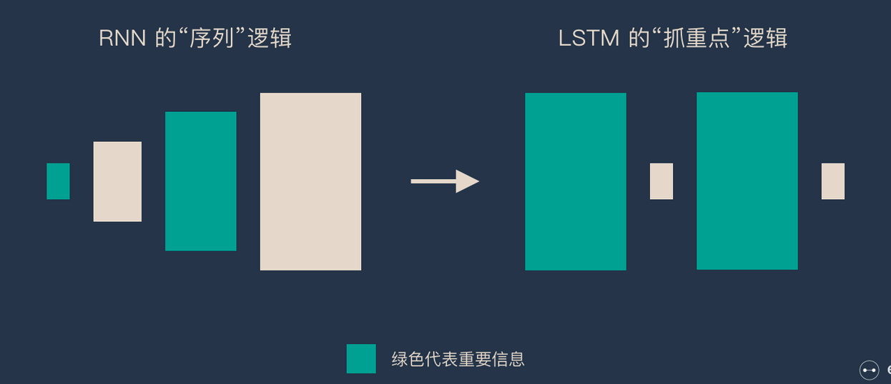
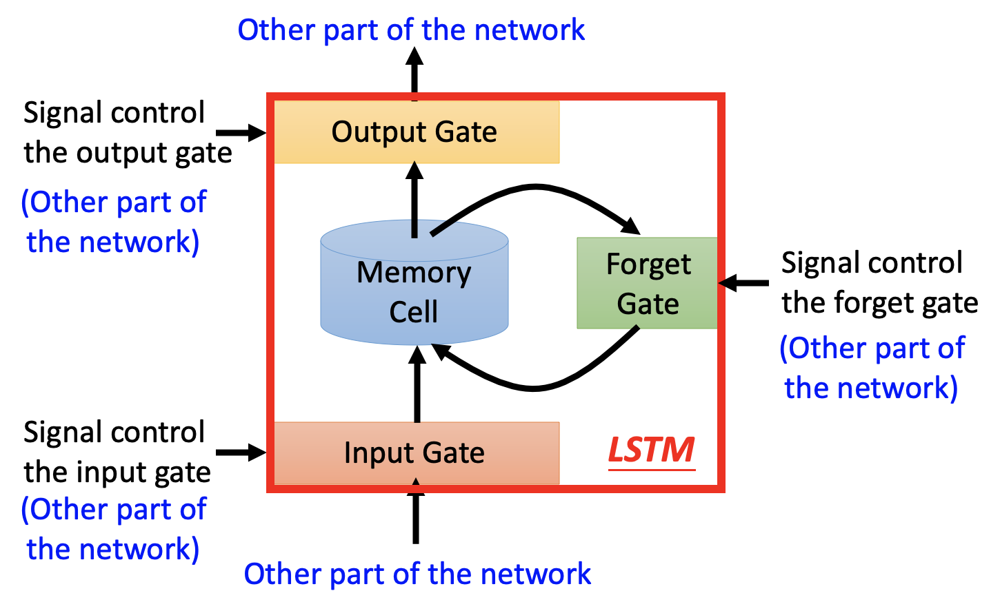
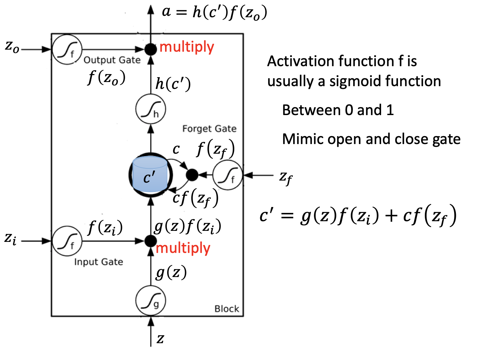
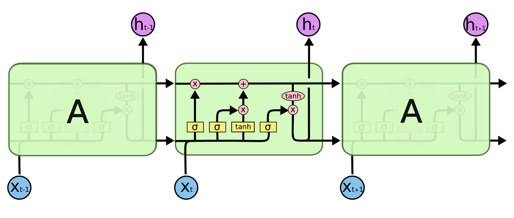
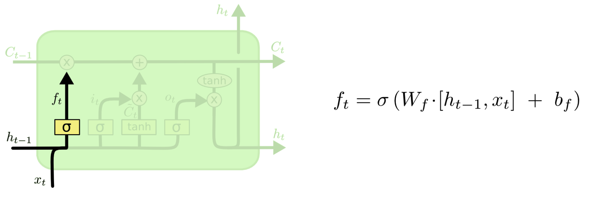
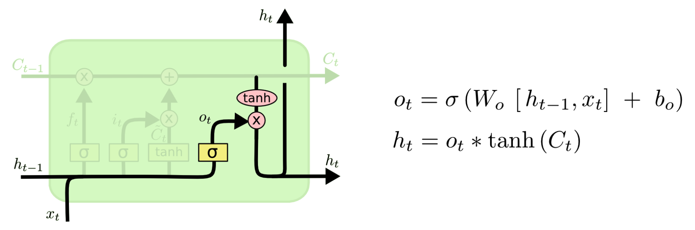
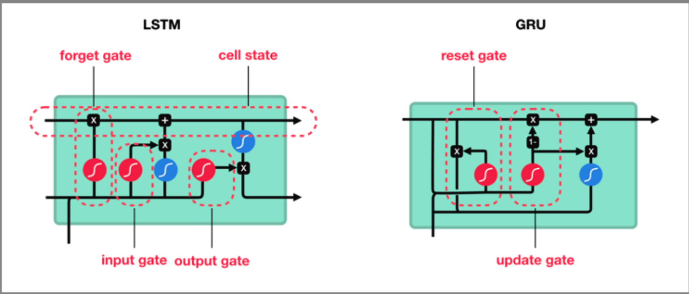

# LSTM

## 简介

RNN 是一种死板的逻辑，越晚的输入影响越大，越早的输入影响越小，且无法改变这个逻辑。LSTM（Long Short Term Mermory network）做的最大的改变就是打破了这个死板的逻辑，而改用了一套灵活了逻辑——只保留重要的信息，可以很好地解决长时依赖问题。简单说就是：抓重点！

## LSTM

为了预测下一个单词，需要返回几个时间步骤来了解前面的单词。有可能在两个相关信息之间有足够的差距。随着差距的扩大，RNN 很难学习和连接信息，但这反而是LSTM的强大功能。LSTM 能够更快地学习长期依赖关系，它可以学习跨1000步的时间间隔。这是通过一种高效的基于梯度的算法实现的。

- input：
- input gate：
- forget gate：
- output gate：

在深层 LSTM 中，只是把原先 NN 中的 neuron 用 LSTM 替换。

## 算法

- 方框内上方的那条水平线，被称为cell state（单元状态），它就像一个传送带，可以控制信息传递给下一时刻。
- LSTM第一步是用来决定什么信息可以通过cell state。这个决定由“forget gate”层通过sigmoid来控制，它会根据上一时刻的输出通过或部分通过。
- 第二步是产生我们需要更新的新信息。这一步包含两部分，第一个是一个“input gate”层通过sigmoid来决定哪些值用来更新，第二个是一个tanh层用来生成新的候选值相加，得到了候选值，一二步结合起来就是丢掉不需要的信息，
- 最后一步是决定模型的输出，首先是通过sigmoid层来得到一个初始输出，然后使用tanh将值缩放到-1到1间，再与sigmoid得到的输出逐对相乘，从而得到模型的输出。

## GRU

GRU（Gated Recurrent Unit）是 LSTM 的一个变体。他保留了 LSTM 划重点，遗忘不重要信息的特点，在long-term 传播的时候也不会被丢失。GRU使用两个门，重置门和一个更新门，这与LSTM中的三个步骤不同。GRU没有内部记忆重置门决定如何将新输入与前一个时间步的记忆相结合。

